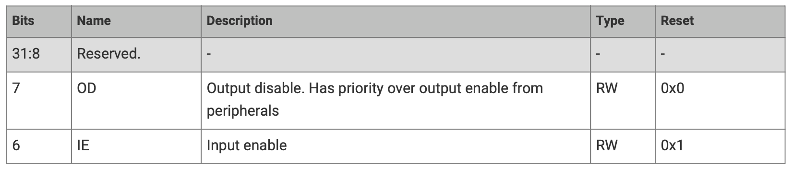
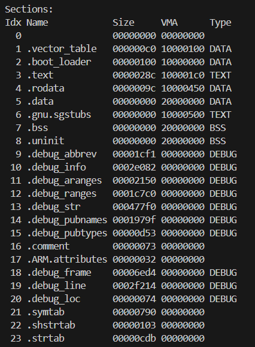
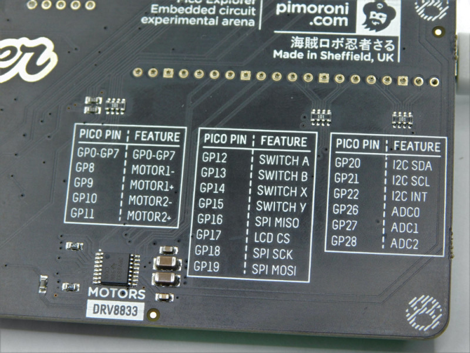

# 02 - Memory Mapped IO & GPIO

The purpose of this lab is to understand how to start developing in [Rust](https://www.rust-lang.org/) for the
RP2040 MCU. The lab presents three examples:
 - **bare metal** development - writing directly to registers, actually writing a driver
 - **platform access crate** (PAC) - using an automatically generated crate from the MCUs SVD file, actually writing a driver, but with some kind of automation
 - **embassy-rs** - using the Rust standard [`embedded-hal`](https://docs.rs/embedded-hal/latest/embedded_hal/) implemented by the [Embassy-rs](https://embassy.dev/) framework.

:::info
The example of this lab is to blink an LED at a certain time interval.
:::

## Resources

1. **Raspberry Pi Ltd**, *[RP2040 Datasheet](https://datasheets.raspberrypi.com/rp2040/rp2040-datasheet.pdf)*
2. **Raspberry Pi Ltd**, *[Raspberry Pi Pico Datasheet](https://datasheets.raspberrypi.com/pico/pico-datasheet.pdf)*
3. **Raspberry Pi Ltd**, *[Raspberry Pi Pico W Datasheet](https://datasheets.raspberrypi.com/picow/pico-w-datasheet.pdf)*

## What is GPIO?

General-Purpose Input/Output, or GPIO, is an essential part of embedded systems that serves as a vital conduit between microcontrollers and microprocessors and the outside world. A microcontroller or microprocessor's group of pins that can each be set to operate as an input or an output is referred to as GPIO. The purpose of these pins is to interface external components, including actuators, displays, sensors, and other devices, so that the embedded system may communicate with its surroundings. Standardised communication protocols like SPI, I2C, PCM, PWM, and serial communication may be directly supported by some GPIO pins. There are two varieties of GPIO pins: digital and analog.

## Configuring GPIO Pins

GPIO pins can be used as outputs (LEDs, motors, buzzers) or as inputs (buttons, sensors).

The R02040 has three peripherals that control the GPIO pins:
 1. *Pads* - control the actual physical pin or pad that the processor has outside. This control the electrical parameters, like maximum current or pull up and pull down resistors
 2. *IO Bank0* - connects and multiplexes the peripheral's pins to the output pads. Several peripherals use the same output pad to communicate with the exterior. For example, in the image below, `GPIO0` can be used either for:
    * `SIO` - the `GPIO` function
    * `SPI_RX` - the receive pin for the `SPI` peripheral
    * `I2C0_SDA` - the data pin for the `I2C0` peripheral
    * `UART0_TX` - the transmit pin for the `UART0` (serial port 0) peripheral
 3. *SIO* - that controls the interior MCU's pins. This is the peripheral that developers use to read and write the value of the pins.


Every pin of the MCU can perform multiple functions. Several peripherals need to use input and output pins.
It is the role of the *IO Bank0* to multiplex and connect the peripherals to the pins.

<div align="center">

</div>

## Hardware access

There are 3 different ways in which the hardware the Raspberry Pi Pico can be used:

1. Embassy-rs framework, with the Embedded HAL implementation
2. Platform Access Crate (PAC)
3. Bare metal

## Embedded HAL Implementation

The bare metal and PAC require a lot of time and effort to develop applications.

The Rust [Embedded devices Working Group](https://www.rust-lang.org/governance/wgs/embedded) has designed 
a  set of standard traits (interfaces) for interacting with an MCU. This is called the **Embedded Hardware Abstraction Layer**, or shortly Embedded HAL. The main purpose is to define a common hardware interface that
frameworks, libraries and operating systems can build upon. Regardless of what MCUs the device is using, the upper level software should be as portable as possible.

There are several crates and frameworks that implement the Embedded HAL traits for the RP2040 MCU.
- [rp2040_hal](https://docs.rs/rp2040-hal/latest/rp2040_hal/) crate, implements just the embedded HAL traits, it is *the bare minimum* for developing RP2040 applications
- [embassy-rp](https://docs.embassy.dev/embassy-rp/git/rp2040/index.html) crate implements the Embedded HAL for RP2040 that is used with the [embassy-rs](https://embassy.dev/) framework

### Embassy-rs framework

[Embassy-rs](https://embassy.dev/) is a full fledged embedded framework for Rust embedded development.
Besides the implementation of the embedded HAL for different MCUs (RP2040 included), embassy-rs provides
several functions like timers, BLE and network communication.

<div align="center">

</div>

The crates used by Embassy-rs and their mapping are shown in the table bellow.

| Crate | Position |
|-------|----------|
| [`embassy-executor`](https://docs.embassy.dev/embassy-executor/git/cortex-m/index.html) | Framework |
| [`smoltcp`](https://docs.rs/smoltcp/latest/smoltcp/), [`defmt`](https://docs.rs/defmt/latest/defmt/) | Libraries |
| [`embassy-net`](https://docs.embassy.dev/embassy-net/git/default/index.html), [`embassy-time`](https://docs.embassy.dev/embassy-time/git/default/index.html), [`embassy-usb`](https://docs.embassy.dev/embassy-usb/git/default/index.html), [`embassy-usb-logger`](https://docs.embassy.dev/embassy-usb-logger/git/default/index.html) | Framework Driver |
| [`embassy-usb-driver`](https://docs.embassy.dev/embassy-usb-driver/git/default/index.html), [`embassy-time-driver`](https://docs.embassy.dev/embassy-time-driver/git/default/index.html) | Embassy HAL (API) |
| [`cyw43`](https://docs.embassy.dev/cyw43/git/default/index.html), [`cyw43-pio`](https://docs.embassy.dev/cyw43-pio/git/default/index.html) | Driver (WiFi) |
| [`embedded-hal`](https://docs.rs/embedded-hal/latest/embedded_hal/), [`embedded-hal-async`](https://docs.rs/embedded-hal-async/latest/embedded_hal_async/)| **Rust Embedded HAL (Standard)** |
| [`embassy_rp`](https://docs.embassy.dev/embassy-rp/git/rp2040/index.html) | HAL Implementation |
| [`cortex-m`](https://docs.rs/cortex-m/latest/cortex_m/), [`cortex-m-rt`](https://docs.rs/cortex-m-rt/latest/cortex_m_rt/) | μ-architecture crates |
| [`rp_pac`](https://docs.embassy.dev/rp-pac/git/default/index.html) | Platform Access Crate |

:::info

The name *Embassy-rs* is derived form **Emb**edded **Asy**nchronous Rust.

:::

### Entry

Embassy-rs is a framework built on top of `cortex-m-rt` and provides its own method of defining
the entrypoint and bootloader.

```rust
use embassy_executor::Spawner;

#[embassy_executor::main]
async fn main(_spawner: Spawner) {
    let peripherals = embassy_rp::init(Default::default());
}
```

The `embassy_rp::init` function takes care of the peripheral initialization so that developers can jump
right in and use them.

:::note

Embassy-rs is designed to work in an asynchronous way and this is why the `main` function is defined as `async`. For the time being, just take it as a must and ignore it.

:::

### Configure GPIO Output

Embassy-rs provides one single function that returns the GPIO `Output` pin and hides the configuration
details from developers.

The `pin` variable implements the embadded HAL [`OutputPin`](https://docs.rs/embedded-hal/latest/embedded_hal/digital/trait.OutputPin.html) trait.

```rust
use gpio::{Level, Output};

// initialize PIN_n (replace n with a number) and set its
// default value to LOW (0)
let mut pin = Output::new(peripherals.PIN_n, Level::Low);

// set the pin value to HIGH (1)
pin.set_high();

// set the pin value to LOW (0)
pin.set_low();
```

:::tip

While the device initialization is specific to every hardware device (the example uses the 
`embassy_rp` crate that is for RP2040), the pin initialization and usage is portable. It
uses the same code, regardless of the MCU used.

:::

### Configure GPIO Input

Using a pin as input is very similar to using it as output.

```rust
use gpio::{Input, Pull};

let pin = Input::new(peripherals.PIN_n, Pull::Up);

if pin.is_high() {
    // Do something if the pin value is HIGH (1)
} else {
    // Do something if the pin value if LOW (0)
}
```

:::warning 

For a correct use of the buttons, use pull-up, pull-down resistors depending on the mode of operation of the button. Check [01 - Hardware Introduction](https://embedded-rust-101.wyliodrin.com/docs/lab/01#buttons)

:::

### Waiting

Embassy-rs provides support for suspending the execution of the software for an amount of time. It uses
the [`Timer`](https://docs.rs/embassy-time/0.3.0/embassy_time/struct.Timer.html) structure from the
[`embassy_time`](https://docs.rs/embassy-time/latest/embassy_time/) crate.

```rust
// suspend the execution for a period of time
use embassy_time::Timer;

Timer::after_secs(1).await;
```

:::tip

If the MCU provides timers, the Embassy framework will use them to suspend the software. This is very efficient.

:::

## Platform Access Crate (PAC)

A mid level way of developing in Rust for MCUs are the *platform access crates* 
(PAC). These crates are automatically generated from the *System View Description* (SVD) files.

Using [rust2svd](https://docs.rs/svd2rust/latest/svd2rust/), developers can automatically generate
a crate that provides access functions to the MCUs registers. This provides a significant improvement,
as developers do not have to write manually the register addresses.

One of the PAC crates for the RP2040 MCU is [rp2040-pac](https://docs.rs/rp2040-pac/latest/rp2040_pac/).

:::note

The PAC crate does not provide any means of initializing the MCU, so the entry point is still
defined by the `cortex-m-rt` crate, just as it is for bare metal. Bare metal will be discussed later in the lab.

Similarly, the PAC crate does not provide any `sleep` function.

This section presents only the differences between bare metal and PAC. The PAC mode of writing 
embedded software is very similar to bare metal, just that register access is made easier.

:::

The RP2040 (ARM Cortex-M0+) MCU uses *Memory Mapped Input Output* (MMIO). This means that the peripheral's registers
are mapped into the address space (in normal words, in the memory). Reading and writing data from and to these registers
is done by memory reads and writes.

Blinking an LED in PAC or bare metal programming means following these steps:

 1. Ask the rust compiler not to use the `std` library, as it depends on the operating system
 2. Write a `main` function and instruct the MCU to call it at startup (reset)
 3. Configure the Single Cycle IO (SIO) peripheral to set a pin as output
 4. Enable the *IO Bank0* peripheral of the RP2040
 5. Configure the *IO Bank0* peripheral so that it sets a certain pin as output
 6. Toggle the pin's value through the *SIO*'s registers
 7. Wait for an amount of time
 8. Loop through steps 6 and 7

### no-std

As the code written runs on an MCU without any framework or operating system,
the Rust compiler cannot rely on the `std` library. The two macros directives
ask the compiler not to link the `std` library and not to expect `main`
function.

```rust
#![no_main]
#![no_std]
```

:::warning

The bare metal code has to start with these two directives.

:::

### Bootloader

The RP2040 has a piece of software written in an internal ROM memory that is loaded 
when the MCU boots. This looks at the first 256 bytes of the Flash memory
to understand how it needs to start the MCU.

:::tip

While the ROM bootloader is rather small, its functionality is very similar to the PC's BIOS
boot sequence.

:::

The RP2040's datasheet explains the boot process. This is not very straight forward, and writing this
information requires a digital signature. The `rp2040-boot` crate provides the bootloader information
for booting with the `cortex-m-rt` crate.

Adding the following code to the Rust includes the bootloader.

```rust
#[link_section = ".boot_loader"]
#[used]
pub static BOOT_LOADER: [u8; 256] = rp2040_boot2::BOOT_LOADER_W25Q080;
```

### Entry

For this lab, we will use the `cortex-m-rt` crate. As the starting code for an MCU is usually processor
and vendor dependent, this crate allows developers to get started a little faster. It implements the bare minimum
initialization code and provides a macro called `entry` that developers can use to select the startup (main)
function.

:::info

The `entry` macro is used by Embassy through the `embassy_executor::main` macro that sets the `main` function as the startup point and defines the correct bootloader.

:::

When an error occurs, Rust calls the `panic` function. When using the `std` library, the `panic` function is
already defined. It prints the error and usually unwinds the stack. When using `core`, it is the developer's
job to define a `panic` function. In the case of bare metal development, the simplest `panic` function is 
one that loops indefinitely, preventing the MCU form executing code.

```rust
use core::panic::PanicInfo;

use cortex_m_rt::entry;

// the `entry` macro sets up this function
// as the function that the MCU calls at
// startup
#[entry]
fn main() -> ! {
    // the `main` function is not allows to return
    loop { }
}

// rust uses panics when an error occurs
// as this is bare metal, we have to define
// the panic function that rust calls
#[panic_handler]
fn panic(_info: &PanicInfo) -> ! {
    // if an error occurs, we simply loop around
    // to prevent the MCU from executing 
    // anything
    loop {}
}
```

:::warning

In PAC or bare metal mode, the MCU does not run any framework or operating system, it just runs the developers bare metal code. This is why `main` function is not allowed to return, it loops forever. There is no system to which the function
could return control.

:::

One of the first lines of the `main` function is getting a reference to all the
peripherals.

```rust
use rp2040_pac::Peripherals;

#[entry]
fn main() -> ! {
    // get a reference to all the peripherals
    let peripherals = Peripherals::take().unwrap();

    loop { }
}
```

:::info

In Embassy, the `main` function does not have to loop indefinitely, it is allowed to return, as it runs within the embassy-rs framework.

:::

### Configuring the SIO

In bare metal and PAC modes, developers have to manually initialize the *IO Bank0* and *SIO* peripherals.

The GPIO pins are configured using the MCU's SIO registers. Each pin is configured by setting or clearing the corresponding
bit of several registers. Below is a table with the memory addresses of the SIO registers. 

The PAC crate provides the `SIO` peripheral, which in turn provides a function for
each one of its registers. It fully hides the actual address of the registers.

<div align="center">

</div>

```rust
let sio = peripherals.SIO;

// set the `pin` pin as output
sio.gpio_oe_set().write(|w| unsafe { w.bits(1 << pin) });

// set the `pin` to value `0`
sio.gpio_out_clr().write(|w| unsafe { w.bits(1 << pin) })

// set the `pin` to value `1`
sio.gpio_out_set().write(|w| unsafe { w.bits(1 << pin) })
```

### Configuring the IO Bank0

GPIO pins can be configured for several functionalities, they can be used as GPIO pins or can also be used by certain peripherals, usually those that implement communication protocols. The RP2040's *IO Bank0* peripherals performs this multiplexing.

The following table provides all the functions that each pin can have.

<div align="center">

</div>

#### Enable the IO Bank0

When the RP2040 starts, the *IO Bank0* peripheral is disabled. To enable it, developers have to
use the *Reset*'s peripheral `RESET`  register.

<div align="center">

</div>

The fields of the `RESET` register. To enable *IO Bank0*, developers have to write
a `0` in the `IO_BANK0` fields. By default, this field has the value `1`, which means that
`*IO Bank0* is disabled.

<div align="center">

</div>

To verify that the *IO Bank0* peripheral has been enabled, developers have to check the field
`IO_BANK0` of the `RESET_DONE` register shown in the table bellow.

<div align="center">

</div>

:::warning

Developers might choose not to wait until the peripheral is enabled, but any writes to the peripheral's
registers will most probably be ignored.

:::

```rust
let reset = peripherals.RESETS;

reset
    .reset()
    .modify(|r, w| unsafe { w.bits(r.bits() & !(1 << 5)) });
while reset.reset_done().read().bits() & (1 << 5) == 0 {}
```

#### Configure the GPIO

To connect the *SIO* peripheral to the output pins, developers have to modify the `GPIOx_CTRL` register.

The following table shows the fields of the `GPIOx_CTRL` register. The fields that is of interest is `FUNCSEL`.
Depending on the value written there, the *IO Bank0* will select a function or another. For this example,
we have to write value `5`.

<div align="center">

</div>

```rust
let io_bank0 = peripherals.IO_BANK0;

// write the value 5 to the FUNCSEL field
// Note: This actually writes the value 5 in FUNCSEL
//       and 0s in all the other field. While this
//       is fine for this example, usually a
//       read, modify, write sequence should be used
io_bank0
    .gpio(pin)
    .gpio_ctrl()
    .write(|w| unsafe { w.bits(5) });

// the correct way of doing this
io_bank0
    .gpio(pin)
    .gpio_ctrl()
    // the PAC crate provides fucntions for all the 
    // register's fields
    .modify(|_, w| unsafe { w.funcsel().bits(5) });
```

### Configuring the Pad

The Pad peripheral is responsible for the electrical setup of the pins. It can configure the
the maximum output current, input pull up or pull down resistor.

The following table shows the *Pads* peripheral registers. Each GPIO pin has a corresponding register.

<div align="center">

</div>

The following tables describe the `GPIOx` register. This register allows the configuration of several
electrical parameters.

<div align="center">

</div>

<div align="center">

</div>

Looking at the default values, when the MCU starts, pins are configured:

| | |
|-|-|
| Output Enabled | Yes |
| Input Enabled | Yes |
| Maximum Output Current | 4mA |
| Pull Input Resistor | Pull Down |
| Schmidt Trigger | Yes |
| Slew Rate | Slow |

For this lab, the default values are fine, this peripheral can be considered as being properly setup.

### Wait for an amount of time

When using an operating system, developers usually have a function called `sleep` which asks the operating system
to suspend the process for a certain amount of time. In bare metal environment, with no framework or operating system,
this is not available. The MCU timers can be used for this, but the simplest (and most inefficient) of waiting is to
loop around while doing nothing. The Arm Cortex-M processors offer the `nop` instruction. This asks the processor
to do nothing.

```rust
// loops around 50000 times asking the processor
// to execute the `nop` instruction that does
// nothing
for _ in 0..50000 {
    // without this `asm` here, the compiler would optimize out the loop
    asm!("nop");
}
```

:::warning

The `asm("nop")` is necessary, as otherwise the compiler optimizes out the empty loop.

:::

The question is how fast does this execute. The RP2040 starts by default using an internal 12MHz clock.

$$
t_{nop} = \frac{1}{12.000.000}s = 0.83ns
$$

The `loop` itself and the range (`0..50000`) calculation take another 4 - 5 MCU cycles. The actual wait time
of the example is:

$$
t_{wait} = 5 * 50000 * \frac{1}{12.000.000}s = 20.83\mu s
$$

:::info

This approach is inefficient compared to the method used in Embassy.

:::

## Bare metal

When using bare metal, developers interact directly with the hardware devices. They are responsible for all the
drivers and other components that they want to use. Mostly, bare metal development means *reading* and *writing* data
from and to the MCUs and peripheral registers.

### Configuring the SIO

The *SIO* peripheral has a base address, the address where its registers are mapped in the address space.

Each register has an offset, that represents the registers position (offset) relative to the *SIO*'s base address. 

:::tip

Computing the actual address of a register means adding the base address of the peripheral with the register's offset.

e.g: `GPIO_OE`'s address is `0xd000_0000 + 0x020` => `0xd000_0020`

:::

<div align="center">

</div>

```rust
use core::ptr::write_volatile;

const GPIO_OE_SET: *mut u32 = 0xd000_0024 as *mut u32;
const GPIO_OUT_SET: *mut u32 = 0xd000_0014 as *mut u32;
const GPIO_OUT_CLR: *mut u32 = 0xd000_0018 as *mut u32;

// set the `pin` pin as output
unsafe { write_volatile(GPIO_OE_SET, 1 << pin); }

// set the `pin` to value `0`
unsafe { write_volatile(GPIO_OUT_CLR, 1 << pin); }

// set the `pin` to value `1`
unsafe { write_volatile(GPIO_OUT_SET, 1 << pin); }
```

:::info 

For a better understanding, please read subchapters 2.3.1.2 and 2.3.1.7 of the [datasheet](https://datasheets.raspberrypi.com/rp2040/rp2040-datasheet.pdf).

:::

#### Enable the IO Bank

```rust
const RESET: u32 = 0x4000_c000;
const CLR: u32 = 0x3000;

const RESET_DONE: u32 = 0x4000_c008;

unsafe {
    // clear bit `5` of the `RESET` register by
    // writing `1` on  bit `5` at address
    // `RESET` + 0x3000
    write_volatile((RESET + CLR) as *mut u32, 1 << 5);

    // wait for the IO Bank0 to enable
    while read_volatile(RESET_DONE as *const u32) & (1 << 5) == 0 {}
}
```

:::tip

There is an interesting trick that the code above is using. Normally, the code modifies only the
bit 5 of the `RESET` register. To perform that, it should:
1. read the register
2. modify the value read
3. write back the modified value

The RP2040 MCU provides a trick that allows the instant modification. For each peripheral mapped at
address A, the MCU's Bus maps three other *shadow* peripherals: 

| Name | Address | Behavior |
|------|---------|----------|
| *Peripheral_XOR* | A+0x1000 | `REGISTER` = `REGISTER` ^ value (XORs the new value with the original register value) | 
| *Peripheral_SET* | A+0x2000 | `REGISTER` = `REGISTER` \| value (sets all the `1` bits of value in the original register) |
| *Peripheral_CLR* | A+0x3000 | `REGISTER` = `REGISTER` & !value (for every `1` bit in the value, clears the corresponding bit in the original register) |
:::

#### Configure the GPIO

To connect the *SIO* peripheral to the output pins, developers have to modify the `GPIOx_CTRL` register.

Each GPIO pin has its own control register, located at offset $40014000h + 4 + 8 * pin$.

<div align="center">

</div>

:::tip

For example, `GPIO25_CTRL`'s address is `0x40014000 + 4 + 8 * 25` = `0x400140CC`.
.

Pin 25 is connected to the onboard LED of the Raspberry Pi Pico.

:::

The following table shows the fields of the `GPIOx_CTRL` register. The fields that is of interest is `FUNCSEL`.
Depending on the value written there, the *IO Bank0* will select a function or another. For this example,
we have to write value `5`.

<div align="center">

</div>

```rust
const GPIOX_CTRL: u32 = 0x4001_4004;

// compute the address of the GPIOx_CTRL register
let gpio_ctrl = (GPIOX_CTRL + 8 * LED) as *mut u32;

// write the value 5 to the FUNCSEL field
// Note: This actually writes the value 5 in FUNCSEL
//       and 0s in all the other field. While this
//       is fine for this example, usually a
//       read, modify, write sequence should be used
unsafe { write_volatile(gpio_ctrl, 5); }
```

:::info 

For a better understanding, please read subchapters 1.4.3, 2.1.12, 2.14, 2.19.1, 2.19.2, 2.19.15, 2.19.16 of the [datasheet](https://datasheets.raspberrypi.com/rp2040/rp2040-datasheet.pdf).

:::

## Build and flash

### Build

To build a program for the Raspberry Pi Pico, run the following command in the crate's root folder (where the `Cargo.toml` file and `src` folder are):

```shell
cargo build
```


This will create the binary file inside `target/thumbv6m-none-eabi/debug/`.

:::note

If the crate is part of a workspace (as it is the lab template), the `target` folder is located in the workspace's root instead of the crate's root. 

:::

### Flash

To load your program to the Raspberry Pi Pico, connect the board through USB to your computer while holding down the `BOOTSEL` button. It should appear as an external drive on your system. Afterwards, you can run the following command (also from the crate's root folder):

```shell
elf2uf2-rs -d target/thumbv6m-none-eabi/debug/<crate_name>
```

This will upload your program to the Pico.

:::note

If you are running this command from within a crate inside of a workspace, don't forget to navigate to the target folder by using `../../`
Example:
```shell
elf2uf2-rs -d ../../target/thumbv6m-none-eabi/debug/<crate_name>
```

:::

:::note

If the above command doesn't work, try these steps instead:

- run this command: 
```shell
elf2uf2-rs target/thumbv6m-none-eabi/debug/<crate_name>
```

- drag and drop the `.uf2` file located in the `target/thumbv6m-none-eabi/debug/` folder to the RP external drive

:::

### Serial console

To see messages from the Pico over the serial port, add the `-s` argument to the flash command:

```shell
elf2uf2-rs -s -d /target/thumbv6m-none-eabi/debug/<crate_name>
```

This will allow us to see messages sent over serial from the board.

### Troubleshooting

#### Link error - reset vector is missing

In case you get an error similar to this:

<div align="center">

</div>

That means that you most probably forgot to add the *entry point* to your program. Make sure you add `#[entry]` before your main function so that the MCU knows to call it at startup.

#### Flash succeeds, the application does not start

In case your code doesn't seem to get uploaded correctly or the board goes into `BOOTSEL` mode as soon as you plug it into your computer, it might be time to debug. To install required dependencies for debugging, run these commands:

```shell
rustup component add llvm-tools

cargo install cargo-binutils
```

Now, you can run this command:

```shell
rust-objdump --section-headers target/thumbv6m-none-eabi/debug/<crate_name>
```

This will let us see the layout of the binary file, or the memory of the program that we are about to flash to the board.

<div align="center">

</div>

We need to make sure that it contains the `.boot_loader` section, or else our program will never run.

Further reading: [Embassy Tutorial](../tutorials/embassy)

## Exercises

1. Use [KiCad](https://www.kicad.org/) to design a simple circuit that connects an LED to GPIO 0 (GP0). (**1p**)

:::warning 

The maximum current that GPIO pins output depends on the MCU. To be sure that the LED will work normally and there is no risk of destruction, a resistor has to be added to limit the current level *below* the maximum GPIO output current.

:::

2. Write a program using Embassy that set on HIGH the LED connected to GPIO pin 0 (GP0). (**2p**)

:::danger 

Please make sure the lab professor verifies your circuit before it is powered up.

:::

3. Write a program using Embassy that blinks the LED connected to GPIO pin 0 (GP0) every 300ms. (**2p**)

:::note

For the purpose of this lab, please use `await` as is, think that for using the `Timer`, you have to add `.await` after the `after` function.

:::

4. Write a program using `embassy-rs` that will write the message "The button was pressed" to the console every time button A is pressed. Take a look at the Pico Explorer Base's pinout to determine the pin to which button A is connected. (**2p**)

<div align="center">

</div>

:::info

The Raspberry Pi Pico does not have an integrated debugger, so writing messages to the console is done
with a simulated serial port over the USB. This implies the usage of a USB driver.

```rust
use embassy_rp::usb::{Driver, InterruptHandler};
use embassy_rp::{bind_interrupts, peripherals::USB};
use log::info;

// Use for the serial over USB driver
bind_interrupts!(struct Irqs {
    USBCTRL_IRQ => InterruptHandler<USB>;
});


// The task used by the serial port driver 
// over USB
#[embassy_executor::task]
async fn logger_task(driver: Driver<'static, USB>) {
    embassy_usb_logger::run!(1024, log::LevelFilter::Info, driver);
}

#[embassy_executor::main]
async fn main(spawner: Spawner) {
    let peripherals = embassy_rp::init(Default::default());

    // Start the serial port over USB driver
    let driver = Driver::new(peripherals.USB, Irqs);
    spawner.spawn(logger_task(driver)).unwrap();

    // ...

    info!("message");
}
```

:::warning

Make sure you sleep while looping to read the button's value, otherwise 
the USB driver's task will not be able to run and the messages will 
not be printed.

:::

:::

5. Write a Rust program using `embassy-rs` that toggles the LED every time button A is pressed. (**1p**)

6. Write a Rust program that sets on HIGH the LED connected to GPIO pin 0 (GP0). (**1p**)
   1. use the `rp2040-pac` crate
   2. use bare metal

7. Write a Rust program that blinks the LED connected to GPIO pin 0 (GP0) every 300ms. (**1p**)
   1. use the `rp2040-pac` crate - write a `PinDriver` that implements the [`OutputPin`](https://docs.rs/embedded-hal/latest/embedded_hal/digital/trait.OutputPin.html) trait
   2. use bare metal - write a `PinDriver` that implements the [`OutputPin`](https://docs.rs/embedded-hal/latest/embedded_hal/digital/trait.OutputPin.html) trait

## Advanced topics

### Debouncing techniques for stable input reading.

Noise is produced whenever a pushbutton or other switch is moved. Because the switch contact is made of metal and has some elasticity, there is some noise (contact). The switch literally bounces a few times once it makes contact with a metal surface when it is shifted into a new position. This contact is known as bounce. 

<div align="center">

</div>

The image above shows the signal produced by a button when pressed.

The most correct way to correct the bouncing problem is the hardware one, but there are also software methods to correct the problem. For more details and examples, consult the documentation from Embassy-rs and the examples provided by them.
