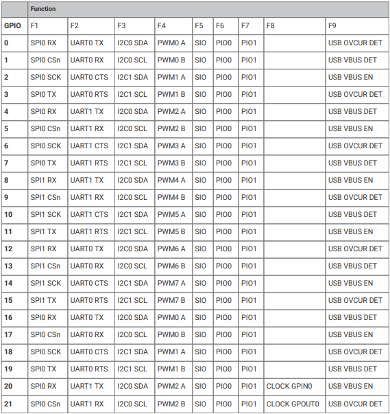
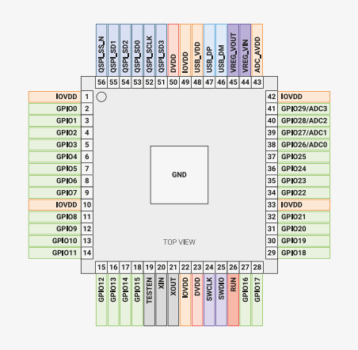

# 02 - GPIO

We will use the [Rust](https://www.rust-lang.org/) programming language and [Embassy-rs](https://embassy.dev/) for the labs.

## What is GPIO?

General-Purpose Input/Output, or GPIO, is an essential part of embedded systems that serves as a vital conduit between microcontrollers and microprocessors and the outside world. A microcontroller or microprocessor's group of pins that can each be set to operate as an input or an output is referred to as GPIO. The purpose of these pins is to interface external components, including actuators, displays, sensors, and other devices, so that the embedded system may communicate with its surroundings. Standardized communication protocols like SPI, I2C, PCM, PWM, and serial communication may be directly supported by some GPIO pins. There are two varieties of GPIO pins: digital and analog.

### Difference between analog and digital

Analog and Digital are two types of signals. The difference between Analog and Digital is how the data is transmitted. Digital signals are transmitted as 1s and 0s, whereas analog signals are transmitted in waves.

### Analog Signal

A continuous, gradually varying electrical waveform that offers an infinite range of values within a certain range is known as an analog signal. Analog signals, which are frequently utilized in audio and video transmission, faithfully capture real-world occurrences. For accurate measurements, analog signals are produced by sensors such as temperature gauges. These signals are used by analog joysticks and potentiometers to provide precise control over electronic equipment. In conventional communication systems, such analog telephone, analog signals are essential. Analog signals are necessary for high-precision measurements in scientific equipment. Digital technology is widely used nowadays, yet analog signals still exist because they can reliably transmit continuous information.

<div align="center">

</div>

### Digital Signal

A digital signal is a binary code made up of 0s and 1s that is used to discretely represent information. Digital transmissions are separate from analog signals, allowing for accurate and error-free communication. Binary logic is used in modern computing to process data, and digital signals are essential to this process. Through error correction, they play a crucial part in telecommunications by guaranteeing dependable transmission. MP3 and other digital audio formats efficiently store and transfer sound as a sequence of binary bits. Modern displays rely heavily on digital signals to transform binary data into visible information on screens. They make it possible for digital media like hard drives and flash memory to be robustly and securely stored. Physical phenomena are translated into binary data for processing by digital sensors, such as those used in cameras and touchscreens. The extensive application of

<div align="center">

</div>

## Configuring GPIO Pins

GPIO pins can be used as outputs (LEDs, motors, buzzers) or as inputs (buttons, sensors).

### Basics of configuring GPIO pins for input and output.

The GPIO pins are configured using the microcontroller's registers. Each pin has a separate register for configuring it as input or output and a separate register for writing or reading values from it. Below is a table with the memory addresses of the GPIO pins. We can see on the right a description of the address, and the offset for it. To write a register, we must compose a base address and an offset.

<div align="center">

</div>

:::info 

For a better understanding, please read [chapter 2.3.1.7](https://datasheets.raspberrypi.com/rp2040/rp2040-datasheet.pdf) of the datasheet.

:::

GPIO pins can be configured for several functionalities, they can read or write depending on their type and can also be used by certain communication protocols. To configure the GPIO pins, we must consult the datasheet of the microcontroller used, in our case RP2040.

<div align="center">

</div>

To see the number of a GPIO pin, we need the pinout scheme of microcontroller.

<div align="center">

</div>

:::info 

For a better understanding, please read [chapter 1.4.3](https://datasheets.raspberrypi.com/rp2040/rp2040-datasheet.pdf) of the datasheet.

:::

### Using the embassy-rs library for GPIO pin configuration

Because writing functionalities on an MCU is quite complicated and requires a lot of time using bare metal. Over time, several layers of abstraction were added to the programming languages and frameworks appeared to make the writing of new functionalities more efficient. One of these frameworks is Embassy-rs, which is a level of abstraction added on top of Rust to make the development process more efficient and faster.

**We have to follow several steps to configure a pin in embassy-rs:**

1. We need the specialized library from embassy rs for controlling the GPIO pins and certain components from it.

```rust
use gpio::{Input, Level, Output, Pull};
```

2. We have to define an gpio, choose its type and choose the corresponding pin number.

**Output**
```rust
let mut gpio_name = Output::new(p.PIN_n, Level::Low);
```

You must replace `n` in `PIN_n` with the pin number. `Level::Low` sets the initial output of the pin, for example if you connect a led and initially want it to be off, set Level::Low, if you want it to be on, set `Level::High`.

**Input**
```rust
let gpio_name = Input::new(p.PIN_n, Pull::Up);
```

For the input type pins, as well as the output ones, we must set the pin number in `PIN_n`, `n` being the number in the pin diagram. `Pull::Up` or `Pull::Down` activates the internal pull up or pull down resistors of the GPIO pin.

:::warning 

For a correct use of the buttons, use pull-up, pull-down resistors depending on the mode of operation of the button. Check [01 - Hardware Introduction](https://embedded-rust-101.wyliodrin.com/docs/lab/01#buttons)

:::

## Control GPIO Pins

As we saw in the previous chapters, the GPIO pins can be used to communicate with the environment through external elements. Next we will see how we can do this using Embassy-rs.

### Writing Rust code to control LEDs using GPIO pins.

The LEDs can be controlled by gpio because the pins can output electric current depending on their configuration (read the datasheet). Therefore, after you configure the pin to correspond with your led, it is necessary to control the voltage for the respective led, so we have to look at the panel of the GPIO pin and choose the appropriate resistance.

**Steps to turn on/off a led:**

1. First of all, we will define our LED and assign it the Level::Low property to be initially off.
```rust
let mut led = Output::new(p.PIN_17, Level::Low);
```

2. To control the flow of current passing through the pin, we have 2 functions to set the pin to low or high depending on the need.
```rust
led.set_high();
led.set_low();
```

:::warning 

The GPIO pins output a standard output current depending on the microcontroller. To be sure that the LED will work normally and there is no risk of destruction, it is recommended to calculate and add a resistor to control the current level.

:::

<div align="center">

</div>

### Writing Rust code to read button state using GPIO pins.

To read the input from the button, we must define the gpio we will use and also choose whether we will put a pull-up or pull-down resistor.

**Steps to turn read state of a button:**

1. We need to define the pin used and set the type of resistance used.
```rust
let button = Input::new(p.PIN_2, Pull::Up);
```

2. To read the input value we can use the is_high() function which will return true if the pin detects input current or false if the pin does not detect input current.
```rust
if button.is_high() {
    // Do something ...
} else {
    // Do something ...
}
```

<div align="center">

</div>

## Advanced techniques for using GPIO pins

In this topic we will discuss several techniques used to solve some hardware problems that can appear using only software.

### Using async for efficient GPIO handling.

The loop runs infinitely, when using the GPIO pins, problems may arise because of this. We can block the loop until meeting certain signals coming on the GPIO.

```rust
let mut async_input = Input::new(p.PIN_16, Pull::Down);

loop {
  async_input.wait_for_high().await;
  info!("The button has been pressed");
}
```

In the case above, the loop is blocked until the button sends the high status.

### Debouncing techniques for stable input reading.

Noise is produced whenever a pushbutton or other switch is moved. Because the switch contact is made of metal and has some elasticity, there is some noise (contact). The switch literally bounces a few times once it makes contact with a metal surface when it is shifted into a new position. This contact is known as bounce. 

<div align="center">

</div>

The image above shows the signal produced by a button when pressed.

The most correct way to correct the bouncing problem is the hardware one, but there are also software methods to correct the problem. For more details and examples, consult the documentation from Embassy-rs and the examples provided by them.

## Exercises

1. Create a Rust program using Embassy-rs set on high an LED connected to GPIO pin 0.
2. Connect an LED to the GP2 pin and create a program written in Embassy-rs to toggle the LED once every 2 seconds.

:::note

To put delay in the infinite loop, this is an example:

```rust
let delay = Duration::from_secs(1);
loop {
    // your code
    Timer::after(delay).await;
    // your code
}
```

:::

3. Connect a button to the GP3 pin and write a program in Embassy-rs that will write the message "The button was pressed" to the console every time the button is pressed.

:::note

To write messages in the console use:

```rust
loop {
    info!("message");
}
```

:::

4. Using the button and the LED from exercise 3 and 2 respectively, write a program in Embassy-rs to toggle the LED when the button is pressed.