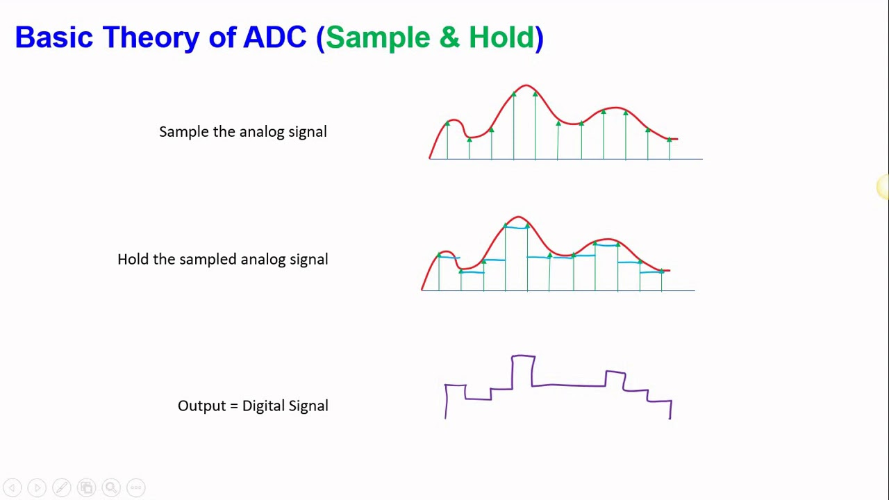

# 02 - GPIO

We will use the [Rust](https://www.rust-lang.org/) programming language and [Embassy-rs](https://embassy.dev/) for the labs.

## Definition and importance of GPIO in embedded systems

GPIO, or General-Purpose Input/Output, is a crucial component in embedded systems, playing a fundamental role in connecting microcontrollers and microprocessors to the external world. GPIO refers to a set of pins on a microcontroller or microprocessor that can be individually configured to function as either input or output. These pins are used to interface with external devices, such as sensors, actuators, displays, and other components, allowing the embedded system to interact with its environment. Some GPIO pins may directly support standardized communication protocols like serial communication, SPI, I2C, PCM, and PWM. GPIO pins are of two types, analog or digital.

### Difference between analog and digital

Analog and Digital are two types of signals. The difference between Analog and Digital is how the data is transmitted. Digital signals are transmitted as 1s and 0s, whereas analog signals are transmitted in waves.

### Analog Signal

An analog signal is a continuous electrical waveform that varies smoothly, providing an infinite range of values within a specified range. Commonly used in audio and video transmission, analog signals accurately represent real-world phenomena. Sensors like temperature gauges output analog signals for precise measurements. Analog joysticks and potentiometers use these signals for nuanced control in electronic devices. Analog signals are vital in traditional communication systems, such as analog telephony. Scientific instruments rely on analog signals for high-precision measurements. Despite the prevalence of digital technology, analog signals persist due to their ability to convey continuous information accurately.

<div align="center">

</div>

### Digital Signal

A digital signal is a discrete representation of information using binary code, consisting of 0s and 1s. Unlike analog signals, digital signals are distinct, enabling precise and error-resistant communication. Digital signals are integral to modern computing, where data is processed using binary logic. They play a key role in telecommunications, ensuring reliable transmission through error correction. Digital audio formats, like MP3, encode sound as a series of binary digits for efficient storage and transmission. Digital signals are fundamental in modern displays, converting binary data into visual information on screens. They enable secure and robust storage in digital media such as hard drives and flash memory. Digital sensors, like those in cameras and touchscreens, convert physical phenomena into binary data for processing. The widespread use of digital signals is driven by their efficiency, accuracy, and adaptability in various technological applications.

<div align="center">

</div>

## Configuring GPIO Pins

GPIO pins can be used as outputs (LEDs, motors, buzzers) or as inputs (buttons, sensors).

### Basics of configuring GPIO pins for input and output.

The GPIO pins are configured bare metal using the microcontroller's registers. Each pin has a separate register for configuring it as input or output and a separate register for writing or reading values from it. Below is a table with the memory addresses of the GPIO pins. We can see on the right a description of the address, and the offset for it. To write a register, we must compose a base address and an offset.

<div align="center">

</div>

:::info 

For a better understanding, please read [chapter 2.3.1.7](https://datasheets.raspberrypi.com/rp2040/rp2040-datasheet.pdf) of the datasheet.

:::

GPIO pins can be configured for several functionalities, they can read or write depending on their type and can also be used by certain communication protocols. To configure the GPIO pins, we must consult the datasheet of the microcontroller used, in our case RP2040.

<div align="center">

</div>

To see the number of a GPIO pin, we need the pinout scheme of microcontroller.

<div align="center">

</div>

:::info 

For a better understanding, please read [chapter 1.4.3](https://datasheets.raspberrypi.com/rp2040/rp2040-datasheet.pdf) of the datasheet.

:::

### Using the embassy-rs library for GPIO pin configuration

Because writing functionalities on an MCU is quite complicated and requires a lot of time using bare metal. Over time, several layers of abstraction were added to the programming languages and frameworks appeared to make the writing of new functionalities more efficient. One of these frameworks is Embassy-rs, which is a level of abstraction added on top of Rust to make the development process more efficient and faster.

**We have to follow several steps to configure a pin in embassy-rs:**

1. We need the specialized library from embassy rs for controlling the GPIO pins and certain components from it.

```rust
use gpio::{Input, Level, Output, Pull};
```

2. We have to define an gpio, choose its type and choose the corresponding pin number.

**Output**
```rust
let mut gpio_name = Output::new(p.PIN_n, Level::Low);
```

You must replace n in PIN_n with the pin number. Level::Low sets the initial output of the pin, for example if you connect a led and initially want it to be off, set Level::Low, if you want it to be on, set Level::High.

**Input**
```rust
let gpio_name = Input::new(p.PIN_n, Pull::Up);
```

For the input type pins, as well as the output ones, we must set the pin number in PIN_n, n being the number in the pin diagram. Pull::Up or Pull::Down activates the pull up or pull down resistors of the GPIO pin.

:::warning 

For a correct use of the buttons, use pull-up, pull-down resistors depending on the mode of operation of the button. Check [01 - Hardware Introduction](https://embedded-rust-101.wyliodrin.com/docs/lab/01#buttons)

:::

## Control GPIO Pins

As we saw in the previous chapters, the GPIO pins can be used to communicate with the environment through external elements. Next we will see how we can do this using Embassy-rs.

### Writing Rust code to control LEDs using GPIO pins.

The LEDs can be controlled by gpio because the pins can output electric current depending on their configuration (read the datasheet). Therefore, after you configure the pin to correspond with your led, it is necessary to control the voltage for the respective led, so we have to look at the panel of the GPIO pin and choose the appropriate resistance.

**Steps to turn on/off a led:**

1. First of all, we will define our LED and assign it the Level::Low property to be initially off.
```rust
let mut led = Output::new(p.PIN_17, Level::Low);
```

2. To control the flow of current passing through the pin, we have 2 functions to set the pin to low or high depending on the need.
```rust
led.set_high();
led.set_low();
```

:::warning 

The GPIO pins output a standard output current depending on the microcontroller. To be sure that the LED will work normally and there is no risk of destruction, it is recommended to calculate and add a resistor to control the current level.

:::

<div align="center">

</div>

### Writing Rust code to read button state using GPIO pins.

To read the input from the button, we must define the gpio we will use and also choose whether we will put a pull-up or pull-down resistor.

**Steps to turn read state of a button:**

1. We need to define the pin used and set the type of resistance used.
```rust
let button = Input::new(p.PIN_2, Pull::Up);
```

2. To read the input value we can use the is_high() function which will return true if the pin detects input current or false if the pin does not detect input current.
```rust
if button.is_high() {
    // Do something ...
} else {
    // Do something ...
}
```

<div align="center">

</div>

## Analog Input/Output

Some of the GPIO pins of the RP2040 have the property of ADC, i.e. analogue-digital converter. To find these pins on the microcontroller diagram, we will analyze the names of the GPIOs and see the peculiarity of some of them having /ADCn. They can be configured either as normal digital pins or as ADC pins. They are used to accurately read certain values transmitted by sensors or to accurately write.

<div align="center">

</div>

:::info 

If you want to better understand how the transformation from analog to digital inside the microcontroller works, we recommend the following [reading](https://www.arrow.com/en/research-and-events/articles/engineering-resource-basics-of-analog-to-digital-converters).

:::

In Embassy Rs we will use a separate library and also separate modules for ADC.

```rust
use embassy_rp::adc::{Adc, Channel, Config, InterruptHandler};
```

To define an ADC type pin, proceed as follows:

```rust
let mut adc = Adc::new(p.ADC, Irqs, Config::default());
let mut gpio_name = Channel::new_pin(p.PIN_n, Pull::None);
```

The 'adc' variable will be used for reading from an ADC pin. To do this operation we will use:

```rust
let value = adc.read(&mut gpio_name).await.unwrap();
```

## Advanced techniques for using GPIO pins

In this topic we will discuss several techniques used to solve some hardware problems that can appear using only software.

### Using async for efficient GPIO handling.

The loop runs infinitely, when using the GPIO pins, problems may arise because of this. We can block the loop until meeting certain signals coming on the GPIO.

```rust
let mut async_input = Input::new(p.PIN_16, Pull::Down);

loop {
  async_input.wait_for_high().await;
  info!("The button has been pressed");
}
```

In the case above, the loop is blocked until the button sends the high status.

### Debouncing techniques for stable input reading.

When a pushbutton or any switch's position is changed noise is generated. Some noise (contact) occurs because the switch contact is metal and it has elasticity. When the switch is moved to a new position it strikes a metal contact and physically bounces a few times. We call this contact bounce. 

<div align="center">

</div>

The image above shows the signal produced by a button when pressed.

The correct method of correcting this problem is hardware, but it requires electronic expertise. A quick and much easier option is software correction. Using Embassy-rs will show as follows:

```rust
#![no_std]
#![no_main]

use defmt::info;
use embassy_executor::Spawner;
use embassy_rp::gpio::{Input, Level, Pull};
use embassy_time::{with_deadline, Duration, Instant, Timer};
use {defmt_rtt as _, panic_probe as _};

pub struct Debouncer<'a> {
    input: Input<'a>,
    debounce: Duration,
}

impl<'a> Debouncer<'a> {
    pub fn new(input: Input<'a>, debounce: Duration) -> Self {
        Self { input, debounce }
    }

    pub async fn debounce(&mut self) -> Level {
        loop {
            let l1 = self.input.get_level();

            self.input.wait_for_any_edge().await;

            Timer::after(self.debounce).await;

            let l2 = self.input.get_level();
            if l1 != l2 {
                break l2;
            }
        }
    }
}

#[embassy_executor::main]
async fn main(_spawner: Spawner) {
    let p = embassy_rp::init(Default::default());
    let mut btn = Debouncer::new(Input::new(p.PIN_9, Pull::Up), Duration::from_millis(20));

    info!("Debounce Demo");

    loop {
        // button pressed
        btn.debounce().await;
        let start = Instant::now();
        info!("Button Press");

        match with_deadline(start + Duration::from_secs(1), btn.debounce()).await {
            // Button Released < 1s
            Ok(_) => {
                info!("Button pressed for: {}ms", start.elapsed().as_millis());
                continue;
            }
            // button held for > 1s
            Err(_) => {
                info!("Button Held");
            }
        }

        match with_deadline(start + Duration::from_secs(5), btn.debounce()).await {
            // Button released <5s
            Ok(_) => {
                info!("Button pressed for: {}ms", start.elapsed().as_millis());
                continue;
            }
            // button held for > >5s
            Err(_) => {
                info!("Button Long Held");
            }
        }

        // wait for button release before handling another press
        btn.debounce().await;
        info!("Button pressed for: {}ms", start.elapsed().as_millis());
    }
}
```

## Exercises

1. Create a Rust program using embassy-rs set on high an LED connected to GPIO pin 0.
2. Connect an LED to the GP2 pin and create a program written in Embassy-RS to toggle the LED once every 2 seconds.
3. Connect a button to the GP3 pin and write a program in Embassy-RS that will write the message "The button was pressed" to the console every time the button is pressed.
4. Using the button and the LED from exercise 3 and 2 respectively, write a program in Embassy-rs to toggle the LED when the button is pressed.