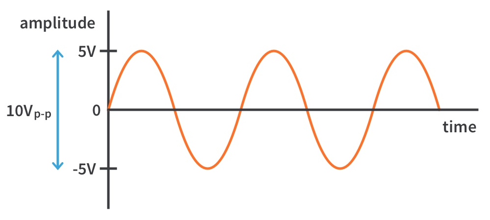
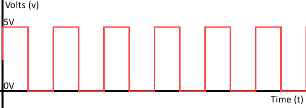

# 02 - GPIO

The purpose of this lab is to understand how to start developing in [Rust](https://www.rust-lang.org/) for the
RP2040 MCU. The lab presents three examples:
 - **bare metal** development - writing directly to registers, actually writing a driver
 - **platform access crate** (PAC) - using an automatically generated crate from the MCUs SVD file, actually writing a driver, but with some kind of automation
 - **embassy-rs** - using the Rust standard `embedded-hal` implemented by the [Embassy-rs](https://embassy.dev/ framework.

:::info
The example of this lab is to blink an LED at a certain time interval.
:::

## Resources

1. **Raspberry Pi Ltd**, *[RP2040 Datasheet](https://datasheets.raspberrypi.com/rp2040/rp2040-datasheet.pdf)*
2. **Raspberry Pi Ltd**, *[Raspberry Pi Pico Datasheet](https://datasheets.raspberrypi.com/pico/pico-datasheet.pdf)*
3. **Raspberry Pi Ltd**, *[Raspberry Pi Pico W Datasheet](https://datasheets.raspberrypi.com/picow/pico-w-datasheet.pdf)*

## What is GPIO?

General-Purpose Input/Output, or GPIO, is an essential part of embedded systems that serves as a vital conduit between microcontrollers and microprocessors and the outside world. A microcontroller or microprocessor's group of pins that can each be set to operate as an input or an output is referred to as GPIO. The purpose of these pins is to interface external components, including actuators, displays, sensors, and other devices, so that the embedded system may communicate with its surroundings. Standardized communication protocols like SPI, I2C, PCM, PWM, and serial communication may be directly supported by some GPIO pins. There are two varieties of GPIO pins: digital and analog.

### Difference between analog and digital signals

Electrical signals are of two types, analog and digital. The difference between analog and digital signals is in the way data is transmitted. Digital signals are transmitted as `1`s and `0`s, whereas analog signals are transmitted in waves.

### Analog Signal

A continuous, gradually varying electrical waveform that offers an infinite range of values within a certain range is known as an analog signal. Analog signals, which are frequently utilized in audio and video transmission, faithfully capture real-world occurrences. For accurate measurements, analog signals are produced by sensors such as temperature gauges. These signals are used by analog joysticks and potentiometers to provide precise control over electronic equipment. In conventional communication systems, such analog telephone, analog signals are essential. Analog signals are necessary for high-precision measurements in scientific equipment. Digital technology is widely used nowadays, yet analog signals still exist because they can reliably transmit continuous information.

<div align="center">

</div>

### Digital Signal

A digital signal is a binary code made up of 0s and 1s that is used to discretely represent information. Digital transmissions are separate from analog signals, allowing for accurate and error-free communication. Binary logic is used in modern computing to process data, and digital signals are essential to this process. Through error correction, they play a crucial part in telecommunications by guaranteeing dependable transmission. MP3 and other digital audio formats efficiently store and transfer sound as a sequence of binary bits. Modern displays rely heavily on digital signals to transform binary data into visible information on screens. They make it possible for digital media like hard drives and flash memory to be robustly and securely stored. Physical phenomena are translated into binary data for processing by digital sensors, such as those used in cameras and touchscreens. The extensive application of

<div align="center">

</div>

## Configuring GPIO Pins

GPIO pins can be used as outputs (LEDs, motors, buzzers) or as inputs (buttons, sensors).

The R02040 has three peripherals that control the GPIO pins:
 1. *Pads* - control the actual physical pin or pad that the processor has outside. This control the electrical parameters, like maximum current or pull up and pull down resistors
 2. *IO Bank0* - connects and multiplexes the peripheral's pins to the output pads. Several peripherals use the same output pad to communicate with the exterior. For example, in the image below, `GPIO0` can be used either for:
    * `SIO` - the `GPIO` function
    * `SPI_RX` - the receive pin for the `SPI` peripheral
    * `I2C0_SDA` - the data pin for the `I2C0` peripheral
    * `UART0_TX` - the transmit pin for the `UART0` (serial port 0) peripheral
 3. *SIO* - that controls the interior MCU's pins. This is the peripheral that developers use to read and write the value of the pins.


## Bare metal

When using bare metal, developers interact directly with the hardware devices. They are responsible for all the
drivers and other components that they want to use. Mostly, bare meta development means *reading* and *writing* data
from and to the MCUs and peripheral registers.

The RP2040 (ARM Cortex-M0+) MCU uses *Memory Mapped Input Output* (MMIO). This means that the peripheral's registers
are mapped into the address space (in normal words, in the memory). Reading and writing data from and to these registers
is done by memory reads and writes.

Blinking an LED in bare metal programming means following these steps:

 1. Ask the rust compiler not to use the `std` library, as it depends on the operating system
 2. Write a `main` function and instruct the MCU to call it at startup (reset)
 3. Configure the Single Cycle IO (SIO) peripheral to set a pin as output
 4. Enable the *IO Bank0* peripheral of the RP2040
 5. Configure the *IO Bank0* peripheral so that it sets a certain pin as output
 6. Toggle the pin's value through the *SIO*'s registers
 7. Wait for an amount of time
 8. Loop though steps 5 and 6

### no-std

As the code written runs on an MCU without any framework or operating system,
the Rust compiler cannot rely on the `std` library. The two macros directives
ask the compiler not to link the `std` library and not to expect `main`
function.

```rust
#![no_main]
#![no_std]
```

:::warning

The bare metal code has to start with these two directives.

:::

### Bootloader

The RP2040 has a piece of software written in an internal ROM memory that is loaded 
when the MCU boots. This looks at the first 256 bytes of the Flash memory
to understand how it needs to start the MCU.

:::tip

While the ROM bootloader is rather small, its functionality is very similar to the PC's BIOS
boot sequence.

:::

The RP2040's datasheet explains the boot process. This is not very straight forward, and writing this
information requires a digital signature. The `rp2040-boot` crate provides the bootloader information
for booting with the `cortex-m-rt` crate.

Adding the following code to the Rust includes the bootloader.

```rust
#[link_section = ".boot_loader"]
#[used]
pub static BOOT_LOADER: [u8; 256] = rp2040_boot2::BOOT_LOADER_W25Q080;
```

### Entry

For this lab, we will use the `cortex-m-rt` crate. As the starting code for an MCU is usually processor
and vendor dependant, this carte allows developers to get started a little faster. It implement the bare minimum
initialization code and provides a macro called `entry` that developers can use to select the startup (main)
function.

When an error occurs, Rust calls the `panic` function. When using the `std` library, the `panic` function is
already defined. It prints the error and usually unwinds the stack. When using `core`, it is the developer's
job to define a `panic` function. In the case of bare metal development, the simplest `panic` function is 
one that loops indefinitely, preventing the MCU form executing code.

```rust
use core::panic::PanicInfo;

use cortex_m_rt::entry;

// the `entry` macro sets up this function
// as the function that the MCU calls at
// startup
#[entry]
fn main() -> ! {
    // the `main` function is not allows to return
    loop { }
}

// rust uses panics when an error occurs
// as this is bare metal, we have to define
// the panic function that rust calls
#[panic_handler]
fn panic(_info: &PanicInfo) -> ! {
    // if an error occurs, we simply loop around
    // to prevent the MCU from executing 
    // anything
    loop {}
}
```

:::warning

In bare metal mode, the MCU does not run any framework or operating system, it just runs the developers bare metal code. This is why `main` function is not allowed to return, it loops forever. There is no system to which the function
could return control.

:::

### Configuring the SIO

The GPIO pins are configured using the MCU's SIO registers. Each pin is configured by setting or clearing the corresponding
bit of several registers. Below is a table with the memory addresses of the SIO registers. 

The *SIO* peripheral has a base address, the address where its registers are mapped in the address space.

Each register has an offset, that represents the registers position (offset) relative to the *SIO*'s base address. 

:::tip

Computing the actual address of a register means adding the base address of the peripheral with the register's offset.

e.g: `GPIO_OE`'s address is `0xd000_0000 + 0x020` => `0xd000_0020`

:::

<div align="center">

</div>

```rust
const GPIO_OE_SET: *mut u32 = 0xd000_0024 as *mut u32;
const GPIO_OUT_SET: *mut u32 = 0xd000_0014 as *mut u32;
const GPIO_OUT_CLR: *mut u32 = 0xd000_0018 as *mut u32;

// set the `pin` pin as output
write_volatile(GPIO_OE_SET, 1 << pin);

// set the `pin` to value `0`
write_volatile(GPIO_OUT_CLR, 1 << pin)

// set the `pin` to value `1`
write_volatile(GPIO_OUT_SET, 1 << pin)
```

:::info 

For a better understanding, please read subchapters 2.3.1.2 and 2.3.1.7 of the [datasheet](https://datasheets.raspberrypi.com/rp2040/rp2040-datasheet.pdf).

:::

### Configuring the IO Bank0

GPIO pins can be configured for several functionalities, they can be used as GPIO pins or can also be used by certain peripherals, usually those that implement communication protocols. The RP2040's *IO Bank0* peripherals performs this multiplexing.

The following table provides all the functions that each pin can have.

<div align="center">

</div>

#### Enable the IO Bank

When the RP2040 starts, the *IO Bank0* peripheral is disabled.

TODO: add registers list and `RESET` and `RESET_DONE` register fields

TODO: explain the +0x3000

```rust
const RESET: u32 = 0x4000_c000;
const CLR: u32 = 0x3000;

const RESET_DONE: u32 = 0x4000_c008;

unsafe {
    // clear bit `5` of the `RESET` register by
    // writing `1` on  bit `5` at address
    // `RESET` + 0x3000
    write_volatile((RESET + CLR) as *mut u32, 1 << 5);

    // wait for the IO Bank0 to enable
    while read_volatile(RESET_DONE as *const u32) & (1 << 5) == 0 {}
}
```

#### Configure the GPIO

To connect the *SIO* peripheral to the output pins, developers have to modify the `GPIOx_CTRL` register.

Each GPIO pin has its own control register, located at offset $40014000h + 4 + 8 * pin$.

<div align="center">

</div>

:::tip

For example, `GPIO25_CTRL`'s address if `0x40014000 + 4 + 8 * 25` = `0x400140CC`.
.

Pin 25 is connected to the onboard LED of the Raspberry Pi Pico.

:::

The following table shows the fields of the `GPIOx_CTRL` register. The fields that is of interest is `FUNCSEL`.
Depending on the value written there, the *IO Bank0* will select a function or another. For this example,
we have to write value `5`.

<div align="center">

</div>

```rust
const GPIOX_CTRL: u32 = 0x4001_4004;

// compute the address of the GPIOx_CTRL register
let gpio_ctrl = (GPIOX_CTRL + 8 * LED) as *mut u32;

// write the value 5 to the FUNCSEL field
// Note: This actually writes the value 5 in FUNCSEL
//       and 0s in all the other field. While this
//       if fine for this example, usually a
//       read, modify, write sequence should be used
unsafe { write_volatile(gpio_ctrl, 5); }
```

:::info 

For a better understanding, please read subchapters 1.4.3, 2.1.12, 2.14, 2.19.1, 2.19.2, 2.19.15, 2.19.16 of the [datasheet](https://datasheets.raspberrypi.com/rp2040/rp2040-datasheet.pdf).

:::

### Configuring the Pad

The Pad peripheral is responsible for the electrical setup of the pins. It can configure the
the maximum output current, input pull up or pull down resistor.

The following table shows the *Pads* peripheral registers. Each GPIO pin has a corresponding register.

<div align="center">

</div>

The following tables describe the `GPIOx` register. This register allows the configuration of several
electrical parameters.

<div align="center">

</div>

<div align="center">

</div>

Looking at the default values, when the MCU starts, pins are configured:

| | |
|-|-|
| Output Enabled | Yes |
| Input Enabled | Yes |
| Maximum Output Current | 4mA |
| Pull Input Resistor | Pull Down |
| Schmidt Trigger | Yes |
| Slew Rate | Slow |

For this lab, the default value are fine, this peripheral can be considered as being properly setup.

### Wait for an amount of time

When using an operating system, developers usually have a function called `sleep` which asks the operating system
to suspend the process for a certain amount of time. In bare metal environment, with no framework or operating system,
this is not available. We MCU timers can be used for this, the simplest (and most inefficient) of waiting is to
loop around while doing nothing. The Arm Cortex-M processors offer the `nop` instruction. This asks the processor
to do nothing.

```rust
// loops around 50000 times asking the processor
// to execute the `nop` instruction that does
// nothing
for _ in 0..50000 {
    // without this `asm` here, the compiler would optimize out the loop
    asm!("nop");
}
```

:::warning

The `asm("nop")` is necessary, as otherwise the compiler optimizes out the empty loop.

:::

The question is how fast does this execute. The RP2040 starts by default using an internal 12MHz clock.

$$
t_{nop} = \frac{1}{12.000.000}s = 0.83ns
$$

The `loop` itself and the range (`0..50000`) calculation take another 4 - 5 MCU cycles. The actual wait time
of the example is:

$$
t_{wait} = 5 * 50000 * \frac{1}{12.000.000}s = 20.83\mu s
$$

## Platform Access Crate (PAC)

An improved, mid level, way of developing in Rust for MCUs are the *platform access crates* 
(PAC). These crates are automatically generated from the *System View Description* (SVD) files.

Using [rust2svd](https://docs.rs/svd2rust/latest/svd2rust/), developers can automatically generate
a crate that provides access functions to the MCUs registers. This provides a significant improvement,
as developers do not have to write manually the register addresses.

One of the PAC crates for the RP2040 MCU is [rp2040-pac](https://docs.rs/rp2040-pac/latest/rp2040_pac/).

:::note

The PAC crate does not provide any means of initializing the MCU, so the entry point is still
defined by the `cortex-m-rt` crate, just as it was for bare metal.

Similarly, the PAC crate does not provide ant `sleep` function.

This section presents only the differences between bare metal and PAC. The PAC mode of writing 
embedded software is very similar to bare metal, just that register access is made easier.

:::

### Entry

One of the first lines of the `main` function is getting a reference to all the
peripherals.

```rust
use rp2040_pac::Peripherals;

#[entry]
fn main() -> ! {
    // get a reference to all the peripherals
    let peripherals = unsafe { Peripherals::steal() };

    loop { }
}
```

### Configuring the SIO

The PAC crate provides the `SIO` peripheral, which in turn provides a function for
each one of its registers. It fully hides the actual address of the registers.

```rust
let sio = peripherals.SIO;

// set the `pin` pin as output
sio.gpio_oe_set().write(|w| unsafe { w.bits(1 << pin) });

// set the `pin` to value `0`
sio.gpio_out_clr().write(|w| unsafe { w.bits(1 << pin) })

// set the `pin` to value `1`
sio.gpio_out_set().write(|w| unsafe { w.bits(1 << pin) })
```

###  Configuring the IO Bank0

#### Enable the IO Bank0

```rust
let reset = peripherals.RESETS;

// the downside of the PAC is that we cannot
// use the CLR (+0x3000) trick that the RP2040
// provides, we have to read and write the
// `RESET` register.
// svd2rust does not know about this so
// it cannot generated the corresponding
// register
reset
    .reset()
    .modify(|r, w| unsafe { w.bits(r.bits() & !(1 << 5)) });
while reset.reset_done().read().bits() & (1 << 5) == 0 {}
```

#### Configure the GPIO

```rust
let io_bank0 = peripherals.IO_BANK0;

// write the value 5 to the FUNCSEL field
// Note: This actually writes the value 5 in FUNCSEL
//       and 0s in all the other field. While this
//       if fine for this example, usually a
//       read, modify, write sequence should be used
io_bank0
    .gpio(pin)
    .gpio_ctrl()
    .write(|w| unsafe { w.bits(5) });

// the correct way of doing this
io_bank0
    .gpio(pin)
    .gpio_ctrl()
    // the PAC crate provides fucntions for all the 
    // register's fields
    .modify(|_, w| unsafe { w.funcsel().bits(5) });
```

## Using the embassy-rs library for GPIO pin configuration

Because writing functionalities on an MCU is quite complicated and requires a lot of time using bare metal. Over time, several layers of abstraction were added to the programming languages and frameworks appeared to make the writing of new functionalities more efficient. One of these frameworks is Embassy-rs, which is a level of abstraction added on top of Rust to make the development process more efficient and faster.

**We have to follow several steps to configure a pin in embassy-rs:**

1. We need the specialized library from embassy rs for controlling the GPIO pins and certain components from it.

```rust
use gpio::{Input, Level, Output, Pull};
```

2. We have to define an gpio, choose its type and choose the corresponding pin number.

**Output**
```rust
let mut gpio_name = Output::new(p.PIN_n, Level::Low);
```

You must replace `n` in `PIN_n` with the pin number. `Level::Low` sets the initial output of the pin, for example if you connect a led and initially want it to be off, set `Level::Low`, if you want it to be on, set `Level::High`.

**Input**
```rust
let gpio_name = Input::new(p.PIN_n, Pull::Up);
```

For the input type pins, as well as the output ones, we must set the pin number in `PIN_n`, `n` being the number in the pin diagram. `Pull::Up` or `Pull::Down` activates the internal pull up or pull down resistors of the GPIO pin.

:::warning 

For a correct use of the buttons, use pull-up, pull-down resistors depending on the mode of operation of the button. Check [01 - Hardware Introduction](https://embedded-rust-101.wyliodrin.com/docs/lab/01#buttons)

:::

## Control GPIO Pins

As we saw in the previous chapters, the GPIO pins can be used to communicate with the environment through external elements. Next we will see how we can do this using Embassy-rs.

### Writing Rust code to control LEDs using GPIO pins.

The LEDs can be controlled by gpio because the pins can output electric current depending on their configuration (read the datasheet). Therefore, after you configure the pin to correspond with your led, it is necessary to control the voltage for the respective led, so we have to look at the panel of the GPIO pin and choose the appropriate resistance.

**Steps to turn on/off a led:**

1. First of all, we will define our LED and assign it the `Level::Low` property to be initially off.
```rust
// we define a variable `led`, as in this example PIN 17 will drive an LED
let mut led = Output::new(p.PIN_17, Level::Low);
```

2. To control the output voltage of the pin, we have two functions to set the pin to `Level::Low` or `Level::High` depending on the need.
```rust
led.set_high();
led.set_low();
```

:::warning 

The maximum current that GPIO pins output depends on the microcontroller. To be sure that the LED will work normally and there is no risk of destruction, a resistor has to be added to limit the current level *below* the maximum GPIO output current.

<div align="center">

</div>

:::

### Writing Rust code to read button state using GPIO pins.

To read the input from the button, we must define the gpio we will use and also choose whether we will put a pull-up or pull-down resistor.

**Steps to turn read state of a button:**

1. We need to define the pin used and set the type of resistance used.
```rust
let button = Input::new(p.PIN_2, Pull::Up);
```

2. To read the input value we can use the is_high() function which will return true if the pin detects input current or false if the pin does not detect input current.
```rust
if button.is_high() {
    // Do something ...
} else {
    // Do something ...
}
```

<div align="center">

</div>

## Advanced techniques for using GPIO pins

In this topic we will discuss several techniques used to solve some hardware problems that can appear using only software.

### Using async for efficient GPIO handling.

The loop runs infinitely, when using the GPIO pins, problems may arise because of this. We can block the loop until meeting certain signals coming on the GPIO.

```rust
let mut async_input = Input::new(p.PIN_16, Pull::Down);

loop {
  async_input.wait_for_high().await;
  info!("The button has been pressed");
}
```

In the case above, the loop is blocked until the button sends the high status.

### Debouncing techniques for stable input reading.

Noise is produced whenever a pushbutton or other switch is moved. Because the switch contact is made of metal and has some elasticity, there is some noise (contact). The switch literally bounces a few times once it makes contact with a metal surface when it is shifted into a new position. This contact is known as bounce. 

<div align="center">

</div>

The image above shows the signal produced by a button when pressed.

The most correct way to correct the bouncing problem is the hardware one, but there are also software methods to correct the problem. For more details and examples, consult the documentation from Embassy-rs and the examples provided by them.

## Exercises

1. Use [KiCad](https://www.kicad.org/) to design a simple circuit that connects an LED to GPIO 0.
2. Write a Rust program that set on HIGH the LED connected to GPIO pin 0.
   1. use bare metal
   2. use the `rp2040-pac` crate
   3. use the `embassy-rs` framework
3. Write a Rust program that blinks the LED connected to GPIO pin 0 every 300ms.
   1. use bare metal
   2. use the `rp2040-pac` crate
   3. use the `embassy-rs` framework
4. Use [KiCad](https://www.kicad.org/) to design a simple circuit that connects an LED to GPIO 0 and a button to GPIO 1. Use the inner pull up resistor.

:::tip

To put delay in the infinite loop, this is an example:

```rust
let delay = Duration::from_secs(1);
loop {
    // your code
    Timer::after(delay).await;
    // your code
}
```

:::

5. Write a program using `embassy-rs` that will write the message "The button was pressed" to the console every time the button is pressed.

:::tip

To write messages in the console use:

```rust
loop {
    info!("message");
}
```

:::

6. Write a Rust program using `embassy-rs` that toggles the LED every time the button is pressed.
