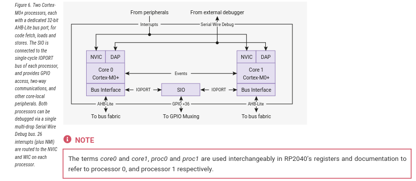
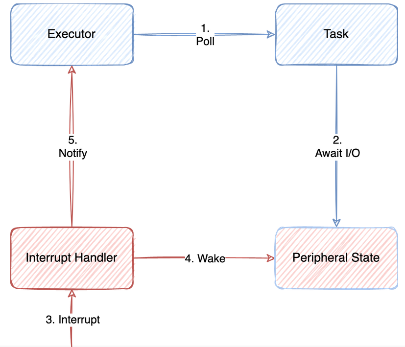

# 03 - Exceptions, Interrupts & Timers

The purpose of this lab is to understand how exceptions and hardware interrupts work and how they can be used, how to set a hard fault handler,
register interrupts and *use interrupts*  with embassy-rs.


## Resources

1. **Raspberry Pi Ltd**, *[RP2040 Datasheet](https://datasheets.raspberrypi.com/rp2040/rp2040-datasheet.pdf)*
2. [Cortex-M0+ Devices Generic User Guide](https://developer.arm.com/documentation/dui0662/latest/)
3. [Embassy documentation](https://embassy.dev/book/dev/runtime.html)


## What is an exception? 

Exceptions describe any condition that requires the processor to stop what it is doing
and do something else. Section 2.3.2 of [Cortex-M0+ Devices generic User Guide](https://documentation-service.arm.com/static/5f04abc8dbdee951c1cdc9f7?token=) lists 7 types of exceptions:


| Exception | Priority | Descriptions |
|-----------|----------|--------------|
| Reset | -15 | Triggered by the system at startup to start the software |
| NMI | -14 | Non Maskable Interrupts, an external interrupt that cannot be ignored, usually used for low latency peripheral needs the attention of the MCU |
| HardFault | -13 | Triggered by the MCU in case of a fault (div by 0, memory fault, ...) |
| SVC | -5 | Supervisor call, triggered usually by a process running on top of the embedded operating system when it wants to make a system call |
| PendSV | -2 | Used for pending system calls |
| SysTick | -1 | Triggered by a periodic timer, usually used by an embedded operating system for context switch |
| Interrupt (IRQ) | 0 and above| Triggered by a peripheral, or generated by a software request

## What is an interrupt?

A hardware interrupt is an type of exception which is a synchronous or asynchronous signal from a peripheral that signals the occurrence of an event that must be handled by the processor. Interrupt handling has the effect of suspending a program's normal thread of execution and launching an interrupt service routine (ISR).

Generally, to associate an interrupt with a specific routine in the program, the processor uses the interrupt vector table (IVT). In this table, each interrupt is associated with the address to which the program will jump when the interrupt is triggered. These addresses are predefined and are mapped in program memory.


The image above illustrates the whole  vector table of ARM Cortex-M0.
It includes exceptions mapped from address 0x04 to 0x40+4n (n depends on the processor type). Lower address means higher priority.
Higher priority exceptions can interrupt lower priority exceptions.

When an interrupt request happens the first thing that the processor does is to memorize its current state. For ARM Cortex-M0 this happens by pushing 8 words or registered data into the main stack to provide the information
need to return the processor to what it was doing before before the interrupt request was called. This part is called the stack frame and it includes registers 0 through 3, register 12, the link register, the program counter and the program status register.


ARM Cortex-M microcontrollers use a similar concept to the IVT called Nested Vectored Interrupt Controller (NVIC).The NVIC is specifically designed to handle these interrupts more efficiently. Interrupt addresses in the NVIC memory region are set according to their priority: the lower the address, the higher the priority. As suggested by the "Nested" in its name, the NVIC supports nested interrupts. This means that if a higher priority interrupt occurs while another interrupt is being processed, the controller can pause the current interrupt service routine (ISR), handle the higher priority interrupt, and then resume the interrupted ISR. This feature is crucial for responsive and real-time processing.


### Interrupts on RP2040

The RP2040 chip has two cores (processors), and each core has its own NVIC. Each core's NVIC is connected to the same set of hardware interrupt lines with one exception : IO Interrupts. In the RP2040, IO interrupts are organized by banks, and each core has its own set of IO interrupts for each bank. The IO interrupts for each core are completely independent. For instance, Processor 0 (Core 0) can be interrupted by an event on GPIO pin 0 in bank 0, while Processor 1 (Core 1) can be interrupted by a separate event on GPIO pin 1 in the same bank. Each processor responds only to its own interrupts, allowing them to operate independently or to handle different tasks simultaneously without interfering with each other.



#### Available interrupt request signals (IRQ)

On RP2040, only the lower 26 IRQ signals are connected on the NVIC, as seen in the table below, and IRQs 26 to 31 are tied to zero (never firing).
The core can still be forced to enter the relevant interrupt handler by writing bits 26 to 31 in the NVIC ISPR register.


The priority order is determined for these signals is determined by :

- First, the dynamic priority level configured per interrupt by the `NVIC_IPR0-7` registers. The Cortex-M0+ implements
the two most significant bits of an 8-bit priority field, so four priority levels are available, and the numerically-lowest
level (level 0) is the highest priority.
 - Second, for interrupts with the same dynamic priority level, the lower-numbered IRQ has higher priority (using the
IRQ numbers given in the table above)


#### GPIO Interrupts

All GPIO pins in Raspberry Pi Pico support interrupts. The interrupts can be classified into three types:

- Level High: An interrupt occurs when a pin is HIGH or at logic 1.
- Level Low: An interrupt occurs when a pin is LOW or at logic 0.
- Rising Edge: Interrupt occurs when a pin transitions from a LOW to HIGH.
- Falling Edge: Interrupt occurs when a pin transitions from HIGH to LOW.


## How to setup an interrupt (or exception) -- bare metal approach

The following steps won't be enough for full bare metal setup of the interrupts. It is only a model that's meant to help understanding this process which is abstracted in higher level frameworks like embassy.

#### 1. Write an interrupt handler
An interrupt handler is a function that should be executed when a the interrupt signal is triggered. This function must have the signature `fn()` without any arguments or return value.

```rust
extern "C" fn interrupt_0_handler() {
    // Clear the irq
    // Your interrupt handling code here
}
```

Using **extern "C"** ensures the function uses the C calling convention, which is necessary for interrupt handlers.

#### 2. Create the vector table array
Make a type of entry for the interrupt vector table, which will contain a pointer to an interrupt handler function.

``` rust
pub union Vector {
    handler: unsafe extern "C" fn(), //pointer to handler function
}
```
Create the vector table array, populating it with the addresses of your handler functions. Use the **#[link_section]** attribute to place this table in the correct memory location.

```rust
#[link_section = ".vector_table"]
pub static  VECTOR_TABLE: [Vector; 5] = [

     Vector {handler: 0x2000_0000}, // initial_stack_pointer: Adjust this to your MCU's RAM start + size
    Vector {handler: reset_handler}, //assuming this handler exits
    Vector {handler: default_handler}, //assuming this handler exits
    Vector {handler: hard_fault_handler}, //assuming this handler exits
    // Other handlers...
    Vector {handler: interrupt_0_handler},
    // More interrupts...
];
```
 #### 3. Direct the Linker

Ensure your linker script (.ld file) places the .vector_table section at the correct start address expected by the microcontroller. 

``` ld
SECTIONS {
    .text : {
        *(.vector_table) /* Place the vector table at the start of flash memory */
        *(.text)         /* Followed by the rest of the program code */
    } > FLASH
}
```

 #### 4. Enabling the interrupt 
 
 This step binds the peripheral signal to the interrupt handler function. This is only needed for exceptions of interrupt type.

 :::note 

 Enabling an interrupt does not also set its main function. For example if we want to enable interrupt for a button (SIO) we need to first se it up as an input, add pull-up resistor etc.

:::

 For proc0 (core 0) the registers for enabling interrupts start at [PROC0_INTE0](https://datasheets.raspberrypi.com/rp2040/rp2040-datasheet.pdf#reg-io_bank0-PROC0_INTE0).

```rust
const SET: u32 = 0x2000;
//Interrupt Enable for proc0
const PROC0_INTE0 : u32 = 0x0100; 

const MASK_LEVEL_LOW : u32 = 0b000;
const MASK_LEVEL_HIGH : u32 = 0b001;
const MASK_EDGE_LOW : u32 = 0b0100;
const MASK_EDGE_HIGH : u32 = 0b1000;

let mask = MASK_EDGE_HIGH;
let register = PROC_INTE0;
let offset = pin_num /4; //take the pin we want to bind with the interrupt handler

write_volatile((register as usize + SET) as *mut u32, mask << offset);
```
 
### Additional steps


 #### Setup the priority
The order in which the core execute each ISR is base on a priority queue. This not only stores the address of the handler function but also sets pointers for the other pending IRQ handlers.

 To set the priority for a IRQ :

``` rust
let priority_for_interrupt_0 : u8 = prio;
const NVIC_PRI4 = 0xe410;
 NVIC_IPR4 = (priority_for_interrupt_3 << 24) |
            (priority_for_interrupt_2 << 16) |
            (priority_for_interrupt_1 << 8)  |
            priority_for_interrupt_0;
```

## Handle an exception using cortex-m crate

### Register a HardFault handler

There are several reasons why a hard fault is triggered:
- **invalid memory** reads and writes
- *invalid* address of the *reset handler* (not the case for RP2040, as the real reset handler is in the Bootrom)
- *invalid* address of the *initial stack pointer* (not the case for RP2040, as the real reset handler is in the Bootrom)
- using the *svc* instruction *in the HardFault handler*
- using the *svc* instruction *NMI handler*

```rust
#[exception]
unsafe fn HardFault(_frame: &cortex_m_rt::ExceptionFrame) -> ! {

    loop{}
}
```

#### Triggering a hard fault

The easiest way of forcing a hard fault is to try to read or write to or from a memory location that is not valid.
For the RP2040, an invalid memory address is `0xf000_0000`.

```rust
// define an invalid memory address
const INVALID_ADDRESS: *const u32 = 0xf000_0000 as *const u32;

// write to it
unsafe {
    // this triggers a hard fault
    write_volatile(INVALID_ADDRESS, 0);
}
```


## Handle an interrupt with rp2040-pac and rp-hal

Setting up an interrupt is a bit more complicated than handling 
a simple exception because we also need to enable that interrupt and bind it to the signal coming from a peripheral.
Additionally, we need to manually clear the interrupt in the interrupt handler so that is does not enter the interrupt handler function without the interrupt signal actually being triggered. Clearing this flag also requires a mutex setup on the pin that was bound to the interrupt, to safely access it's registers.
```rust
// Add the interrupt macro
use hal::pac::interrupt;
use rp2040_hal::gpio;

// The GPIO interrupt type we're going to generate
use rp2040_hal::gpio::Interrupt::EdgeLow;
```
### Setup the peripherals 

If peripherals will be used in the interrupt handler function we need to set up a mutex to safely access them.

```rust
/// This pin will be our interrupt source.
/// It will trigger an interrupt if pulled to ground (via a switch or jumper wire)
type ButtonPin = gpio::Pin<gpio::bank0::Gpio0, gpio::FunctionSioInput, gpio::PullUp>;

type Button = (ButtonPin);

/// This how we transfer our Button pins into the Interrupt Handler.
/// We'll have the option hold the Button using the Button type.
/// This will make it a bit easier to unpack them later.
static GLOBAL_PINS: Mutex<RefCell<Option<Button>>> = Mutex::new(RefCell::new(None));

```

### Enable interrupt 


```rust 

// Set up the GPIO pin that will be our input
let in_pin = pins.gpio0.reconfigure();

// Trigger on the 'falling edge' of the input pin.
// This will happen as the button is being pressed
in_pin.set_interrupt_enabled(EdgeLow, true);

```

### Give back the pins

```rust
// Give away our pins by moving them into the `GLOBAL_PINS` variable.
critical_section::with(|cs| {
    GLOBAL_PINS.borrow(cs).replace(Some((led, in_pin)));
});

```
### Unmask the IO_BANK0 IRQ

so that the NVIC interrupt controller
will jump to the interrupt function when the interrupt occurs.

```rust
 unsafe {
        pac::NVIC::unmask(pac::Interrupt::IO_IRQ_BANK0);
        }
```


### Define the interrupt handler

When defining an interrupt handler we need to:

- Add `#[interrupt]` attribute which requires the cortex-m-rt crate for defining interrupt handlers.
- Add code for that should run after button is pressed
- Take the gpio's resources that we defined, clear interrupt flag so that it doesn't enter `IO_IRQ_BANK0()` again without a button press.

```rust
#[interrupt]
fn IO_IRQ_BANK0() {

    // Do something
    //Example: toggle LED

    static mut BUTTON: Option<Button> = None;

    critical_section::with(|cs| {
        *BUTTON = GLOBAL_PINS.borrow(cs).take();
    });
    
    // Need to check if our Option<ButtonPins> contains our pins
    if let Some(button) = BUTTON {

        // Clear the interrupt so that it doesn't enter the ISR again
        button.clear_interrupt(EdgeLow);

        //give away the borrowed button
        critical_section::with(|cs| {
        GLOBAL_PINS.borrow(cs).replace(Some((button)));
    });

    }

    
}
```

:::note

To use pins from main into the interrupt handler we will need to setup mutexes as well.

:::


## How to setup an interrupt in Embassy


In Embassy, handling interrupts does not involve manually setting up interrupt service routines (ISRs) in the traditional sense that you might be used to with bare-metal or lower-level embedded programming. Instead, Embassy abstracts away the hardware-specific details and provides a higher-level async API for working with hardware events, including interrupts.

Embassy uses Rust's async/await syntax to provide an easier way to write non-blocking embedded applications. This approach allows you to wait for events (like GPIO pin changes, which could be triggered by hardware interrupts underneath). In a way that looks synchronous but is actually non-blocking and handled asynchronously by the Embassy executor.

:::note

Async and await mechanisms will be discuses in more detail in course_04 and lab_05. 

:::



:::note

Unlike the usb drive, GPIO pins don't need explicit interrupt binding.
All interrupts handlers are already associated to the type of the input signal (rising edge, level low etc.)

:::

For example, if you're waiting for a button press, you don't need to set up the interrupt yourself; you simply use Embassy's GPIO API to wait for the pin change event (`button.wait_for_rising_edge().await`).

If we want the main loop to keep running regardless of the button state, we need to define a new task. A task in Embassy is an async function that will run in parallel with other tasks. It can pause its execution at certain points, waiting for some conditions to be met (like waiting for an I/O operation to complete, a timer to elapse, or an external event to occur), and then resume where it left off.  


### Define the task function
```rust
#[embassy_executor::task]
async fn my_task() {
    // initialize gpio
    loop {
        
        //Wait for button button to be pressed
        button.wait_for_rising_edge().await;
        //Do something only if button was pressed
        //(Here should be the logic for your interrupt request handler)
        //Example: turn on the LED
        
    }
}
````

### Pass the your function to the task spawner
```rust
use embassy_executor::Spawner;

#[embassy_executor::main]
async fn main(spawner: Spawner) {

    //  Spawn my_task
    spawner.spawn(my_task()).unwrap();

    loop {
        //Do something
        //...
    }
}
```

### Passing states between tasks

Sharing data safely between tasks can be done using shared resources that ensure access is synchronized to prevent race conditions and other concurrency issues. Rust's `core::sync::atomic` provides types such as `AtomicBool`, `AtomicIsize`, `AtomicUsize` that can make read and write operations to be executed atomically. This means that read and write operations will happen imidiately and cannot be interrupted by other tasks. 

```rust

use core::sync::atomic::{AtomicU32, Ordering};

static SHARED_VAL: AtomicU32 = AtomicU32::new(0 /*initial value*/);

{//read value in task
let val = SHARED_VAL.load(Ordering::Relaxed);
}

{//write value in task
SHARED_VAL.store(val, Ordering::Relaxed);
}
```

:::note

For scenarios where atomic operations are not sufficient and you need to protect more complex interactions or data structures, using a Mutex from Embassy is more appropriate. Embassy's Mutex is designed to be used in asynchronous environments, allowing tasks to await the lock without blocking.

:::

## What is a timer?

A timer is a type of peripheral can measure fixed time intervals and generate interrupts when the measured interval expires. A timer, once initialized will work independently of the processing unit. This allows delay loops to be removed from the main program.

### What is a counter?
A counter is a register or memory location that stores a numerical value which is incremented at a certain rate. This rate is usually determined by the timer's input clock frequency and a prescaler, which is a value that divides the input clock to slow down the counter increment rate. 


We will describe the external timer for the rp2040 in the next laboratory. For now we will use he processor internal timer which is bound to the **SysTick** exception. This internal timer is present for all arm cortex-m processors. 

## Setting up SysTick -- bare metal approach

Systick timer is configured on 24 bits which are divided as following :  


```rust

const SYST: u32 = 0x00ff_ffff;

//SYS_CSR is further divided in :
const SYST_CSR_ENABLE: u32 = 1 << 0; //Enable SysTick counter
const SYST_CSR_TICKINT: u32 = 1 << 1; //Enables SysTick exception request
const SYST_CSR_CLKSOURCE: u32 = 1 << 2; //SysTick clock source. 
const SYST_CSR_COUNTFLAG: u32 = 1 << 16; //Returns 1 if timer counted to 0 since last time this was read. 

//SYS_RVR :
const SYST_RVR_RELOAD: u32 = 1 << 24; //Value to load into the SysTick Current Value Register when the counter reaches 0.
```

### Enable SysTick exception
To enable and configure SysTick we will use the first register.
```rust
write_volatile(SYST + SET, SYST_CSR_ENABLE); //enable counter
write_volatile(SYST + SET, SYST_CSR_TICKINT); //enable exception
write_volatile(SYST + SET, SYST_CSR_CLKSOURCE); //enable systick source
```

### Setup after how many ticks the exception will be raised
To configure when the SysTick exception will happen we need to set the SYST_RVR register.
```rust
let number_of_ticks: u32 = 1000000;
write_volatile(SYST + 24 /*RVR*/, number_of_ticks);
```

### Write the exception handler for SysTick

```rust

extern "C" fn handle_SysTick_Exception(){

    //do something after number_of_ticks were counted
  
}

//don't forget to link this function at the appropriate address in the vector table

```

## Setting up Systick using rp-hal


### Enable the SysTick timer

```rust
let mut core = pac::CorePeripherals::take().unwrap();

core.SYST.clear_current();
core.SYST.enable_counter();
core.SYST.enable_interrupt();
```

### Set the number of ticks need the raise the exception

```rust
/// Our Cortex-M systick goes from this value down to zero. For our timer maths
/// to work, this value must be of the form `2**N - 1`.
const SYSTICK_RELOAD: u32 = 0x00FF_FFFF;

// Use systick as a count-down timer
core.SYST.set_reload(SYSTICK_RELOAD);
```

### Write the exception handler

```rust
#[exception]
fn SysTick() {
 //do something

 //reload timer
 core.SYST.set_reload(SYSTICK_RELOAD);
}

```

## Using Timers in Embassy

### Import the Timer API 
Include the necessary modules from Embassy that provide timer functionality.

```rust
use embassy_time::{Duration, Timer};
```


### Await the Timer 
Use the await keyword on the timer's delay function to pause the execution of the current task until the timer expires. This is a non-blocking wait, so other async tasks can run during this time.
```rust
Timer::after(Duration::from_millis(100)).await;
//wait in current task 100 milliseconds
```

Once the timer expires, the task that awaited the timer resumes execution from the point it awaited.

## Inspect binaries
When working in Rust, `objdump` can be used to inspect the compiled output to see sections and interleaved code. This is particularly useful to inspect code and debug.

### Install cargo binutils
Before you can use objdump with Rust projects, you'll need to install `cargo-binutils`.


```bash
cargo install cargo-binutils
rustup component add llvm-tools-preview
```

### Check section headers

```bash
cargo objdump --target thumbv6m-none-eabi -- -section-headers
```

```bash

Sections:
Idx Name            Size     VMA      Type
  0                 00000000 00000000 
  1 .vector_table   000000c0 10000100 DATA
  2 .boot_loader    00000100 10000000 DATA
  3 .text           00000b10 100001c0 TEXT
  4 .rodata         000001a4 10000cd0 DATA
  5 .data           00000000 20000000 DATA
  6 .gnu.sgstubs    00000000 10000e80 TEXT
  7 .bss            00000000 20000000 BSS
  8 .uninit         00000000 20000000 BSS
  9 .debug_abbrev   00001bce 00000000 DEBUG
 10 .debug_info     00025316 00000000 DEBUG
 11 .debug_aranges  000014b8 00000000 DEBUG
 12 .debug_str      0003c860 00000000 DEBUG
 13 .debug_pubnames 000175c6 00000000 DEBUG
 14 .debug_pubtypes 00000ee6 00000000 DEBUG
 15 .comment        00000073 00000000 
 16 .ARM.attributes 00000032 00000000 
 17 .debug_frame    00004444 00000000 DEBUG
 18 .debug_line     00023790 00000000 DEBUG
 19 .debug_ranges   00016df8 00000000 DEBUG
 20 .debug_loc      00000074 00000000 DEBUG
 21 .symtab         00000970 00000000 
 22 .shstrtab       00000103 00000000 
 23 .strtab         00000fe4 00000000 
```

### Disassemble a specific section

```bash
cargo objdump --target thumbv6m-none-eabi -- -disassemble -j .section_name
```

:::info

cargo objdumb and rust-objdump tools use llvm's objdump tool.
Some terminals do not parse parameters proxied to llvm-objdump command.
If this happens please use llvm-objdump script directly like so

```bash
llvm-objdump <path_to_binary> --section.headers
```

:::

## Exercises


1. Connect an LED1 to pin 0 and an LED2 to pin 1. Use [KiCad](https://www.kicad.org/) to draw the schematics.
2. Write a program using PAC that blinks the LED2. Use `rust-objdump` to display the sections.

:::tip

Use the code from [Lab 02](/lab/02).

:::

3. Register a hard fault handler that blinks LED2.
   1. Generate a hard fault, you should see LED1 stop blinking (either on or off) and the LED2 blink
   2. Move the blinking LED2 code to the panic handler and make sure it is called when a hard fault is generated.
4. Register a SysTick function that toggles a LED2 every seconds. You should see both LEDs blink.

5. Register an interrupt on the pin connected to button A. Toggle an LED each time the button is pressed.
6. Use `embassy-rs` to obtain the same result.

:::tip

Spawning a new task might be a good idea.

:::