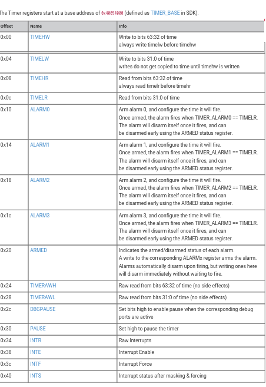

# 03 - Interrupts & Timers
This lab is intended to familiarize you with working with hardware interrupts and in particular with external interrupts.

## Resources

1. **Raspberry Pi Ltd**, *[RP2040 Datasheet](https://datasheets.raspberrypi.com/rp2040/rp2040-datasheet.pdf)*
2. [Cortex-M0+ Devices Generic User Guide](https://developer.arm.com/documentation/dui0662/latest/)
3. [Embassy documentation](https://embassy.dev/book/dev/runtime.html)

## What is an interrupt ?

A hardware interrupt is a synchronous or asynchronous signal from a peripheral that signals the occurrence of an event that must be handled by the processor. Interrupt handling has the effect of suspending a program's normal thread of execution and launching an interrupt service routine (ISR).

Generally, to associate an interrupt with a specific routine in the program, the processor uses the interrupt vector table (IVT). In this table, each interrupt is associated with the address to which the program will jump when the interrupt is triggered. These addresses are predefined and are mapped in program memory.


When an interrupt request happens the first thing that the processor does is to memorize its current state. For ARM Cortex-M0 this happens by pushing 8 words or registered data into the main stack to provide the information
need to return the processor to what it was doing before before the interrupt request was called. This part is called the stack frame and it includes registers 0 through 3, register 12, the link register, the program counter and the program status register.


ARM Cortex-M microcontrollers use a similar concept to the IVT called Nested Vectored Interrupt Controller (NVIC).The NVIC is specifically designed to handle these interrupts more efficiently. Interrupt addresses in the NVIC memory region are set according to their priority: the lower the address, the higher the priority. As suggested by the "Nested" in its name, the NVIC supports nested interrupts. This means that if a higher priority interrupt occurs while another interrupt is being processed, the controller can pause the current interrupt service routine (ISR), handle the higher priority interrupt, and then resume the interrupted ISR. This feature is crucial for responsive and real-time processing.


### Interrupts on RP2040

The RP2040 chip has two cores (processors), and each core has its own NVIC. Each core's NVIC is connected to the same set of hardware interrupt lines with one exception : IO Interrupts. In the RP2040, IO interrupts are organized by banks, and each core has its own set of IO interrupts for each bank. The IO interrupts for each core are completely independent. For instance, Processor 0 (Core 0) can be interrupted by an event on GPIO pin 0 in bank 0, while Processor 1 (Core 1) can be interrupted by a separate event on GPIO pin 1 in the same bank. Each processor responds only to its own interrupts, allowing them to operate independently or to handle different tasks simultaneously without interfering with each other.


#### Supported interrupt request signals (IRQ)

On RP2040, only the lower 26 IRQ signals are connected on the NVIC, as seen in the table below, and IRQs 26 to 31 are tied to zero (never firing).
The core can still be forced to enter the relevant interrupt handler by writing bits 26 to 31 in the NVIC ISPR register.


The priority order is determined for these signals is determined by :

- First, the dynamic priority level configured per interrupt by the NVIC_IPR0-7 registers. The Cortex-M0+ implements
the two most significant bits of an 8-bit priority field, so four priority levels are available, and the numerically-lowest
level (level 0) is the highest priority.
 - Second, for interrupts with the same dynamic priority level, the lower-numbered IRQ has higher priority (using the
IRQ numbers given in the table above)


All GPIO pins in Raspberry Pi Pico support interrupts. The interrupts can be classified into three types:

- Level High: An interrupt occurs when a pin is HIGH or at logic 1.
- Level Low: An interrupt occurs when a pin is LOW or at logic 0.
- Rising Edge: Interrupt occurs when a pin transitions from a LOW to HIGH.
- Falling Edge: Interrupt occurs when a pin transitions from HIGH to LOW.


## How to setup an interrupt -- bare metal approach

The following steps won't be enough for full bare metal setup of the interrupts. It is only a model that's meant to help understanding this process which is abstracted in higher level frameworks like embassy.

#### 1. Write an interrupt handler
An interrupt handler is a function that should be executed when a the interrupt signal is triggered. This function must have the signature **fn()** without any arguments or return value.

```rust
extern "C" fn interrupt_0_handler() {
    // Clear the irq
    // Your interrupt handling code here
}
```

Using **extern "C"** ensures the function uses the C calling convention, which is necessary for interrupt handlers.

#### 2. Create the vector table array
Make a type of entry for the interrupt vector table, which will contain a pointer to an interrupt handler function.

``` rust
pub union Vector {
    handler: unsafe extern "C" fn(), //pointer to handler function
}
```
Create the vector table array, populating it with the addresses of your handler functions. Use the **#[link_section]** attribute to place this table in the correct memory location.

```rust
#[link_section = ".vector_table"]
pub static  VECTOR_TABLE: [Vector; 5] = [

     Vector {handler: 0x2000_0000}, // initial_stack_pointer: Adjust this to your MCU's RAM start + size
    Vector {handler: reset_handler}, //assuming this handler exits
    Vector {handler: default_handler}, //assuming this handler exits
    Vector {handler: hard_fault_handler}, //assuming this handler exits
    // Other handlers...
    Vector {handler: interrupt_0_handler},
    // More interrupts...
];
```
 #### 3. Direct the Linker

Ensure your linker script (.ld file) places the .vector_table section at the correct start address expected by the microcontroller. 

``` ld
SECTIONS {
    .text : {
        *(.vector_table) /* Place the vector table at the start of flash memory */
        *(.text)         /* Followed by the rest of the program code */
    } > FLASH
}
```

 #### 4. Enabling the interrupt 
 :::note 

 Enabling an interrupt does not also set its main function. For example if we want to enable interrupt for a button (SIO) we need to first se it up as an input, add pull-up resistor etc.

:::

 For proc0 (core 0) the registers for enabling interrupts start at [PROC0_INTE0](https://datasheets.raspberrypi.com/rp2040/rp2040-datasheet.pdf#reg-io_bank0-PROC0_INTE0).

```rust
const SET: u32 = 0x2000;
//Interrupt Enable for proc0
const PROC0_INTE0 : u32 = 0x0100; 

const MASK_LEVEL_LOW : u32 = 0b000;
const MASK_LEVEL_HIGH : u32 = 0b001;
const MASK_EDGE_LOW : u32 = 0b0100;
const MASK_EDGE_HIGH : u32 = 0b1000;

let mask = MASK_EDGE_HIGH;
let register = PROC_INTE0;
let offset = pin_num /4;

write_volatile((register as usize + SET) as *mut u32, mask << offset);
```
 
### Additional steps


 #### Setup the priority
The order in which the core execute each ISR is base on a priority queue. This not only stores the address of the handler function sets pointers for the other pending IRQ handlers.

 To set the priority for a IRQ :

``` rust
let priority_for_interrupt_0 : u8 = prio;
const NVIC_PRI4 = 0xe410;
 NVIC_IPR4 = (priority_for_interrupt_3 << 24) |
            (priority_for_interrupt_2 << 16) |
            (priority_for_interrupt_1 << 8)  |
            priority_for_interrupt_0;
```

## How to setup an interrupt with rp2040-pac and rp-hal

```rust
// Add the interrupt macro
use hal::pac::interrupt;
use rp2040_hal::gpio;

// The GPIO interrupt type we're going to generate
use rp2040_hal::gpio::Interrupt::EdgeLow;
```
### Setup the peripherals 

If peripherals will be used in the interrupt handler function we need to set up a mutex to safely access them.

```rust
/// This pin will be our interrupt source.
/// It will trigger an interrupt if pulled to ground (via a switch or jumper wire)
type ButtonPin = gpio::Pin<gpio::bank0::Gpio0, gpio::FunctionSioInput, gpio::PullUp>;

type Button = (ButtonPin);

/// This how we transfer our Button pins into the Interrupt Handler.
/// We'll have the option hold the Button using the Button type.
/// This will make it a bit easier to unpack them later.
static GLOBAL_PINS: Mutex<RefCell<Option<Button>>> = Mutex::new(RefCell::new(None));

```

### Enable interrupt 


```rust 

// Set up the GPIO pin that will be our input
let in_pin = pins.gpio0.reconfigure();

// Trigger on the 'falling edge' of the input pin.
// This will happen as the button is being pressed
in_pin.set_interrupt_enabled(EdgeLow, true);

```

### Give back the pins

```rust
// Give away our pins by moving them into the `GLOBAL_PINS` variable.
critical_section::with(|cs| {
    GLOBAL_PINS.borrow(cs).replace(Some((led, in_pin)));
});

```
### Unmask the IO_BANK0 IRQ

so that the NVIC interrupt controller
will jump to the interrupt function when the interrupt occurs.

```rust
 unsafe {
        pac::NVIC::unmask(pac::Interrupt::IO_IRQ_BANK0);
        }
```


### Define the interrupt handler

When defining an interrupt handler we need to:

- Add `#[interrupt]` attribute which requires the cortex-m-rt crate for defining interrupt handlers.
- Add code for that should run after button is pressed
- Take the gpio's resources that we defined, clear interrupt flag so that it doesn't enter `IO_IRQ_BANK0()` again without a button press.

```rust
#[interrupt]
fn IO_IRQ_BANK0() {

    // Do something
    //Example: toggle LED

    static mut BUTTON: Option<Button> = None;

    critical_section::with(|cs| {
        *BUTTON = GLOBAL_PINS.borrow(cs).take();
    });
    
    // Need to check if our Option<ButtonPins> contains our pins
    if let Some(button) = BUTTON {

        // Clear the interrupt so that it doesn't enter the ISR again
        button.clear_interrupt(EdgeLow);

        //give away the borrowed button
        critical_section::with(|cs| {
        GLOBAL_PINS.borrow(cs).replace(Some((button)));
    });

    }

    
}
```

:::note

To use pins from main into the interrupt handler we will need to setup mutexes as well.

:::


## How to setup an interrupt in Embassy

In Embassy, handling interrupts does not involve manually setting up interrupt service routines (ISRs) in the traditional sense that you might be used to with bare-metal or lower-level embedded programming. Instead, Embassy abstracts away the hardware-specific details and provides a higher-level async API for working with hardware events, including interrupts.

Embassy uses Rust's async/await syntax to provide an easier way to write non-blocking embedded applications. This approach allows you to wait for events (like GPIO pin changes, which could be triggered by hardware interrupts underneath). In a way that looks synchronous but is actually non-blocking and handled asynchronously by the Embassy executor.


:::note

Unlike the usb drive, GPIO pins don't need explicit interrupt binding.
All interrupts handlers are already associated to the type of the input signal (rising edge, level low etc.)

:::

For example, if you're waiting for a button press, you don't need to set up the interrupt yourself; you simply use Embassy's GPIO API to wait for the pin change event (`button.wait_for_rising_edge().await`).

If we want the main loop to keep running regardless of the button state, we need to define a new task. A task in Embassy is an async function that will run in parallel with other tasks. It can pause its execution at certain points, waiting for some conditions to be met (like waiting for an I/O operation to complete, a timer to elapse, or an external event to occur), and then resume where it left off.  


### Define the task function
```rust
#[embassy_executor::task]
async fn my_task() {
    // initialize gpio
    loop {
        
        //Wait for button button to be pressed
        button.wait_for_rising_edge().await;
        //Do something only if button was pressed
        //(Here should be the logic for your interrupt request handler)
        //Example: turn on the LED
        
    }
}
````

### Pass the your function to the task spawner
```rust
use embassy_executor::Spawner;

#[embassy_executor::main]
async fn main(spawner: Spawner) {

    //  Spawn my_task
    spawner.spawn(my_task()).unwrap();

    loop {
        //Do something
        //...
    }
}
```

### Passing states between tasks

Sharing data safely between tasks can be done using shared resources that ensure access is synchronized to prevent race conditions and other concurrency issues. Rust's core::sync::atomic types such as `AtomicBool`, `AtomicIsize`, `AtomicUsize` onto which read and write operations can be executed atomically.

```rust

use core::sync::atomic::{AtomicU32, Ordering};

static SHARED_VAL: AtomicU32 = AtomicU32::new(0 /*initial value*/);

{//read value in task
let val = SHARED_VAL.load(Ordering::Relaxed);
}

{//write value in task
SHARED_VAL.store(val, Ordering::Relaxed);
}
```

:::note

For scenarios where atomic operations are not sufficient and you need to protect more complex interactions or data structures, using a Mutex from Embassy is more appropriate. Embassy's Mutex is designed to be used in asynchronous environments, allowing tasks to await the lock without blocking.

:::

## What is a timer?

A timer is a type of peripheral can measure fixed time intervals and generate interrupts when the measured interval expires. A timer, once initialized will work independently of the processing unit. This allows delay loops to be removed from the main program.

### What is a counter?
A counter is a register or memory location that stores a numerical value which is incremented at a certain rate. This rate is usually determined by the timer's input clock frequency and a prescaler, which is a value that divides the input clock to slow down the counter increment rate. 


RP2040 microcontroller timer has a 64-bit timer counter. Given the 32-bit data bus limitation (RP2040 has a 32-bit architecture), the microcontroller cannot directly access 64-bit values in a single operation. To manage this, the RP2040 employs a pair of 32-bit registers for both reading and writing the 64-bit timer value. 
#### Writing to the Timer

**TIMEHW** (Time High Word for Write) and **TIMELW** (Time Low Word for Write): To set or write the timer's 64-bit value, you write the lower 32 bits to **TIMELW** and the upper 32 bits to **TIMEHW**. This operation requires two separate writes due to the 32-bit data bus limitation.

#### Reading from the Timer

Reading the 64-bit timer value is slightly more complex due to the need to ensure the value does not change during the read operation (which would result in an inconsistent value being read).

**TIMEHR** (Time High Word for Read) and **TIMELR** (Time Low Word for Read): To read the timer's 64-bit value accurately, you first read from **TIMELR** (the lower register). This read operation latches the current value of the higher 32 bits into an internal buffer associated with the **TIMEHR** register. Then, you read from **TIMEHR** to get the upper 32 bits. This two-step process ensures you get a consistent 64-bit value even if the timer increments during the read operation, because the high value you read corresponds to the exact moment you read the low value.

#### Alternative Raw Reading

**TIMERAWH** (Timer Raw High) and **TIMERAWL** (Timer Raw Low): These registers provide an alternative way to read the timer's 64-bit value without the latching mechanism. Reading from these registers gives you the raw, current value of the timer's high and low parts. However, without latching, there's a risk that the timer could increment between reading the low and high parts, potentially resulting in an inconsistent 64-bit value.

Example of erroneous reading : 
The 64-bit counter is transitioning from **0x00000000FFFFFFFF** to **0x0000000100000000**


### What is an alarm ?

In the context of the RP2040 microcontroller, an "alarm" refers to a feature of its timer peripheral. The RP2040 timer includes four alarms. Each alarm can be individually programmed to trigger an interrupt at a specific time, based on the main counter's value within the Timer peripheral.

### Programming Alarms

#### 1. Configuring the Alarm Value 
Setting the alarm's comparator value to the desired future time (relative to the 64-bit counter value).
#### 2. Enabling the Alarm Interrupt 
Configuring the NVIC (Nested Vectored Interrupt Controller) to enable the interrupt associated with the alarm.
#### 3. Handling the Interrupt 
Implementing an ISR to respond when the alarm interrupt triggers. This often includes resetting the alarm for periodic tasks.

## How to set an alarm on rp2040 --bare metal approach

:::note

The following steps won't be enough for full bare metal setup of the interrupts. This is a simplified model. Mutexes should be used to safely access the timer registers.

:::

Looking at the TIMER specific registers we can map their values in the code.



This translates to :

```rust
const TIMER_BASE : u32 = 0x40054000;
const TIMEHW : u32 = 0x00;
const TIMELW : u32 = 0x04;
const TIMEHR : u32 = 0x08;
const TIMELR : u32 = 0x0c;
//......................//
const ARMED : u32 = 0x20;
const TIMERAWH : u32 = 0x24;
const TIMERAWL : u32 = 0x28;
const INTR : u32 = 0x34;
const INTE : u32 = 0x38;
const INTF : u32 = 0x3c;
const INTS : u32 = 0x40;
```

### 1. Enable interrupt for the timer

Use INTE to enable interrupt

``` rust 
const SET : u32 = 0x2000;
const TIMER_IRQ_0_ARMED_BIT_MASK: u32 = 0b0001; //we chose alarm0
let reg = TIMER_BASE + INTE;

write_volatile((reg + SET) as *mut u32, TIMER_IRQ_0_ARMED_BIT_MASK);
```
### 2. Schedule (Arm the alarm)

```rust
//read time and add amount of time needed to trigger the alarm
pub fn get_time_ticks(&self) -> u64 {
        let low = read_volatile((TIMER_BASE + TIMERAWL));
        let high = read_volatile((TIMER_BASE + TIMERAWH));
       (u64::from(high) << 32) | u64::from(low);
}

// in main
{
let timestamp = get_time_ticks() + countdown;
}

fn schedule(timestamp : u64){
    let timestamp_low = (timestamp & 0xFFFF_FFFF) as u32; //take only the last bits 

    //write to alarm timestamp low
    write_volatile(TIMER_BASE + ALARM0, timestamp_low);
    // once TIMELR == TIMER_ALARM0, TIMER_IRQ_0 ISR will run (this only happens if interrupt is enabled)

    //check if alarm is triggered already (timestamp was set to a value in the past)
    let now = get_time_ticks();
    if now > timestamp {

    //if already passed timestamp force the ISR to happen
    let reg = TIMER_BASE + INTF;
    write_volatile((reg + SET) as *mut u32,TIMER_IRQ_0_ARMED_BIT_MASK);
    }
}
```

### 3. Write the handler for the alarm

```rust

extern "C" fn TIMER_IRQ_0() {
   
    alarm.clear_interrupt(); //so that it won't keep firing
   
    schedule(10000000);  // Schedule a new alarm after 10000000 ticks have passed 

    //Do Something
    //Example:  Blink the LED so we know we hit this interrupt          
}
```

## How to setup an alarm with rp2040-pac and rp-hal

```rust 
use hal::fugit::MicrosDurationU32;
use pac::interrupt;
use rp2040_hal::clocks::Clock;
use rp2040_hal::timer::Alarm;

```
### Clock Source Configuration

The RP2040 allows for different clock sources for different parts of the system. For instance, the system clock can be driven by an internal oscillator, an external crystal oscillator (XOSC), or one of the PLLs (Phase-Locked Loops) to scale clock frequencies to needed rates.

```rust
const XTAL_FREQ_HZ: u32 = 12_000_000u32;

// Configure the clocks
    let clocks = hal::clocks::init_clocks_and_plls(
        XTAL_FREQ_HZ,
        pac.XOSC,
        pac.CLOCKS,
        pac.PLL_SYS,
        pac.PLL_USB,
        &mut pac.RESETS,
        &mut watchdog,
    )
    .unwrap();
```

### Configuring the Alarm

Configure alarm_0 to trigger after TIME_UNTIL_TRIGGERED ticks of the timer. This configuration includes setting the alarm to the desired time and enabling it to generate an interrupt when it triggers.


```rust

let mut timer = hal::Timer::new(pac.TIMER, &mut pac.RESETS, &clocks);

critical_section::with(|cs| {
        let mut alarm = timer.alarm_0().unwrap();
        let _ = alarm.schedule(TIME_UNTIL_TRIGGERED);

        // Enable generating an interrupt on alarm
        alarm.enable_interrupt();

        // Move alarm into ALARM, so that it can be accessed from interrupts
        unsafe {
            ALARM.borrow(cs).replace(Some((alarm)));
        }
    });
```
The `critical_section::with(|cs| { ... })` call in this context is used to execute a block of code atomically, preventing any interrupts from occurring while the enclosed code is running.


### Unmask the timer IRQ 

so that it will generate an interrupt the interrupt defined by us.
```rust

unsafe {
    pac::NVIC::unmask(pac::Interrupt::TIMER_IRQ_0);
}
```
### Interrupt Handler Logic

We not only need to clears the alarm's interrupt flag ( to prevent the interrupt from firing repeatedly without the conditions being re-met)
But we also need to reschedule the alarm for a future point in time. This allows the alarm (and thus the interrupt) to be repetitive or periodic.

```rust

#[interrupt]
fn TIMER_IRQ_0() {

    //Do something


    //Reset alarm
    critical_section::with(|cs| {
        // Temporarily take our ALARM
        let alarm = unsafe { ALARM.borrow(cs).take()};
        if let Some(( mut alarm)) = alarm {
            // Clear the alarm interrupt or this interrupt service routine will keep firing
            alarm.clear_interrupt();
            
            let _ = alarm.schedule(TIME_UNTIL_TRIGGERED_AGAIN);
            
            // Return ALARM into our static variable
            unsafe {
                ALARM
                    .borrow(cs)
                    .replace_with(|_| Some((alarm)));
            }
        }
    });
}

```


## Timer/Alarm in Embassy

In Embassy, timers provide a way to perform asynchronous waits, allowing tasks to delay execution for a specified duration without blocking the entire program. This is particularly useful for operations like debouncing buttons, controlling timing-sensitive protocols, or simply creating delays without halting the CPU or other tasks.


### Using Timers in Embassy

#### Import the Timer API 
Include the necessary modules from Embassy that provide timer functionality.

```rust
use embassy_time::{Duration, Timer};
```


#### Await the Timer 
Use the await keyword on the timer's delay function to pause the execution of the current task until the timer expires. This is a non-blocking wait, so other async tasks can run during this time.
```rust
Timer::after(Duration::from_millis(100)).await;
//wait in current task 100 milliseconds
```

Once the timer expires, the task that awaited the timer resumes execution from the point it awaited.

## Exercises

### PIN interrupts

 1. Write a program that toggles an LED when a button is pressed.
 (Do not modify the main loop)


 1. Use two buttons two change the state of an LED. The first button will trigger the change on rising edge. The second button will trigger the state change falling edge.


:::tip

make two tasks and save the state of the LED

:::

  
### Timers 

 3. Make the led change state (blink) depending on timer interrupt change 

 4. Use the 2 buttons to change the blink speed

