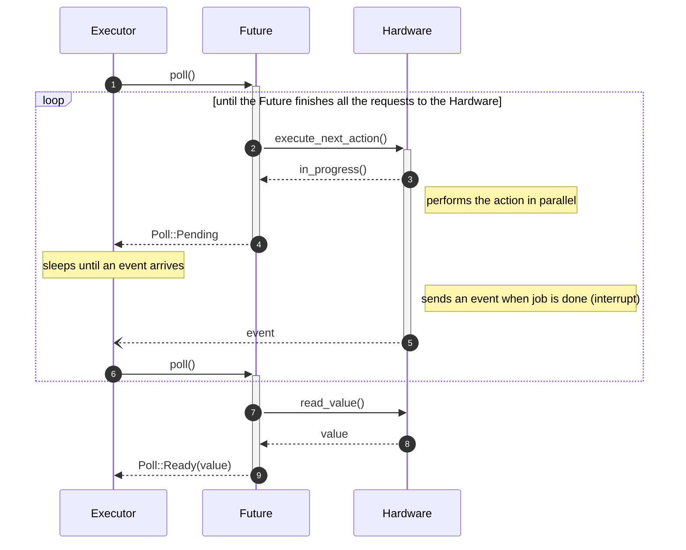
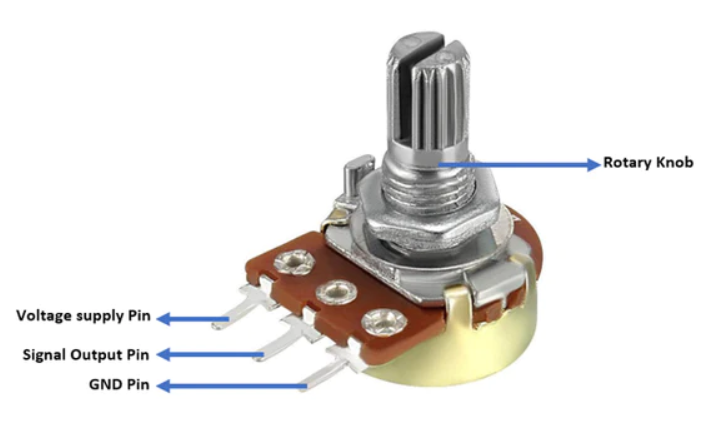
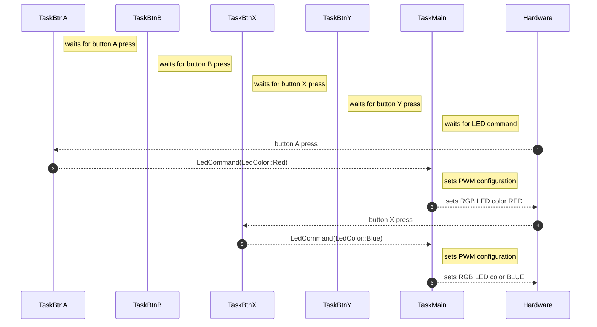

# 05 - Asynchronous Development

This lab will teach you the principles of asynchronous programming, and its application in Embassy.


## Resources

1. **Bert Peters**, *[How does async Rust work](https://bertptrs.nl/2023/04/27/how-does-async-rust-work.html)* 
2. **Omar Hiari**, *[Sharing Data Among Tasks in Rust Embassy: Synchronization Primitives](https://dev.to/apollolabsbin/sharing-data-among-tasks-in-rust-embassy-synchronization-primitives-59hk)* 

## Asynchronous functions

Up to now, during the labs, we've seen that, in order to be able to do multiple different actions "at once", we would use *tasks*. We would let the `main` function run, while also doing another action seemingly "in parallel" inside of another task. 
Let's take the following example: if we want to blink an LED every second while also waiting for a button press to do something else, we would need to spawn a new task in which we would wait for the button press, while blinking the LED in the `main` function. 

When thinking of how exactly this works, you would probably think that the task is running on a separate *thread* than the `main` function. Usually this would be the case when developing a normal computer application. Multithreading is possible, but requires a preemptive operating system. Without one, only one thread can independently run per processor core and that means that, since we are using only one core of the RP2040 (which actually has only 2), we would only be able to run **one thread at a time**. So how exactly does the task wait for the button press in parallel with the LED blinking? 
Short answer is: it doesn't. In reality, both functions run asynchronously. 

### Tasks

A task in Embassy is represented by an *asynchronous function*. Asynchronous functions are different from normal functions, in the sense that they allow asynchronous code execution. Let's take an example from the previous lab:
```rust
#[embassy_executor::task]
async fn button_pressed(mut led: Output<'static, PIN_X>, mut button: Input<'static, PIN_X>) {
    loop {
	info!("waiting for button press");
        button.wait_for_falling_edge().await;
    }
}

#[embassy_executor::main]
async fn main(spawner: Spawner) {
    let peripherals = embassy_rp::init(Default::default());

    let button = Input::new(peripherals.PIN_X, Pull::Up);
    let led2 = Output::new(peripherals.PIN_X, Level::Low);

    spawner.spawn(button_pressed(led2, button)).unwrap();

    let mut led = Output::new(peripherals.PIN_X, Level::Low);

    loop {
        led.toggle();
        Timer::after_millis(200).await;
    }
}
```
In this example, we notice that both the `button_pressed` and `main` functions are declared as `async`, telling the compiler to treat them as asynchronous functions. Inside the `main` function (which is also a task, actually), we blink the LED:

```rust
loop {
    led.toggle();

    Timer::after_millis(200).await;
}
```

## `await` keyword

After setting the timer, our `main` function would need to wait until the alarm fires after 200 ms. Instead of just waiting and blocking the current and *only* thread of execution, it could allow the thread to do another action in the meantime. This is where the `.await` keyword comes into play.
When using `.await` inside of an asynchronous function, we are telling a third party (called the **executor**, detailed later) that this action might take more time to finish, so *do something else* until it's ready. Basically, the execution flow of the asynchronous function function is halted exactly where `.await` is used, and the executor starts running another task. In our case, it would halt the main function while waiting for the alarm to go off and it could start running the code inside the `button_pressed` task.
```rust
loop {
    info!("waiting for button press");
    button.wait_for_falling_edge().await;
}
```
We can see that here, we also use the `wait_for_falling_edge` function asynchronously, meaning that until we get a signal that a button has been pressed, the executor can decide to do other stuff. If it has nothing else to do, it goes to sleep, until it receives a signal that either the button has been pressed, or the timer has run out. Then, it will resume execution of the function where the action has completed. 
When the button is pressed the execution flow will resume inside of the `button_pressed` task, until it is interrupted by the next `.await` in that function. If the timer runs out before the `button_pressed` task execution reaches the next `.await`, the resuming of the `main` function will delayed until the `button_pressed` task `.await`s.
This method of development allows our programs to run seemingly "in parallel", without the need of multiple threads. Each task *voluntarily* pauses its execution and passes control over to whatever other task needs it. This means that it's the task's business to allow other tasks to run while it's idly waiting for something to happen on its end.
:::note
On a preemptive operating system, it would be the scheduler's job to decide when and for how long processes get to run.
:::

## `Future`s

Rust has a special datatype that represents an action that will complete sometime in the future. By using `.await` on a `Future`, we are passing control to another task until the `Future` completes.
:::info
In the `button_pressed` task, the `wait_for_falling_edge` returns a `Future`, which is then `.await`ed.
:::
This is a simplified version of what a `Future` in Rust really looks like:
```rust
enum Poll<T> {
    Pending,
    Ready(T),
}

trait Future {
   type Output;
   fn poll(&mut self) -> Poll<Self::Output>;
}
```
The `Future` has an `Output` associated type, that represents the type of the result that it will return once it completes. For `wait_for_falling_edge()`, the Output type is `()` (nothing).
The function `poll` returns a `Poll` type, which can either be `Pending`, or `Ready<T>` (T will be output in this case).
Let's break down what all of this means. A `Future` needs to be checked on, every now and then, to see what its status is. This is the job of the **Executor**. The executor must regularly ask the `Future` if it's completed, or if it needs more time before it can give a result. We can say that the `Future` is `poll`ed, and depending on whether it's ready to give a result or not, it gives its status as `Pending` or `Ready`. If it's still pending, it needs more time before it can return a result, so the executor moves on to poll another `Future`. Whenever the `Future` is completed, it returns `Ready` once polled, and the executor returns execution back to the function where the `Future` `.await`ed.



:::note
An efficient executor will not poll all tasks. Instead, tasks signal the executor that they are ready to make progress by using a `Waker`.
:::

:::info
A real future in Rust looks like this:
```rust
pub trait Future {
    type Output;

    // Required method
    fn poll(self: Pin<&mut Self>, cx: &mut Context<'_>) -> Poll<Self::Output>;
}
```
:::

Under the hood, the Rust compiler is actually transforming our asynchronous function into a state-machine. That is why we can only use `.await` inside of an `async` function, because it needs to be treated differently than an ordinary function in order to work asynchronously.

:::info
Asynchronous programming is widely used in web development. In JavaScript, the equivalent of a `Future` would be a `Promise`.
:::

Read more about how async/await works in Rust [here](https://rust-lang.github.io/async-book/01_getting_started/01_chapter.html).

### `await`ing multiple `Future`s

Sometimes we need to `.await` several futures at the same time. Embassy provides two ways of doing this:
- `select` - wait for several `Future`s, stop as soon as **one** of them **returns**;
- `join` - wait for several `Future`s until they **all return**

#### `select`

In some cases, we might find ourselves in the situation where we need to await multiple futures at a time. For example, we want to wait for a button press *and* wait for a timer to expire, and we deal with each future completion in different ways.

There is a function in Embassy that allows us to do this: `select`. It takes two `Future`s as arguments, and polls both of them to see which one completes first.
```rust
let select = select(button.wait_for_falling_edge(), Timer::after_secs(5)).await;
```

It returns an `Either` type, that looks like this:
```rust
pub enum Either<A, B> {
    First(A),
    Second(B),
}
```
A and B are the results of each `Future`, so we can just use a `match` on the `select` variable to see which `Future` finished first.
```rust
match select {
    First(res1) => {
        // handle case for button press
    },
    Second(res2) => {
        // handle case for alarm firing
    }
}
```

:::warning
After selecting the first `Future` that completes, the other one is *dropped*. For instance, if the button press happens first, the timer will be stopped.
:::

:::info
You can also use [`select3`](https://docs.rs/embassy-futures/latest/embassy_futures/select/fn.select3.html), [`select4`](https://docs.rs/embassy-futures/latest/embassy_futures/select/fn.select4.html) or [`select_array`](https://docs.rs/embassy-futures/latest/embassy_futures/select/fn.select_array.html) when dealing with more than two `Future`s.
:::

#### `join`

Similarly, we can also [`join`](https://docs.rs/embassy-futures/latest/embassy_futures/join/fn.join.html) multiple `Future`s, meaning that we wait for all of them to complete before moving on. 

```rust
let (res1, res2) = join(button.wait_for_falling_edge(), Timer::after_secs(5)).await;
```

`join` returns a tuple containing the results of both `Future`s.


## Channels

Up to this point, to be able to share peripherals or data across multiple tasks, we have been using global `Mutex`s or passing them directly as parameters to the tasks. But there are other, more convenient ways to send data to and from tasks. Instead of having to make global, static variables that are shared by tasks, we could choose to only send the information that we need from one task to another. To achieve this, we can use *channels*.

**Channels** allow a unidirectional flow of information between two endpoints: the *Sender* and the *Receiver*. The sender sends a value through the channel, and the receiver receives this value once it is ready to do so. Until it is ready, the data will be stored inside a queue. Channels in Embassy are *Multiple Producer, Multiple Consumer*, which means that we can have a channel associated with multiple senders and multiple receivers. 

To use a channel in Embassy, we first need to declare a static instance of the channel. 

```rust
static CHANNEL: Channel<ThreadModeRawMutex, bool, 64> = Channel::new();
```
- `ThreadModeRawMutex` - the type of Mutex that the Channel internally uses. It is a mutex that can safely be shared between threads
- `bool` - the type of data that is sent through the channel
- `64` - the maximum number of values that can be stored in the channel's queue

Let's say we spawn a task `task1` that runs a timer. Every second, we want to toggle an LED in the `main` function, based on the timer running in `task1`. For this, `task1` would need to send a signal to the `main` program every time the 1 second alarm has fired, meaning the task and the main program would share the channel. `task1` would *send* over the channel, and `main` would *receive*.

Inside `task1`, we would just set a timer and wait until it fires. After it fires, we send a signal through the channel, to indicate that 1 second has elapsed.

```rust
#[embassy_executor::task]
async fn task1() {
    loop {
        Timer::after_secs(1).await;
        CHANNEL.send(true).await;
    }
}
```

In the `main` function, we need to then wait for the signal, and once it's received, toggle the LED.

```rust
// ---- fn main() ----
loop {
    let value = CHANNEL.receive().await;
    match value {
        true => led.toggle().unwrap(),
        false => info!("We got something else")
    }
}
```

:::info
The reason we need all of this is because Rust doesn't allow us to mutably borrow more than once. To use a peripheral (say PWM) inside multiple tasks, 
we would need to either move it inside the task entirely, or use a mutable reference to it. If we have multiple tasks, though, once we move our peripheral variable *inside* the first task,
we can't pass it to another task, because the value was *moved* inside that task completely. And if we wanted to pass it as a mutable reference instead, we would quickly realize that Rust 
doesn't allow multiple mutable references at once, to avoid concurrent modifications. So this is why we need to either declare a global, static `Mutex` that any task can access, to ensure 
that the value cannot be modified concurrently by two different tasks, or use channels and keep the peripheral inside the `main` function.

To better understand the concepts of ownership and borrowing in Rust, take a look at [chapter 4](https://doc.rust-lang.org/book/ch04-00-understanding-ownership.html) of the Rust Book.
:::

## Potentiometer

A potentiometer is a three-terminal resistor with a sliding or rotating contact that forms an adjustable voltage divider. If only two terminals are used, one end and the wiper, it acts as a variable resistor or rheostat. A volume knob on a speaker is a potentiometer, for instance.



## Exercises


1. Connect an LED to GP0, an RGB LED to GP1, GP2, GP5 and a potentiometer to ADC0. Use Kicad to draw the schematic. (**1p**)
2. Change the monochromatic LED's intensity, using button A (SW_A) and button B(SW_B) on the Pico Explorer. Button A will increase the intensity, and button B will decrease it. (**2p**)

:::tip
- Use PWM to control the intensity.
- Create two tasks, one for button A, one for button B. Use a channel to send commands from each button task to the main task.
:::

3. Control the RGB LED's color with buttons A, B, X and Y on the Pico Explorer. (**2p**)
- Button A -> RGB = Red
- Button B -> RGB = Green
- Button X -> RGB = Blue
- Button Y -> RGB = Led Off
:::tip
Use a separate task for each button. When a button press is detected, a command will be sent to the main task, and the main task will set the RGB LED's color according to that command.

:::warning
When building Rust software in *debug mode*, which is what `cargo build` does, Rust will panic if mathematical operations underflow or overflow. This means that:

```rust
let v = 10u8;
v -= 12;
```

will panic. To avoid this, you can use the [`wrapping_`](https://doc.rust-lang.org/std/primitive.u8.html#method.wrapping_add) and [`saturating_`](https://doc.rust-lang.org/std/primitive.u8.html#method.saturating_add) functions:

```rust
let v = 10u8;
// this will store 0 in v
v = v.saturating_sub(12); 
```
:::


:::

4. In addition to the four buttons, control the RGB LED's intensity with the potentiometer. (**3p**)

:::tip
You will need another task in which you sample the ADC and send the values over a channel.
You could do this in one of two ways:
1. Use a single channel for both changing the color and the intensity of the LED. Button tasks and the potentiometer task will send over the same channel. For this, you will need to change the type of data that is sent over the channel to encapsulate both types of commands. For example, you could use an enum like this:
```rust
enum LedCommand {
    ChangeColor(Option<LedColor>),
    ChangeIntensity(u16)
}
```
2. Use two separate channels, one for sending the color command (which contains the LedColor), and one for sending the intensity. You can `await` both channel `receive()` futures inside of a `select` to see which command is received first, and handle it.
Example:
```rust
let select = select(COLOR_CHANNEL.receive(), INTENSITY_CHANNEL.receive()).await;
match select {
    First(color) => {
        // ...
    },
    Second(intensity) => {
        // ...
    }
}
```
:::

5. Print to the screen of the Pico Explorer the color of the RGB LED and its intensity. Use the SPI screen driver provided in the lab skeleton. (**2p**)
:::tip
To write to the screen, use this example:
```rust
let mut text = String::<64>::new();
write!(text, "Screen print: ", led_color).unwrap(); // led_color must be defined first

Text::new(&text, Point::new(40, 110), style)
    .draw(&mut display)
    .unwrap();

// Small delay for yielding
Timer::after_millis(1).await;
```
:::
