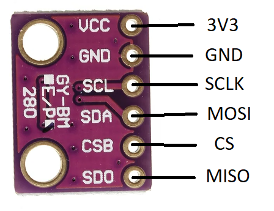
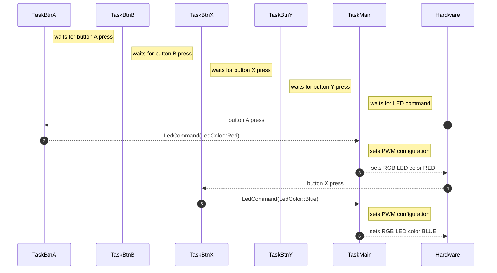

# 06 - Serial Peripheral Interface

This lab will teach you how to communicate with hardware devices using the Serial Peripheral Interface (SPI) protocol, in Embassy. 

## Resources

TBD

## Serial Peripheral Interface (SPI)

The Serial Peripheral Interface (or SPI) is a communication protocol used between microcontrollers and peripheral ICs (integrated circuits). It allows synchronous transfer of data between one *main* device and one or more *sub* devices (e.g. sensors). The main device is the one that dictates the communication.

### Data transmission


During SPI transmission, there are 4 wires used:

- **CLK** - clock - generated by the main device - subs use it to synchronously read and write to the bus
- **MOSI** - **M**ain **O**ut **S**ub **I**n - used to carry data from the main device to *all* the subs
- **MISO** - **M**ain **I**n **S**ub **O**ut - used to carry data from the *active* sub to the main device
- **CS** - chip select - selects the sub to be activated, or the sub that the main wants to communicate with
                       - one wire per sub
                       - inactive subs will disconnect from the *MOSI* and *MISO* lines

:::info
The communication is *full-duplex*. This means that, during data transmission, both the master and the slave **must write** to the MOSI/MISO wires, no matter if that data is relevant or not.
:::

#### Transmission example

1. main sets `CS` to `LOW` - the sub that the main wants to communicate with is activated - all other subs disconnect from `MOSI` and `MISO` lines
2. main writes the first bit on the `MOSI` line, and, *simultaneously*, sub writes the first bit on the `MISO` line
3. main starts the clock
4. on *rising edge* 
    - main reads data from the `MISO` line 
    - sub reads data from the `MOSI` line
5. on *falling edge*
    - main writes data to the `MOSI` line
    - sub writes data to the `MISO` line
6. repeat steps 4 and 5 until main stops the clock

:::note
Whether steps 4 and 5 happen on rising/falling edge depends on the configuration of the SPI.
:::


In the image above, the main first exchages data with the first sub by setting its corresponding `CS` line to low. After it finishes transmission with sub 1, it deactivates it and, afterwards, initiates communication with the second sub by setting its `CS` line to low. Notice that both main and sub read and write to the MOSI/MISO line simultaneously.

### SPI modes

SPI has 4 different modes which define when data is read or written. These modes can be configured through 2 registers: `CPOL` and `CPHA`.

| Mode | `CPOL` | `CPHA` |
|-|-|-|
| 0 | 0 | 0 |
| 1 | 0 | 1 |
| 2 | 1 | 0 |
| 3 | 1 | 1 |

| | | |
|-|-|-| 
| `CPOL` | Clock polarity | defines when the data bit is read <br/> 0: *rising edge* <br/> 1: *falling edge* |
| `CPHA` | Clock phase | defines when the data is written to the line <br/> 0: when `CS` *activates* <br/> 1: on *clock edge* (depends on `CPOL`) |

### Daisy Chaining

An SPI network with many sub devices can prove impractical from a hardware point of view. **Daisy chaining** is a method that solves this by linking multiple devices together with the following configuration:


The `MOSI` line connects the main device only to the first sub. Then, the `MISO` output of the first sub ties to the `MOSI` input of the second sub, and so forth. The final sub in the chain ties to the `MISO` line to the main device. All `CS` lines are common, therefore all subs are active at the same time.

If main wants to communicate with the second sub, it will send its data through the first sub, and receive data from the second sub through all subs following it. (TODO: explain)

## DMA

When it comes to standard communication protocols that rely on [MMIO](/docs/lab/02), it would be inefficient to rely on the MCU itself to handle all of these data transfers. This is why the **Direct Memory Access** (DMA) is used. Its purpose is to offload the MCU by dealing with simple transmission to and from peripherals, and whenever it finishes a transfer, it raises an interrupt.

## Digital vs Analog sensors

### Analog sensors
Up to now, during the labs, we have been using *analog sensors* (photoresistor and potentiometer). Analog sensors are just a transducer, which outputs a voltage depending on its measurement (light, temperature, etc.). This output needs to be read using an ADC and processed so that it can resemble something useful to us.
:::info
For example, for an analog temperature sensor, we would be getting a voltage reading that we need to convert to an actual temperature in Celsius by using a specific formula. This formula can usually be found in the datasheet of the analog sensor.
:::


### Digital sensors
For this lab, we will be using a *digital sensor*, which is an *upgraded* version of an analog sensor. It contains a transducer, but also an internal MCU with an ADC. This means that the sensor itself deals with the analog-to-digital conversion and the processing of the voltage reading, and exposes it through a digital interface that can be accessed using a specific communication protocol (e.g. SPI, I2C etc.).


## BMP280 Digital Pressure Sensor

The **BMP280** is a *digital* temperature and pressure sensor designed by Bosch. It can be interfaced both with SPI and with I2C. This means that we can read the temperature and pressure values directly from the registers of the BMP280 using SPI.

:::info
**DATASHEET**: https://www.bosch-sensortec.com/media/boschsensortec/downloads/datasheets/bst-bmp280-ds001.pdf
:::

### BMP280 Memory Map


#### Registers

`id` register (0xF3) - contains the ID of the BMP280

`ctrl_meas` register (0xF4) - used for configuring the temperature/pressure measurements of the sensor

| `ctrl_meas` bits | Name | Description |
|-|-|-| 
| Bit 7, 6, 5 | osrs_t[2:0] | Controls oversampling of temperature data. |
| Bit 4, 3, 2 | osrs_p[2:0] | Controls oversampling of pressure data. |
| Bit 1, 0 | mode[1:0] | Controls the power mode of the device. |

| osrs_p[2:0] | Pressure oversampling |
|-|-|
| 000 | Skipped (output set to 0x80000) |
| 001 | oversampling x 1 |
| 010 | oversampling x 2 |
| 011 | oversampling x 4 |
| 100 | oversampling x 8 |
| 101, others | oversampling x 16 |

| osrs_t[2:0] | Temperature oversampling |
|-|-|
| 000 | Skipped (output set to 0x80000) |
| 001 | oversampling x 1 |
| 010 | oversampling x 2 |
| 011 | oversampling x 4 |
| 100 | oversampling x 8 |
| 101, others | oversampling x 16 |

`press` registers - `press_msb` (0xF7), `press_lsb` (0xF8), `press_xslb` (0xF9) - contain the pressure measurement

`temp` registers - `temp_msb` (0xFA), `temp_lsb` (0xFB), `temp_xslb` (0xFC) - contain the temperature measurement

:::warning
Unless we write to the `osrs_p` and `osrs_t` fields of the `ctrl_meas` register, the `press` and `temp` registers will have a constant value of `0x80000`! We need to configure the pressure and temperature oversampling before reading the measurements.
:::

### BMP280 wiring

The BMP280 has 5 pins:

| Pin | Function |
|-|-|
| `VCC` | power source (3V3) |
| `GND` | ground |
| `SCL` | `CLK` line |
| `SDA` | `MOSI` line |
| `CSB` | `CS` line |
| `SDO` | `MISO` line |



:::note
The BMP280 can also be interfaced through I2C, using the same pins but with different functions.
:::

The Raspberry Pi Pico has multiple usable SPI channels. Each channel has a set of two SPI control pins.


:::tip
Since we are using the Pico Explorer, it's simple to see which pins are used for SPI transmission. You can also check the back side of the Pico Explorer to see exactly which GP pins are being used by the extension for SPI.
:::

### Reading the temperature/pressure from the BMP280 sensor

## Exercises

1. Connect an LED to GP0, an RGB LED to GP1, GP2, GP5 and a potentiometer to ADC0. Use Kicad to draw the schematic. (**1p**)
2. Change the monochromatic LED's intensity, using button A (SW_A) and button B(SW_B) on the Pico Explorer. Button A will increase the intensity, and button B will decrease it. (**2p**)

:::tip
- Use PWM to control the intensity.
- Create two tasks, one for button A, one for button B. Use a channel to send commands from each button task to the main task.
:::

3. Control the RGB LED's color with buttons A, B, X and Y on the Pico Explorer. (**2p**)
- Button A -> RGB = Red
- Button B -> RGB = Green
- Button X -> RGB = Blue
- Button Y -> RGB = Led Off
:::tip
Use a separate task for each button. When a button press is detected, a command will be sent to the main task, and the main task will set the RGB LED's color according to that command.


:::

4. In addition to the four buttons, control the RGB LED's intensity with the potentiometer. (**3p**)

:::tip
You will need another task in which you sample the ADC and send the values over a channel.
You could do this in one of two ways:
1. Use a single channel for both changing the color and the intensity of the LED. Button tasks and the potentiometer task will send over the same channel. For this, you will need to change the type of data that is sent over the channel to encapsulate both types of commands. For example, you could use an enum like this:
```rust
enum LedCommand {
    ChangeColor(Option<LedColor>),
    ChangeIntensity(u16)
}
```
2. Use two separate channels, one for sending the color command (which contains the LedColor), and one for sending the intensity. You can `await` both channel `receive()` futures inside of a `select` to see which command is received first, and handle it.
Example:
```rust
let select = select(COLOR_CHANNEL.receive(), INTENSITY_CHANNEL.receive()).await;
match select {
    First(color) => {
        // ...
    },
    Second(intensity) => {
        // ...
    }
}
```
:::

5. Print to the screen of the Pico Explorer the color of the RGB LED and its intensity. Use the SPI screen driver provided in the lab skeleton. (**2p**)
:::tip
To write to the screen, use this example:
```rust
let mut text = String::<64>::new();
write!(text, "Screen print: ", led_color).unwrap(); // led_color must be defined first

Text::new(&text, Point::new(40, 110), style)
    .draw(&mut display)
    .unwrap();

// Small delay for yielding
Timer::after_millis(1).await;
```
:::