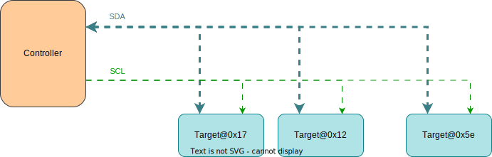
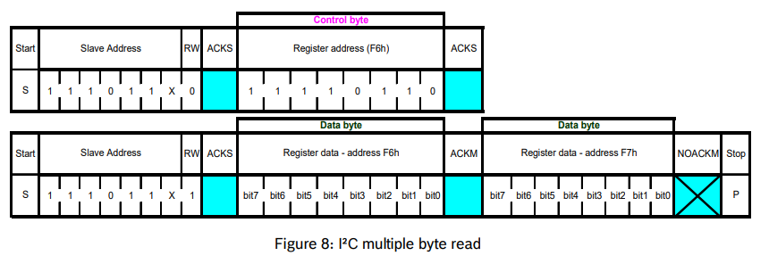

# 07 - Inter-Integrated Circuit

This lab will teach you how to communicate with hardware devices using the Inter-Integrated Circuit (I2C) protocol, in Embassy.

## Resources

1. **Raspberry Pi Ltd**, *[RP2040 Datasheet](https://datasheets.raspberrypi.com/rp2040/rp2040-datasheet.pdf)*
   - Chapter 4 - *Peripherals*
     - Chapter 4.3 - *I2C*

2. **BOSCH**, *[BMP280 Digital Pressure Sensor](https://www.bosch-sensortec.com/media/boschsensortec/downloads/datasheets/bst-bmp280-ds001.pdf)*
   - Chapter 3 - *Functional Description*
   - Chapter 4 - *Global memory map and register description*
   - Chapter 5 - *Digital Interfaces*
     - Subchapter 5.2 - *I2C Interface*

3. **Paul Denisowski**, *[Understanding Serial Protocols](https://www.youtube.com/watch?v=LEz5UCN3aHA)*
4. **Paul Denisowski**, *[Understanding UART](https://www.youtube.com/watch?v=sTHckUyxwp8)*

## Inter-Integrated Circuit (I2C)

The Inter-Integrated Circuit (I2C) is a synchronous, multi-controller/multi-target communication protocol. Similarly to the SPI, it allows data transfer between a controller and one or more peripheral ICs, but it uses only 2 wires (1 data line and 1 clock line, making it half-duplex) and has a different way of addressing the peripherals: using the their unique *addresses*.

### Configuration



I2C transmission uses 2 lines:

- **SCL** - **S**erial **CL**ock line - clock is generated by the controller - used to synchronize communication between the controller and the targets
- **SDA** - **S**erial **DA**ta line - carries data between the controller and the addressed target
    - targets read data from SDA **only** when the clock is *low*
    - targets write data to SDA **only** when the clock is *high*

:::info
The communication is *half-duplex*. This means that data is transmitted only in one direction at a time, since there is only *one* data line that can be used both for sending data to the target and receiving data from the target.
:::

:::info
The `SDA` and `SCL` wires are never actually driven (set to `LOW`/`HIGH`) by the controller/peripherals. The line is controlled by either pulling the line low or releasing the line high. 

When the line is *pulled down*, this means that it is tied directly to `GND`. This electronically translates to `LOW`.

When the line is *released*, or *pulled up*, this means that it ties back to `3V3` (which we can consider as being the "default" state of the wire) through a pull-up resistor. This electronically translates to `HIGH`.

This is called *open-drain connection*. You can read more about how it works [here](https://www.ti.com/lit/an/sbaa565/sbaa565.pdf?ts=1712891793335#:~:text=I2C%20is%20a%20two%2Dwire,and%20receive%20commands%20and%20data.), at section 2.2.
:::

### Data transmission

Each target is associated with a unique *address*. The controller uses this address to initiate communication with that target. This address can either be 7 or 10 bits.

#### Initiation

Before the transmission, both the `SCL` and `SDA` lines are set to `HIGH`. First thing the controller does is to signal a `start` condition by pulling the `SDA` line to `LOW`. All targets understand that the communication is about to commence and listen on the `SDA` line. Next, the controller starts the clock and begins to write the address of the target it wants to talk to, followed by a command bit that signifies whether the controller wants to *read* from the target or *write* to it. Whichever target recognizes its address, responds with an `ACK` (acknowledged), by pulling the `SDA` to `LOW`. If no target responds and the `SDA` stays `HIGH`, then it is considered a `NACK` (not acknowledged). Afterwards, the data transmission can begin.

#### Transmission

Depending on the command bit (R/W), either the controller or the target begins to send data over the `SDA` line. Data is sent one byte at a time, and then acknowledged by the receiver. One sequence of a data byte and `ack` is called a *frame*. 

During the communication, data can be:
- written to the `SDA` line *only* when `SCL` is `LOW` or
- read from the `SDA` line *only* when `SCL` is `HIGH`.

#### End

To end the transmission, the controller signals a `stop` condition. This is done by releasing the `SCL` line to `HIGH`, and then also releasing the `SDA` line. Since data can be written *only* when `SCL` is `LOW`, the target understands that this is a special event, that means that the communication has ended. 


:::note
For 10-bit addresses, the controller first issues a specific sequence of bits. This sequence is reserved, therefore targets with 7-bit addresses are prohibited from having addresses that start with this sequence. These bits mark the fact that the controller is attempting to initiate communication with a target with a 10-bit address, so all 7-bit targets ignore the `SDA` line once they recognize this sequence. After the special sequence, the controller sends the upper 2 bits of the address, then waits for an `ack` from the target(s) that have an address that begins with these 2 bits. Afterwards, it sends the rest of the address, and waits for an acknowledgement from the target.


:::

### I2C in Embassy

These are the I2C imports we will be using. We will use the functions provided by the `embedded_hal` crate, since these are standard and used by most frameworks.

```rust
use embassy_rp::i2c::{I2c, InterruptHandler as I2CInterruptHandler, Config as I2cConfig};
use embedded_hal_async::i2c::{Error, I2c as _};
use embassy_rp::peripherals::I2C0;
```

:::info
The reason why we use `I2c as _` from `embedded_hal_async` is that in order to use the `embedded_hal` trait methods, the trait needs to be imported.
:::

We start by initializing the peripherals.

```rust
let peripherals = embassy_rp::init(Default::default());
```

Next, we declare the pins we will be using for the SDA and SCL lines. We can find which pins of the Raspberry Pi Pico have these functions by looking at the pinout.

```rust
let sda = peripherals.PIN_X;
let scl = peripherals.PIN_Y;
```

We then initialize our I2C instance, using the pins we defined earlier and a default configuration. It's recommended to use the asynchronous version, since it won't block the executor.

```rust
let mut i2c = I2c::new_async(peripherals.I2C0, scl, sda, Irqs, I2cConfig::default());
```

The first argument of the `new` function is the I2C channel that will be used. There are two I2C channels on the Raspberry Pi Pico, and depending on which pins we decided to use, we can see which channel they are on by looking at the pinout.

The `Irqs` variable refers to the interrupt that the I2C driver will use when handling transfers. We also need to bind this interrupt, which depends on the I2C channel we are working with.

```rust
bind_interrupts!(struct Irqs {
    I2C0_IRQ => I2CInterruptHandler<I2C0>;
});
```

:::warning
Since multiple `Config`s and `InterruptHandler`s can exist in one file, in the code examples above, `I2cConfig` and `I2CInterruptHandler` are renamed imports:
```rust
use embassy_rp::i2c::{I2c, InterruptHandler as I2CInterruptHandler, Config as I2cConfig};
```
:::

#### Reading from a target

To read from a target, we will be using the `read_async` function of the I2C driver. 

The function takes 2 parameters:
- the address of the target we are attempting to receive the data from
- the *receiving* buffer in which we will store the data received from the target

The following example reads two bytes from the target of address `0x44`.

```rust
const TARGET_ADDR: u16 = 0x44;
let mut rx_buf = [0x00u8; 2];
i2c.read(TARGET_ADDR, &mut rx_buf).await.unwrap();
```

#### Writing to a target

To write data to a target, we will be using the `write_async` function of the I2C driver.

This function also takes 2 parameters:
- the address of the target we are attempting to transmit the data to
- the *transmitting* buffer that contains the data we want to send to the target

The following example writes two bytes to the target of address `0x44`.

```rust
const TARGET_ADDR: u16 = 0x44;
let tx_buf = [0x01, 0x05];
i2c.write(TARGET_ADDR, &tx_buf).await.unwrap();
```

:::info
We can also use `write_read` if we want to perform both a write and a read one after the other.

```rust
i2c.write_read(TARGET_ADDR, &tx_buf, &mut rx_buf).await.unwrap();
```
:::

### BMP280 with I2C

In the previous lab, we learned how to interface the BMP280 digital pressure sensor using the SPI protocol. The sensor also allows I2C communication, so that is we will be using now to retrieve the pressure and temperature values.

:::info
The default I2C address of the BMP280 is `0x76`.
:::

### Wiring

The same pins we used for SPI will now be used for I2C. 

| Pin | Function |
|-|-|
| `VCC` | power source (3V3) |
| `GND` | ground |
| `SCL` | `SCL` line |
| `SDA` | `SDA` line |
| `CSB` | not used |
| `SDO` | not used |

On the Pico Explorer base, the I2C pins are marked for simple use. You can check the back of the base to see which pins of the Raspberry Pi Pico they are tied to.

### Reading the temperature/pressure from the BMP280 using Embassy

Like we did last time, we need to use the internal registers of the BMP280 to retrieve the temperature/pressure measurements. What's changed is the way we access them. Instructions on how to use I2C with the BMP280 can be found in the [datasheet](https://www.bosch-sensortec.com/media/boschsensortec/downloads/datasheets/bst-bmp280-ds001.pdf), at section 5.2.

Before we start, we initialize the I2C driver with the pins and channel we will be using.

```rust
use embassy_rp::i2c::{I2c, InterruptHandler as I2CInterruptHandler, Config as I2cConfig};
use embedded_hal_async::i2c::{Error, I2c as _};
use embassy_rp::peripherals::I2C0;

bind_interrupts!(struct Irqs {
    I2C0_IRQ => I2CInterruptHandler<I2C0>;
});

// ------- fn main() -------

let peripherals = embassy_rp::init(Default::default());

// I2C pins
let sda = peripherals.PIN_X;
let scl = peripherals.PIN_Y;

// I2C definition
let mut i2c = I2c::new_async(peripherals.I2C0, scl, sda, Irqs, I2cConfig::default());
```

In section 5.2.1 and 5.2.2 of the datasheet, we get the information we need in order to read/write to a register of the BMP280 using I2C.

#### Reading a register



To read the value of a register, we first need to send the BMP280 the address of the register we want to read. Afterwards, the sensor will send back the value of the register we requested.

For this, we need to first *write* this register address over I2C and then *read* the value we get back from the sensor. We could use the `write_read_async` function to do this.

```rust
let tx_buf = [REG_ADDR]; // the tx buffer contains the address of the register we want to read
let mut rx_buf = [0x00u8]; // the rx buffer initially contains one empty value, which will be replaced by the value of the register we asked for
i2c.write_read(BMP280_ADDR, &tx_buf, &mut rx_buf).await.unwrap(); // we provide the function the I2C address of the BMP280 and the two buffers
```

:::info
I2C is *half-duplex*. The `write_read` function performs two separate transfers: a write and a read. As opposed to SPI, these transfers are unidirectional, and that's why we need two of them, separately.
:::

:::info
Like with SPI, we can also read multiple registers with consecutive addresses at a time. All we need to do is modify the size of the receive buffer to be able to hold more register values, the rest of the procedure is the same.

```rust
let mut rx_buf = [0x00u8; 3];
```
This is explained in section 5.3 of the datasheet.
:::

#### Writing to a register


To write to a register, we need to send the sensor a buffer containing pairs of register addresses and values we want to write to those registers. For example, if we wanted to write `0x00` to `REG_A`:

```rust
let tx_buf = [REG_A, 0x00];
i2c.write(BMP280_ADDR, &tx_buf).await.unwrap();
```

If we wanted to write both `REG_A` and `REG_B` to `0x00`:

```rust
let tx_buf = [REG_A, 0x00, REG_B, 0x00];
i2c.write(BMP280_ADDR, &tx_buf).await.unwrap();
```

## Exercises

1. Connect the BMP280 **with I2C**. Use Kicad to draw the schematic. (**1p**)

2. Read the value of the `id` register using I2C and print it over serial. (**2p**)

3. Get the pressure and temperature readings from the sensor, **using I2C**. 
- Write the `ctrl_meas` register with appropiate configuration values. You can find information on the contents you should write to this register at section 4.3.4 of the datasheet. (**2p**)
- Read the raw pressure value and print it over the serial. (**2p**)
- Read the raw temperature value and print it over the serial. (**2p**)

:::tip
Use what you learned in the last lab.
:::

4. Show the temperature and pressure values on the screen. (**1p**)