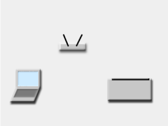

# 08 - Wi-Fi

This lab will teach you the basics of networking and Wi-Fi, and how to use Wi-Fi with the Raspberry Pi Pico W, in Embassy.

## Resources

TBD

## Networking basics

A network is a set of devices that are linked together in order to share resources. Devices can talk to one another using different communication protocols, usually Ethernet (wired) or Wi-Fi (wireless).

Devices that communicate in a network have an associated IP (Internet Protocol) address. There are two types of IP addresses: IPv4 (stored on 32 bits) and IPv6 (newer, stored on 64 bits). We will be discussing only the IPv4 in this lab, since it is most commonly used in local networks.

### IPv4

An IPv4 address looks like this:
`192.168.0.1/8`
Each number separated by a dot is represented on 8 bits (ranging from 0 to 255). The number after the slash is the *mask* of the address, which will be described shortly.

An IP address is made of two parts:
- network prefix: defines the network the device is a part of
- host identifier: is unique to the device in the network

The *mask* of an address defines the number of bits that are used to represent the host identifier. In other words, the bigger the mask, the more unique devices can exist in the network.

For example, for the above address `192.168.0.1/8`, we know that the host identifier is 8 bits long. Therefore, the first 24 bits give us the network prefix and the last 8 bits give us the host identifier.

Any device that wants to communicate in this local network (or *subnet*) must have an address ranging from `192.168.0.1` to `192.168.0.254`.

:::note
In the above example, `192.168.0.0` is the *network address*, and `192.168.0.255` is the *broadcast address*. The first and last possible addresses in a subnet are reserved and should not be used for devices.
:::

Learn more about subnetting [here](https://networklessons.com/cisco/ccna-routing-switching-icnd1-100-105/what-is-subnetting).

### Routers

TODO

### DHCP

Dynamic Host Configuration Protocol (DHCP) is a network management protocol used by routers to dynamically allocate IP addresses to devices connected to its network. Routers dynamically assign addresses to new devices in the network, if they don't already have a *static* IP.

## Wi-Fi

**Wi-Fi** is a networking technology that allows devices to *wirelessly* communicate in a local network or interface the Internet. 

Wi-Fi devices use radio waves to transmit data to one another in a network, through *wireless access points* (a wireless router, for instance). The access point (AP) connects directly to a local area network (LAN) and provides wireless connections for other devices in its proximity to use. 



:::note
Certain materials, such as stone with high metal content, can block Wi-Fi signals.
:::

### Protocol

Wi-Fi uses the *802.11* IEEE standard, with different radio technologies:

- 2.4 GHz radio band, ultra high frequency, (widely supported; Raspberry Pi Pico W uses this frequency)
- 5 GHz radio band, super high frequency
- others, not widely used

Each radio frequency range is divided into a multitude of *channels*. Each device that uses a frequency band communicates over one channel. Ideally, each device is allocated a separate channel. Sometimes, though, when there are many devices using a Wi-Fi frequency band, devices might end up having to *share* a channel and wait their turn to transmit data, leading to lower communication speeds. 5 GHz provides more channels than 2.4 GHz, allowing more devices to use the band without interference. 

### Wi-Fi on the Raspberry Pi Pico

Apart from the RP2040 microcontroller, the Raspberry Pi Pico board also has a separate, on-board wireless interface. It is a 2.4 GHz Infineon chip, *CYW43439*. This chip deals only with Wi-Fi (and Bluetooth) communication, and it is connected to the RP2040 via SPI.


### Security

#### Open Wi-Fi

Open wireless networks don't require any authentication, and all transmissions are unencrypted. Any device that connects to an open network can easily intercept data sent in this network. This is unsecured and unsafe.

#### Wired Equivalent Privacy (WEP)

WEP is the first security protocol ever implemented. It uses data encryption based on generated key values. It was designed in 1997 and has since become obsolete, because it is really easy to crack and basically as unsafe as open Wi-Fi.

#### Wi-Fi Protected Access (WPA/WPA2/WPA3)

WPA, WPA2 and WPA3 were defined in response to the serious weaknesses discovered in WEP. Each version of WPA increments the security of the protocol, using more powerful password encryption methods. 

### Wi-Fi in Embassy

Initialise the peripherals first, as usual.

```rust
let peripherals = embassy_rp::init(Default::default());
```

The CYW43 chip also needs to be programmed in order to handle the Wi-Fi connection and transfers. For this, Infineon provides two firmware binaries that need to be built together with our program. We use the `include_bytes!` macro to achieve this.

```rust
let fw = include_bytes!("../cyw43-firmware/43439A0.bin");
let clm = include_bytes!("../cyw43-firmware/43439A0_clm.bin");
```

The above example assumes that the binaries have been downloaded and added to the `<crate_root>/cyw43-firmware` folder. They can be downloaded from [here](https://github.com/embassy-rs/embassy/tree/main/cyw43-firmware).

:::info
The `include_bytes!` macro is built-in by the compiler. It links the `cyw43` binaries to our program binary during compilation.
:::

Next, we need to declare the SPI that interfaces the Wi-Fi chip. This SPI will be controlled by PIO (Programmable Input/Output), instead of simple GPIO pins, as we've done so far. PIO contains dedicated hardware that can deal with high-speed input and output operations, therefore offloading the MCU.

```rust
let pwr = Output::new(p.PIN_23, Level::Low);
let cs = Output::new(p.PIN_25, Level::High);
let mut pio = Pio::new(p.PIO0, Irqs);
let spi = PioSpi::new(&mut pio.common, pio.sm0, pio.irq0, cs, p.PIN_24, p.PIN_29, p.DMA_CH0);
```

We're also going to need to bind the interrupts that can be triggered by the PIO.

```rust
bind_interrupts!(struct Irqs {
    PIO0_IRQ_0 => InterruptHandler<PIO0>;
});
```

#### CYW43 driver

Now we need to instantiate the `CYW43` driver, and spawn a task that will start it. 

```rust
static STATE: StaticCell<cyw43::State> = StaticCell::new();
let state = STATE.init(cyw43::State::new());
let (net_device, mut control, runner) = cyw43::new(state, pwr, spi, fw).await;
spawner.spawn(wifi_task(runner)).unwrap();

control.init(clm).await;
control
    .set_power_management(cyw43::PowerManagementMode::PowerSave)
    .await;
```

Inside this task, the driver will deal with the low-level SPI transfers between the MCU and the Wi-Fi chip.

```rust
#[embassy_executor::task]
async fn wifi_task(runner: cyw43::Runner<'static, Output<'static>, PioSpi<'static, PIO0, 0, DMA_CH0>>) -> ! {
    runner.run().await
}
```

#### Network stack

To be able to communicate in a network, our device needs to have an associated IP address. We can configure a static IP address, or we can use DHCP to have an IP address dynamically assigned to our device.

1. Static IP address
In this case, the device defines its own IP address for the WLAN. For this, we also need to know the address of the default gateway.

```rust
let config = embassy_net::Config::ipv4_static(embassy_net::StaticConfigV4 {
   address: Ipv4Cidr::new(Ipv4Address::new(192, 168, 69, 2), 24),
   dns_servers: Vec::new(),
   gateway: Some(Ipv4Address::new(192, 168, 69, 1)),
});
```

2. Dynamic IP address
In this case, our device asks for an IP address via DHCP. It also receives other configuration information, such as the default gateway.

:::note
This method takes more time, because the device needs to wait to receive an IP address before it can start communicating in the network.
:::

```rust
let config = Config::dhcpv4(Default::default());
```

Once we have defined the configuration, we need to instantiate and run the network stack driver, to be able to connect to the WLAN.

```rust
// Generate random seed
let seed = 0x0123_4567_89ab_cdef; // chosen by fair dice roll. guarenteed to be random.

// Init network stack
static STACK: StaticCell<Stack<cyw43::NetDriver<'static>>> = StaticCell::new();
static RESOURCES: StaticCell<StackResources<2>> = StaticCell::new();
let stack = &*STACK.init(Stack::new(
    net_device,
    config,
    RESOURCES.init(StackResources::<2>::new()),
    seed,
));

spawner.spawn(net_task(stack));
```

The network driver deals with the network stack: receiving, building and sending packets over the WLAN.

```rust
#[embassy_executor::task]
async fn net_task(stack: &'static Stack<cyw43::NetDriver<'static>>) -> ! {
    stack.run().await
}
```

#### Scanning for Wi-Fi networks

The `CYW43` driver has a function that allows us to scan all Wi-Fi access points in the device's proximity.

```rust
let mut scanner = control.scan(Default::default()).await;
while let Some(bss) = scanner.next().await {
    if let Ok(ssid_str) = str::from_utf8(&bss.ssid) {
        info!("Scanned {}", ssid_str);
    }
}
```

:::info
The `ssid` is the name of the AP.
:::

#### Connecting to a Wi-Fi Access Point

To connect to a WPA2 Wi-Fi network, we can use the `join_wpa2` function, providing the network name and the password.

```rust
loop {
    match control.join_wpa2(WIFI_NETWORK, WIFI_PASSWORD).await {
        Ok(_) => break,
        Err(err) => {
            info!("join failed with status={}", err.status);
        }
    }
}

// Wait for DHCP, not necessary when using static IP
info!("waiting for DHCP...");
while !stack.is_config_up() {
    Timer::after_millis(100).await;
}
info!("DHCP is now up!");
```

:::note
To connect to an open network, we must use the `join_open` function instead.

```rust
control.join_open(WIFI_NETWORK).await;
```
:::

#### Creating a Wi-Fi Access Point

The Pico can also be used as an Access Point, that other devices can connect to. We can initialize it as either an open network:

```rust
control.start_ap_open("Pico AP", 5).await; // what are these parameters?
```

or as a secured, WPA2 network:

```rust
control.start_ap_wpa2("Pico AP", "WeloveRust", 5).await;
```

#### Starting a server

Now that we have connected our Pico to a Wi-Fi network, we can start a server to handle connections to our Pico.

We need to create a TCP socket in order to handle TCP connections and transfers. 

```rust
let mut socket = TcpSocket::new(stack, &mut rx_buffer, &mut tx_buffer);
socket.set_timeout(Some(Duration::from_secs(10)));
```

Next, we wait for a connection on a specific port. For example, the following snippet waits for a TCP connection on port `1234`.

```rust
control.gpio_set(0, false).await;
info!("Listening on TCP:1234...");
if let Err(e) = socket.accept(1234).await {
    warn!("accept error: {:?}", e);
    continue;
}

info!("Received connection from {:?}", socket.remote_endpoint());
control.gpio_set(0, true).await;
```

Once we have an established connection, we can read and write to the socket, and communicate with the other endpoint.

```rust
loop {
    let n = match socket.read(&mut buf).await {
        Ok(0) => {
            warn!("read EOF");
            break;
        }
        Ok(n) => n,
        Err(e) => {
            warn!("read error: {:?}", e);
            break;
        }
    };

    info!("rxd {}", from_utf8(&buf[..n]).unwrap());

    match socket.write_all(&buf[..n]).await {
        Ok(()) => {}
        Err(e) => {
            warn!("write error: {:?}", e);
            break;
        }
    };
}
```

## Exercises

1. The lab skeleton contains an example of setting up the Wi-Fi and connecting to an access point.
- Scan for local networks. (**1p**)
- Modify the code in order to connect to an existing network. Once connected, determine the IP address that has been assigned to the Pico through DHCP. (**1p**)
- Use a static IP address instead of a dynamic one. You can use the IP determined at the previous point. (**1p**)

2. Test the example by connecting your computer to the Pico through Wi-Fi. Use `netcat` or any alternative to send a TCP packet to the Pico server. You should receive back the same string. (**1p**)

:::tip
On Windows, you can use [NCat](https://nmap.org/download.html#windows). The command for establishing a TCP connection is:
```shell
ncat [ip_address] [port]
```
To send a TCP packet, write any string in the terminal and press enter. You should receive back the same string, since this is what our server is currently configured to do.
:::

3. Modify the way the server on the Pico deals with connections. Send a message through Wi-Fi to your computer whenever a button is pressed. (**2p**)

4. Modify the server so that you can send commands from your computer to turn an LED on and off. (**1p**)

5. Configure the Pico as an access point. You will need to set a static IP address both for the Pico and your computer, to make sure they are both in the same subnet. (**1p**)

6. Connect two Picos together through Wi-Fi. Control the LED connected to one Pico through a button connected to the second Pico. One team can configure the server for the LED Pico, and another team the server for the button Pico. (**2p**)