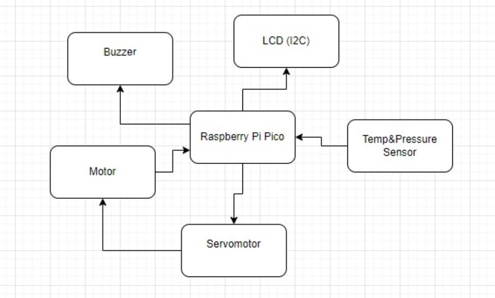
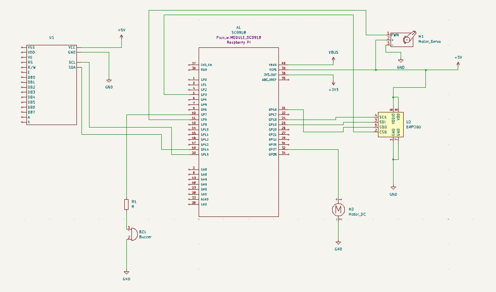
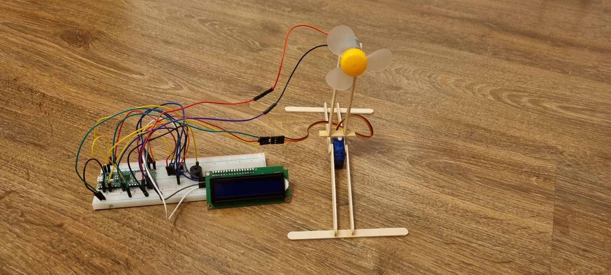
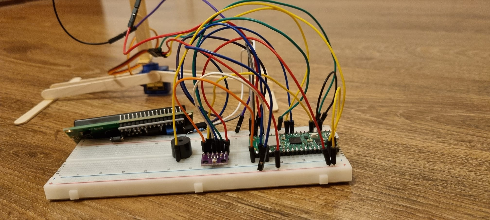
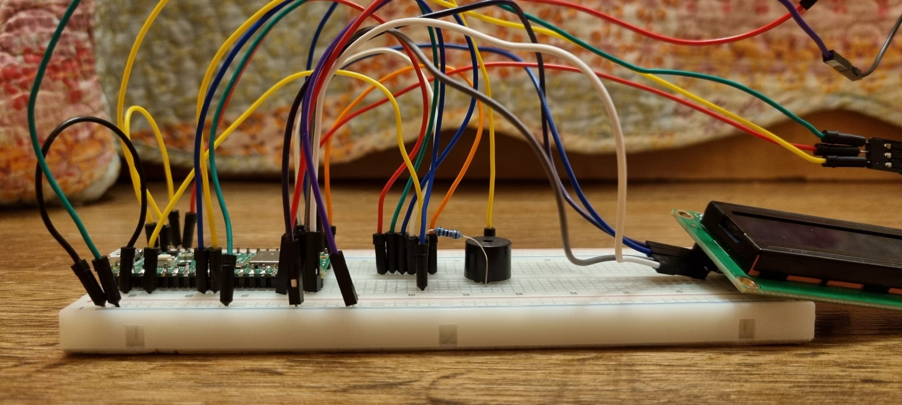
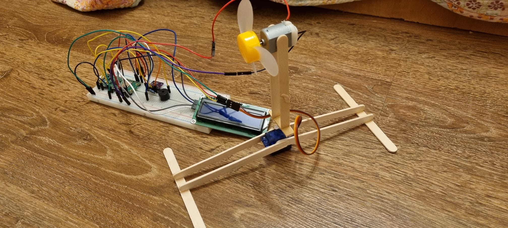
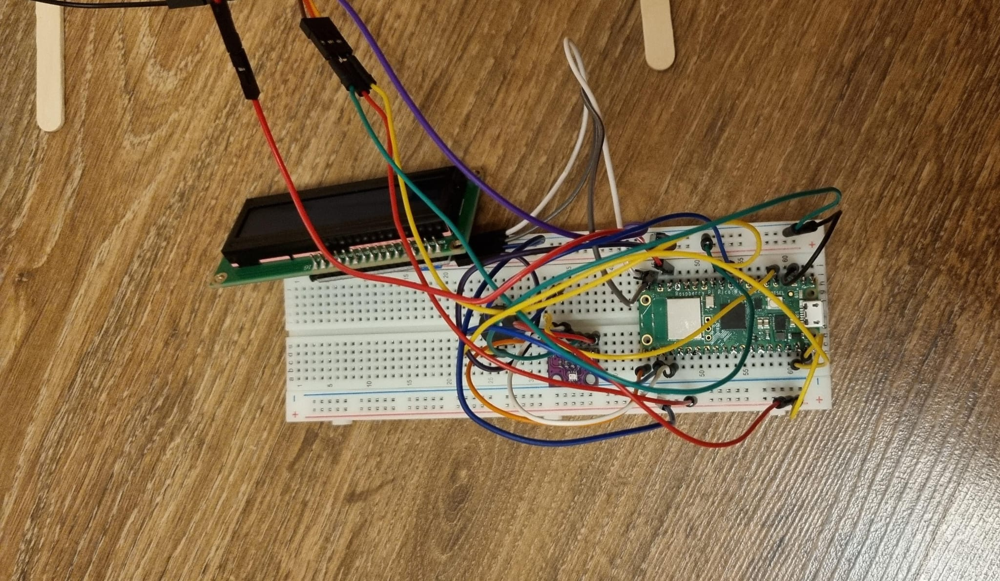

# Smart Fan
Displays room temp/pressure, auto-activates at thresholds.

:::info 

**Author**: Cristea Ioana-Maria \
**GitHub Project Link**: https://github.com/UPB-FILS-MA/project-Ella23411

:::

## Description

A fan that monitors and displays the temperature and pressure in the room on a LCD screen, then activates the fan after a certain threshold :


+ The system utilizes a sensor to detect both temperature and pressure.

+ The LCD screen showcases the temperature and pressure readings.

+ The fan is triggered once the threshold is exceeded.

+ A buzzer is activated once the threshold is surpassed.

+ After the threshold is exceeded, the fan's arm oscillates from side to side.


## Motivation

**This project** holds a special significance for me because it allowed me to bridge the gap between theory and practice. Throughout my time in the laboratory, I gained valuable insights into the fundamentals of electronics and programming. However, there were certain aspects that I didn't have the chance to explore fully.

By undertaking the development of a smart fan, I saw an opportunity to not only apply the knowledge I acquired in the lab but also to expand my skill set in areas that were previously uncharted territory for me. Combining hardware with software was a challenge I eagerly embraced, and through this project, I gained invaluable hands-on experience in integrating the two seamlessly.

## Architecture 
The **Raspberry Pi Pico** serves as the central control unit, directing and managing all other components utilized within the project.


The **LCD** serves as an interface for showcasing the sensor readings, it is connected to the Pico through I2C

The **servomotor** is connected to an improvised arm, allowing the fan to rotate 90° in either direction.

The **buzzer**, when the temperature threshold is surpassed, emits an  alarm, acting as an alert mechanism.

The **pressure and temperature** sensor detects changes in temperature and pressure, supplying input to the Pico.

A **DC Motor** that controls the fan




## Log

<!-- write every week your progress here -->

### Week 6 - 12 May
I uploaded the necessary project documentation, making sure everything was in order. Then, I began working on the schematics, carefully mapping out the design. Additionally, I started developing some of the software. Each step brought the project closer to realization.

### Week 7 - 19 May
In the following week, I completed the hardware and assembled the makeshift arm, which presented a few challenges. However, I managed to resolve them successfully. Additionally, I made further progress on the software development.

### Week 20 - 26 May

## Hardware

1. **Raspberry Pi Pico**:
- **Purpose**: Controls all components.
- **Function**: Acts as the main controller, coordinating the operations of sensors, motors, buzzers, and the LCD display.

2. **Temperature and Pressure Sensor**:
- **Purpose**: Detects changes in temperature and pressure.
- **Function**: Continuously monitors the environment and sends data regarding temperature and pressure to the Raspberry Pi Pico.

3. **Active Buzzer**:
- **Purpose**: Emits sound alerts.
- **Function**: Activates when the temperature exceeds the preset threshold, providing an audible warning.

4. **DC Motor with Fan**:
- **Purpose**: Provides cooling.
- **Function**: Activates when the temperature exceeds the preset threshold, turning on the fan to help reduce temperature.

5. **Servomotor with Makeshift Arm**:
- **Purpose**: Performs mechanical action for signaling or other purposes.
- **Function**: Activates when the temperature exceeds the preset threshold, moving the arm 90 degrees to each side.

6. **LCD Display**:
- **Purpose**: Displays real-time data.
- **Function**: Shows the current temperature and pressure readings, allowing for easy monitoring of environmental changes.

### Hardware Overview:
- The **Raspberry Pi Pico** controls and coordinates all components.
- The **Temperature and Pressure Sensor** continuously monitors the environment.
- When the temperature exceeds the set threshold:
- The **Active Buzzer** sounds an alert.
- The **DC Motor** activates the fan to cool the area.
- The **Servomotor** moves the makeshift arm 90 degrees to each side as a physical signal.
- The **LCD Display** provides real-time updates of temperature and pressure, ensuring that the changes are visible and trackable.


### Schematics









### Bill of Materials

<!-- Fill out this table with all the hardware components that you might need.

The format is 
```
| [Device](link://to/device) | This is used ... | [price](link://to/store) |

```

-->

| Device | Usage | Price |
|--------|--------|-------|
| [Rapspberry Pi Pico W](https://www.raspberrypi.com/documentation/microcontrollers/raspberry-pi-pico.html) | The microcontroller | [35 RON](https://www.optimusdigital.ro/en/raspberry-pi-boards/12394-raspberry-pi-pico-w.html) |
| [BMP280](https://www.bosch-sensortec.com/media/boschsensortec/downloads/datasheets/bst-bmp280-ds001.pdf) | Temperature Sensor| [8,49 RON](https://www.optimusdigital.ro/ro/senzori-senzori-de-presiune/1666-modul-senzor-de-presiune-barometric-bmp280.html?search_query=bmp280&results=11) |
| Active Buzzer | Active Buzzer | [1,49 RON](https://www.optimusdigital.ro/ro/audio-buzzere/635-buzzer-activ-de-3-v.html?search_query=buzzer+activ&results=18) |
| [LCD Display](https://www.waveshare.com/datasheet/LCD_en_PDF/LCD1602.pdf) | LCD Display| [30 RON](https://www.optimusdigital.ro/ro/optoelectronice-lcd-uri/62-lcd-1602-cu-interfata-i2c-si-backlight-galben-verde.html?search_query=lcd+1602&results=17) |
| DC Motor | DC Motor | [3,50 RON](https://ardushop.ro/ro/motoare-si-drivere/437-motoras-curent-continuu.html?gad_source=1&gclid=Cj0KCQjwltKxBhDMARIsAG8KnqXmbO_Pw93I5tCpBIvBfZewX5Zezb63wDD63KWlIPhqzm3f4ITGaoYaAr0nEALw_wcB) |
| [Servomotor](https://datasheetspdf.com/datasheet/SG90.html) | Servomotor | [14 RON](https://www.optimusdigital.ro/ro/motoare-servomotoare/26-micro-servomotor-sg90.html?search_query=servomotor&results=119) |


## Software

| Library | Description | Usage |
|---------|-------------|-------|
| [ag-lcd](https://github.com/mjhouse/ag-lcd) | Display Library | Used for I2C LCD Display |
| [embassy-rp](https://github.com/embassy-rs/embassy/tree/main/embassy-rp) | RP2040 Peripherals | Used for accessing the peripherals|
| [embassy-time](https://github.com/embassy-rs/embassy/tree/main/embassy-time) | Time Library | Used for Timeouts and Delays |

## Links

<!-- Add a few links that inspired you and that you think you will use for your project -->

1. [Raspberry Pi Pico Temperature Controlled Fan Speed | PWM](https://www.youtube.com/watch?v=8kfROSQYDWI)
2. [Interfacing BMP280 sensor with Raspberry Pi Pico W](https://www.youtube.com/watch?v=OdqcJoFi_Bk)

