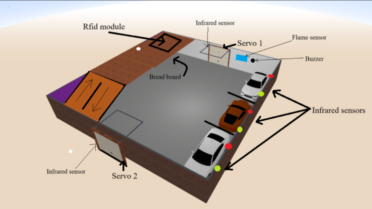
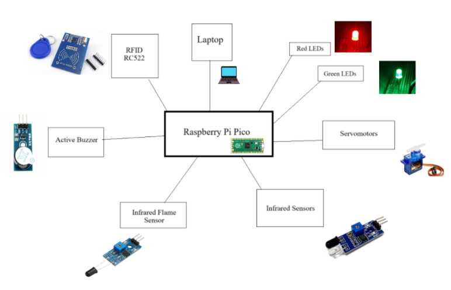
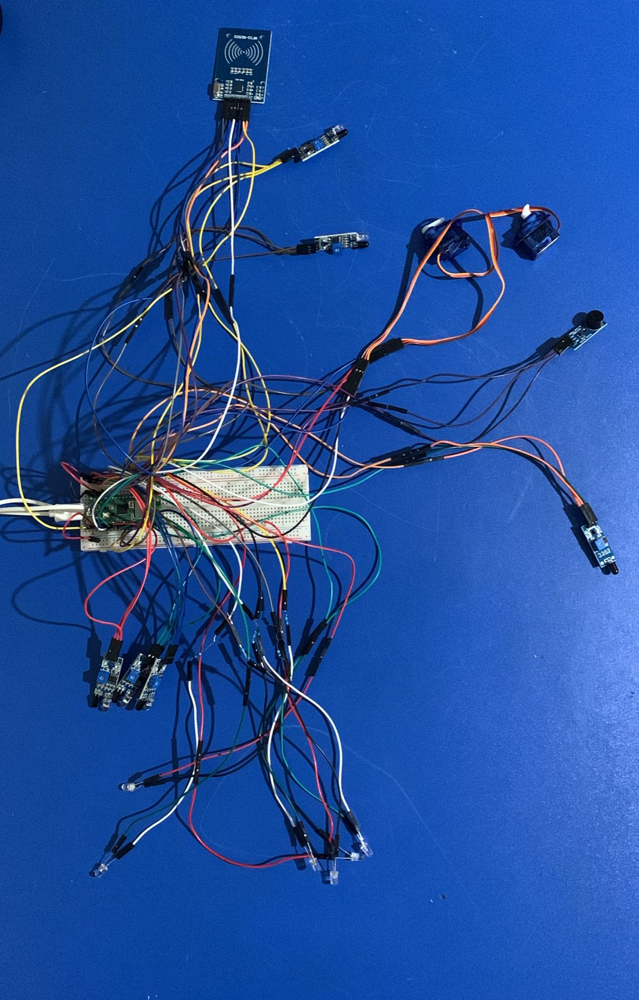
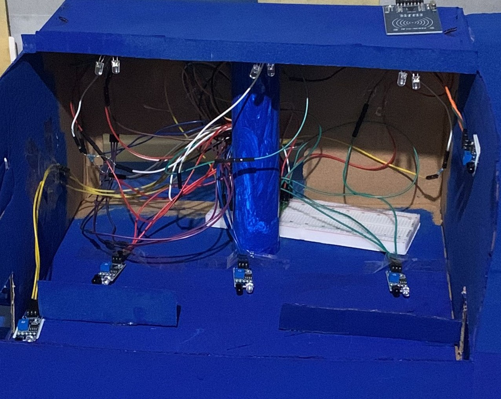
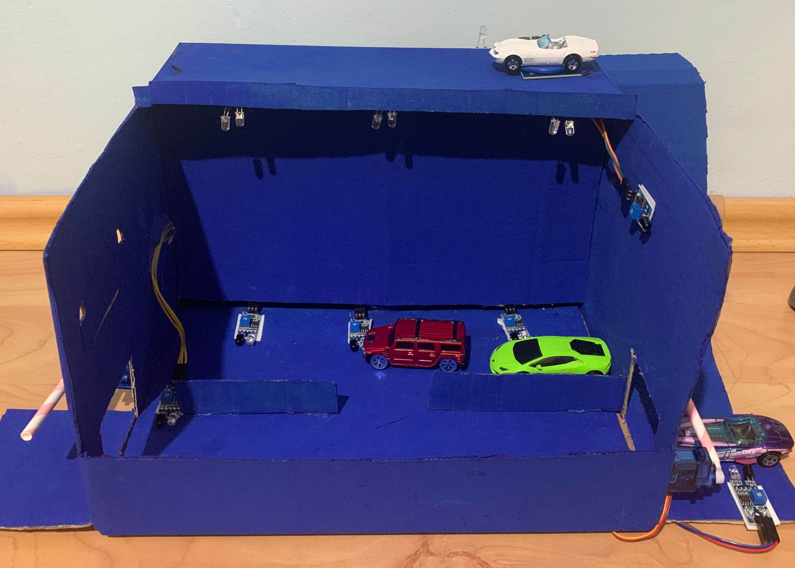
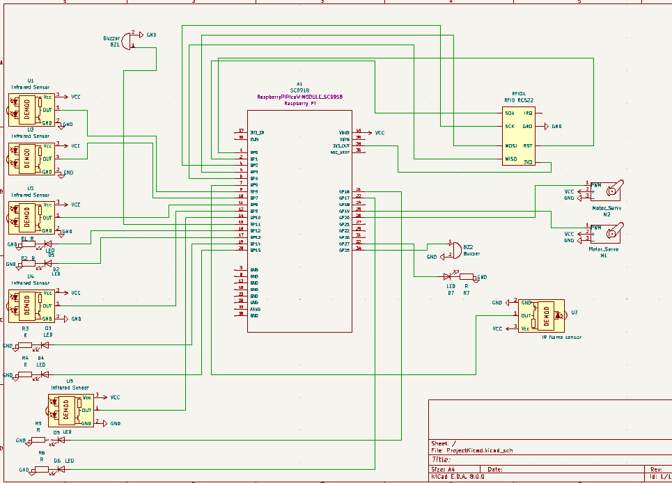

# Automated Parking System 
A parking system utilizing infrared sensors, RFID, and Raspberry Pi Pico W for enhanced security and efficiency.

:::info 
**Author**: El-Ghoul Layla \
**GitHub Project Link**: https://github.com/UPB-FILS-MA/project-Scarletwtc
:::

## Description
The project revolves around a multi-storey parking lot. At the entrance, an infrared sensor will detect the presence of vehicles. After the detection of a vehicle a servomotor barrier will allow its entry. Infrared sensors will be implanted at each parking lot to monitor occupation.There will be green leds indicating available parking spaces, and red ones indicating occupancy.The second floor will be designated for authorized vehicles only.To make this happen, an RFID system will be utilized. In case an unauthorized vehicle tries to access, a buzzer will be activated alerting security personnel. When an authorized vehicle is detected, an LED light will turn on. The exit will also implement an infrared sensor and a servomotor barrier. A flame sensor will indicate the presence of fire, in case of fire a buzzer will be activated and the servomotors will automatically open to enable evacuation procedures.

## Motivation
These days, cars have become a necessity rather than a luxury. People rely on them for their everyday activities, whether it's going to work, running errands, or simply enjoying some leisure time. One major concern for them is finding a place to park wherever they go. Whether it's for work, fun, or shopping, having a convenient and safe parking space is crucial for their comfort and peace of mind.
I picked this project because it addresses this concern. My project focuses on making parking lots safer, ensuring a better parking experience for everyone.

## Architecture 

This project utilizes a Raspberry Pi Pico W to create a smart parking system, housed within a cardboard box. The system features two floors, with various sensors and components managing the parking spaces.

### Components Overview

#### First Floor

- **Parking Areas**:
  - **3 parking spaces**, each equipped with:
   - **Green LED**: Indicates the space is available.
   - **Red LED**: Indicates the space is occupied.
   - **Infrared Sensor**: Detects presence of cars.

- **Gates**:
  - **Entrance Gate**: Controlled by **Servomotor 1** (connected to GPIO pin 19).
  - **Exit Gate**: Controlled by **Servomotor 2** (connected to GPIO pin 20).

- **Sensors**:
  - **Infrared Sensors**: 5 sensors (PIR 6 to PIR 10) monitoring vehicle movements, connected to GPIO pins 6-10. 3 senzors indicate if a car is parked in a parking space, while 2 of them are used to indicate cars for gates (servomotors) to open.
  - **IR Flame Sensor**: Detects fire and triggers a buzzer, connected to GPIO pin 5.
  - **Entrance Gate**: Controlled by **Servomotor 1** (connected to GPIO pin 1).
  - **Exit Gate**: Controlled by **Servomotor 2** (connected to GPIO pin 2).

- **Sensors**:
  - **Infrared Sensors**: 5 sensors (PIR 1 to PIR 5) monitoring vehicle movements, connected to GPIO pins 6-10. 3 senzors indicate if a car is parked in a parking space, while 2 of them are used to indicate cars for gates (servomotors) to open.
  - **IR Flame Sensor**: Detects fire and triggers a buzzer, connected to GPIO pin 3.

#### Second Floor

- **Authorized Parking Area**:
  - **RFID RC522**: Controls access to the area, communicates with the Pico W via SPI:
   - **SCK**: GPIO 2
   - **MISO**: GPIO 4
   - **MOSI**: GPIO 3
   - **CS**: GPIO 1
   - **RST**: GPIO 0
   - **SCK**: GPIO 18
   - **MISO**: GPIO 16
   - **MOSI**: GPIO 19
   - **CS**: GPIO 17
  - **LED Light**: Indicates access status.

### Connectivity

- **Infrared Sensors**: Connected to the Raspberry Pi Pico W's GPIO pins, sending signals about vehicle presence.
- **Servo Motors**: Controlled by pins on the Pico W.
- **LEDs**: Indicate parking space and authorization status.
- **Fire Sensor**: Activates a buzzer when triggered.
- **RFID**: Communicates via SPI with the Pico W, controlling access and indicating status with an LED.
- **Active buzzer**: the buzzer that gets activated in case of a fire.
  

### Physical Layout

- **Cardboard Box**: Houses the system, with cutouts for each component:
  - **First Floor**: 3 parking spaces, entrance, and exit.
  - **Second Floor**: Authorized parking area.
- **Breadboard**: Hidden inside, connecting all components to the Pico W.

## Log

<!-- write every week your progress here -->

### Week 6 - 12 May
I searched for a suitably sized cardboard box that could fit all my components. I purchased cars that could be detected by the infrared sensors and ordered the missing components. 

After preparing the cardboard, I made all the necessary cutouts and painted it blue. I then developed and tested code for each component individually to ensure proper functionality. The infrared sensors, flame sensor, buzzers, and LEDs worked as intended. However, I still needed to code the servo and the RFID, and select the appropriate GPIO pins. 

I also drew the initial KiCad schematics, ensuring each component was accurately represented and connected according to my design.

### Week 7 - 19 May

I assembled all the components, secured them in their positions within the cardboard structure, and wrote the code for the remaining components, the servo, and the RFID. After that, I combined the code to ensure everything worked together, using asynchronous functions to achieve this. 

Additionally, I updated the original KiCad design by adding a few more components and modifying some pin connections. Initially, I tried to get the RFID to work using SPI without a driver. Later, at the laboratory, I received help to get the RFID functioning correctly and using the driver, then I coded it to recognize specific UIDs. The only component that still needs work is the servo. I also need to decorate the cardboard further, as it is currently just plain blue. 

### Week 20 - 26 May

## Hardware
- *Infrared Flame sensor*: I used this to detect any nearby fires.
- *Active buzzer module*: This buzzer is activated when the flame sensor detects fire, or when rfid detects unauthorised car.
- *Servomotor*: Used as a barrier.
- *Infrared sensor*: Two of them are used with the servomotors, they indicate nearby cars so that the servo barrier opens. Three of them are used to detect if parking spaces are occupied or not.
- *Rfid module*: I used it to differ between authorised and unauthorised cars. Authorised have a recognised card attached to it, the unauthorised ones will have a different card attached.
- *Green leds*: used to indicate free parking spots.
- *Red leds*: used to indicate occupied parking spots.
-*Orange led*: used to indicate the presence of authorised car

This is what the wiring looks like:

This picture shows what the wires look like inside the cardboard behind the "wall" i will be adding:

This is the final product as of yet:

### Schematics

This is the kicad schematic.

### Bill of Materials
| Device | Usage | Price |
|--------|--------|-------|
| [Rapspberry Pi Pico W](https://www.raspberrypi.com/documentation/microcontrollers/raspberry-pi-pico.html) | The microcontroller | [35 RON](https://www.optimusdigital.ro/en/raspberry-pi-boards/12394-raspberry-pi-pico-w.html) |
|[Led 5mm](https://www.farnell.com/datasheets/1498852.pdf)| Red Led light| [0.26 RON](https://www.optimusdigital.ro/ro/optoelectronice-led-uri/700-led-rou-de-3-mm-cu-lentile-transparente.html)|
| [Led 5mm](https://www.farnell.com/datasheets/2861534.pdf) | Green Led light | [0.26 RON](https://www.optimusdigital.ro/ro/optoelectronice-led-uri/931-led-verde-de-3-mm-cu-lentile-transparente.html?search_query=led+verde&results=93) |
|[Micro Servomotor SG90 90°](http://www.ee.ic.ac.uk/pcheung/teaching/DE1_EE/stores/sg90_datasheet.pdf)| The micro servomotor | [14 RON](https://www.optimusdigital.ro/ro/motoare-servomotoare/26-micro-servomotor-sg90.html)|
| [Modul cu Buzzer activ](https://components101.com/misc/buzzer-pinout-working-datasheet) | Active buzzer | [2,49 RON](https://www.optimusdigital.ro/ro/audio-buzzere/10-modul-cu-buzzer-activ.html) |
| [Male to male jumper wires](https://media.digikey.com/pdf/Data%20Sheets/Digi-Key%20PDFs/Jumper_Wire_Kits.pdf) | Wires | [6.98 RON](https://www.optimusdigital.ro/ro/fire-fire-mufate/888-set-fire-tata-tata-40p-20-cm.html?search_query=fire+tata+tata&results=80) |
| [Male to male jumper wires](https://media.digikey.com/pdf/Data%20Sheets/Digi-Key%20PDFs/Jumper_Wire_Kits.pdf) | Wires | [6.98 RON](https://www.optimusdigital.ro/ro/fire-fire-mufate/880-fire-colorate-mama-mama-10p-10-cm.html?search_query=fire+mama+mama&results=63) |
| [Infrared Sensor ](https://arduinogetstarted.com/tutorials/arduino-infrared-obstacle-avoidance-sensor) | infrared sensor | [8,78 RON](https://ardushop.ro/ro/electronica/41-modul-senzor-ir-infrarosu-evita-obstacole.html) |
| [ServoMotor](http://www.ee.ic.ac.uk/pcheung/teaching/DE1_EE/stores/sg90_datasheet.pdf) | Micro Servomotor SG90 90° | [13,99 RON](https://www.optimusdigital.ro/ro/motoare-servomotoare/26-micro-servomotor-sg90.html?search_query=servo&results=194) |
| [Infrared Flame Sensor ](https://www.datasheethub.com/ir-flame-sensor-module/) | flame sensor | [2,49 RON](https://www.optimusdigital.ro/en/optical-sensors/110-ir-flame-sensor.html) |
| [Modul RFID RC522 ](https://microcontrollerslab.com/raspberry-pi-pico-rfid-rc522-micropython/) | Rfid RC522 | [2,49 RON](https://www.optimusdigital.ro/ro/wireless-rfid/67-modul-cititor-rfid-mfrc522.html?search_query=rfid&results=44) |

## Software
| Library | Description | Usage |
|---------|-------------|-------|
|[embassy-executor](https://docs.embassy.dev/embassy-executor/git/std/index.html)|Asynchronous executor for Rust embedded systems| Used for task scheduling and asynchronous programming|
|[embassy-time](https://embassy.dev/book/dev/time_keeping.html)|Time management library  |Used for time-based operations such as delays |
|[embassy-rp](https://docs.embassy.dev/embassy-rp/git/rp2040/index.html)| Peripheral access library |Used for initializing and interacting with peripherals |
|[log](https://docs.embassy.dev/embassy-usb-logger/git/default/index.html)|Logging facade |Used for logging messages |
|[embassy-usb-logger](https://docs.embassy.dev/embassy-usb-logger/git/default/index.html)|USB logger implementation for embassy  |Used for logging messages over USB  |
|[gpio](https://docs.embassy.dev/embassy-stm32/git/stm32c011d6/gpio/index.html)|GPIO manipulation |Used for interacting with GPIO pins |
|[pwm](https://docs.embassy.dev/embassy-nrf/git/nrf52840/pwm/index.html)|Pulse-width modulation |Used for controlling the buzzer's sound intensity |

## Links

1. [PM projects 2023](https://ocw.cs.pub.ro/courses/pm/prj2023)
2. [Car Parking System](https://www.youtube.com/watch?v=8XOsXdNOa4g&ab_channel=svsembedded)
