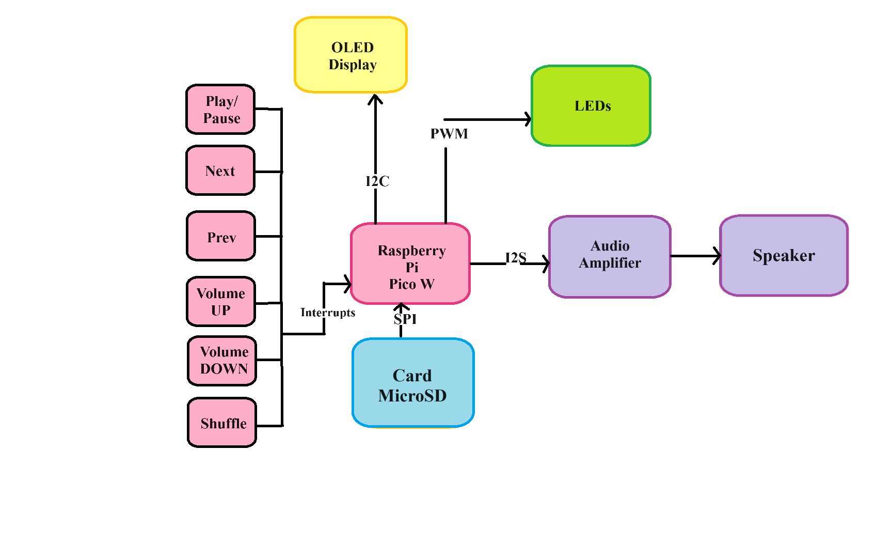
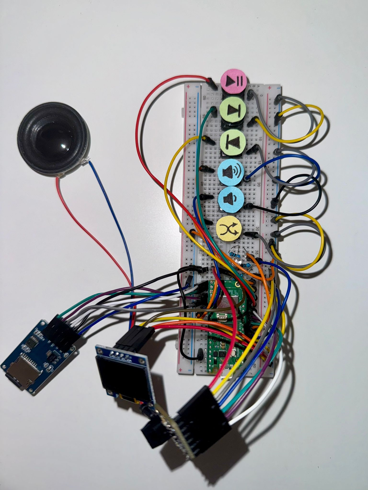
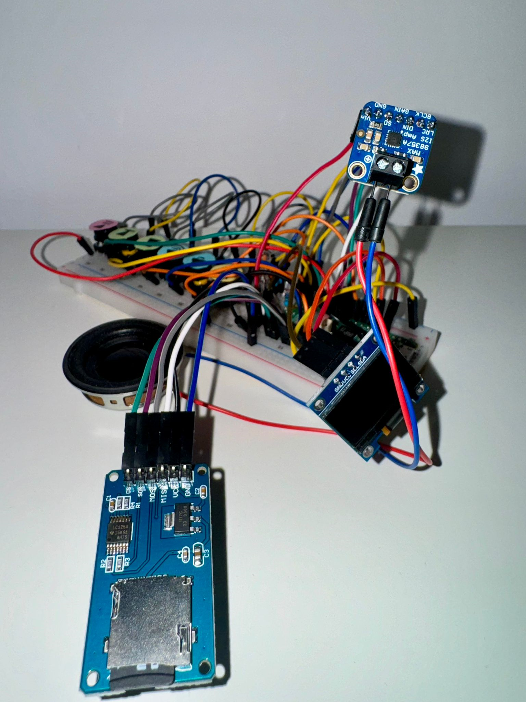
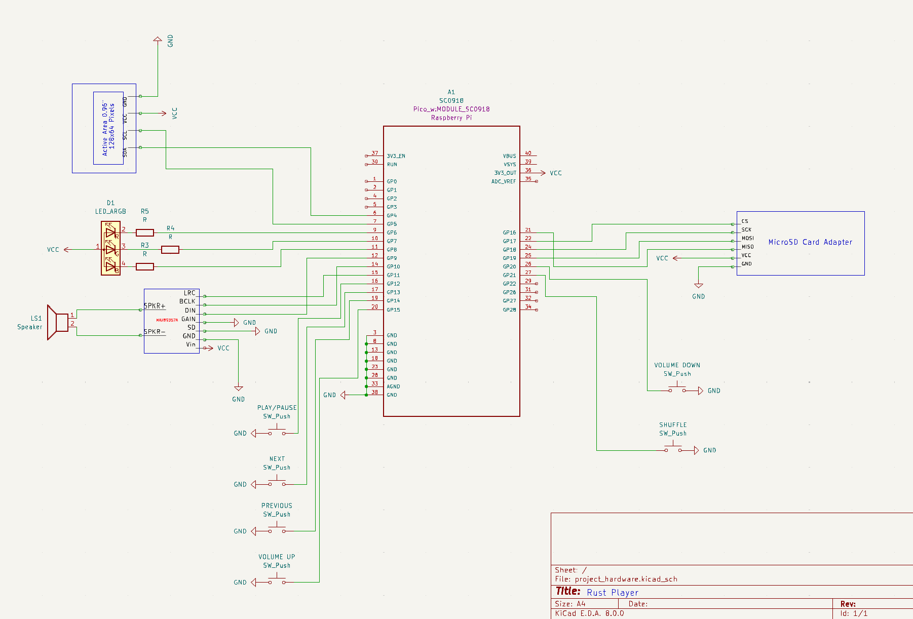
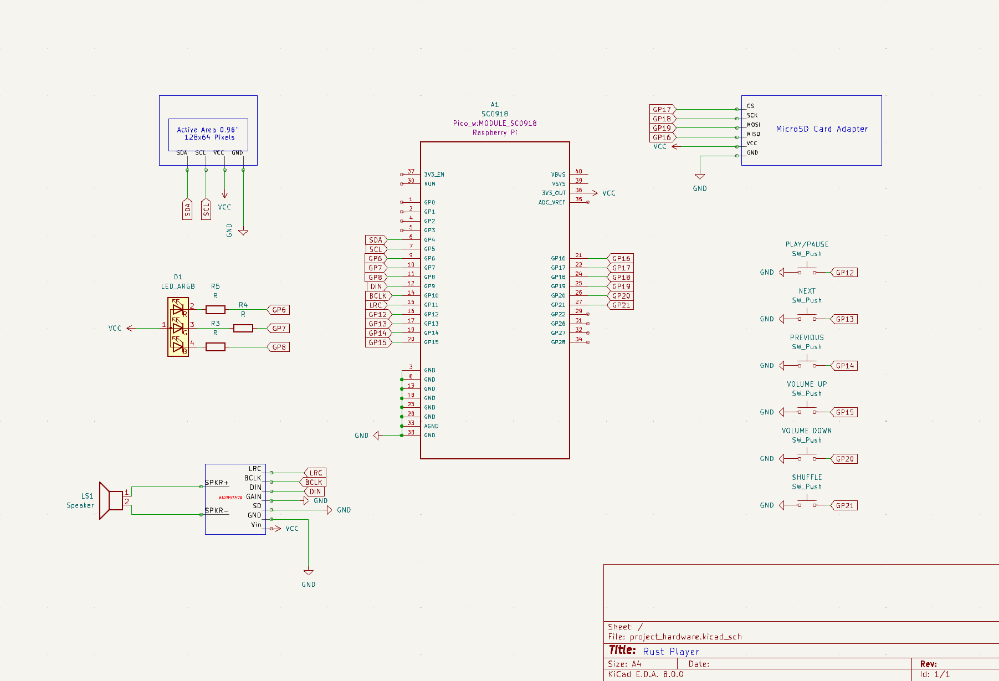

# RustPlayer
This project rekindles the nostalgic charm of physically selecting music with buttons, delivering a classic audio experience through an intuitive MP3 player.
:::info 

**Author**: Popa Ruxandra-Georgiana \
**GitHub Project Link**: (https://github.com/ruxi22/RustPlayer)

:::

## Description

RustPlayer is a custom-built MP3 player utilizing a Raspberry Pi Pico W to allow users to play music directly from a microSD card, controlled through a simple interface of buttons and an OLED display. Some laboratories I found relevent for the project I am implementing, are: 
- Lab 3: Interfacing SPI devices
- Lab 5: I2S Audio
- Lab 7: Advanced I/O Interfaces

## Motivation

My passion for music and technology inspired me to want to create the RustPlayer. This project is a perfect opportunity to apply my technical skills in a meaningful way, combining my love for tunes with the challenge of programming and hardware design. I'm excited to develop a device that not only plays music but also reconnects people with the tactile joy of manually choosing songs—something that's lost in today’s streaming era. Building the RustPlayer is also an excellent opportunity to deepen my understanding of embedded systems and user interface design, which are crucial in my studies and future career in technology.

## Architecture 

### Schematic Diagram

A schematic diagram is provided to illustrate the connections and layout of the components. 

 
  **Raspberry Pi Pico W**
  - **Role**: Acts as the central controller for all functions.
  - **Connections**:
    - Interfaces with the OLED Display, MicroSD Card Module, Audio Amplifier, LEDs and Buttons.

 **OLED Display**
  - **Interface**: I2C
  - **Connections**:
    - **SDA** (Serial Data Line) to GPIO4 of Raspberry Pi Pico W
    - **SCL** (Serial Clock Line) to GPIO5 of Raspberry Pi Pico W
  - **Role**: Displays user interface, track information, and playback status.

 **Buttons**
  - **Interface**: GPIO (with interrupts)
  - **Connections**:
    - Connected to various GPIO pins for different controls (e.g., play/pause, next, previous).
  - **Role**: Allow user input for controlling playback and settings.

 **LEDs**
  - **Interface**: PWM capable for brightness control
  - **Role**: Provide visual feedback during operation.

 **Audio Amplifier**
  - **Interface**: I2S
  - **Role**: Amplifies the audio signal for output to the speaker.

 **Speaker**
  - **Role**: Outputs audio signal received from the Audio Amplifier.

 **MicroSD Card Module**
  - **Interface**: SPI
  - **Connections**:
    - **SCK** (Serial Clock) to GPIO24 of Raspberry Pi Pico W
    - **MOSI** (Master Out Slave In) to GPIO25 of Raspberry Pi Pico W
    - **MISO** (Master In Slave Out) to GPIO21 of Raspberry Pi Pico W
    - **CS** (Chip Select) to GPIO22 of Raspberry Pi Pico W

## Log

<!-- write every week your progress here -->

### Week 6 - 12 May

The schematic for the project has been successfully created using KiCad. This schematic includes all necessary components and connections for the electronic circuit.

### Week 7 - 19 May

A 3D model of the project enclosure has been designed using Tinkercad. The box is tailored to fit all components securely and includes cutouts for the buttons, display, RGB led and speaker.

### Week 20 - 26 May

## Hardware

The Raspberry Pi Pico W serves as the central microcontroller for the RustPlayer project. It provides the processing power and interfaces necessary to control various components of the music player. With its dual-core ARM Cortex-M0+ processor and ample GPIO pins, the Pico W can handle tasks such as reading input from buttons, interfacing with the MicroSD card module for storing and accessing MP3 files, driving the OLED display for the user interface, and controlling the audio output via the MAX98357A amplifier.

This is the current progress of the RustPlayer project. So far, the essential components have been assembled. The next step involves making the music player more compact by integrating all components into a custom-designed box with a lid. This enclosure will be created using Tinkercad to ensure a perfect fit.

### Schematics

This schematic, created with KiCad, illustrates the electronic design of the RustPlayer project. It provides a detailed layout of the connections and components, ensuring accurate assembly and functionality.

In the second picture I have used net labels to represent connections, for a cleaner and more organized layout.

### Bill of Materials

| Device                                                  | Usage                        | Price                           |
|---------------------------------------------------------|------------------------------|---------------------------------|
| [Raspberry Pi Pico W](https://www.raspberrypi.com/documentation/microcontrollers/raspberry-pi-pico.html) | The microcontroller         | [35 RON](https://www.optimusdigital.ro/en/raspberry-pi-boards/12394-raspberry-pi-pico-w.html) |
| [MicroSD Card Module](https://www.robofun.ro/modul-cititor-card-microsd) | Storage for MP3 files        | [66 RON](https://www.robofun.ro/modul-cititor-card-microsd) |
| [Amplificator 3W I2S - MAX98357A](https://www.robofun.ro/amplificator-3w-i2s-max98357a.html?gad_source=1&gclid=EAIaIQobChMIuMLW1uvuhQMVtTgGAB2bvw6eEAQYASABEgL-DfD_BwE)   | Audio output                 | [53 RON](https://www.robofun.ro/amplificator-3w-i2s-max98357a.html?gad_source=1&gclid=EAIaIQobChMIuMLW1uvuhQMVtTgGAB2bvw6eEAQYASABEgL-DfD_BwE) |
| [0.96'' I2C IIC OLED Display](https://www.sigmanortec.ro/Display-OLED-0-96-I2C-IIC-Albastru-p135055705?gad_source=1&gclid=EAIaIQobChMI87uZ2uzuhQMVXAUGAB0WEwaqEAQYASABEgIC8vD_BwE) | User interface display       | [20 RON](https://www.sigmanortec.ro/Display-OLED-0-96-I2C-IIC-Albastru-p135055705?gad_source=1&gclid=EAIaIQobChMI87uZ2uzuhQMVXAUGAB0WEwaqEAQYASABEgIC8vD_BwE) |
| [VISATON 2916](https://ro.farnell.com/visaton/2916/speaker-k-50-wp-50-ohms/dp/1683896?gross_price=true&CMP=KNC-GRO-GEN-SHOPPING-PMax_Test_840_HighMargin&mckv=_dc%7Cpcrid%7C%7Cplid%7C%7Ckword%7C%7Cmatch%7C%7Cslid%7C%7Cproduct%7C1683896%7Cpgrid%7C%7Cptaid%7C%7C&gad_source=1&gclid=EAIaIQobChMIqpmFqOzuhQMVdkJBAh25UwYvEAQYASABEgJ7jPD_BwE)   | Audio output device          | [50 RON](https://ro.farnell.com/visaton/2916/speaker-k-50-wp-50-ohms/dp/1683896?gross_price=true&CMP=KNC-GRO-GEN-SHOPPING-PMax_Test_840_HighMargin&mckv=_dc%7Cpcrid%7C%7Cplid%7C%7Ckword%7C%7Cmatch%7C%7Cslid%7C%7Cproduct%7C1683896%7Cpgrid%7C%7Cptaid%7C%7C&gad_source=1&gclid=EAIaIQobChMIqpmFqOzuhQMVdkJBAh25UwYvEAQYASABEgJ7jPD_BwE) |
| [Card MicroSD](https://www.emag.ro/card-de-memorie-microsd-kingston-canvas-select-plus-32gb-100mb-s-cu-adaptor-sdcs2-32gb/pd/D63FBGBBM/?ref=fam#32-GB) | Memory Card MicroSD | [30-40 RON](https://www.emag.ro/card-de-memorie-microsd-kingston-canvas-select-plus-32gb-100mb-s-cu-adaptor-sdcs2-32gb/pd/D63FBGBBM/?ref=fam#32-GB) |
| [Electronic components: LEDs, buttons, wires resistors and Breadboard](https://www.optimusdigital.ro/en/?gad_source=1&gclid=EAIaIQobChMIt8fHl_DuhQMVoj8GAB2CHwcJEAAYASAAEgLBrvD_BwE) | Electronic Components | [15-20 RON](https://www.optimusdigital.ro/en/?gad_source=1&gclid=EAIaIQobChMIt8fHl_DuhQMVoj8GAB2CHwcJEAAYASAAEgLBrvD_BwE) |

## Software

| Library | Description | Usage |
|---------|-------------|-------|
| [st7789](https://github.com/almindor/st7789) | Display driver for ST7789 | Used for the display for the Pico Explorer Base |
| [embedded-graphics](https://github.com/embedded-graphics/embedded-graphics) | 2D graphics library | Used for drawing to the display |
| [TinyUSB](https://github.com/nviennot/tinyusb-sys-rs) | An open-source USB library for embedded systems that handles USB device and host functionality | Provides USB communication capabilities for the RustPlayer, enabling potential future expansions such as connecting USB-based audio devices |
| [FatFs](https://github.com/rafalh/rust-fatfs) | A lightweight file system library for embedded systems, compatible with FAT32, FAT16, and FAT12 | Handles reading and writing audio files to and from the microSD card efficiently |

## Links

<!-- Add a few links that inspired you and that you think you will use for your project -->

1. [Music Player using Raspberry Pi Pico and DFPlayer](https://www.youtube.com/watch?v=1--GBKYXRyY)
2. [World's Cheapest Internet Radio Player! - Powered by Raspberry Pi](https://www.youtube.com/watch?v=aSga6w89VpI)
3. [Revolutionize Your Spotify Experience for less than $15](https://www.youtube.com/watch?v=SWiPIBWvgIU)

