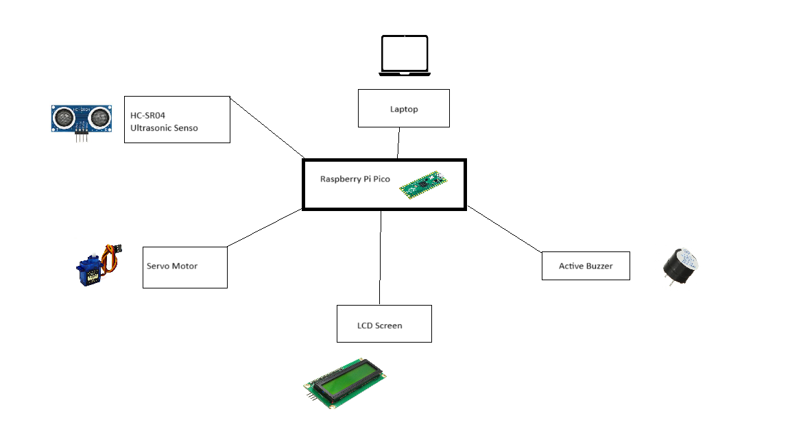
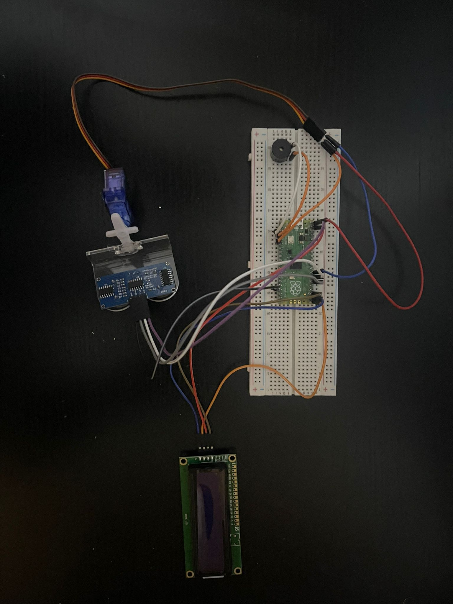
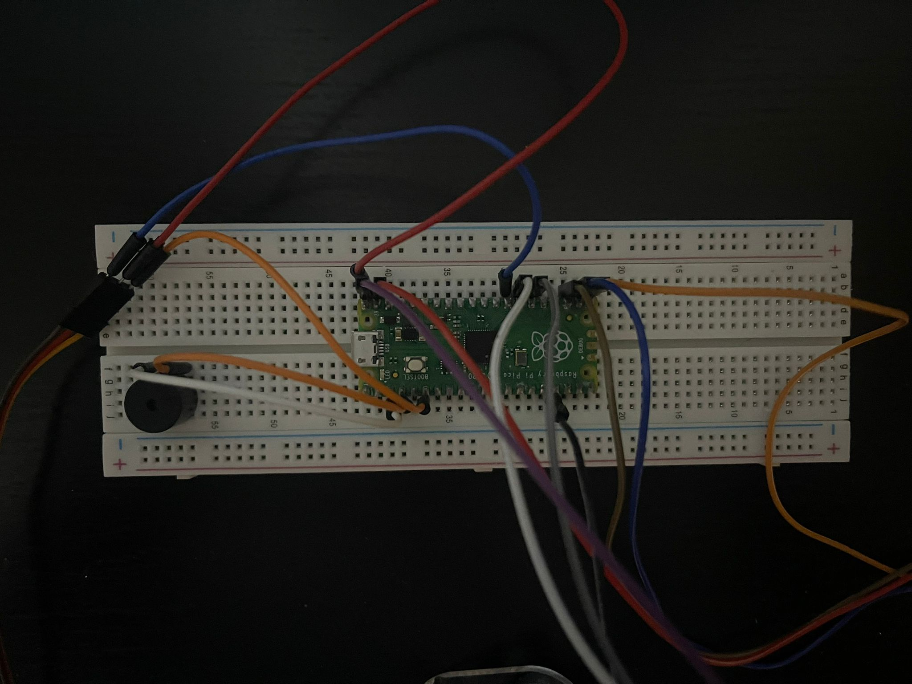
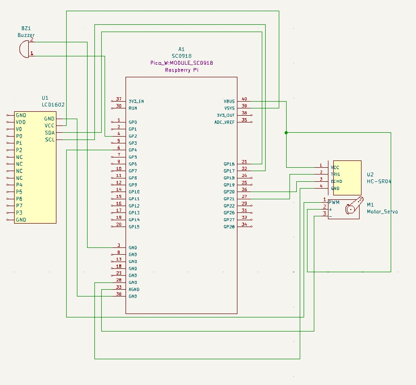

# Object Detection and Alert System
Automated Surveillance and Notification Interface.

:::info 
**Author**: Mahmoud Mirghani Abdelrahman \
**GitHub Project Link**: https://github.com/UPB-FILS-MA/project-Abd210
:::

## Description

The project utilizes an HC-SR04 ultrasonic sensor, a servo motor ,an lcd, and a buzzer. Here's how it works:

Radar-like Functionality: The servo motor is attached to the ultrasonic sensor, allowing it to sweep back and forth like a radar. This setup helps the sensor detect objects across a range of angles.

Detection and Alerts: When an object is within range, the ultrasonic sensor measures the distance to the object and stops the servo motor's rotation. A buzzer then sounds, alerting me to the presence of an obstacle.

Real-time Feedback: The buzzer continues to sound until the object moves away, allowing the servo to resume its sweeping motion. During detection, the system displays the distance to the object and the servo's angle on an LCD screen, providing me with real-time information about the object's position.

This project effectively combines ultrasonic sensing, servo control, and audio alerts to create a functional radar-like detection mechanism with real-time feedback, making it suitable for obstacle detection and range measurement applications.

## Motivation

I chose this project to create a functional radar-like system for obstacle detection and range measurement, utilizing my skills in ultrasonic sensing, servo control, and real-time feedback. I was also inspired by a YouTube video on similar technology.

## Architecture 



```
    Components:
Sensor Module: The HC-SR04 ultrasonic sensor measures the distance to nearby objects.

Control Module: 
    A Raspberry Pi Pico microcontroller manages the sensor's operations, controlling the servo motor and processing data from the ultrasonic sensor.

Alert Module:
    A buzzer provides an audio alert when an object is detected.

Display Module:
    An LCD screen provides real-time feedback, displaying the distance to the detected object and the angle of the servo motor.
```
    Connections:
```
LCD Screen: 
    Connected to the Pico with:
        SDA to PIN_16
        SCL to PIN_17
        Ground to Ground
        VSYS to VDD
Ultrasonic Sensor:
    Connected to the Pico with:
        Trig to GP21
        Echo to GP20
        VCC to VBUS
        Ground to Ground
Buzzer:
    Connected to the Pico with:
        Ground to Ground
        Positive to PIN2
Servo Motor:
    Connected to the Pico with:
        Signal to PIN28
        VCC to VBUS
        Ground to Ground
```
## Log

<!-- write every week your progress here -->

### Week 6 - 12 May
I purchased the components for my project and tested them individually to ensure they worked properly. This initial testing phase helped me plan how to implement the code effectively.

I created the initial KiCad schematic and decided which pins to use for each component. During this process, I received assistance from the lab teachers for the servo motor because it wasn't functioning properly and it worked at the end.

By working step-by-step, I successfully managed to make all the components work independently. Each part performed as expected when tested on its own.

Now, I just needed to put everything together and finish the coding. Combining the individual codes and making sure everything worked together was the final step.

### Week 7 - 19 May
Despite the initial setup, I connected everything to the Pico and modified the initial KiCad schematic to change some pins. This involved careful adjustments to ensure all connections were accurate.

I tried to integrate the code for all the components. The components I managed to combine were the LCD, ultrasonic sensor, and buzzer. Each of these worked perfectly when tested together.Everything worked except for the servo, which did not function. 

I connected the pins and took photos of the hardware setup. I used my kicad schematic to do this.
### Week 20 - 26 May

## Hardware
The hardware used includes:

1. Raspberry Pi Pico: A microcontroller that manages the project's operations, controlling the servo motor, processing sensor data, and handling other components.
  
2. HC-SR04 Ultrasonic Sensor: Measures the distance to nearby objects, providing range data for obstacle detection.
  
3. Servo Motor: Moves the ultrasonic sensor back and forth in an arc, mimicking radar scanning.
  
4. Buzzer: Provides an audio alert when an obstacle is detected.
  
5. LCD Screen: Displays real-time feedback on the distance to detected objects and the angle of the servo motor.
Detail in a few words the hardware used.


This is what the project looks like:

This is an upclose picture of the wiring:


### Schematics



### Bill of Materials

| Device | Usage | Price |
|--------|--------|-------|
| [Rapspberry Pi Pico W](https://www.raspberrypi.com/documentation/microcontrollers/raspberry-pi-pico.html) | The microcontroller | [35 RON](https://www.optimusdigital.ro/en/raspberry-pi-boards/12394-raspberry-pi-pico-w.html) |
|[Micro Servomotor SG90 90°](http://www.ee.ic.ac.uk/pcheung/teaching/DE1_EE/stores/sg90_datasheet.pdf)| The micro servomotor | [14 RON](https://www.optimusdigital.ro/ro/motoare-servomotoare/26-micro-servomotor-sg90.html)|
| [Modul cu Buzzer activ](https://components101.com/misc/buzzer-pinout-working-datasheet) | Active buzzer | [2,49 RON](https://www.optimusdigital.ro/ro/audio-buzzere/10-modul-cu-buzzer-activ.html) |
| [Male to male jumper wires](https://media.digikey.com/pdf/Data%20Sheets/Digi-Key%20PDFs/Jumper_Wire_Kits.pdf) | Wires | [6.98 RON](https://www.optimusdigital.ro/ro/fire-fire-mufate/888-set-fire-tata-tata-40p-20-cm.html?search_query=fire+tata+tata&results=80) |
| [Male to female jumper wires](https://media.digikey.com/pdf/Data%20Sheets/Digi-Key%20PDFs/Jumper_Wire_Kits.pdf) | Wires | [6.98 RON](https://www.optimusdigital.ro/ro/fire-fire-mufate/878-set-fire-mama-tata-40p-30-cm.html?search_query=fire+mama+tata&results=37https://www.optimusdigital.ro/ro/fire-fire-mufate/880-fire-colorate-mama-mama-10p-10-cm.html?search_query=fire+mama+mama&results=63) |
| [Ultrasonic sensor HC-SR04](https://pdf1.alldatasheet.com/datasheet-pdf/view/1132204/ETC2/HCSR04.html) | measure distance and detect the object | [6.49 RON](https://www.optimusdigital.ro/ro/senzori-senzori-ultrasonici/9-senzor-ultrasonic-hc-sr04-.html?search_query=ultrasonic+sensor&results=8) |
| [lcd1602](https://www.waveshare.com/datasheet/LCD_en_PDF/LCD1602.pdf) | display | [9.83](https://ardushop.ro/ro/electronica/36-lcd-1602.html?gad_source=1&gclid=CjwKCAjw88yxBhBWEiwA7cm6pdqOViizWqCFbWwp7bppHaDJMWmLusj9m5WZ71mS_5w1ogINvKjYFBoC404QAvD_BwE) |

## Software

| Library | Description | Usage |
|---------|-------------|-------|
|[pwm](https://docs.embassy.dev/embassy-nrf/git/nrf52840/pwm/index.html)|Pulse-width modulation |Used for controlling the buzzer's sound intensity |
|[embassy-executor](https://docs.embassy.dev/embassy-executor/git/std/index.html)|Asynchronous executor for Rust embedded systems| Used for task scheduling and asynchronous programming|
|[embassy-time](https://embassy.dev/book/dev/time_keeping.html)|Time management library  |Used for time-based operations such as delays |
|[embassy-rp](https://docs.embassy.dev/embassy-rp/git/rp2040/index.html)| Peripheral access library |Used for initializing and interacting with peripherals |
|[log](https://docs.embassy.dev/embassy-usb-logger/git/default/index.html)|Logging facade |Used for logging messages |
|[embassy-usb-logger](https://docs.embassy.dev/embassy-usb-logger/git/default/index.html)|USB logger implementation for embassy  |Used for logging messages over USB  |
|[gpio](https://docs.embassy.dev/embassy-stm32/git/stm32c011d6/gpio/index.html)|GPIO manipulation |Used for interacting with GPIO pins |
|[HC-SR04](https://github.com/Benehiko/pico-ultrasonic-rs.git) |HC-SR04 manipulation| 
Used for controlling the ultrasonic sensor|

## Links
1. [DIY Radar with Ultrasonic Sensor](https://youtube.com/shorts/o7DMHJKhpws?si=-lUkMuV3EGYiiGDN)

