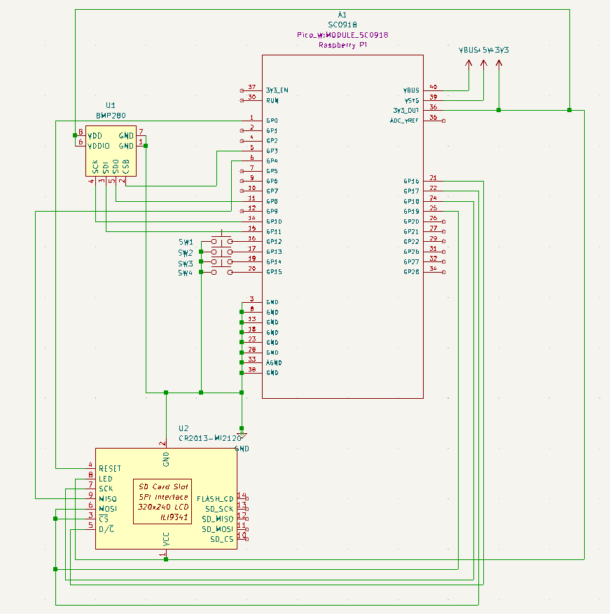

# Weather Station

Rust-powered environmental monitoring station

:::info 

**Author**: Udrea Alberto-George \
**GitHub Project Link**: https://github.com/UPB-FILS-MA/project-UdrAlberto

:::

## Description

The project builds a weather station which should provide real-time weather data on an external display and web interface

## Motivation

Building a Raspberry Pi Pico W weather station with embassy-rs combined my interest in embedded systems with a chance to explore networking. It allows me to learn sensor interaction, data processing, and real-time programming. Integrating a web interface adds a network layer, enabling real-time data display and opening doors for future functionalities like remote monitoring.

## Architecture 

## Log

### Week 6 - 12 May
[Implemented the software baseline](https://github.com/UPB-FILS-MA/project-UdrAlberto/commit/b76fcde81a6b80d8a26ecc948acc6462a66c3757)

The work in this phase involved the creation of the crates, the assimilation of the necessary resources and the implementation of communication between the components at a grassroots level.

### Week 7 - 19 May
[Added the network stack onto the software](https://github.com/UPB-FILS-MA/project-UdrAlberto/commit/ddab361e172beedbbc50cb34c979435d62d4cf54)

Here we fixed (most of) the bugs left over from the previous stage of our development and added the network part of the code, which deals with the transmission of the data collected in the network, to the host device of the web application.

We also made progress in the hardware part of the project, basically grounding the physical side of the project

### Week 20 - 26 May

## Hardware

We will use a BME280 in order to gather environmental data. The Pico will process this gathered data in order to print meaningful graphics on the provided display. We will also use several push buttons in order to switch between the available data

### Schematics and Photos
[For the KiCad schematic files, click here](https://github.com/UPB-FILS-MA/project-UdrAlberto/tree/main/schematics)

<table>
<tr>
 <th>Schematics</th>
<td>
 

</td>

<td>
 

</td>
</tr>

<tr>
 <th>Photos</th>
 <td>
  

</td>
<td>
 

</td>
</tr>
</table>

### Bill of Materials

| Device | Usage | Price |
|--------|--------|-------|
| [Raspberry Pi Pico WH](https://www.raspberrypi.com/documentation/microcontrollers/raspberry-pi-pico.html) | The microcontroller | [56 RON](https://ardushop.ro/ro/home/2819-raspberry-pi-pico-wh.html) |
| [BME280](https://www.bosch-sensortec.com/products/environmental-sensors/humidity-sensors-bme280/) | Temperature, pressure and humidity sensor | [74 RON](https://www.optimusdigital.ro/ro/senzori-senzori-de-presiune/5649-modul-senzor-barometric-de-presiune-bme280.html) |
| [LED Display](https://ardushop.ro/8014-thickbox_default/modul-lcd-spi-128x160.jpg) | Display | [39 RON](https://ardushop.ro/ro/home/2818-modul-lcd-spi-128x160.html) |
| [Breadboard](https://www.yamanelectronics.com/wp-content/uploads/2020/06/basics-of-breadboard.jpg) | The physical base of the project | [10 RON](https://www.optimusdigital.ro/ro/prototipare-breadboard-uri/8-breadboard-830-points.html) |
| [Jumper Wires](http://www.atomsindustries.com/assets/images/items/1075/1075.jpg) | For connecting all the different components | [7 RON](https://www.optimusdigital.ro/ro/fire-fire-mufate/886-set-fire-tata-tata-40p-15-cm.html) |
| [Push buttons](https://ardushop.ro/655-thickbox_default/buton-mic-push-button-trough-hole.jpg) | For switching info on the screen| [0.36 RON each / 1.5 RON total](https://www.optimusdigital.ro/ro/butoane-i-comutatoare/1119-buton-6x6x6.html)
 

## Software

| Library | Description | Usage |
|---------|-------------|-------|
| [embassy-rp](https://github.com/embassy-rs/embassy/tree/main/embassy-rp) | The embassy-rp HAL targets the Raspberry Pi RP2040 microcontroller. The HAL implements both blocking and async APIs for many peripherals. |  The utilised HAL  |
| [st7789](https://github.com/almindor/st7789) | Display driver for ST7789 | Used for the display |
| [embedded-graphics](https://github.com/embedded-graphics/embedded-graphics) | 2D graphics library | Used for drawing to the display |
| [BME 280 Rust Library](https://github.com/VersBinarii/bme280-rs)| BME280 Sensor library | Used for communicating with the sensor |

## Links

1. [Idea](https://www.hackster.io/jotrinelectronics/building-a-weather-station-with-raspberry-pi-pico-rp2040-9d5cbb)
2. [Arduino BME280 Library (not Rust, but it will be useful as a conceptual insight)](https://github.com/finitespace/BME280)
3. [Web app framework](https://yew.rs)
4. [Might be useful for the web app implementation](https://github.com/rustwasm/wasm-bindgen)
