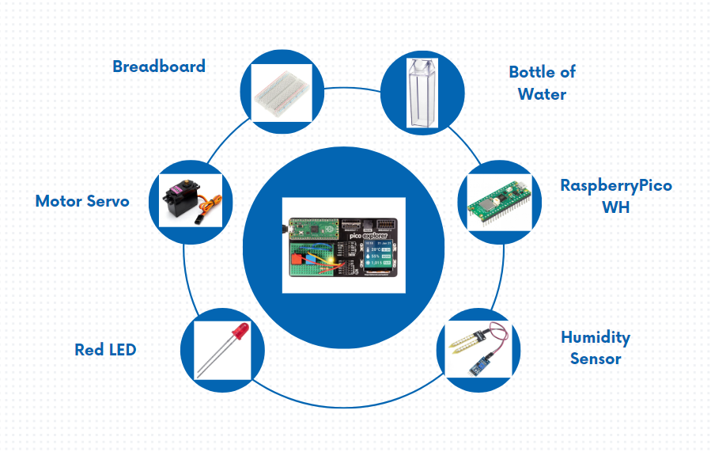
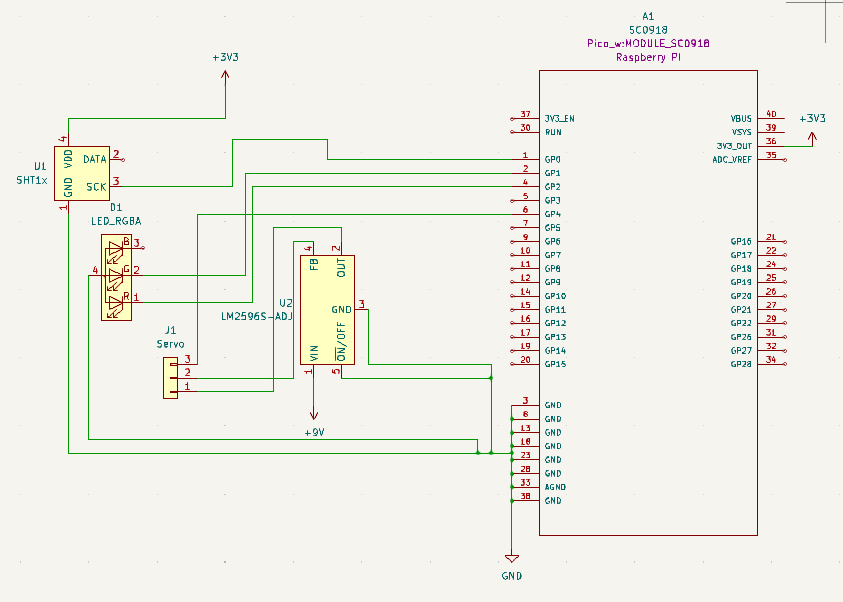

# Saving the Flower
Rust-powered environmetal monitoring the umidity percentage of the plant

:::info 

**Author**: Iordache Alecsandra-Elena \
**GitHub Project Link**: https://github.com/UPB-FILS-MA/project-alecsandraiordache

:::

## Description

My project focuses on innovative humidity sensing using the Raspberry Pi Pico microcontroller. I aim to address the critical need for efficient humidity control in various environments. Leveraging advanced sensing technology and the versatile Raspberry Pi Pico, we're developing a solution for real-time monitoring and regulation of humidity levels.

## Motivation

Think about it – every drop counts, right? By setting up this cool project, we're actually doing our part for the planet. Water scarcity is a big deal nowadays, and we're tackling it head-on by making sure we're not wasting a single drop. With my system in place, we're not just watering plants efficiently; we're also being kinder to Mother Earth. It's like showing her some love and saying, "Hey, we care about you!" Plus, when others see what we're doing, maybe they'll get inspired to jump on the eco-friendly bandwagon too. So, it's not just about plants – it's about making a difference, one humidity sensor at a time!

## Architecture 

a.   Raspberry Pi Pico
b.   MG996 Servo Motor
-	The servo motor is responsible for actuating the water release mechanism. It receives instructions from the Raspberry Pi Pico to rotate and control the flow of water from the bottle
c.	Bottle of water
-	The water bottle acts as the reservoir for supplying water to the plants. It is connected to the servo motor, and its controlled release ensures precise watering based on humidity levels.
d.	The module with soil moisture sensor
-	The sensor module measures the moisture content of the soil. It provides data to the Raspberry Pi Pico, allowing it to determine when watering is required based on preset thresholds.
e.	LED RGB
-	The LED RGB serves as an indicator that the system is watering the plant
f.  Voltage divider
-   The voltage divider recives 9V from the battery and realise 5V to power the servo motor
g.	Power Supply

## Log

Introducing my smart plant watering system: a combination of automation and efficient plant care. This system uses a soil humidity sensor to monitor moisture levels, activating a servo motor to release water from a bottle when needed. Power is managed through a voltage divider that provides a stable 5V from a battery. An RGB LED indicates the plant's status, glowing red when it needs watering and green when it is sufficiently hydrated. This project not only simplifies plant maintenance but also ensures optimal hydration for healthy growth.

<!-- write every week your progress here -->

### Week 6 - 12 May

### Week 7 - 19 May

### Week 20 - 26 May

## Hardware

The humidity sensor will read the percentage of the soil. If it is under 60%, the Servo Motor will realise the bottle cap for watering the plant. 

### Schematics

Place your KiCAD schematics here.

### Bill of Materials

| Device | Usage | Price |
|--------|--------|-------|
| Rapspberry Pi Pico WH | The microcontroller | [56 RON](https://ardushop.ro/ro/home/2819-raspberry-pi-pico-wh.html) |
| Pico Explorer Base | The development board | [163.28 RON](https://www.amazon.nl/Pimoroni-Pico-Explorer-Base/dp/B0C5Y2J7Z2/ref=sr_1_1?__mk_nl_NL=%C3%85M%C3%85%C5%BD%C3%95%C3%91&crid=WKSPNG17VBE9&dib=eyJ2IjoiMSJ9.Q7INK_s77jVXTRKnG0B_Hm4rPvh3lRNdWoD7EoN_B1kZHK4El3qiNAdCsHmACkWS0BoEBuwhEGBPJz16rrWc5ep20gk71u_6mhVBmOJYMCwv-tmkhnfWaR_iwp8S7UvzD-BejRPPOtcWEdYEsSyTvpcMryz7hQil0BhwJToiga0K_pcaoWhLB6q0snRIwieMlEGjluy4nqFznZ6Bc2hMyJtxmybrvUsVbuxXt-HiiL46ZnBxT_R4OOXKrmt_9CyzVduhQpET2WLvsw57SFvuqKn2eNXtCF9-3GLAEip_n_A.o0UNPqoEPczaoHrUE-SBhSWpczSYQElEA6tOsE6T-oY&dib_tag=se&keywords=pico%20explorer&qid=1712995988&sprefix=pico%20explorere%2Caps%2C187&sr=8-1) |
| Breadboard 400 | Breadboard | [3.34 RON](https://ardushop.ro/ro/electronica/34-breadboard-400.html?search_query=breadboard+400&results=156) |
| Modul cu sensor de umiditate | Humidity sensor for the plant | [7.04 RON](https://www.emag.ro/modul-cu-senzor-umiditate-sol-cl73/pd/D5ZZ5JBBM/?utm_campaign=share%20product&utm_medium=ios&utm_source=mobile%20app) |
| Wires | For connecting the components | [5.96 RON](https://ardushop.ro/ro/electronica/24-40-x-fire-dupont-tata-mama-10-cm2.html?search_query=fire+tata+tata&results=439) |
| LED RGB | It glowing red when it needs watering and green when it is sufficiently hydrated | [0.99 RON](https://www.optimusdigital.ro/ro/optoelectronice-led-uri/484-led-rgb-anod-comun.html?search_query=LED+RGB&results=113)|
| Motor Servo MG996 12kg | Opening the bottle cap | [38.08 RON](https://www.emag.ro/motor-servo-mg996-12kg-180grade-cl846/pd/DCSHBRBBM/?utm_source=mobile%20app&utm_medium=ios&utm_campaign=share%20product)|
| Modul DC-DC Step Down LM2596S |  Voltage divider | [12.99 RON](https://www.optimusdigital.ro/ro/surse-coboratoare-reglabile/1108-modul-dc-dc-step-down-lm2596hv.html)|
 
## Software

| Library | Description | Usage |
|---------|-------------|-------|
| [embassy_executor](https://embassy.dev/book/dev/runtime.html#_executor) | Embedded project empowers you to build responsive | Used for the display for the Pico Explorer Base |
|[gpio](https://docs.embassy.dev/embassy-stm32/git/stm32c011d6/gpio/index.html)|GPIO manipulation |Used for interacting with GPIO pins |
|[embassy-rp](https://docs.embassy.dev/embassy-rp/git/rp2040/index.html)| Peripheral access library |Used for initializing and interacting with peripherals 

## Links

<!-- Add a few links that inspired you and that you think you will use for your project -->

1. [Video with the same ideea but in Arduino](https://www.youtube.com/watch?v=ojhrVsBs0nM&ab_channel=ScienceBuddies)
2. [Learning about Rust](https://www.rust-lang.org/learn)
3. [Web app framework](https://yew.rs)
