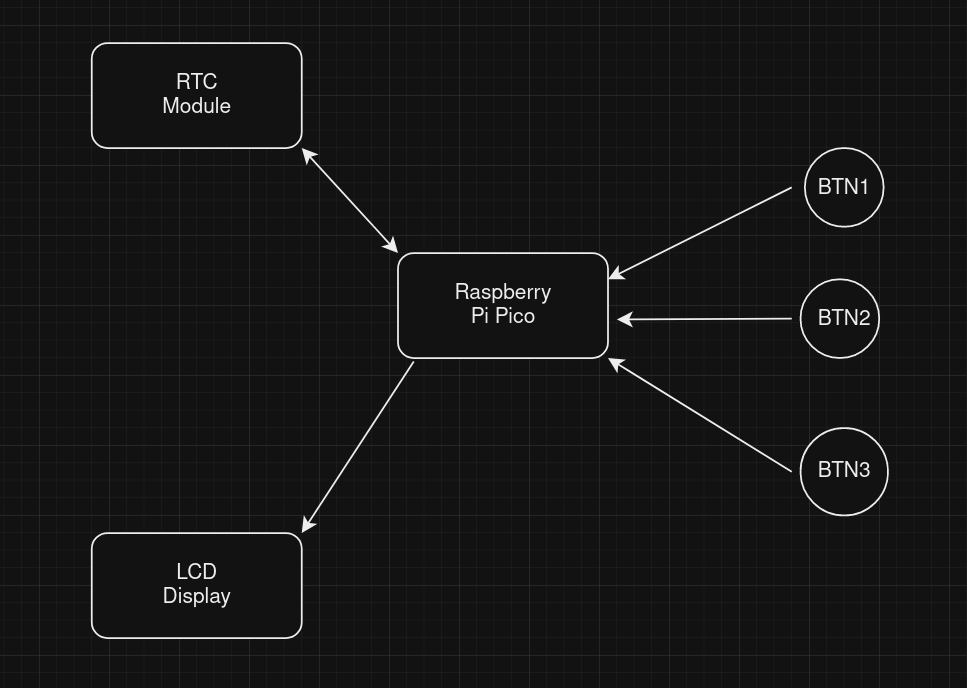
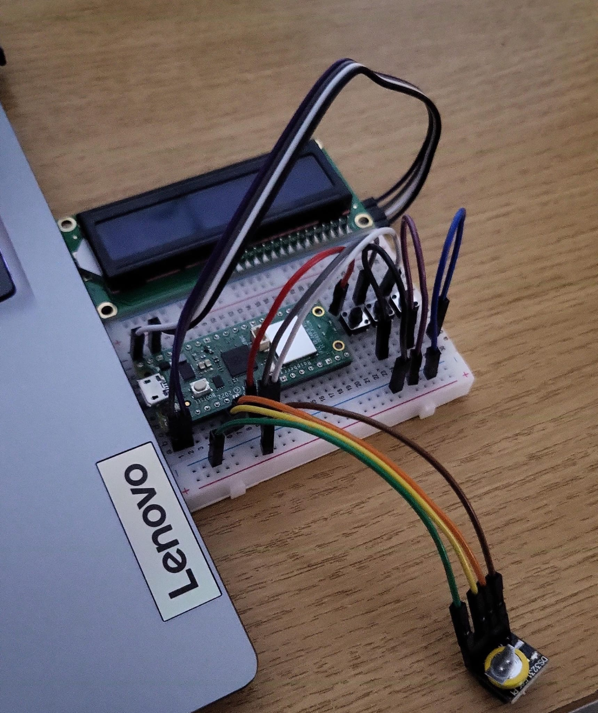
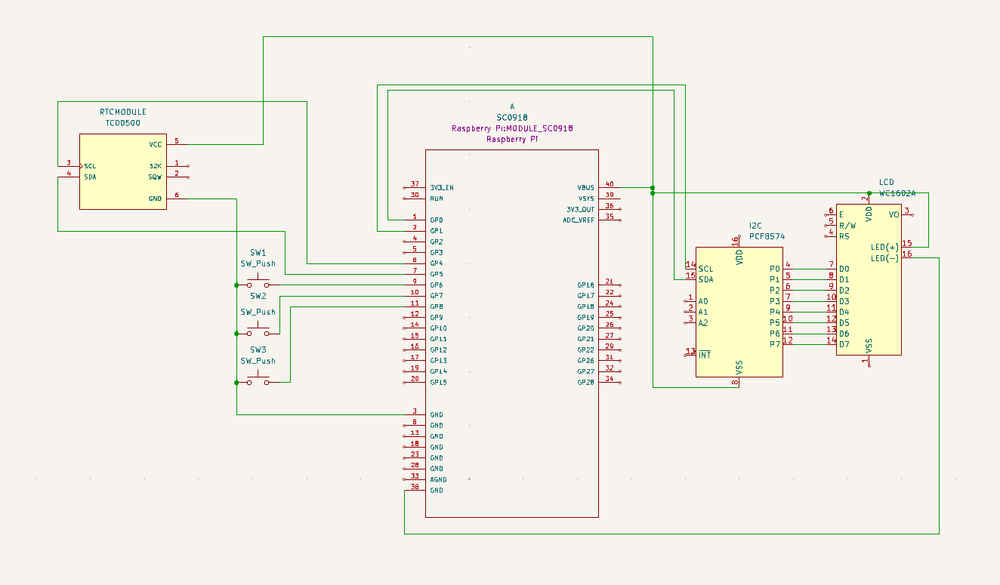

# Clock-in

A clock-in machine used to keep track of attendance.

:::info

**Author**: Oblu Alexandra \
**GitHub Project Link**: (https://github.com/UPB-FILS-MA/project-alexandra214)

:::

## Description

This project aims to create a clock-in device using a Raspberry Pi Pico W microcontroller and a display module.

## Motivation

This clock-in device is designed to simplify attendance tracking, addressing the inefficiencies of manual systems. By automating the process with reliable technology, it aims to enhance accuracy and streamline administrative tasks for businesses.

## Architecture

* Raspberry Pi Pico W: Chosen as the microcontroller unit due to its affordability and versatility.

* Real-Time Clock (RTC) Module: Responsible for preserving time data even when the system is off.

* LCD Display: Visual interface for the clock-in device.

* Push Buttons: Input devices for clocking in/out.

### Components
- Raspberry Pi Pico W: Chosen as the microcontroller unit due to its affordability and versatility.
- Real-Time Clock (RTC) Module: Responsible for preserving time data even when the system is off
- LCD Display: Visual interface for the clock-in device.
- Push Buttons: Input devices for clocking in/out.
  
### Connection
- Raspberry Pi Pico W and RTC Module are connected via GPIO pins.
- The LCD display is connected to the Raspberry Pi Pico W.
- Push buttons are connected to GPIO pins of the Raspberry Pi Pico W.

<!-- write every week your progress here -->

### Week 6 - 12 May

Got the needed parts and checked if the project was doable. This step involved understanding what each part does and planning how to put them together.

### Week 7 - 19 May

Put all the parts together and connected the wires. This step required following the schematics closely and testing the setup to make sure everything worked properly.

### Week 20 - 26 May

## Hardware

Hardware Diagram

Completed Robot

### Schematics

KiCad Schematic

### Bill of Materials

| Device                          | Usage              | Price              |
|---------------------------------|--------------------|--------------------|
| Raspberry Pi Pico W             | Microcontroller    | [35 RON](https://www.optimusdigital.ro/en/raspberry-pi-boards/12394-raspberry-pi-pico-w.html) |
| Push buttons                    | Input devices      | [1 RON](https://www.optimusdigital.ro/ro/butoane-i-comutatoare/1119-buton-6x6x6.html) |
| Real-Time Clock (RTC) Module    | Timekeeping        | [18 RON](https://www.optimusdigital.ro/ro/altele/637-modul-ds3231-rtc-pentru-raspberry-pi-.html?search_query=rtc+module&results=15) |
| LCD Display                     | Visual interface   | [58 RON](https://www.optimusdigital.ro/ro/lcd-uri/1158-lcd-hat-1602-pentru-raspberry-pi.html?search_query=lcd+display+raspberry+pi&results=27)

## Software

| Library | Description | Usage |
|---------|-------------|-------|
| [embedded-hal](https://github.com/rust-embedded/embedded-hal) | Hardware abstraction layer | Used for interfacing with hardware peripherals such as GPIO pins and SPI for the LCD display |
| [rp-hal](https://github.com/rp-rs/rp-hal) | HAL for Raspberry Pi Pico | Provides higher-level abstractions for peripherals on the Raspberry Pi Pico |

## Links
**1. RTC module**: [Datasheet](https://www.optimusdigital.ro/ro/altele/637-modul-ds3231-rtc-pentru-raspberry-pi-.html?search_query=rtc+module&results=15)

**2. LCD display**: [Datasheet](https://www.optimusdigital.ro/en/lcds/1158-lcd-hat-1602-pentru-raspberry-pi.html)

**3. Inspiration**: [RTC video](https://www.youtube.com/watch?v=gv1h-3kK6SU&ab_channel=CoreElectronics)

**4. Inspiration**: [Punch clock](https://www.youtube.com/watch?v=kCpWF5UXfQ4&ab_channel=CBSSundayMorning)
