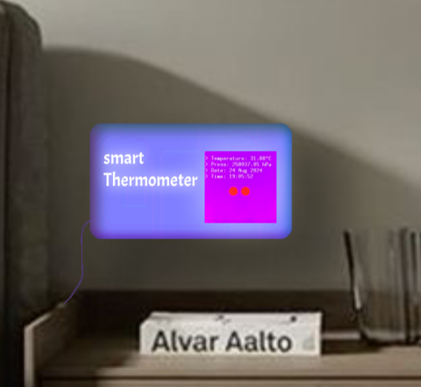

# Date and thermometer clock 
Display temperature, pressure, clock, and date on the LCD screen module.

:::info

**Author**: Alkhatib Hoda \
**GitHub Project Link**: https://github.com/UPB-FILS-MA/project-AlkhatibHoda

:::

## Description

This project showcases an advanced digital clock designed to do more than just tell time—it keeps you anchored in the present while helping you plan for the future. With its ability to display not only the current date and time but also real-time temperature and atmospheric pressure, this device serves as a daily companion that informs your decisions and enhances your awareness of the environment around you.

## Motivation

Time is the most precious resource we have; it’s the framework within which we set our goals and pursue our dreams. Every passing second grows into a minute, every minute into an hour, and so on—reminding us that life moves forward, whether we’re ready or not. In a world where deadlines define our progress and achievements, it’s easy to lose track of the days as they slip by. This digital clock was created to serve as an essential tool for staying grounded in time, helping manage not just the simplest but also the most complex actions in our lives. Along with keeping track of time, it also monitors temperature and atmospheric pressure, providing real-time environmental data that aids in daily decision-making.

## Architecture
Here is a clear architecture image:

According to the image here is an explanation about what each component does:

| The component | What is it  | Why do we need it |
| --- | --- | --- |
| `Raspberry Pi Pico W` | A microcontroller board with built-in Wi-Fi. |  The Pico W is the brain of your project. It controls all the other components and handles communication with the internet to get the current date and time.|
| `BMP280` | A device that measures the temperature and atmospheric pressure of its environment. |To monitor and display the temperature and pressure as part of your project. |
| `LCD screen` | A screen that shows information in a readable format. | To present the temperature, pressure, date, and time in a way that you can easily see and understand. It acts as the output interface of your project.|
| `Buzzer` | A small device that makes noise. |To provide audio feedback or alerts. For example, it could beep when the temperature or pressure reaches a certain threshold, or simply to signal that the system is active.|
| [`API Through Wifi`](http://worldtimeapi.org/api/timezone/Europe/Bucharest) |A web service that provides date and time information. |To get the current time and date from the internet.This way your project has accurate and up-to-date time information without needing a separate real-time clock module and can ensure your time information is always accurate.|

## Log

<!-- write every week your progress here -->

### Week 6 - 12 May
I bought the components .

### Week 7 - 19 May
Tested codes for my project.

### Week 20 - 26 May
Worked on the documentation and posted my project.

## Hardware
| When connected  | A closer look to the connection: |
| ------------- | ------------- |
|   |    |

About those two circles… I hope you didn’t notice them. But if you did, just keep going—they were supposed to be a heart, but let’s just say they’re cherry emojis 🍒. Or maybe a broken heart 💔, because let’s face it, time can be a bit of a heartbreaker.

 I tried to make a 3D model here :) :
.

### Schematics:

The schematic image shows a clearer connection for the components , using the online simulator [*Wokwie*](https://wokwi.com/).

> [!NOTE]  
> the lcd screen is connected by default to the pico explorer base .

the buzzer is connected (with a resistance) to GPIO 1.\
here is the BMP280 connection table
| PIN | connection with pico explorer ~ pico PIN|
| --- | --- |
| `VCC` | power source (3V3)|
| `GND` | ground |
| `SCL` | 	`12SCL` line ~ GP21 |
| `SDA` | `12SDA` line ~ GP20 |
| `CSB` | not used  |
| `SDO` | not used  |

> [!TIP]  
> On the Pico Explorer base, the I2C pins are marked for simple use. You can check the back of the base to see which pins of the Raspberry Pi Pico they are tied to.

### Bill of Materials

<!-- Fill out this table with all the hardware components that you might need.
The format is
| [Device](link://to/device) | This is used ... | [price](link://to/store) |
-->

| Device                                                                                                  | Usage               | Price                                                                                                                                                                                                                                                                                |
| ------------------------------------------------------------------------------------------------------- | ------------------- | ------------------------------------------------------------------------------------------------------------------------------------------------------------------------------------------------------------------------------------------------------------------------------------ |
| [Raspberry Pi Pico WH, Wireless+Headers](https://www.raspberrypi.com/documentation/microcontrollers/raspberry-pi-pico.html) | The microcontroller | [56 RON](https://ardushop.ro/ro/home/2819-raspberry-pi-pico-wh.html?search_query=pico&results=14) |
| [Pico Explorer Base](https://shop.pimoroni.com/products/pico-explorer-base?variant=32369514315859)                                                                   |functional Base for components | [160 RON](https://www.optimusdigital.ro/en/others/12148-pico-explorer-base.html) |
| [Passive Buzzer](https://projects.raspberrypi.org/en/projects/introduction-to-the-pico/9)                                                                                      | Buzzer              | [4 RON ](https://ardushop.ro/ro/electronica/194-buzzer.html?search_query=buzzer&results=16) |
| [BMP280](https://www.bosch-sensortec.com/media/boschsensortec/downloads/datasheets/bst-bmp280-ds001.pdf)                                                                                       | Digital pressure and temperature sensor     | [17 RON ](https://www.emag.ro/modul-senzor-de-presiune-atmosferica-bmp280-cl214/pd/DGKX6JBBM/) |
| [65 x Fire Jumper](https://www.digikey.com/en/htmldatasheets/production/5367683/0/0/1/20ul1015strbla250)                                                                                    | connection           | [12  RON](https://ardushop.ro/ro/electronica/28-65-x-jumper-wires.html?search_query=fir&results=286) |
| [40 x Dupont Yarn Mother-Father 10cm](https://www.digikey.com/en/htmldatasheets/production/5367683/0/0/1/20ul1015strbla250)                                                                 | connection           | [5 RON](https://ardushop.ro/ro/electronica/23-40-x-dupont-cables-female-male-10cm.html?search_query=fir&results=286) |
          

## Software

| Library                                  | Description                        | Usage                              |
| ---------------------------------------- | ---------------------------------- | ---------------------------------- |
| [Embassy](https://embassy.dev/)          | Framework                          | Framework                          |
| [Embedded-graphics](https://github.com/embedded-graphics/embedded-graphics)          | for drawing 2D graphics                          | for rendering graphics on displays |
| [embassy-rp](https://github.com/embassy-rs/embassy/tree/main/embassy-rp)          | HAL for Raspberry Pi RP2040, supporting both blocking and async APIs for various peripherals.                       | Simplifies peripheral control on RP2040 with async support. |
| [embassy-executor](https://github.com/embassy-rs/embassy/tree/main/embassy-executor)       | An async executor for embedded systems, part of the Embassy ecosystem.               | Manages asynchronous tasks in embedded applications.               |
| [embedded-hal](https://github.com/rust-embedded/embedded-hal)       | Programming Language               | Programming Language               |
| [cyw43_pio](https://github.com/rp-rs/rp-hal/tree/main/boards/pico/cyw43_pio)          |A library to control the Cypress CYW43 Wi-Fi chip using the Raspberry Pi Pico PIO.                        | Manages Wi-Fi connectivity for Raspberry Pi Pico.                      |
| [embassy-sync](https://github.com/embassy-rs/embassy/tree/main/embassy-sync)          |Provides synchronization primitives like mutexes and channels for async code in embedded environments.                        |Enables safe concurrency in embedded applications.                     |
| [st7789](https://github.com/almindor/st7789)          |A Rust driver for controlling ST7789 displays, compatible with embedded-hal.                      | 	Enables control and rendering on ST7789-based displays.                          |
## Links

<!-- Add a few links that inspired you and that you think you will use for your project -->

1. [Inspiration project](https://www.youtube.com/watch?v=gBofy7MMdIY)
2. [YT video](https://www.youtube.com/watch?v=1INA9AmaDtQ&t=650s)
