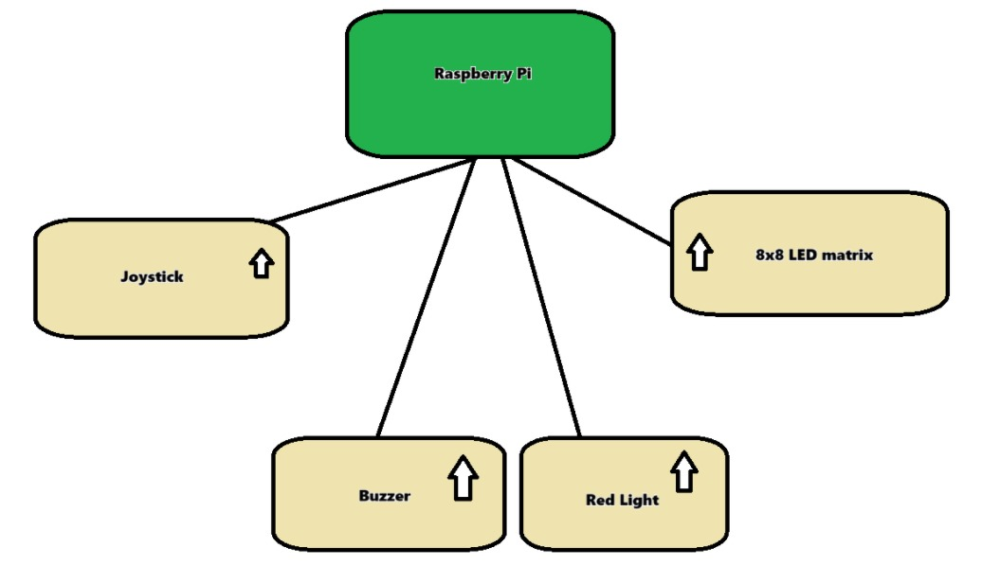
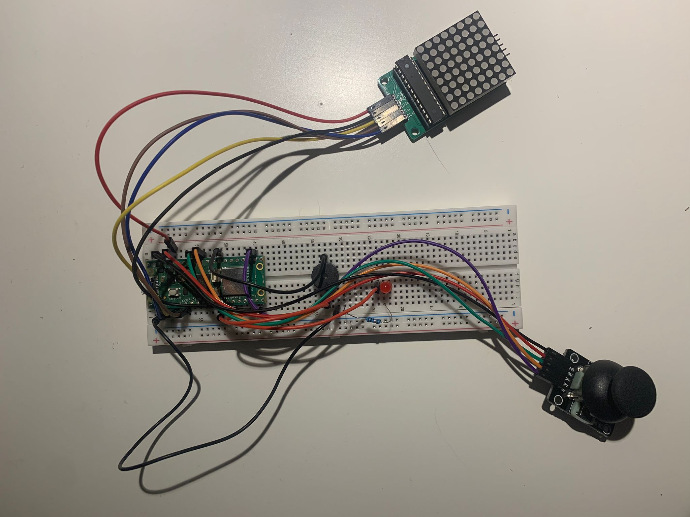
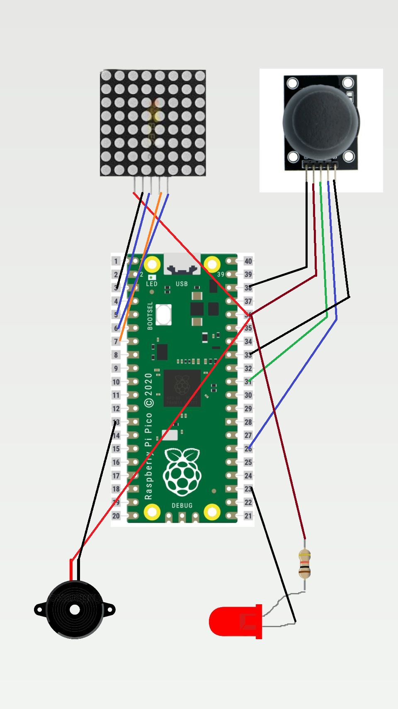

# Snake game project 
The game 'Snake', displayed on an 8×8 LED Matrix module 

:::info

**Author**: Alkhatib Hoda \
**GitHub Project Link**: https://github.com/UPB-FILS-MA/project-AlkhatibHoda

:::

## Description

My project is a recreation of the popular game 'Snake,' displayed on an 8×8 LED Matrix module using a Raspberry Pi.My aim is to create something that appears simple but holds many memories of my childhood and provides enjoyable entertainment.

## Motivation

Creating a Snake game with Rust on a Raspberry Pi and LED matrix blends nostalgia with technical challenge, fostering both creativity and learning.

## Architecture

Game Engine:
Manages game state and logic.
Controls snake movement, food generation, and scoring.
Input Handling:
Interprets joystick input for controlling the snake.
Ensures responsive and accurate gameplay.
Display Management:
Controls LED matrix to represent the game grid.
Updates display in real-time based on game state.
Audio Feedback:
Uses buzzers to provide sound effects for game events.
Enhances player experience with auditory cues.
Game State Management:
Maintains current game state and information.
Facilitates communication between components.
User Interface (UI):
Provides visual indicators and feedback.
Enhances player engagement and experience.

-   how they connect with each other

The Raspberry Pi is positioned at the center, serving as the main controller.
Components are arranged in a clear and organized manner around the Raspberry Pi.
Arrows indicate the direction of data flow or connection from the components to the Raspberry Pi.
Each component is labeled for clarity.

## Log

<!-- write every week your progress here -->

### Week 6 - 12 May
I tested the code for each component.

### Week 7 - 19 May
Assembled the components on the breadboard. \
Making the schematic.

### Week 20 - 26 May

## Hardware
 

My hardware setup comprises a Raspberry Pi Pico microcontroller, a breadboard serving as the main board, an 8×8 LED matrix module, a passive buzzer, a joystick module, and various wires for connection, a LED , a resistor.

### Schematics

The Raspberry Pi is positioned at the center, serving as the main controller.
Components are arranged in a clear and organized manner around the Raspberry Pi.
Arrows indicate the direction of data flow or connection from the components to the Raspberry Pi.
Each component is labeled for clarity.

### Bill of Materials

<!-- Fill out this table with all the hardware components that you might need.
The format is
| [Device](link://to/device) | This is used ... | [price](link://to/store) |
-->

| Device                                                                                                  | Usage               | Price                                                                                                                                                                                                                                                                                |
|-|-|-|
| [Raspberry Pi Pico WH, Wireless+Headers](https://www.raspberrypi.com/documentation/microcontrollers/raspberry-pi-pico.html) | The microcontroller | 56,23 RON                                                                                                                                                                                       |
| [Breadboard](https://ardushop.ro/ro/electronica/33-breadboard-830.html?search_query=breadboard&results=31) | Main board          | 10,15 RON                                                                                                                                                                                                                                                   
| [L8x8 LED matrix + control circuit](https://ardushop.ro/ro/home/95-matrice-led-uri-8x8-circuit-de-control.html?search_query=matrix&results=8)     | a screen to Display | 14,87 RON                                                                                                                                                      |
| [Passive Buzzer](https://ardushop.ro/ro/electronica/194-buzzer.html?search_query=buzzer&results=16)                                                                                       | Buzzer              | 3,97 RON                                                                                                                        |
| [Joystick mode](https://ardushop.ro/ro/electronica/127-modul-joystick.html?search_query=joystick&results=4)                                                                                        | control the game    | 3,60 RON                                                                                                                                                                                                                                                        |
| A LED                                                    | turns on when starting | 0 RON-I borrowed it                                                                                                                                                                                                                                                       |
| A resistor                                       | current-limiting resistor| 0 RON-I borrowed it                                                                                                                                                                                                                                                        |
| [65 x Fire Jumper](https://ardushop.ro/ro/electronica/28-65-x-jumper-wires.html?search_query=fir&results=286)           | connection           | 11,86  RON |
| [40 x Dupont Yarn Mother-Father 10cm](https://ardushop.ro/ro/electronica/23-40-x-dupont-cables-female-male-10cm.html?search_query=fir&results=286)                     | connection           | 5,18  RON|

## Software

| Library                                  | Description                        | Usage                              |
| ---------------------------------------- | ---------------------------------- | ---------------------------------- |
| [VsCode](https://code.visualstudio.com/) | Integrated Development Environment | Integrated Development Environment |
| [Rust](https://www.rust-lang.org/)       | Programming Language               | Programming Language               |
| [Embassy](https://embassy.dev/)          | Framework                          | Framework                          |

## Links

<!-- Add a few links that inspired you and that you think you will use for your project -->

1. From last year projects: [project](https://ocw.cs.pub.ro/courses/pm/prj2023/apredescu/gameofsnake)
