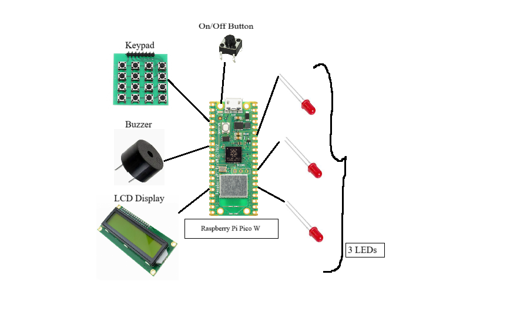
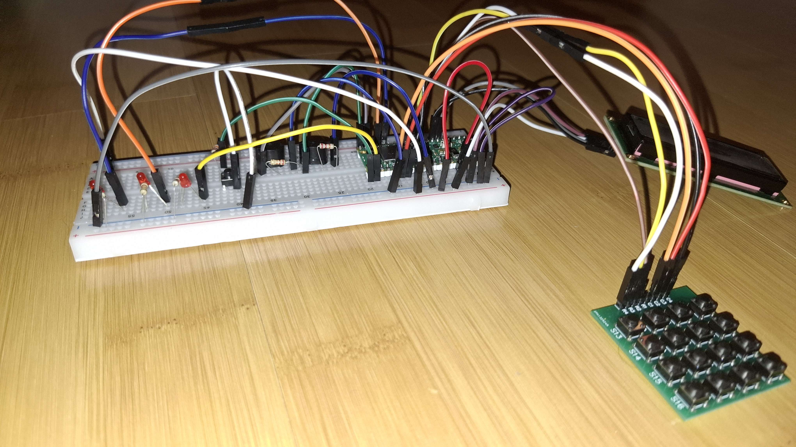
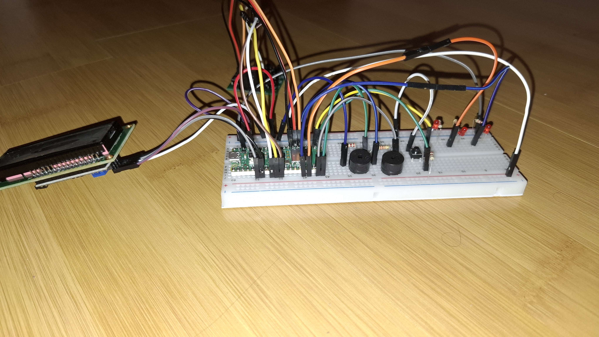
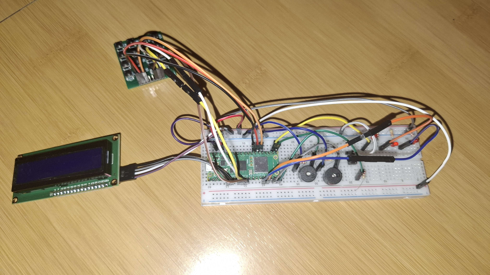
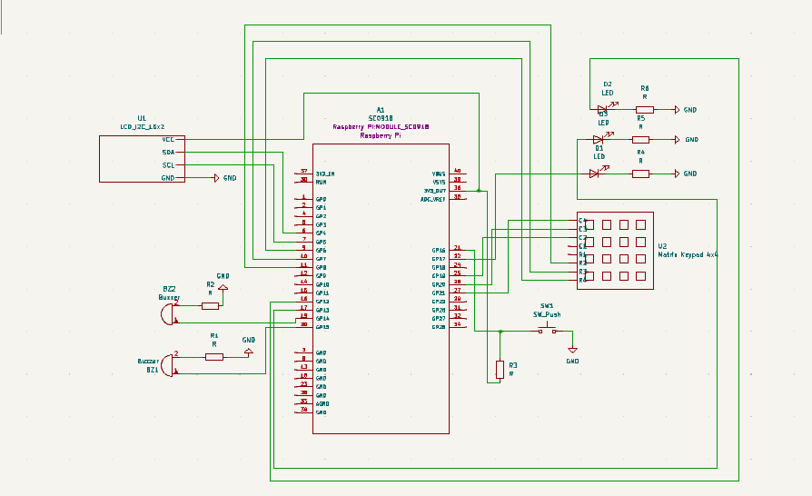

# The Hangmaster
A hangman game programmed on a Raspberry Pi Pico. 

:::info 
**Author**: Munteanu Amalia-Nicole \
**GitHub Project Link**: https://github.com/UPB-FILS-MA/project-nikkoxp
:::

## Description

My project is based on an old timey game that we all used to play during school hours and even in our free time with our friends, the hangman. The game's purpose is to crrate a fun enviroment in which people can relax and rewind old memories from their childhood. The player is given a word and must guess the letters it consists of. For example, if a player choose a letter which is part of the chosen word, the positions of the letter will be revealed to the player. However, if the letter is not part of the word, a red LED will light up. When all 3 LEDs on the breadboard are lit up, the player has lost, and the game is over and a buzzer will go off. The game will be able to function on a Raspberry Pi, using a LCD display which uses Embeded-graphics, a buzzer, a keypad, a potentiometer, 3 LEDs and a button for starting the game and stopping it. 

## Motivation

I've always taken a big interest in the game development area, and thought it would be fun to try challenging myself by coding a game designed to work on a microprocessor in a newly encountered programming language, rust. The question was which game. Well, it all came around when one day, during free hours, my friends and I decided to play Hangman and thought it would be a great idea to revolve my project on this timeless game.

## Architecture 




## Log

<!-- write every week your progress here -->

### Week 6 - 12 May
 - Placed an order for the necessary components and picked them up from the shop.
 - Made a prototype of my project using schematics and started to play around with the hardware part, figuring out the places of my components.
   
### Week 7 - 19 May
 - This week I was able to finish the Hardware of my project and create the schematics of it using Kicad.
 - I started working on the software part of my project.
 - desgined the schematics of the LCD and the Keypad in kicad.
 - Started designing a shell in which I would be able to place my hardware and make it look more appealing to the public, by hiding the wires and the components such as the pico and buzzers.
   
### Week 20 - 26 May

## Hardware
 - Raspberry Pi Pico W: A microcontroller board for the embedded project.
 - LCD Display: A 16x2 character LCD display with I2C interface and blue backlight.
 - Wires father-father: Male-to-male jumper wires for connecting components on a breadboard or elsewhere.
 - Wires mother-mother: Female-to-female jumper wires for connecting components on a breadboard or elsewhere.
 - Buzzer: An audio output device that emits sound when activated once the player loses all the lives.
 - Keypad: A 4x4 matrix keypad for inputting the letters.
 - Breadboard: A breadboard for prototyping the circuit necessary for the project.
 - 3 LEDs: 3 red LEDs with diffused lens for visual indication.
 - Buton 6x6x6: A tactile push button for manual control or input.

 

 

 

### Schematics

 

### Bill of Materials

<!-- Fill out this table with all the hardware components that you might need.

The format is 
```
| [Device](link://to/device) | This is used ... | [price](link://to/store) |

```

-->

| Device | Usage | Price |
|--------|--------|-------|
| [Rapspberry Pi Pico W](https://www.raspberrypi.com/documentation/microcontrollers/raspberry-pi-pico.html) | The microcontroller | [35 RON](https://www.optimusdigital.ro/en/raspberry-pi-boards/12394-raspberry-pi-pico-w.html) |
| LCD 1602 cu Interfata I2C si Backlight Albastru | The Display | [16,34 RON](https://www.optimusdigital.ro/ro/optoelectronice-lcd-uri/2894-lcd-cu-interfata-i2c-si-backlight-albastru.html) |
| Wires father-father | The Wires Father-Father | [6,99 RON](https://www.optimusdigital.ro/ro/fire-fire-mufate/884-set-fire-tata-tata-40p-10-cm.html?search_query=fire&results=437) |
| Wires mother-mother | The Wires Mother-Mother | [7,73 RON](https://www.optimusdigital.ro/ro/fire-fire-mufate/652-fire-colorate-mama-mama-40p-10-cm.html?search_query=fire&results=437) |
| Buzzer | The Buzzer | [1,95 RON](https://www.optimusdigital.ro/ro/audio-buzzere/12247-buzzer-pasiv-de-33v-sau-3v.html?search_query=buzzer&results=62) |
| Keypad | The Keypad | [3,99 RON](https://www.optimusdigital.ro/ro/senzori-senzori-de-atingere/2441-tastatura-matriceala-4x4-cu-butoane.html?search_query=matriceala&results=2) |
| Breadboard | The Breadboard | [9,98 RON](https://www.optimusdigital.ro/ro/prototipare-breadboard-uri/8-breadboard-830-points.html?search_query=Breadboard&results=145) |
| 3 Red LEDs | The LEDs | [0,39 RON](https://www.optimusdigital.ro/ro/optoelectronice-led-uri/696-led-rou-de-3-mm-cu-lentile-difuze.html?search_query=LED&results=818) |
| Button 6x6x6 | The On/Off Button | [0,36 RON](https://www.optimusdigital.ro/ro/butoane-i-comutatoare/1119-buton-6x6x6.html) |


## Software

| Library | Description | Usage |
|---------|-------------|-------|
| [st7789](https://github.com/almindor/st7789) | Display driver for ST7789 | Used for the display for the Pico Explorer Base |
| [embedded-graphics](https://github.com/embedded-graphics/embedded-graphics) | 2D graphics library | Used for drawing to the display |


## Links

<!-- Add a few links that inspired you and that you think you will use for your project -->

1. [Hangman LCD](https://ocw.cs.pub.ro/courses/pm/prj2021/alazar/hangman_lcd)
2. [Hangman](https://ocw.cs.pub.ro/courses/pm/prj2022/imacovei/iarina.dalimon)
...
