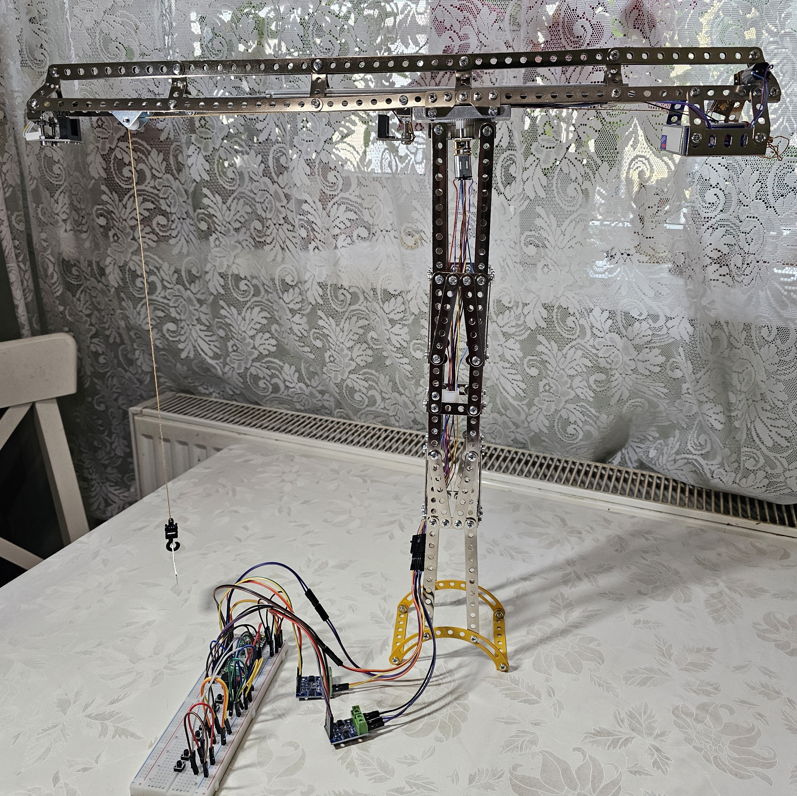
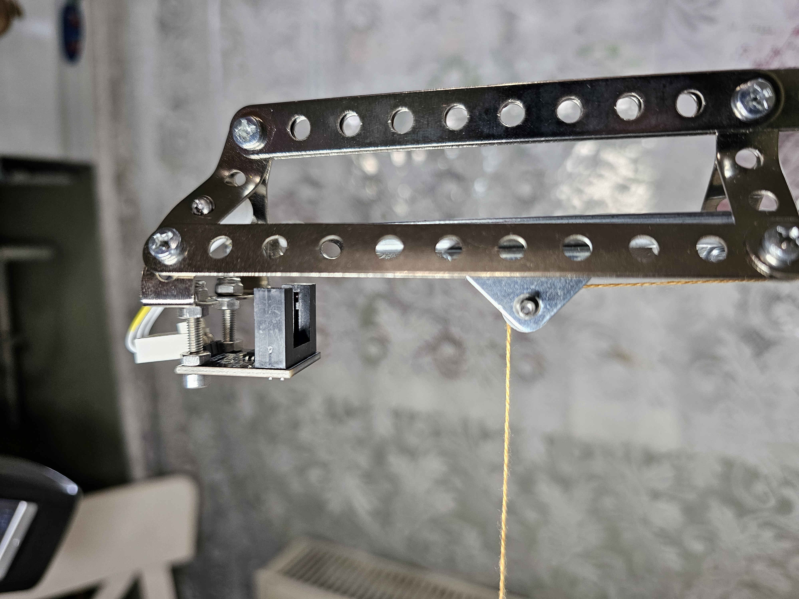
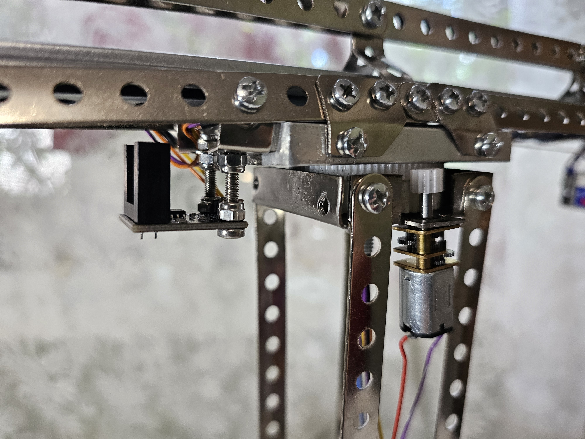
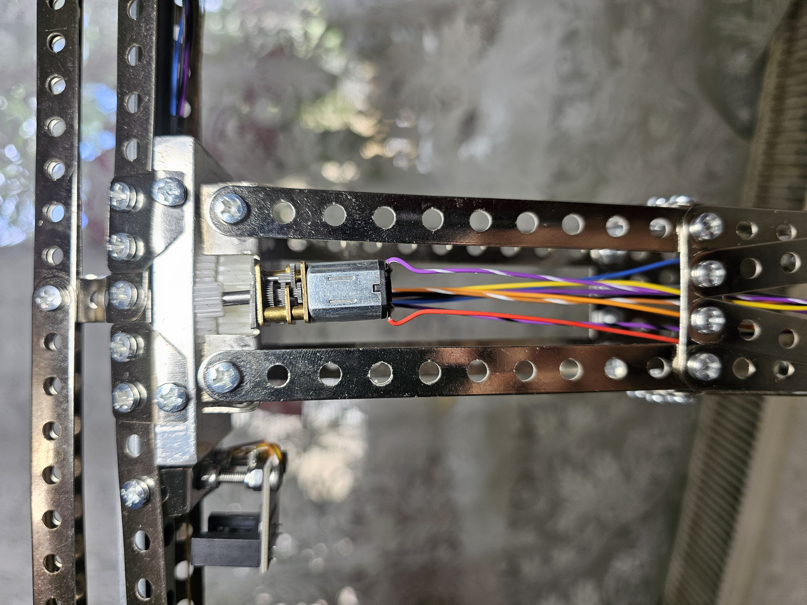
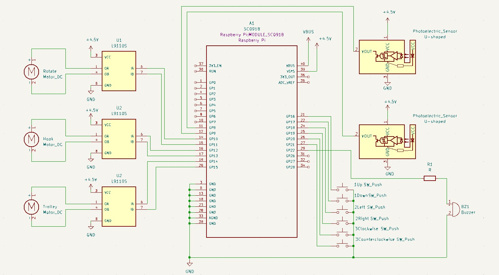

# Tower Crane

Directly from a construction site, miniaturized into a Rust motorized project.

:::info 

**Author**: TEODORESCU Ana Maria \
**GitHub Project Link**: https://github.com/UPB-FILS-MA/project-AnutaTeo

:::

## Description

The project represents a tower crane designed and build using metal parts. In order to achieve its full functionality, the crane is motorized by 3 motors to perform different movements. It has a 360 degrees rotational motion where the arm and the tower meet. This motion is powered by a small Micro Motor with reducer 1:298 that has around 25 rpm. A small rpm rate is necessary to ensure stability. The crane also has a trolley that moves back and forth along the jib. This motion is also powered by a small Micro Motor with reducer 1:298 to make sure that we can move the load without affecting the stability of the crane. The next movement is the hook extension that runs up and down to reach the required height for lifting objects. This motion is powered by a Micro Motor with reducer 1:200 that has around 100rpm.

Especially for the trolley movement, 2 photoelectric sensors are placed at both ends of the jib, in order to detect the presence of the oncoming trolley and redirecting it back. This ensures a continuously motion, without the risks of falling over the edge or getting stuck at the end.

There is also a buzzer that emits sounds whenever the crane is moving. All of these functionalities are ensured by the use of the Raspberry Pi Pico microcontroller and controlled by buttons.


## Motivation

I chose this project because since I was little I was very passionate by the construction field. The question "How do they manage to build those skyscrapers?" was always in my mind when I saw on TV those impressive tall buildings around the world or even residential blocks in my city. Now, having the opportunity to create this project, I can dive deep into the mystery of tower cranes, how do they work and how can they be stable when lifting heavy objects in the air. Using Pico microcontroller, motors, sensors, drivers, pulley wheels and also the software knowledge I learned programming in Rust during this course, I can achieve building and designing this miniature tower crane.

## Architecture 


The main components are:

Tower Crane: The structure is build using metal parts, bolts and nuts used in the construction of different toys.

Raspberry Pi Pico W: The microcontroller is the most important part that controls the motors, the sensors and the buzzer.

Micro Motors with reducer: Powers the movements of rotation, trolley and hook - connected to the Pico with motor drivers

Photoelectric sensors: Detects the oncoming trolley


Passive Buzzer: Emits a sound when the crane is moving

Buttons: The user can control the direction of the motor (up, down, static).

Power supply for all of the components

The sensors sends data to the Pico, which controls the motors through the motor drivers. The Pico connects to the buzzer when the motors are working. There are also 6 buttons connected to the Pico for giving the movement commands.

## Log

<!-- write every week your progress here -->

### Week 6 - 12 May

In this week I build the skeleton of the tower crane with all the srews and bolts and I bought the final components, as I found out that it required some new parts. 

### Week 13 - 19 May

In this week I made the kicad schematic and I connected all the hardware components on the breadboard and on the crane. I continued working on the mechanical part of the project, focusing on the movements (rotational, hook and trolley). I placed the sensors on the ends of the jib, the motors and the rotational mechanism with the plastic gears, also the string for the hook.

### Week 20 - 26 May

## Hardware

Raspberry Pi Pico W: main processing unit

Micro Motor GA12-N20 with reducer 1:200 with 10 mm Long Shaft: for the hook
2 Micro Motors JA12-N20 with reducer 1:298: for the trolley and rotation

2 L9110S Motor Drivers: connects the motors with the Pico

2 Miniature U-Shape Photoelectric Sensor: detects the trolley

Passive Buzzer 3.3V or 3V: emits a sound 

Battery Holder 3 x R6 for power supply

Plastic gears (different diameters) for rotational movement







### Schematics



### Bill of Materials

<!-- Fill out this table with all the hardware components that you might need.

The format is 
```
| [Device](link://to/device) | This is used ... | [price](link://to/store) |

```

-->

| Device | Usage | Price |
|--------|--------|-------|
| [Raspberry Pi Pico W](https://www.raspberrypi.com/documentation/microcontrollers/raspberry-pi-pico.html) | The microcontroller | [35 RON](https://www.optimusdigital.ro/en/raspberry-pi-boards/12394-raspberry-pi-pico-w.html) |
| [GA12-N20](https://www.handsontec.com/dataspecs/GA12-N20.pdf) | Micro Motor | [26 RON](https://www.optimusdigital.ro/ro/motoare-micro-motoare-cu-reductor/681-micro-motor-cu-reductor-ga12-n20-1200.html?search_query=Micro+Motor+GA12-N20+cu+Reductor+1%3A200+%C8%99i+Ax+de+10+mm&results=7) |
| 2x JA12-N20 | Micro Motor | [90 RON](https://www.optimusdigital.ro/ro/motoare-micro-motoare-cu-reductor/237-motor-cu-reductor-ja12-n20-.html?search_query=Micro+Motor+cu+Reductor+JA12-N20+1%3A298&results=2) |
| [Dual Motor Driver L9110s](https://www.laskakit.cz/user/related_files/l9110_2_channel_motor_driver.pdf) | 2x Motor driver | [8 RON](https://www.optimusdigital.ro/ro/drivere-de-motoare-cu-perii/480-driver-de-motoare-l9110s.html?search_query=Driver+de+Motoare+Dual+L9110S&results=2) |
| [2x U Shape Photoelectric Sensor](https://datasheet.octopart.com/PM-L54-Panasonic-datasheet-33007024.pdf)| Sensors | [14 RON](https://www.optimusdigital.ro/en/optical-sensors/599-senzor-fotoelectric-in-miniatura-in-forma-de-u.html) |
| [Passive Buzzer](https://components101.com/misc/buzzer-pinout-working-datasheet) | Passive Buzzer | [2 RON](https://www.optimusdigital.ro/ro/audio-buzzere/12247-buzzer-pasiv-de-33v-sau-3v.html) |
| 10x Pulley Wheel | Pulley Wheel | [10 RON](https://www.optimusdigital.ro/ro/mecanica-roti-scripete/406-roata-scripete-de-93-mm.html?search_query=Roata+Scripete+Alba+%CE%A69.3-2A&results=1) |
| Plastic Gear small | Plastic Gear | [2 RON](https://www.optimusdigital.ro/ro/mecanica-roti-dintate/2477-roata-dinata-din-plastic-m05-pentru-ax-d-de-3-mm.html?search_query=Roata+Din%C8%9Bata+din+Plastic+M0.5+pentru+Ax+D+de+3+mm&results=3) |
| Plastic Gear big| Plastic Gear | [3 RON](https://www.optimusdigital.ro/ro/mecanica-roti-dintate/980-roata-dinata-din-plastic-78-25a.html?search_query=Roata+Din%C8%9Bata+din+Plastic+78-2.5A&results=1) |
| 6x Buttons | Button | [3 RON](https://www.optimusdigital.ro/ro/butoane-i-comutatoare/1119-buton-6x6x6.html?search_query=Buton+6x6x6&results=1) |
| Battery Holder 3xR6 | Battery Holder | [4 RON](https://www.optimusdigital.ro/ro/suporturi-de-baterii/1090-suport-baterii-3-x-r6.html?search_query=Suport+baterii+3xR6&results=1) |
| [Male to male jumper wires](https://media.digikey.com/pdf/Data%20Sheets/Digi-Key%20PDFs/Jumper_Wire_Kits.pdf) | Wires | [7 RON](https://www.optimusdigital.ro/ro/fire-fire-mufate/884-set-fire-tata-tata-40p-10-cm.html?search_query=Fire+Colorate+Tata-Tata+%2840p%2C+10+cm%29&results=10) |


## Software

| Library | Description | Usage |
|---------|-------------|-------|
| [pwm](https://docs.rs/rp2040-hal/latest/rp2040_hal/pwm/index.html) | Pulse-width modulation | Used for controlling the buzzer |
| [embedded-hal](https://docs.rs/embedded-hal/latest/embedded_hal/) | Hardware abstraction library | Include support for GPIO, SPI, I2C, and more |


## Links

<!-- Add a few links that inspired you and that you think you will use for your project -->

1. [Robotic Tower Crane with Arduino, 3D printed and Lego-Compatible parts ](https://www.youtube.com/watch?v=wK85V26j7AA&ab_channel=TartRobotics)
2. [Model Tower Crane](https://www.instructables.com/Model-Tower-Crane-Project/)
3. [Crane from Cardboard](https://www.youtube.com/watch?v=vRyBKM3az6Y&ab_channel=AMFREEVIDEOS)
...
