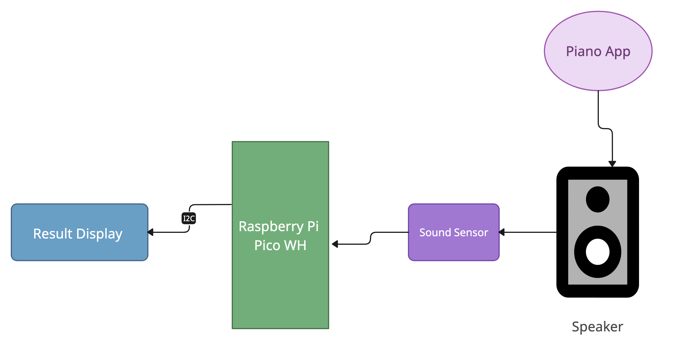
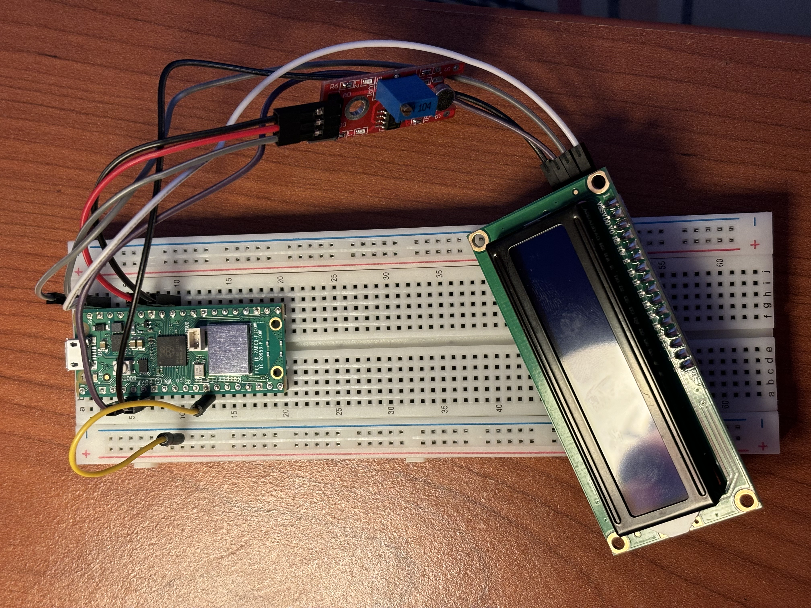
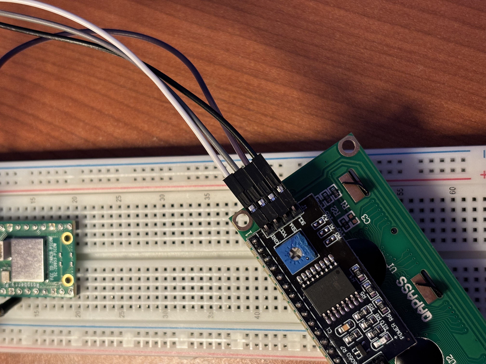
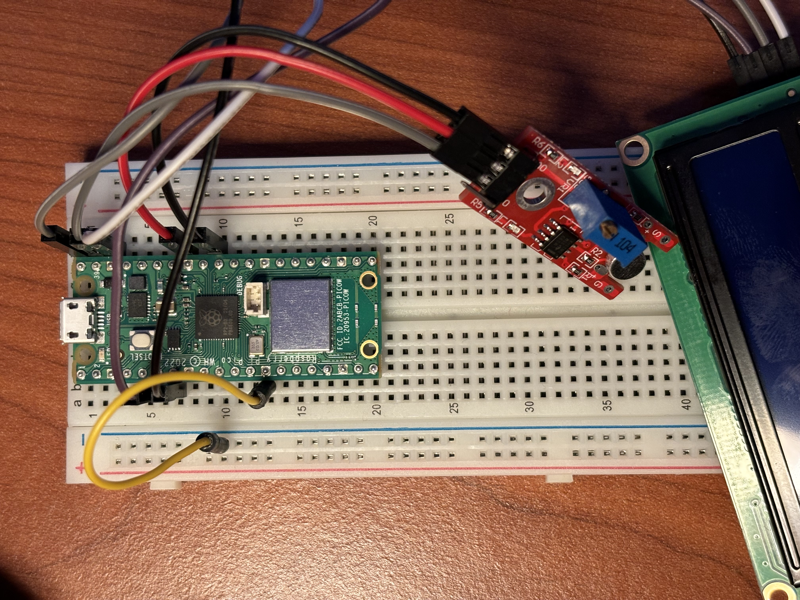
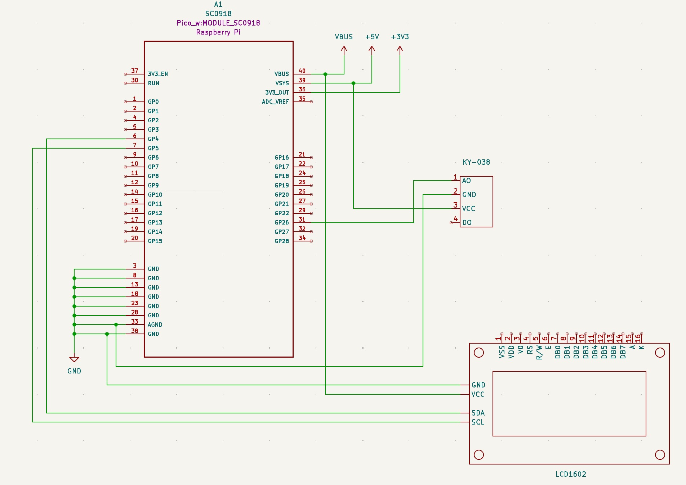
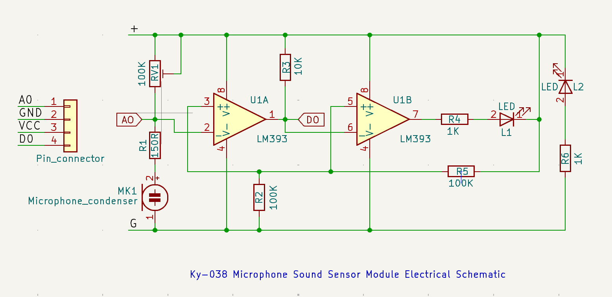

# Pitch Detector
An external musical note detector.

:::info 

**Author**: Ana-Alexia Alecu \
**GitHub Project Link**: https://github.com/UPB-FILS-MA/project-aleqbee

:::

## Description

This Raspberry Pi Pico project is designed to showcase the estimated frequency and corresponding musical note produced by an electronic keyboard or piano app. In this setup, I use the digital output of the Ky-038 microphone sound sensor module, transmitting it to one of the Raspberry Pi Pico's input pins. The process involves applying auto-correlation, weight calculations and tuning algorithms to identify the fundamental frequency using the initial three periods. This determined fundamental frequency is then compared against frequencies in octaves 3, 4 and 5 to detect the nearest pitch frequency. Finally, the identified musical note corresponding to the closest frequency is displayed on the LCD screen.

## Motivation

I saw this project as an opportunity to combine my two passions: music and technology. As a logical person, who finds Maths to be one of her favourite subjects, I knew that this kind of technical pursuit would allow me to use mathematics and physics. I quite enjoy signals and data processing, so alongside music, which is one of my hobbies, it seemed like it would make a perfect project for me. What is more, I have always been amazed by the vocal range finder applications, how they so accurately perceive and display the exact note you are singing, in a very fast manner and I would say this has been my main inspiration, which came to light when I was scrolling through the list of projects done in the previous years.

## Architecture 

The architecture components are the following:
- __Raspberry Pi Pico WH:__ The Raspberry Pi Pico acts as the main microcontroller board for the project. It runs the Rust program that interfaces with the peripherals and handles the pitch detection algorithm.
- __Microphone Sound Sensor:__ The microphone sound sensor captures audio input (sound) from the environment, in my case, from the speakers.
- __Speakers:__ The speakers output audio signals, such as generated piano notes corresponding to the detected pitch, from a piano app.
- __Piano app:__ It is an application used for playing some musical notes from given octave ranges to be registered by the speakers.
- __LCD:__ Connected to the Raspberry Pi Pico via I2C, the LCD1602 provides an interface for displaying the musical note detected, as well as the corresponding frquency.




## Log

<!-- write every week your progress here -->

### Week 6 - 12 May

### Week 7 - 19 May

### Week 20 - 26 May

## Hardware

The Raspberry Pi Pico microcontroller is perfect for this Pitch Detection project, as it requires a lot of computational power due to the signal processing. The Ky-038 microphone sound sensor module is used for capturing the sounds, emitted by a Piano App, through some PC Speakers. Although the hardware part of this project is not complex, as this technological endeavour does not rely on the hardware part, but rather on the software one, I believe it is still a challenging programming project that will help me develop my technical skills needed for my carrer.

The whole setup


The LCD 1602 I2C Module


The Ky-038 Sound Sensor Module



### Schematics

 



### Bill of Materials

<!-- Fill out this table with all the hardware components that you might need.

The format is 
```
| [Device](link://to/device) | This is used ... | [price](link://to/store) |

```

-->

| Device | Usage | Price |
|--------|--------|-------|
| [Raspberry Pi Pico WH](https://www.raspberrypi.com/documentation/microcontrollers/raspberry-pi-pico.html) | The microcontroller - used for its processing power | [57 RON](https://ardushop.ro/ro/home/2819-raspberry-pi-pico-wh.html?search_query=raspberry+pi+pico&results=985) |
| [1602 LCD with I2C Interface](https://www.orientdisplay.com/wp-content/uploads/2019/10/AMC1602AR-B-B6WTDW-I2C-specsheet.pdf) | Used for displaying the musical notes or pitches | [17 RON](https://www.optimusdigital.ro/en/lcds/2894-1602-lcd-with-i2c-interface-and-blue-backlight.html) |
| [Ky-038 Microphone Sound Sensor](https://kirig.ph/wp-content/uploads/2020/08/KY-038-Joy-IT.pdf) | Used for capturing the sound | [6 RON](https://www.bitmi.ro/modul-senzor-sunet-cu-microfon-ky-038-10658.html?gad_source=1&gclid=Cj0KCQjwltKxBhDMARIsAG8KnqVtOHJJyAnCysmzd026bh0o0Vw4qvzYcy5RNVwreSkt491DiR8epWsaAgojEALw_wcB) |
| [Kit Plusivo Microcontroller](https://www.plusivo.com/electronics-kit/88-plusivo-microcontroller-super-starter-kit-196-pcs.html) | The breadboard, jumper wires and male to female wires) | [75 RON](https://www.optimusdigital.ro/ro/kituri/12333-kit-plusivo-microcontroller-starter.html?search_query=plusivo+microcontroller+starter+kit&results=3) |
| [MB102 Breadboard Power Supply Module 3.3V/5V](https://components101.com/modules/5v-mb102-breadboard-power-supply-module) | The power supply | [5 RON](https://ardushop.ro/ro/home/40-modul-sursa-de-alimentare-5v-33v.html?gad_source=1&gclid=CjwKCAjw_LOwBhBFEiwAmSEQASEyvWtmmps6Ws3dCUTS4OcWVfv0u_nU3wKQxYoxGqLemFYc_rMQPxoCBSYQAvD_BwE) |
| PC Speakers | Used for emitting a powerful sound | [-] |


## Software

| Library | Description | Usage |
|---------|-------------|-------|
| [Embassy-rs](https://github.com/embassy-rs/embassy) | Rust framework for embedded programming | Used for programming the behavior of the Raspberry Pi Pico and for streamlining specific concepts within embedded programming |
| [ag-lcd](https://github.com/mjhouse/ag-lcd) | Rust port of the LiquidCrystal library | Used for writing to the lcd1602 |


## Links

<!-- Add a few links that inspired you and that you think you will use for your project -->

1. [My Weekend Project: Musical Note Detector Using An Arduino](https://www.youtube.com/watch?v=2n_JiXvBwsw)
2. [Voice Detection with Raspberry Pi Pico W](https://www.youtube.com/watch?v=qK2P7_a0Xzo&list=WL&index=7)
3. [PM Projects 2023](https://ocw.cs.pub.ro/courses/pm/prj2023)
4. [Vocal Range Finder Tool](https://singingcarrots.com/range-test)
...
