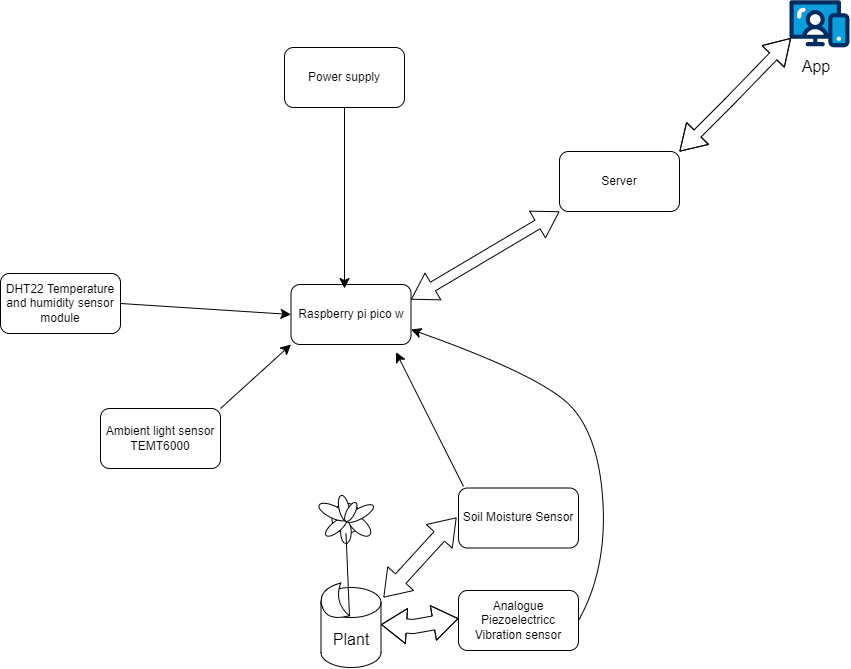
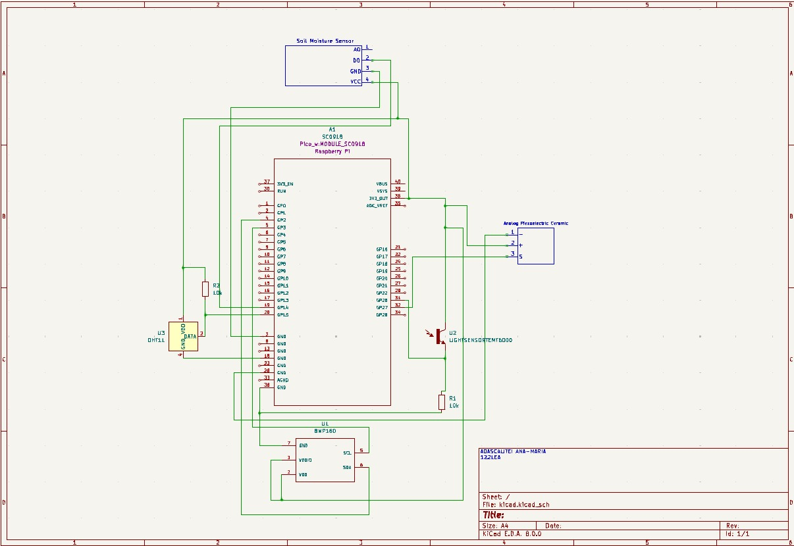

# GreenGuardian
A smart plant monitoring system

:::info 

**Author**: Ana-Maria Adascalitei \
**GitHub Project Link**: https://github.com/UPB-FILS-MA/project-AnaAdascalitei

:::

## Description

My project aims to keep track on the plants effortlessly. It provides comprehensive tracking of evironmental parameters such as soil moisture, ph levels, if there any bugs on the plant or inside it, but also ambient temperature and light intesity. By this, you can have optimal care for your plant and ensure the thrive of it with minimal effort.

## Motivation

The occasions when I've neglected plant care, or when my mother overlooked unfavorable room temperatures for plants, inspired me to seek a more convenient method for plant maintenance and reminders for when care is forgotten.

## Architecture 

Main components: 

Raspberry Pi Pico W - This is the microcontroller I will use for this project. It is responsible for gathering data from the sensors, processing it, and sending it to the server (which will eventually send it to the app).

Server - A component that receives the data from the microcontroller and stores it in a database. It will also send it to the app.

App - A mobile application that receives the data from the servers and informs the user about the plant. It will send alerts in case the plant needs water or if there should be a change in the plant's location.

SOIL MOISTURE SENSOR, HYGROMETER - It measures the soil moisture to determine if the plant needs water.

BMP180 Temperature and Pressure sensor module - This component provides crucial environmental data by measuring both temperature and atmospheric pressure. By monitoring changes in atmospheric pressure, we can detect alterations in weather patterns or room conditions, such as sudden temperature drops or fluctuations in air pressure, which could impact plant health and growth.

Ambient light sensor TEMT6000 -  This component will help us realize if there is enough light in the place for the plant during the day. If not, we will change the location.

Analogue Piezoelectric Vibration Sensor - This component detects vibrations. These vibrations will determine whether a bug has entered the plant or if a pet has disturbed the soil.

DHT22 Temperature and Humidity Sensor Module - This will give us the temperature and humidity of the place where the plant is. The temperature is not really needed since we already have BMP180, but the humidity will tell us if the place is humid enough.

The sensors from both the plant (humidity, vibration) and from the room (light, pressure, temperature, humidity) will be connected directly to the Raspberry Pi Pico W. The data will then be sent to the server and finally to the app.

The microcontroller is connected to a power supply so we can continuously receive data about the conditions of the plant.

## Log

<!-- write every week your progress here -->

### Week 6 - 12 May

This week was dedicated to advancing the GreenGuardian project. After thorough research to gather inspiration, I meticulously selected the necessary components and acquired a suitable plant for testing. Additionally, I commenced the schematic design using KiCad, a pivotal step towards materializing the project.

### Week 7 - 19 May

However this week, during the implementation phase, an unforeseen challenge arose. Upon realization that the Raspberry Pi Pico W lacked the required pins to connect to the breadboard, I promptly took corrective action by procuring the correct microcontroller. Despite proactive measures, there was a delay in the delivery of essential wires, which were expected to arrive by May 14th but were unfortunately still pending.

This setback necessitated a pause in the physical execution of the project, as the absence of crucial components hindered progress. Nonetheless, this period provided an opportunity for reevaluation and meticulous planning to ensure seamless project execution once all components are available.

### Week 7 - 19 May

### Week 20 - 26 May

## Hardware

The hardware setup for the GreenGuardian project encompasses a comprehensive array of components tailored to ensure effective plant monitoring. 

Key components include various sensors responsible for monitoring critical parameters such as soil moisture, temperature, humidity, atmospheric pressure, ambient light, and vibrations. These sensors, in conjunction with the Raspberry Pi Pico W microcontroller, form the backbone of the monitoring system.

Additionally, a dedicated power supply unit is incorporated to ensure uninterrupted operation of the system. This power supply is meticulously designed to provide continuous power, enabling real-time updates and notifications regarding the plant's health status. Whether it's alerting about the need for watering or detecting potential pest intrusions, the power supply ensures that the system remains operational around the clock, safeguarding the well-being of the plant.

### Schematics

Detail in a few words the hardware used.

### Schematics

Place your KiCAD schematics here.

### Bill of Materials

| Device | Usage | Price |
|--------|--------|-------|
| [Rapspberry Pi Pico W](https://www.raspberrypi.com/documentation/microcontrollers/raspberry-pi-pico.html) | The microcontroller | [34.5 RON](https://www.optimusdigital.ro/en/raspberry-pi-boards/12394-raspberry-pi-pico-w.html) |
| [Alimentator micro-usb 5V/3A](https://www.emag.ro/alimentator-micro-usb-5v-3a-hs0276/pd/DFJ4THMBM/) | The power supply | [29 RON](https://www.emag.ro/alimentator-micro-usb-5v-3a-hs0276/pd/DFJ4THMBM/) |
| [SOIL MOISTURE SENSOR, HYGROMETER](https://lastminuteengineers.com/soil-moisture-sensor-arduino-tutorial/) | Sensor | [7.29 RON](https://www.sigmanortec.ro/Senzor-umiditate-sol-higrometru-p125814620?gad_source=1&gclid=Cj0KCQjwudexBhDKARIsAI-GWYXGicLaV454gukJto0U3L1IDuU7N3dE_WxiYuYbR0pdp2Ox946WPMwaArYfEALw_wcB) |
| [Analogue Piezoelectric Vibration Sensor](https://wiki.keyestudio.com/Ks0272_keyestudio_Analog_Piezoelectric_Ceramic_Vibration_Sensor) | Sensor | [9.39 RON](https://www.optimusdigital.ro/ro/senzori-de-vibraii/8249-senzor-de-vibraii-piezoelectric-analogic.html) |
| [BMP180 Temperature and Pressure sensor module](https://cdn-shop.adafruit.com/datasheets/BST-BMP180-DS000-09.pdf) | Sensor | [6.98 RON](https://www.optimusdigital.ro/ro/senzori-senzori-de-presiune/149-modul-senzor-de-temperatura-si-presiune-bmp180.html?gad_source=1&gclid=Cj0KCQjwudexBhDKARIsAI-GWYXQ68XuanU0Fj4nSUeFhcqsyLRhLE3Z7uuvnoqYVH0o3xS1I89QjH4aAmWdEALw_wcB) |
| [Ambient light sensor TEMT6000](https://www.vishay.com/docs/81579/temt6000.pdf) | Sensor | [9.54 RON](https://ardushop.ro/ro/home/1290-senzor-lumina-ambientala-temt6000.html?gad_source=1&gclid=Cj0KCQjwudexBhDKARIsAI-GWYX15byKNkAdoOsKDJThdU8gESRelgwfZlQcGv04jr3jS9_2ZAtI1_caArzuEALw_wcB) |
| [DHT22 Temperature and Humidity Sensor Module](https://www.waveshare.com/wiki/DHT22_Temperature-Humidity_Sensor) | Sensor | [23.12 RON](https://www.optimusdigital.ro/ro/senzori-senzori-de-temperatura/1449-modul-senzor-de-temperatura-i-umiditate-dht22.html?gad_source=1&gclid=Cj0KCQjwudexBhDKARIsAI-GWYX2l_sgwbYXbCA5XcIhaypPaPie0vliKXPyyUP1BQktOMuGz81nukIaAlatEALw_wcB) |
| [Set of 40 Arduino wire, Male-Male, 30 cm, Multicolor](https://www.circuitrework.com/guides/6-1.html) | Electrical connections | [15.59 RON](https://www.emag.ro/set-40-cabluri-arduino-male-male-30-cm-multicolor-5904162803453/pd/DF8RKLMBM/?cmpid=87002&utm_source=google&utm_medium=cpc&utm_campaign=(RO:Whoop!)_3P-Y_%3e_Jucarii_hobby&utm_content=79559830074&gad_source=1&gclid=Cj0KCQjwudexBhDKARIsAI-GWYWt9SsCZzii9k1LJHTSBMOah2oDdkI7yTfMZakFptJvrMiHOxyWc_waAiHjEALw_wcB) |
| [RESISTORS KIT 30 VALUES, 600 PIECES, 1/4W, 10R-1M](https://workforce.libretexts.org/Bookshelves/Electronics_Technology/Book%3A_Electric_Circuits_I_-_Direct_Current_(Kuphaldt)/02%3A_Ohm's_Law/2.05%3A_Resistors) | The power supply | [22.61 RON](https://www.sigmanortec.ro/kit-rezistori-30-valori-20-bucati?gad_source=1&gclid=Cj0KCQjwudexBhDKARIsAI-GWYXVwR8WoacJF0ZDAr3WXUoq8JFBMFJ1A5L4YkYdOBCkjGcvHLX43U4aAoM9EALw_wcB) |

## Software

| Library | Description | Usage |
|---------|-------------|-------|
| [embassy-net](https://github.com/embassy-rs/embassy) | Networking for embedded systems| This library will help me send data from the Rapspberry Pi Pico W to the app |
| [embassy_rp](https://github.com/embassy-rs/embassy) | GPIO library for Raspberry Pi Pico | This will help me access GPIO pins such as SPI, I2C, PWM. |
| [dht-sensor](https://github.com/michaelbeaumont/dht-sensor) | Library for dht sensor | Rust library designed for interfacing with DHT sensors. |

## Links

1. [Garduino](https://ocw.cs.pub.ro/courses/pm/prj2023/apredescu/garduino)
2. [lPlant Watcher](https://ocw.cs.pub.ro/courses/pm/prj2023/alexau/plantwatcher)
3. [Sistem Monitorizare Plante](https://ocw.cs.pub.ro/courses/pm/prj2023/gpatru/bogdan.brutaru)
4. [Sistem intretinere plante](https://ocw.cs.pub.ro/courses/pm/prj2022/abirlica/sistem_intretinere_plante)