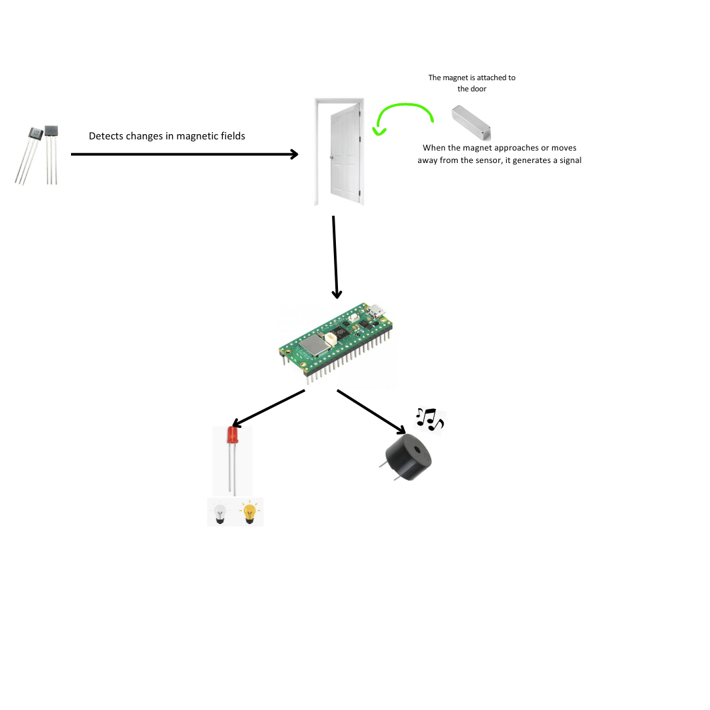
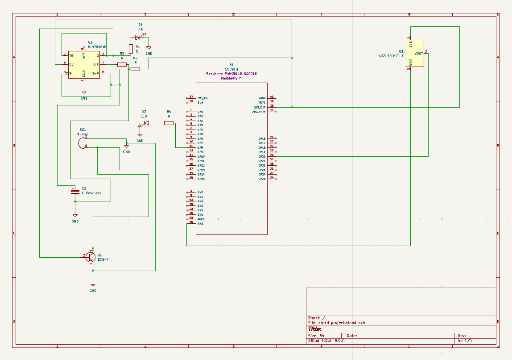
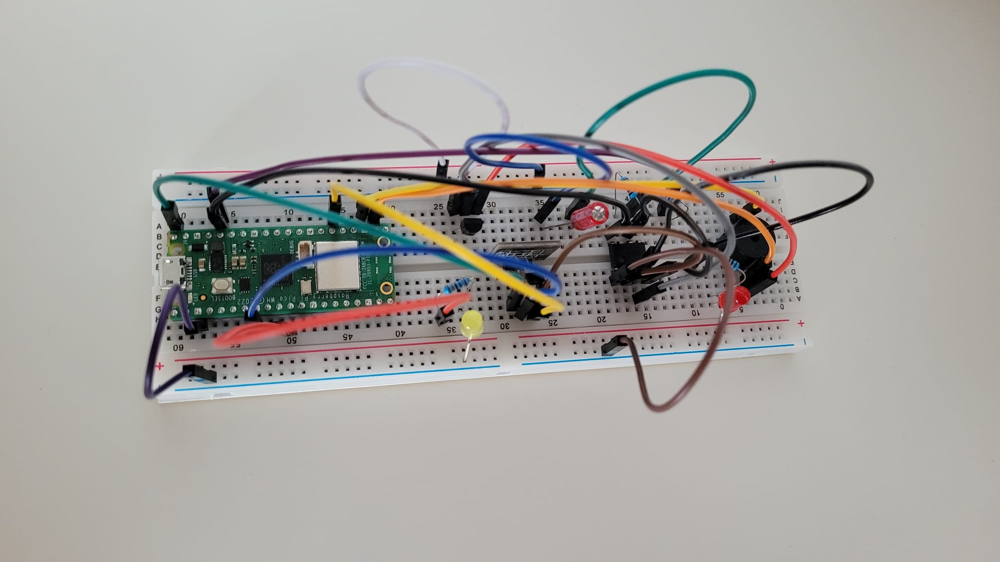
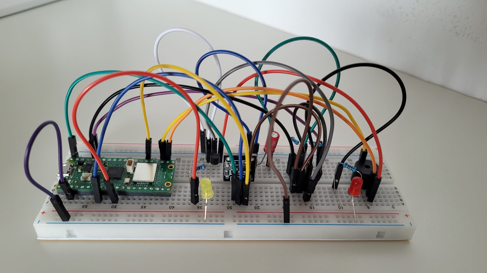

# Magnetic Door Alarm System
A simple security device

:::info

**Author**: Băluțoiu Ana-Maria \
**GitHub Project Link**: https://github.com/UPB-FILS-MA/project-arshiii16

:::

## Description

The magnetic door alarm is a simple security device that alerts you when a door is opened. It works by using a Hall Effect sensor to detect the presence of a magnet (usually 
attached to the door) and triggers an alarm (such as a buzzer) when the magnetic field changes (i.e., when the door opens). The alarm serves as a warning or deterrent against unauthorized access.

## Motivation

I chose this project because it is straightforward and doesn’t require complex components or intricate circuitry. The Hall Effect sensor, 555 timer IC, and a few other basic components are affordable and readily available. Also, I think everybody wants to know when someone opens the doors around the house, whether it’s for security reasons or just to keep track of household activity. This alarm serves that purpose efficiently. Finally, it’s a great way to learn about basic electronics, sensors, and timers.

## Architecture 

Here’s a description of the system components and their interactions:

1) Hall Effect Sensor:
    The Hall Effect sensor is the input component that detects changes in magnetic fields.
    When a magnet (such as the door magnet) approaches or moves away from the sensor, it generates a signal.
    The sensor’s output is a digital signal (high or low) indicating whether the door is open or closed.
2) Raspberry Pi Pico (Microcontroller):
    The Raspberry Pi Pico serves as the central processing unit (CPU) for the system.
    It reads the output from the Hall Effect sensor.
    Based on the sensor input, the Pico decides whether to trigger the alarm or keep it silent.
    The Pico can also control other components, such as the buzzer and LED.
3) Alarm Logic:
    The Pico runs a simple program (written in Rust) that monitors the Hall Effect sensor.
    If the sensor detects the door opening (magnet moving away), the Pico activates the alarm.
    If the sensor detects the door closing (magnet approaching), the Pico deactivates the alarm.
    The alarm logic ensures that the system responds appropriately to door movements.
4) Buzzer and LED:
    The buzzer and LED are output components.
    When the alarm is triggered (door opens), the Pico activates the buzzer to produce an audible sound.
    Simultaneously, the LED lights up to provide a visual indication of the alarm state.
    When the door closes, the Pico turns off the buzzer and LED.
Connections:
The Hall Effect sensor connects to a GPIO pin on the Pico.
The buzzer and LED connect to other GPIO pins.
The Pico’s Rust program reads the sensor input, controls the buzzer and LED, and manages the alarm state.

## Log

<!-- write every week your progress here -->

### Week 6 - 12 May
Hardware Design:
I selected necessary components, including the Hall Effect sensor, a 555 timer IC, a buzzer, resistors, two LEDs, a capacitor, a transistor.
Circuit Design: 
Created a circuit diagram connecting the components.

### Week 7 - 19 May
Software Setup: 
Opened KiCad and created a new project.
Component Placement: 
Added components from the hardware design to the schematic and connected them according to the circuit diagram.
### Week 20 - 26 May

## Hardware

The magnetic door alarm project uses the following hardware components:

1) Hall Effect Sensor (3144): Detects the presence of a magnet (door open).
2) 555 Timer IC: Generates an adjustable alarm tone.
3) Buzzer: Produces the alarm sound.
4) LED: Provides visual indication.
5) Transistor (BC547): Controls the 555 timer.
6) Magnet: Attached to the door frame.
7) Reed Switch: Mounted on the door itself.
7) Raspberry Pi: It will serve as the brain of this project, allowing the user to control the alarm system, read sensor data, and execute the alarm logic.
These components work together to create a simple yet effective door alarm system.

### Schematics
This is the Kicad Schematic:

Here are some photos of the hardware:

### Bill of Materials

| Device | Usage | Price |
|--------|--------|-------|
| [Raspberry Pi Pico W](https://www.raspberrypi.com/documentation/microcontrollers/raspberry-pi-pico.html) | The microcontroller | [35 RON](https://www.optimusdigital.ro/en/raspberry-pi-boards/12394-raspberry-pi-pico-w.html) |
| [LED 5 mm](https://www.optimusdigital.ro/ro/optoelectronice-led-uri/37-led-galben.html?search_query=led&results=818) | Provides visual indication. | [0.39 RON](https://www.optimusdigital.ro/ro/optoelectronice-led-uri/37-led-galben.html?search_query=led&results=818) |
| [Hall Effect Sensor (3144)](https://ardushop.ro/ro/electronica/483-senzor-magnetic-hall-a3144.html?gad_source=1&gclid=CjwKCAjw88yxBhBWEiwA7cm6pcTJfPkq9zg1-BR94EmOeKQr0mzdFMify2V8sOvuPWqg-Te-TSuL4BoCO6YQAvD_BwE) | Detects the presence of a magnet(door open). | [3.21 RON](https://ardushop.ro/ro/electronica/483-senzor-magnetic-hall-a3144.html?gad_source=1&gclid=CjwKCAjw88yxBhBWEiwA7cm6pcTJfPkq9zg1-BR94EmOeKQr0mzdFMify2V8sOvuPWqg-Te-TSuL4BoCO6YQAvD_BwE) |
| [555 Timer IC](https://docs.rs-online.com/ae11/A700000009214226.pdf) | Generates an adjustable alarm tone. | [2.41 RON](https://ardushop.ro/ro/electronica/199-ic-timer-555.html?search_query=NE555&results=7) |
| [Buzzer](https://www.farnell.com/datasheets/2171929.pdf) | Produces the alarm sound. | [3.33 RON](https://quintrix.ro/buzzer-activ-12v-arduino-raspberry?search=buzzer) |
| [Transistor (BC547)](https://www.farnell.com/datasheets/410427.pdf) | Controls the 555 timer. | [1.68 RON](https://quintrix.ro/index.php?route=product/product&product_id=8438&search=BC547) |
| [Reed Switch](https://en.wikipedia.org/wiki/Reed_switch) | Mounted on the door itself. | [1.49 RON](https://www.optimusdigital.ro/en/buttons-and-switches/3899-normally-open-magnetic-reed-switch-2x14-mm.html) |
| [10uF Capacitor (C1)](https://www.emag.ro/condensator-electrolitic-10uf-50v-dc-105-c-samxon-km-10u-50v-t128611/pd/DDYYNXMBM/?cmpid=101180&utm_source=google&utm_medium=cpc&utm_campaign=(RO:eMAG!)_3P_NO_SALES_%3e_Iluminat_and_electrice&utm_content=76376892625&gad_source=1&gclid=CjwKCAjw88yxBhBWEiwA7cm6pd9ThOIVmEhijwZhV7bZUx1GJTYeP-z-NqkZEjqQCJ8S-3f6G47xSRoCUpoQAvD_BwE) | Connected to pin 2 of the 555 timer. | [4.41 RON](https://www.emag.ro/condensator-electrolitic-10uf-50v-dc-105-c-samxon-km-10u-50v-t128611/pd/DDYYNXMBM/?cmpid=101180&utm_source=google&utm_medium=cpc&utm_campaign=(RO:eMAG!)_3P_NO_SALES_%3e_Iluminat_and_electrice&utm_content=76376892625&gad_source=1&gclid=CjwKCAjw88yxBhBWEiwA7cm6pd9ThOIVmEhijwZhV7bZUx1GJTYeP-z-NqkZEjqQCJ8S-3f6G47xSRoCUpoQAvD_BwE) |
| [50k Potentiometer (RV1)](https://www.optimusdigital.ro/en/potentiometers/1885-50k-mono-potentiometer.html?search_query=50k&results=72) | Adjusts the alarm frequency. | [1.49 RON](https://www.optimusdigital.ro/en/potentiometers/1885-50k-mono-potentiometer.html?search_query=50k&results=72) |

## Software

| Library | Description | Usage |
|---------|-------------|-------|
| [rppal](https://github.com/golemparts/rppal) | Raspberry Pi Peripheral Access Library | Provides an interface for accessing various Raspberry Pi peripherals |
| [panic-halt](https://github.com/korken89/panic-halt) | panic handler that halts the program | Used to handle panics gracefully |

## Links

1. [Idea](https://www.kjmagnetics.com/blog.asp?p=raspberry-pi-alarm)
2. [Step by step help](https://www.makeuseof.com/how-to-make-an-intruder-alarm-with-raspberry-pi-pico/)
3. [Visual representation](https://www.youtube.com/watch?v=0XNt2bBGI0s&ab_channel=JohnGallaugher)
