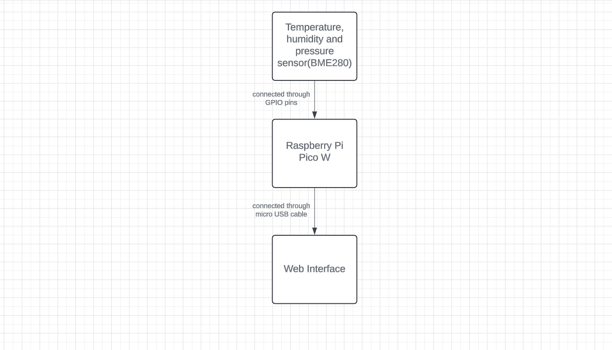

# Wireless Weather Station
 A wireless weather station transmitting temperature, humidity, and pressure readings to a web interface.

:::info 

**Author**: Ana-Maria Batagoi \
**GitHub Project Link**: https://github.com/UPB-FILS-MA/project-anabat27

:::

## Description

This project aims to design and implement a comprehensive weather monitoring system utilizing the Raspberry Pi Pico W microcontroller and Rust programming language. It involves integrating temperature, humidity, and pressure sensors to gather environmental data, which is then transmitted wirelessly to a web interface. Users can access this interface from any device with a web browser to view real-time weather conditions, enabling remote monitoring and analysis for various applications.

## Motivation

I chose this project because it combines several interesting elements: microcontroller programming with the Raspberry Pi Pico W, coding in Rust, sensor integration for environmental data collection, and web development for creating a user interface. Additionally, building a weather station provides practical applications for monitoring weather conditions, which can be useful for personal or educational purposes. Overall, it's a challenging and rewarding project that encompasses a range of skills and technologies.

## Architecture 
 
 Main components:

Sensor Interface Module:
This consists of the BME280, which is a sensor that integrates all three measuraments(temperature, pressure and humidity).

Data Processing Module:
 The data processing module primarily consists of the microcontroller (Raspberry Pi Pico W) itself. It handles the processing of raw sensor data, including tasks such as data filtering, calibration, and conversion.

Data Transmission Module:
 For wireless transmission, this module typically includes the Wi-Fi capabilities of the Raspberry Pi Pico W. The Pico W has built-in Wi-Fi connectivity, allowing it to connect to your local Wi-Fi network and transmit data to a web server or cloud platform.

User Interface Module:
The user interface module primarily consists of the web server  where the weather station data is transmitted and displayed.
 
How they connect:
Sensor Interface Module to Data Processing Module: The BME280 is connected to the Raspberry Pi Pico W through GPIO pins.
Data Processing Module to User Interface Module:The Raspberry Pi Pico W is connected to the web interface using a micro USB cable.

## Log

### Week 6 - 12 May

### Week 7 - 19 May

### Week 20 - 26 May

## Hardware

Raspberry Pi Pico W: The main microcontroller board that will control the operation of the weather station and handle communication with sensors.

BME280 Sensor Module: This sensor module integrates temperature, humidity, and pressure sensors into one unit, simplifying the hardware setup. It communicates with the Raspberry Pi Pico W using the I2C communication protocol.

Micro USB Cable: To connect the Raspberry Pi Pico W to the computer for programming and development.

Breadboard and Jumper Wires: For prototyping and connecting the components together.

### Schematics

Place your KiCAD schematics here.

### Bill of Materials

| Device | Usage | Price |
|--------|--------|-------|
| [Raspberry Pi Pico W](https://www.raspberrypi.com/documentation/microcontrollers/raspberry-pi-pico.html) | The microcontroller | [35 RON](https://www.optimusdigital.ro/en/raspberry-pi-boards/12394-raspberry-pi-pico-w.html) |
| [BME280](https://cdn-shop.adafruit.com/datasheets/BST-BME280_DS001-10.pdf) | The sensor | [74 RON](https://www.optimusdigital.ro/ro/senzori-senzori-de-presiune/5649-modul-senzor-barometric-de-presiune-bme280.html?search_query=bme280&results=9) |
| [Micro USB Cable](https://www.optimusdigital.ro/en/usb-cables/4576-cablu-albastru-micro-usb.html?search_query=usb+to+micro+usb&results=516) | To power the Raspberry Pi Pico W | [3 RON](https://www.optimusdigital.ro/en/usb-cables/4576-cablu-albastru-micro-usb.html?search_query=usb+to+micro+usb&results=516) |
| [Breadbord](https://www.bitmi.ro/breadboard-400-puncte-pentru-montaje-electronice-rapide-10633.html?msclkid=51a52b4d40b3124cdde24d7ada3ea044) | To assembly the prototype | [8 RON](https://www.bitmi.ro/breadboard-400-puncte-pentru-montaje-electronice-rapide-10633.html?msclkid=51a52b4d40b3124cdde24d7ada3ea044) |
| [Male-to-male Wires](https://www.optimusdigital.ro/ro/fire-fire-mufate/889-set-fire-tata-tata-10p-20-cm.html) | To connect | [5 RON](https://www.optimusdigital.ro/ro/fire-fire-mufate/889-set-fire-tata-tata-10p-20-cm.html) |
| [Male-to-female Wires](https://www.optimusdigital.ro/ro/fire-fire-mufate/214-fire-colorate-mama-mama-10p.html?search_query=fire+mama+tata&results=37) | To connect | [4 RON](https://www.optimusdigital.ro/ro/fire-fire-mufate/214-fire-colorate-mama-mama-10p.html?search_query=fire+mama+tata&results=37) |
| [Female-to-female Wires](https://www.optimusdigital.ro/ro/fire-fire-mufate/214-fire-colorate-mama-mama-10p.html?search_query=fire+mama+mama&results=61) | To connect | [4 RON](https://www.optimusdigital.ro/ro/fire-fire-mufate/214-fire-colorate-mama-mama-10p.html?search_query=fire+mama+mama&results=61) |

## Software

| Library | Description | Usage |
|---------|-------------|-------|
| [embassy-hal](https://github.com/embassy-rs/embassy) | Embassy hardware abstraction layer | Used to provide a hardware abstraction layer (HAL) for embedded systems |
| [embassy](https://github.com/embassy-rs/embassy) | Asynchronous embedded applications | Used to write efficient, reliable, and scalable embedded applications |
| [embassy-net](https://github.com/embassy-rs/embassy) | Networking support for embedded applications |Used to simplify the implementation of networking functionality in embedded Rust applications |

## Links

1. [Raspberry Pi Pico W:Wireless Weather Station](https://www.youtube.com/watch?v=3q807OdvtH0&t=65s)
...
