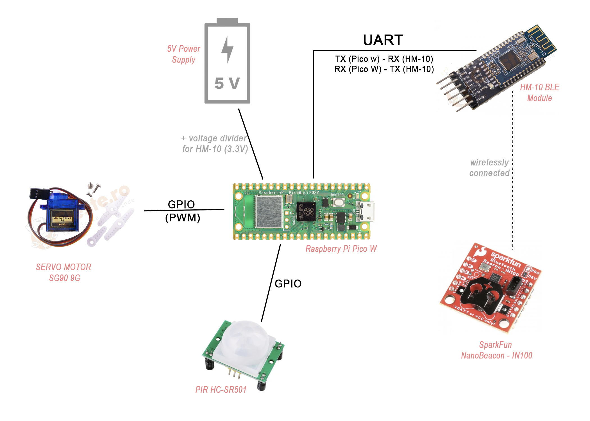

# Smart Pet Door    
A smart pet door that unlocks automatically when a registered pet approaches.

:::info 

**Author**: Uritu Andra-Ioana \
**GitHub Project Link**: https://github.com/UPB-FILS-MA/project-andrauritu

:::

## Description

The Smart Pet Door project is designed to provide pets with the freedom to enter the home while ensuring security against unregistered animals. It utilizes a combination of BLE beacon technology and an infrared motion sensor to detect and authenticate a pet's approach and to automatically manage access.
## Motivation

This project idea actually came from my mom. Our family cat, admittedly not the sharpest tool in the shed, has struggled with using traditional pet houses. Every time we tried giving him one, other neighborhood cats would take it over. They’d get inside, eat his food, and leave him outside, especially when it rained and we weren't home to let him in. To help him have a place of his own, my mom thought a smart pet door would be really useful. This system uses a beacon-based entry mechanism that ensures only our cat can enter, preventing other animals from accessing his shelter and food. This door not only promises to give our beloved but intellectually challenged cat the comfort and security he deserves but also offers peace of mind, knowing he has access to his own space, regardless of whether we are home to assist him.

## Architecture 

 
The system consists of the following main components:
- **Infrared Sensor**: Detects movement near the door.
- **Raspberry Pi Pico W**: Acts as the central processing unit, interpreting signals from the infrared sensor and controlling the other components.
- **HM-10 BLE Module**: Handles Bluetooth communication to scan for the NanoBeacon worn by the pet.
- **Servomotor**: Operates the locking mechanism of the door.
- **NanoBeacon IN100**: The beacon worn by the pet, which is scanned by the HM-10 module.

### System Operation
1. The **Infrared Sensor** detects motion near the door and signals this to the **Raspberry Pi Pico W**.
2. The **Raspberry Pi Pico W**, upon receiving the motion alert, instructs the **HM-10 BLE Module** to scan for the NanoBeacon.
3. If the **HM-10 BLE Module** detects the NanoBeacon within a predetermined range, it communicates this back to the **Raspberry Pi Pico W**.
4. The **Raspberry Pi Pico W** then commands the **Servomotor** to unlock the door.
5. The door remains unlocked for 10 minutes, after which it re-locks automatically unless the **Infrared Sensor** detects additional movement, prompting the door to stay unlocked or re-scan for the beacon.


## Log

<!-- write every week your progress here -->

### Week 6 - 12 May

### Week 7 - 19 May

### Week 20 - 26 May

## Hardware
- **Raspberry Pi Pico W**: The microcontroller, coordinating all device interactions.
- **NanoBeacon IN100**: Worn by the cat, programmed with a unique UUID for door access.
- **CP2102 USB-to-Serial Module**: Used in initial setup for programming the NanoBeacon.
- **Infrared Sensor**: Detects motion near the door to activate the system.
- **HM-10 BLE Module**: Enables Bluetooth communication to scan for the beacon on the cat.
- **Servomotor**: Controls the lock mechanism of the pet door, switching between locked and unlocked.
- **USB Cable**: Connects and powers the Raspberry Pi Pico W and the CP2102 during setup.
- **Power Supply**: An external battery to keep the system running independently.


### Schematics

Place your KiCAD schematics here.

### Bill of Materials

<!-- Fill out this table with all the hardware components that you might need.

The format is 
```
| [Device](link://to/device) | This is used ... | [price](link://to/store) |

```

-->

| Device | Usage | Price |
|--------|-------|-------|
| [Raspberry Pi Pico WH](https://www.raspberrypi.com/documentation/microcontrollers/raspberry-pi-pico.html) | Acts as the central controller | [38.99 RON](https://www.optimusdigital.ro/ro/placi-raspberry-pi/12395-raspberry-pi-pico-wh.html?search_query=pico+wh&results=32) |
| [HM-10 BLE Module](https://people.ece.cornell.edu/land/courses/ece4760/PIC32/uart/HM10/DSD%20TECH%20HM-10%20datasheet.pdf) | For scanning the NanoBeacon | [35.47 RON](https://cleste.ro/modul-bluetooth-4-0-ble.html) |
| [IN100 NanoBeacon](https://cdn.sparkfun.com/assets/3/d/5/5/1/IN100-Datasheet.pdf) | Attached to the pet’s collar | [44 RON](https://www.robofun.ro/wireless/breakout-sparkfun-nanobeacon-in100.html) |
| [Servomotor](https://datasheetspdf.com/pdf-down/S/G/9/SG90-TowerPro.pdf) | Operates the door lock | [12.72 RON](https://cleste.ro/motor-servo-sg90-9g.html) |
| [PIR Sensor HC-SR501](https://www.mpja.com/download/31227sc.pdf) | Detects motion at the door | [5.25 RON](https://www.robofun.ro/pir/hc-sr501-pir-motion-sensor-module-green.html) |


## Software

| Library | Description | Usage |
|---------|-------------|-------|
|[embassy-executor](https://docs.embassy.dev/embassy-executor/git/std/index.html)|Asynchronous executor for Rust embedded systems| Used for task scheduling and asynchronous programming|
|[embassy-time](https://embassy.dev/book/dev/time_keeping.html)|Time management library  |Used for time-based operations such as delays |
|[embassy-rp](https://docs.embassy.dev/embassy-rp/git/rp2040/index.html)| Peripheral access library |Used for initializing and interacting with peripherals |
| [serialport](https://github.com/serialport/serialport-rs) | A Rust library for working with serial ports. | Used to communicate with the HM-10 BLE module for beacon scanning and Bluetooth communication. |
| [rppal](https://docs.rs/rppal/latest/rppal/) | Raspberry Pi peripheral access library for Rust. | Utilizes GPIO, I2C, and PWM interfaces on the Raspberry Pi Pico W for interacting with sensors and the servomotor. |
| [HMSoft V540](http://www.jnhuamao.cn/download_rom_en.asp?id=) | The firmware download files for the HM-10 BLE module. | I will try to use the  HM-10 HMSoft CC2541 WeChat Airsync V540 firmware upgrade file [2016-11]. |
| [NanoBeacon Config tool](https://inplay-tech.com/nanobeacon-config-tool) | The tool to configure the NanoBeacon's UUID and characteristics. | I will set up the IN-100 using this and then search for the specific configurations with the HM-10 module. |

## Links

1. https://www.martyncurrey.com/hm-10-bluetooth-4ble-modules/
2. https://forum.arduino.cc/t/how-to-make-an-ibeacon-detector-with-arduino/278665/68
3. https://engineering.fresnostate.edu/research/bulldogmote/documents/11.%20HM10%20BLE_FTDI.pdf
4. https://magpi.raspberrypi.com/articles/raspberry-pi-cat-flap