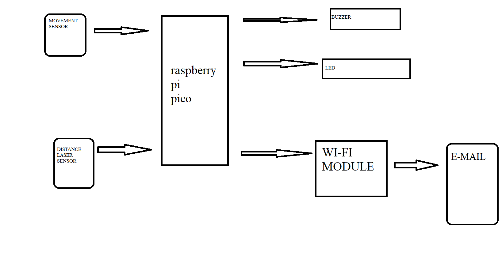
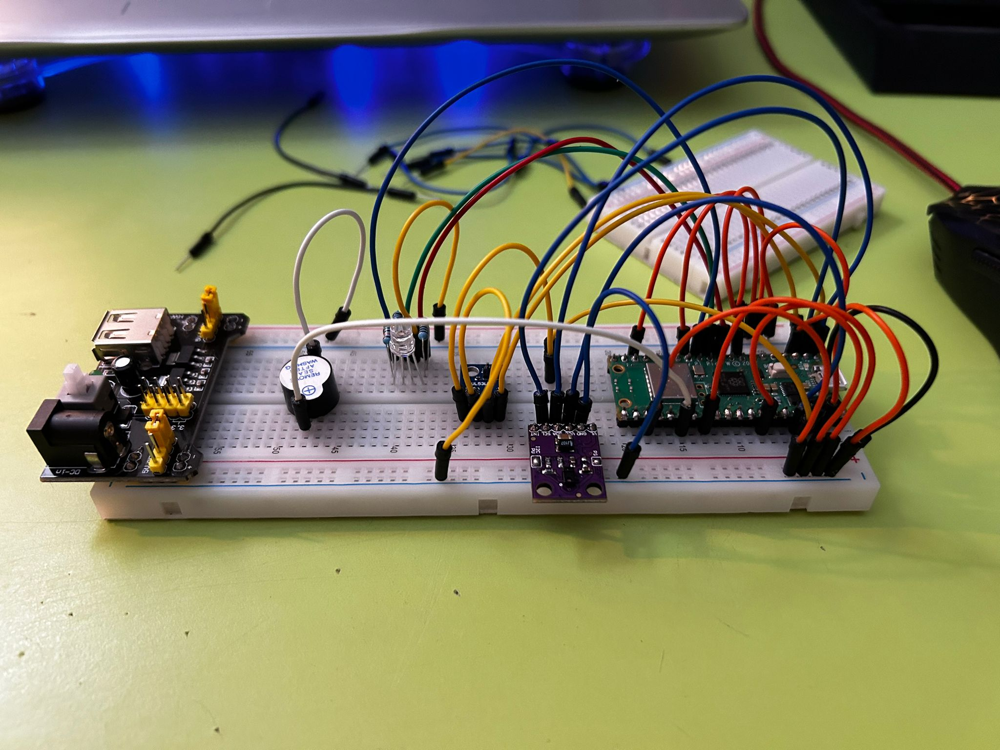
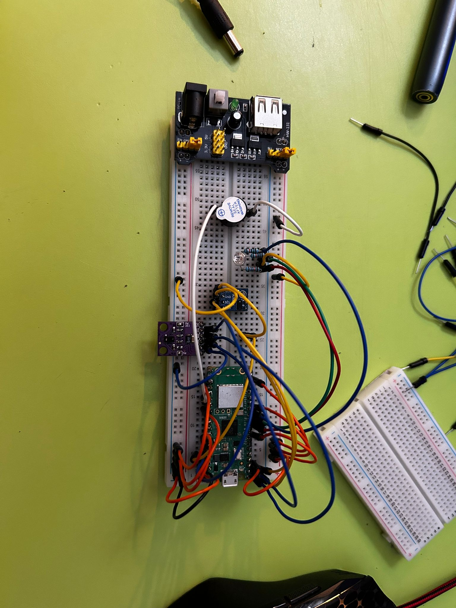
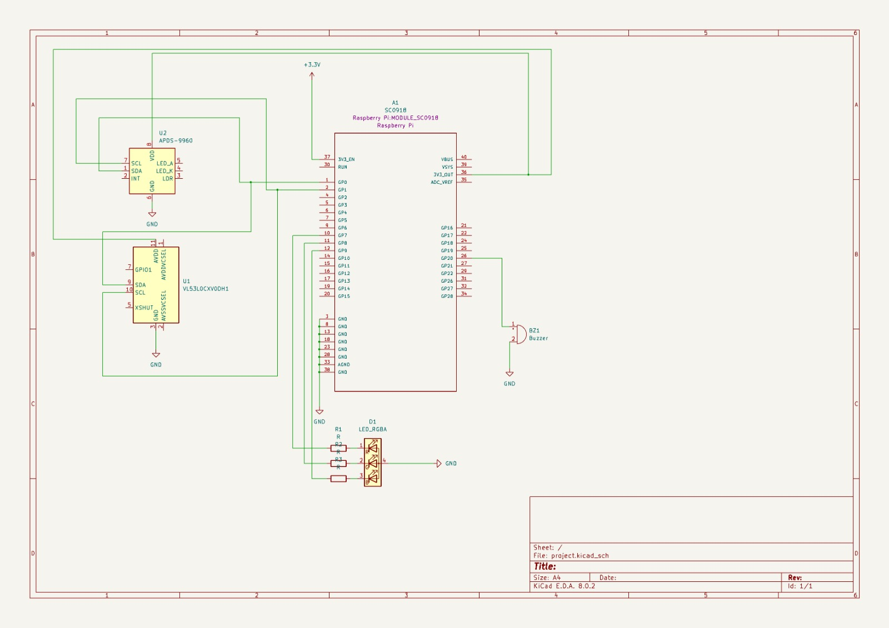

# Project Name
SentinelGuard

:::info 

**Author**: Andreescu Andrei-Vlad
**GitHub Project Link**: https://github.com/AndreiAndreescu/upb-fils-ma.github.io

:::

## Description

i want to make a project that activates a system alarm when something enters in a zone where is a movement sensor a laser sensor and a light sensor and then it gives me an email with the the time spend in the zone at the time that the alarm activated 

## Motivation

for me an alarm sistem is very interesting so for me to do one is absolutly grandious 

## Architecture 


## Log

<!-- write every week your progress here -->

### Week 6 - 12 May

### Week 7 - 19 May

### Week 20 - 26 May

## Hardware


Raspberry Pi Pico W (SC0918): Microcontroller board based on the RP2040 microcontroller chip.

APDS-9960 Light Sensor: Digital RGB, ambient light, and gesture sensor with I2C interface.

VL53L0X Distance Laser Sensor: Time-of-flight (ToF) laser-ranging sensor for measuring distances with an I2C interface.

RGB LED: Light-emitting diode capable of producing various colors, typically with common cathode/anode configuration.

Buzzer: Electromechanical component that produces sound when activated, usually by applying an alternating current.

### Schematics



### Bill of Materials

Rapspberry Pi Pico W
Light sensor and movement sensor
Laser distance sensor
Rgb led
Buzzer
Power supply 

The format is 
```
| [Device](link://to/device) | This is used ... | [price](link://to/store) |

```

-->

| Device | Usage | Price |
|--------|--------|-------|
| [Rapspberry Pi Pico W](https://www.raspberrypi.com/documentation/microcontrollers/raspberry-pi-pico.html) | The microcontroller | [35 RON](https://www.optimusdigital.ro/en/raspberry-pi-boards/12394-raspberry-pi-pico-w.html) |
[Light sensor and movement sensor](https://www.emag.ro/senzor-de-lumina-rgb-detector-de-gesturi-apds-9960-multicolor-apds9960-mod/pd/DLR798MBM/?utm_campaign=share%20product&utm_source=mobile%20app&utm_medium=ios) |[21 RON] |
[Laser distance sensor](https://www.emag.ro/senzor-de-distanta-laser-tof-vl53l0x-aalbastru-vl53l0x-gy530-blue/pd/DQR798MBM/?utm_campaign=share%20product&utm_medium=ios&utm_source=mobile%20app)|[16 RON]|


## Software

| Library | Description | Usage |
|---------|-------------|-------|
## Links

<!-- Add a few links that inspired you and that you think you will use for your project -->

1. [link](https://www.youtube.com/watch?v=hUUlJuWxy00)
