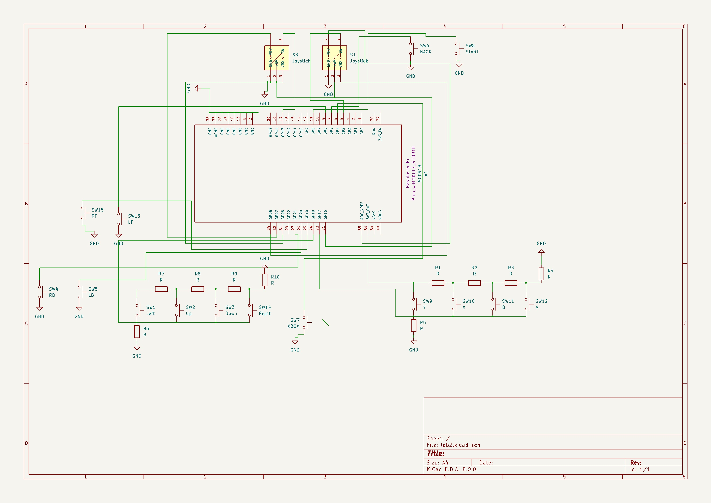

# GamePad Xinput API

A game controller coded in Rust using Xinput API

:::info

**Author**: Dragotă Andrei \
**GitHub Project Link**: https://github.com/UPB-FILS-MA/project-domnudragota

:::


## Description


### Introduction

A rudimentary GamePad constructed on a breadboard serves as a functional prototype to test within various gaming environments. This DIY controller operates on the Windows XInput API, allowing the system to recognize it as an Xbox controller, thereby facilitating seamless integration with a wide range of games that support Xbox controller inputs. The underlying electronics and wiring are carefully assembled on a breadboard, providing a flexible platform for development and testing.

### Purpose

The primary goal of this project is to assess input latency across different gaming scenarios. By using this GamePad, which mimics the functionality of a standard Xbox controller, researchers can measure the time delay between user input and corresponding in-game actions. The experiment aims to gather data on input latency across a variety of platforms, including different operating systems, computer configurations, and monitor types. This information can help identify factors that contribute to input lag and inform hardware and software optimization strategies to improve gaming responsiveness.
Testing environment

In addition to the breadboard GamePad, an official Xbox Series controller (plus PlayStation because why not) is included for comparative analysis. By conducting parallel tests with the DIY controller and the Xbox Series controller, researchers can evaluate how closely the breadboard-built GamePad matches the performance and responsiveness of a commercially available controller. This comparative approach provides a baseline to assess whether the homemade controller exhibits any additional latency or other unexpected behavior.

### Conclusions

Basically, this project has both a technical and practical focus: it explores the construction and functionality of a custom-built controller, while simultaneously addressing broader questions related to gaming performance, user experience, and system optimization. The findings from this study could have implications for gamers, developers, and hardware manufacturers interested in minimizing input latency and enhancing gameplay fluidity.


## Motivation

As it can be probably guessed from the above paragraphs, I want to combine 2 subjects which are on opposite measurement axis (creativity and art with engineering projects). I believe that this project will help me understand how much time and effort developpers and engineers put when designing even just a little piece of the hardware part for the console or computer. Moreover, I'm keen on challenges and I wish to learn Rust as a new and innovative programming language, in comparison, I come from Java langaguage so Rust might be the perfect mix for me for C/C++ and Java. Furthermore (and last idea I promise) I want to create a small presentation involving statistics and measuring data to show that projects can be done in an equal rhythm with fun, creativity and hard work.

## Architecture 


Here is a small diagram of all the connections (I think) should be neccessary for the controller. I'll also try to describe it in words. Hopefully it will make sense.

### Main Components

Controller Interface->
This is the collection of user input elements, including buttons, joysticks, and directional pads. It's what the user interacts with to control the game.

Signal Processing->
This component receives input signals from the controller interface and translates them into data that the microcontroller can process. In this case, it includes the voltage dividers for button groupings.

Microcontroller->
The central component responsible for processing input data, managing the XInput API communication, and handling USB communication. The Raspberry Pi Pico W is used for this project.

USB Interface->
This is the connection point between the microcontroller and the host system (e.g., a Windows computer). It allows the controller to be recognized as an XInput device.

XInput Communication->
This component encapsulates the interaction between the microcontroller and the host system through the XInput API. It translates input signals into a format that games can understand.

### Connections

Controller Interface to Signal Processing->
The input components (buttons, joysticks, etc.) are connected to the signal processing unit. Voltage dividers are used to group certain buttons, reducing the number of required digital pins.

Signal Processing to Microcontroller->
The processed signals are sent to the microcontroller for further handling. The microcontroller is responsible for interpreting the inputs and sending appropriate responses to the host system.

Microcontroller to USB Interface->
The microcontroller connects to the USB interface, which allows it to communicate with the host system. This connection enables the controller to be recognized as an XInput device.

Microcontroller to XInput Communication ->
The microcontroller sends input data to the host system using the XInput API. This component ensures that the controller's input is properly formatted and recognized by compatible games.


## Log

<!-- write every week your progress here -->

### Week 6 - 12 May
Designed the hardware on the breadboard, applied the voltage dividers to the circuit, finished up the KiCad hardware schematic
### Week 7 - 19 May
Finished up the hardware on the breadboard + final version on KiCad. Should start with software now.
### Week 20 - 26 May
TBD
## Hardware

The controller has 16 buttons, 2 vibration motors, 2 joysticks, resistances of 220 ohms to not blow up the circuit. Pico will process all the inputs from the buttons and will translate it for the XInput app. 

To implement the project, you need a board with a native USB port, such as the Raspberry Pi Pico.

I chose to use two voltage dividers to save the digital pins on the board. The directional buttons and the A/B/X/Y buttons are grouped by 4 in a voltage divider.

The disadvantage of these groupings is that two or more buttons from the same group cannot be read simultaneously. For example, pressing buttons A and B at the same time will send to the analog pin the value corresponding to pressing button B, not both. (fixed it, should work)

Another compromise is the fact that, for reasons of availability, the "Trigger" buttons are not analog. The value sent to the XInput API is either 0% pressed or 100% pressed.


### Schematics




### Bill of Materials

<!-- Fill out this table with all the hardware components that you might need.

The format is 
```
| [Device](link://to/device) | This is used ... | [price](link://to/store) |

```

-->

| Device | Usage | Price |
|--------|--------|-------|
| [Rapspberry Pi Pico W](https://www.raspberrypi.com/documentation/microcontrollers/raspberry-pi-pico.html) | The microcontroller | [35 RON](https://www.optimusdigital.ro/en/raspberry-pi-boards/12394-raspberry-pi-pico-w.html) |
| 2 x BreadBoard| Build the circuit | [20 RON](https://www.optimusdigital.ro/ro/prototipare-breadboard-uri/8-breadboard-830-points.html) |
| Buttons ( 12-15 ) | Input for controller | [5 RON](https://www.optimusdigital.ro/ro/butoane-i-comutatoare/1119-buton-6x6x6.html?search_query=buton&results=222) |
| Resistances | To not fry the circuit | [5 RON](https://www.optimusdigital.ro/ro/componente-electronice-rezistoare/858-rezistor-025w-18k.html?search_query=rezistor&results=120) |
| 2x JoySticks | Move and aim with the controller | [10 RON](https://www.optimusdigital.ro/ro/senzori-senzori-de-atingere/742-modul-joystick-ps2-biaxial-negru-cu-5-pini.html?search_query=joystick&results=42) |
| 2x Vibration Motors | Response from game using Windows API | [5 RON](https://www.optimusdigital.ro/ro/motoare-motoare-cu-vibratii/693-motor-cu-vibratii-a1027.html?gad_source=1&gclid=Cj0KCQjwir2xBhC_ARIsAMTXk87DxwQMGCCtCEbpkpSU_Mpx-jXCLmP0dDQwEzAGgiDgH0d1KsIc7isaAvvcEALw_wcB) |

## Software

| Library | Description | Usage |
|---------|-------------|-------|
| [rusty_xinput](https://docs.rs/rusty-xinput/latest/rusty_xinput/#) | Crate for Rust | Implements Xinput .dll in Rust, has several functions |
| [gilrs](https://docs.rs/gilrs/latest/gilrs/) | GilRs - Game Input Library for Rust | GilRs abstract platform specific APIs to provide unified interfaces for working with gamepads |
| [Xinput](https://learn.microsoft.com/en-us/windows/win32/xinput/xinput-game-controller-apis-portal) | Bread and butter of this project (main driver) | Xinput, comes with Windows |
| [embassy_rs](https://github.com/embassy-rs/embassy) | Embassy framework for embedded systems| Implement specifically USB module, ADC converter, I2C/SPi crates |
## Links

<!-- Add a few links that inspired you and that you think you will use for your project -->

1. [Microsoft Official Doc](https://learn.microsoft.com/en-us/windows/win32/xinput/getting-started-with-xinput)
2. [Implementation example](https://dev.to/jeikabu/gamepad-input-with-rust-2oji)
3. [Sketch of a controller using spare parts](https://www.youtube.com/watch?v=YEDTK_Yv0vo)
