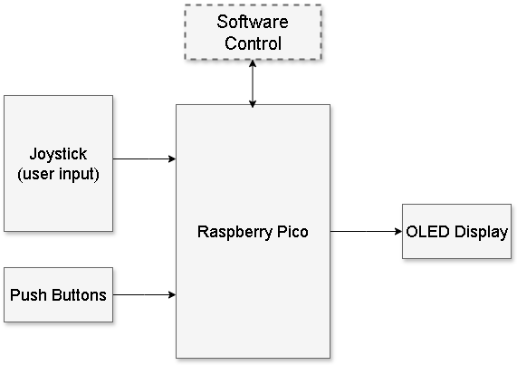
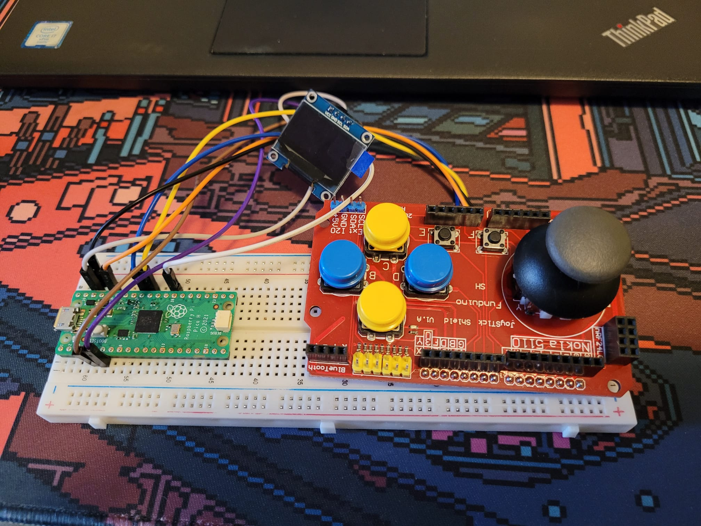
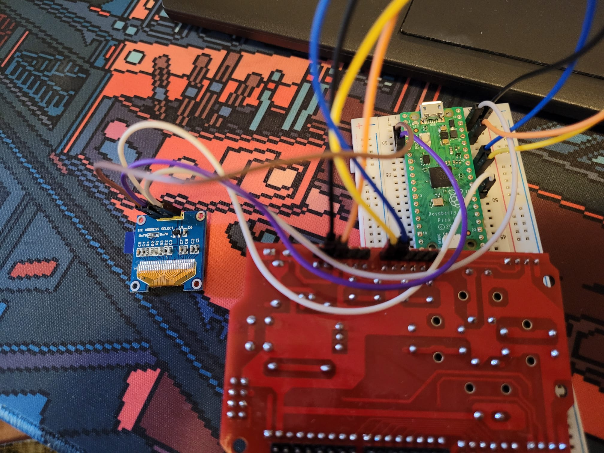
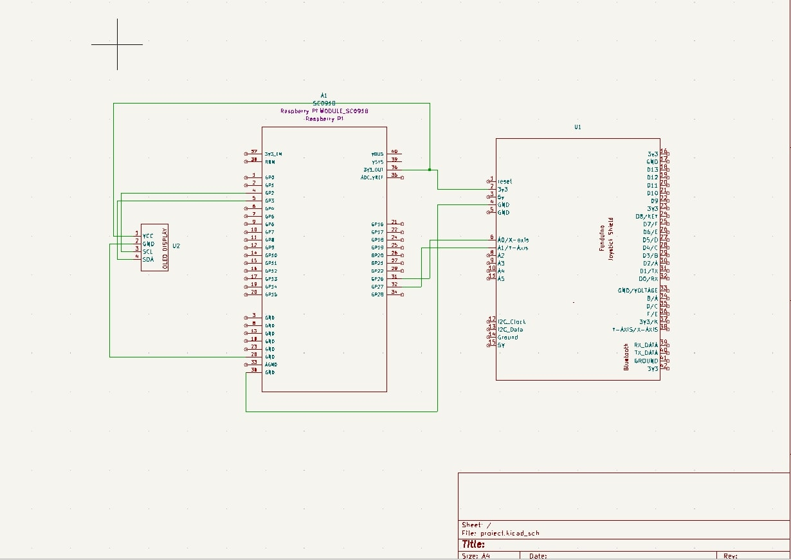

# Chicken Invaders
A chicken invaders game made in Rust

:::info 

**Author**: Pelmus Antonio Bogdan \
**GitHub Project Link**: https://github.com/UPB-FILS-MA/project-antoniopelmus

:::

## Description

Chicken Invaders is a fun arcade game where players defend Earth from an invasion of chickens.
As a spaceship pilot, you'll blast through waves of poultry foes.

## Motivation

As I was searching for inspiration in other students projects from the last years, I came across mini-games such as Snake or Pong Game.
That's when I remembered one of my favourite games from my childhood, chicken invaders.

## Architecture 

## Log

<!-- write every week your progress here -->

### Week 6 - 12 May

### Week 7 - 19 May
Created Kicad schematics for the project.
Connected all of the hardware components.

### Week 20 - 26 May

## Hardware

We will use a Joystick for movement and push buttons for game settings (reset,options etc).The game will be displayed on a OLED Display
Here are images of the hardware :

### Schematics

### Bill of Materials

| Device | Usage | Price |
|--------|--------|-------|
| [Rapspberry Pi Pico H](https://www.raspberrypi.com/documentation/microcontrollers/raspberry-pi-pico.html) | The microcontroller | [39,99 RON](https://www.bitmi.ro/placi-de-dezvoltare/placa-de-dezvoltare-raspberry-pi-pico-h-rp2040-264kb-ram-10848.html) |
| [JoyStick Shield V1.A](https://cb-electronics.com/products/funduino-joystick-shield-v1-a-ky-023-shield/) | Input/Controller | [14,99](https://www.bitmi.ro/module-electronice/shield-cu-joystick-si-butoane-compatibil-arduino-10378.html)|
| [0.96" OLED Display](https://randomnerdtutorials.com/guide-for-oled-display-with-arduino/) | Visual Output | [25,99](https://www.bitmi.ro/componente-electronice/ecran-oled-0-96-cu-interfata-iic-i2c-10488.html)|
| [400p BreadBoard](https://static.cs.tme.eu/2018/03/5aaa4f5a91b79/Lecture_1_The_Breadboard.pdf) | Platform | [7,99](https://www.bitmi.ro/electronica/breadboard-400-puncte-pentru-montaje-electronice-rapide-10633.html)|
| [Wires(F-F,M-M,F-M)](https://www.sudatel.sd/storage/2019/12/JUMPER-WIRE-SPECIFICATION.pdf) | Wire Connection | Free from friend |
Total Cost: 89 ron
## Software

| Library | Description | Usage |
|---------|-------------|-------|
| [SSD1306](https://github.com/adafruit/Adafruit_SSD1306) | Display driver | Used for the OLED Screen |
| [embedded-graphics](https://github.com/embedded-graphics/embedded-graphics) | 2D graphics library | Used for drawing to the display |

## Links

<!-- Add a few links that inspired you and that you think you will use for your project -->

1. [Snake Game on Pico](https://www.youtube.com/watch?v=5r_6mbYlLVo)
2. [Pong Game](https://www.youtube.com/watch?v=7DlhFy_pxAk)
...