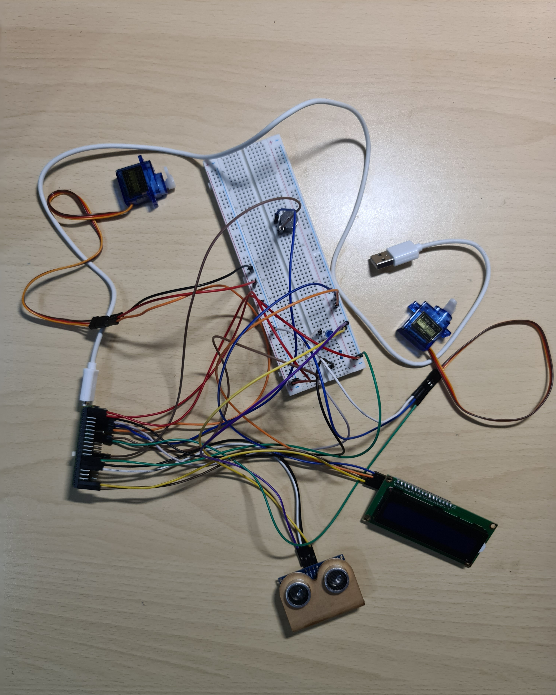
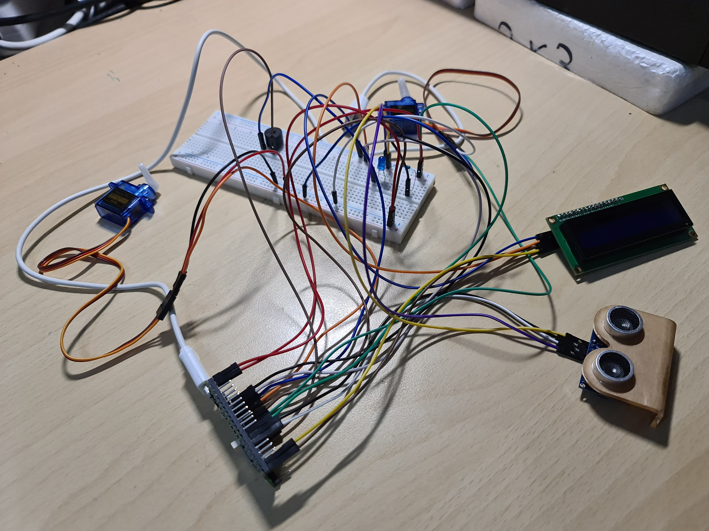
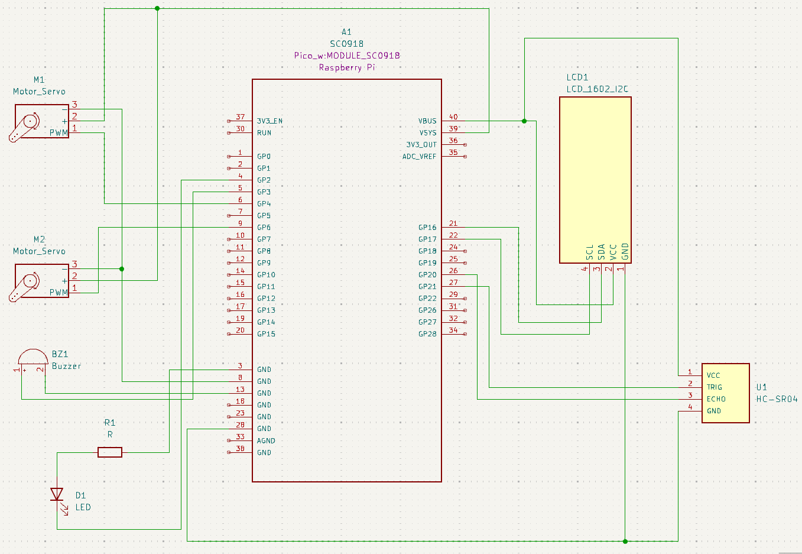

# Intrusion Detection

Security system that performs different actions based on the distance of a person or an object

:::info

**Author**: Zafar Azzam \
**GitHub Project Link**: https://github.com/UPB-FILS-MA/project-Azzamjoy44

:::

## Description

  - I will use an Ultrasonic sensor to detect an object, and to see how close an object is to the sensor. Based on how close the object is, certain actions will happen.

  - When the sensor will detect an object within a specific range (e.g., 70 cm) an LED will light up. If the object gets even closer to the sensor (e.g., 50 cm) the LED will remain lit and a buzzer (alarm) will start buzzing. And when the object comes even closer ( e.g., less than or equal to 30cm), the LED will remain lit and the buzzer will keep buzzing and two servo motors (with carboard attached) will rotate 90 degrees (one servo motor will rotate clockwise, the other servo motor will rotate anticlockwise) to show a closing gate.

  - If the object starts moving away, and moves beyond a specific distance (e.g., 30 cm) from the sensor, the two servo motors will rotate back to their initial state, but the buzzer will keep buzzing and the LED will remain lit. If the object keeps moving further away and moves beyond another specific distance (e.g., 50 cm), the buzzer will stop buzzing but the LED will remain lit. And finally, when the object moves further away (e.g., more than 70 cm), the LED will turn off.

  - An LCD will be constantly displaying the distance between the object and the sensor.

## Motivation

I decided on this idea because of its real world applications. This project is an inexpensive and portable method of identifying intrusion in an area. The initiative aims to raise awareness of health and safety issues, particularly in enclosed environments, by utilizing the Raspberry Pi Pico's capabilities. With the help of this gadget, users can be informed about any risks in real time and be equipped to act quickly. In the end, people's living and working conditions become safer.

## Architecture 


## Log

<!-- write every week your progress here -->

### Week 6 - 12 May
I managed to make the HC-SR04 ultrasonic sensor work properly. I also managed to make the LED turn on and remain lit when the distance between an object and the sensor is less than or equal to 60 cm, and the LED turns off when the object goes beyond 60 cm away from the sensor.

### Week 7 - 19 May
I was able to make the buzzer start buzzing, and keep the LED lit on, when the distance between an object and the sensor is less than or equal to 45 cm. Now when the object is more than 45 cm away from the sensor and is less than or equal to 60 cm away from the sensor, the buzzer stops buzzing, but the LED remains lit and the LED functionalities are intact. I managed to make the LCD 1602 I2C work but I need to integrate the LCD into my project.

### Week 20 - 26 May

## Hardware

  - I'm using the Raspberry Pi Pico WH development board, which has the RP2040 microcontroller chip that handles processing and interfaces with every piece of hardware.

  - Components will be connected using a breadboard and female-to-male jumper wires, male-to-male jumper wires, and female-to-female jumper wires.

  - Object detection and distance measurement will be handled by the HC-SR04 Ultrasonic sensor. Various states will be indicated by; a monochromatic LED that is connected with a 1K resistor to limit the current, a Buzzer, and two SG90 Servo motors.

  - An I2C LCD will be used to display the distance between the sensor and the object in real-time.

  - The complete system can be powered on a 9V battery, which makes the system portable and independent.

These are images of the physical hardware and connections



### Schematics



### Bill of Materials

<!-- Fill out this table with all the hardware components that you might need.

The format is 
```
| [Device](link://to/device) | This is used ... | [price](link://to/store) |

```

-->

| Device | Usage | Price |
|--------|--------|-------|
| [Raspberry Pi Pico WH](https://www.raspberrypi.com/documentation/microcontrollers/raspberry-pi-pico.html) | The Microcontroller | [56.23 RON](https://ardushop.ro/ro/home/2819-raspberry-pi-pico-wh.html?search_query=Raspberry+Pi+Pico+WH%2C+Wireless+Headers&results=1027) |
| [Ultrasonic Sensor (HC-SR04)](https://docs.google.com/document/d/1Y-yZnNhMYy7rwhAgyL_pfa39RsB-x2qR4vP8saG73rE/edit) | Object detection | [6.49 RON](https://www.optimusdigital.ro/ro/senzori-senzori-ultrasonici/9-senzor-ultrasonic-hc-sr04-.html?search_query=ultrasonic+sensor&results=8) |
| [LCD 1602 I2C](https://www.optimusdigital.ro/ro/optoelectronice-lcd-uri/2894-lcd-cu-interfata-i2c-si-backlight-albastru.html?search_query=0104110000003584&results=1) | The Display | [16.34 RON](https://www.optimusdigital.ro/ro/optoelectronice-lcd-uri/2894-lcd-cu-interfata-i2c-si-backlight-albastru.html?search_query=0104110000003584&results=1) |
| [Sets of Resistors 10R-1M](https://ardushop.ro/ro/electronica/212-set-rezistente-14w-600buc30-valori-10r-1m.html?search_query=SET+rezistori+1%2F4W+600buc%2F30+valori+10R-1M%09&results=893) | Current Modulation | [12.29 RON](https://ardushop.ro/ro/electronica/212-set-rezistente-14w-600buc30-valori-10r-1m.html?search_query=SET+rezistori+1%2F4W+600buc%2F30+valori+10R-1M%09&results=893) |
| [Micro USB Cable](https://www.optimusdigital.ro/ro/cabluri-cabluri-usb/498-cablu-micro-usb-1-m-alb.html?search_query=Cablu+Micro+USB+1+m+alb&results=32) | For flashing the program to the microcontroller | [3.48 RON](https://www.optimusdigital.ro/ro/cabluri-cabluri-usb/498-cablu-micro-usb-1-m-alb.html?search_query=Cablu+Micro+USB+1+m+alb&results=32) |
| [Breadboard](https://ardushop.ro/ro/electronica/33-breadboard-830.html?search_query=Breadboard+830+puncte+MB-102%09&results=584) | For connections | [10.14 RON](https://ardushop.ro/ro/electronica/33-breadboard-830.html?search_query=Breadboard+830+puncte+MB-102%09&results=584) |
| [Jumper Wires](https://ardushop.ro/ro/electronica/28-65-x-jumper-wires.html?search_query=65+x+fire+jumper%09&results=355) | For connections | [11.86](https://ardushop.ro/ro/electronica/28-65-x-jumper-wires.html?search_query=65+x+fire+jumper%09&results=355) |
| [Female-to-male Wires](https://www.optimusdigital.ro/ro/fire-fire-mufate/879-set-fire-mama-tata-10p-30-cm.html?search_query=Fire+Colorate+Mama-Tata+%2810p%2C+30+cm%29%09&results=6) | For connections | [5.79 RON](https://www.optimusdigital.ro/ro/fire-fire-mufate/879-set-fire-mama-tata-10p-30-cm.html?search_query=Fire+Colorate+Mama-Tata+%2810p%2C+30+cm%29%09&results=6) |
| [Male-to-male Wires](https://www.optimusdigital.ro/ro/fire-fire-mufate/885-set-fire-tata-tata-10p-10-cm.html?search_query=Tata-Tata&results=722) | For connections | [2.85 RON](https://www.optimusdigital.ro/ro/fire-fire-mufate/885-set-fire-tata-tata-10p-10-cm.html?search_query=Tata-Tata&results=722) |
| [Female-to-female Wires](https://www.optimusdigital.ro/ro/fire-fire-mufate/90-fire-colorate-mama-mama-40p.html?search_query=male-male+wires&results=1) | For connections | [7.99 RON](https://www.optimusdigital.ro/ro/fire-fire-mufate/90-fire-colorate-mama-mama-40p.html?search_query=male-male+wires&results=1) |
| [9V Battery](https://www.bricodepot.ro/electrice/lanterne-si-baterii/acumulator-reincarcabil-hr-9-v.html) | DC Voltage source | [29.74 RON](https://www.bricodepot.ro/electrice/lanterne-si-baterii/acumulator-reincarcabil-hr-9-v.html) |
| [9V Battery Holder](https://www.optimusdigital.ro/ro/suporturi-de-baterii/20-conector-pentru-baterie-de-9-v.html?search_query=battery&results=24) | DC Voltage source holder | [1.29 RON](https://www.optimusdigital.ro/ro/suporturi-de-baterii/20-conector-pentru-baterie-de-9-v.html?search_query=battery&results=24) |
| [LEDs](https://ardushop.ro/ro/electronica/299-led-5mm.html?search_query=LED+5mm+-+Culoare+%3A+Ro%C8%99u%09&results=744) | Indicator | [0.45 RON](https://ardushop.ro/ro/electronica/299-led-5mm.html?search_query=LED+5mm+-+Culoare+%3A+Ro%C8%99u%09&results=744) |
| [Buzzers](https://www.optimusdigital.ro/ro/audio-buzzere/634-buzzer-pasiv-de-5-v.html?search_query=buzzer&results=60) | Indicator | [1.40 RON](https://www.optimusdigital.ro/ro/audio-buzzere/634-buzzer-pasiv-de-5-v.html?search_query=buzzer&results=60) |
| [Servo Motors](https://www.optimusdigital.ro/ro/motoare-servomotoare/2261-micro-servo-motor-sg90-180.html?search_query=sg90&results=11) | Indicator | [11.99 RON](https://www.optimusdigital.ro/ro/motoare-servomotoare/2261-micro-servo-motor-sg90-180.html?search_query=sg90&results=11) |


## Software

| Library | Description | Usage |
|---------|-------------|-------|
| [lcd1602-driver](https://github.com/eZioPan/lcd1602-driver) | Driver for the LCD 1602 I2C| Used to operate the LCD 1602|
| [heapless](https://docs.rs/heapless/latest/heapless/) | Used to make strings on the pico | Needed to convert data to string in order to display the data on the LCD 1602 I2C|
| [hc_sr04 module](https://github.com/Benehiko/pico-ultrasonic-rs) | Driver for the HC-SR04 Ultrasonic Sensor | Used to operate the HC-SR04 Ultrasonic Sensor |
| [pwm](https://docs.embassy.dev/embassy-nrf/git/nrf52840/pwm/index.html) | Pulse-Width Modulation | Used for controlling the servo motors and the buzzer's noise level|
| [embassy-executor](https://docs.embassy.dev/embassy-executor/git/std/index.html) | Asynchronous Executor for Embedded Rust Systems | Used for task scheduling and asynchronous programming |
| [embassy-rp](https://docs.embassy.dev/embassy-rp/git/rp2040/index.html) | Hardware Abstraction Layer for the RP2040 | Used to operate the peripheral devices connected the Raspberry Pi Pico |
| [embassy-time](https://docs.rs/embassy-time/0.3.0/embassy_time/) | Time management library | This library is used for managing timekeeping, timeouts and delays |
| [gpio](https://docs.embassy.dev/embassy-stm32/git/stm32c011d6/gpio/index.html) | Library for handling GPIO functionalities | Used to control and configure GPIO pins on the microcontroller board |
| [log](https://docs.rs/log/latest/log/) | Lightweight Logging Facade | Used for logging messages |
| [embassy-usb-logger](https://docs.embassy.dev/embassy-usb-logger/git/default/index.html) | USB implementation of the log crate | Used for logging messages over USB |


## Links

<!-- Add a few links that inspired you and that you think you will use for your project -->

1. [Using an Ultrasonic sensor with Raspberry Pi Pico](https://how2electronics.com/hc-sr04-ultrasonic-distance-sensor-with-raspberry-pi-pico/)
2. [Using a servo motor with a Raspberry Pi Pico](https://how2electronics.com/how-to-control-servo-motor-with-raspberry-pi-pico/)
