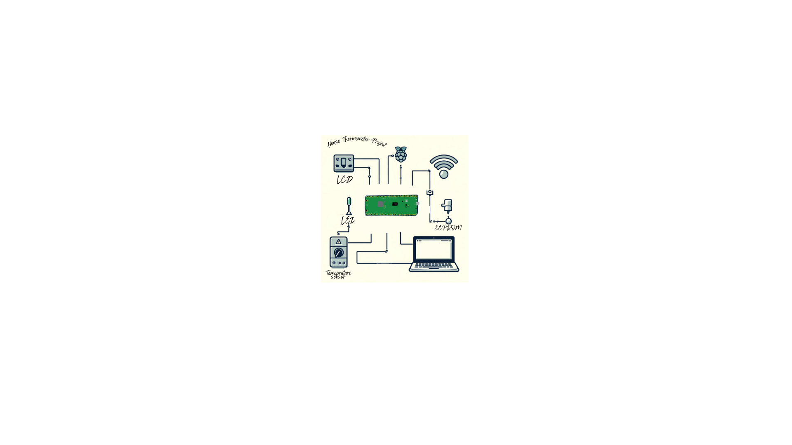
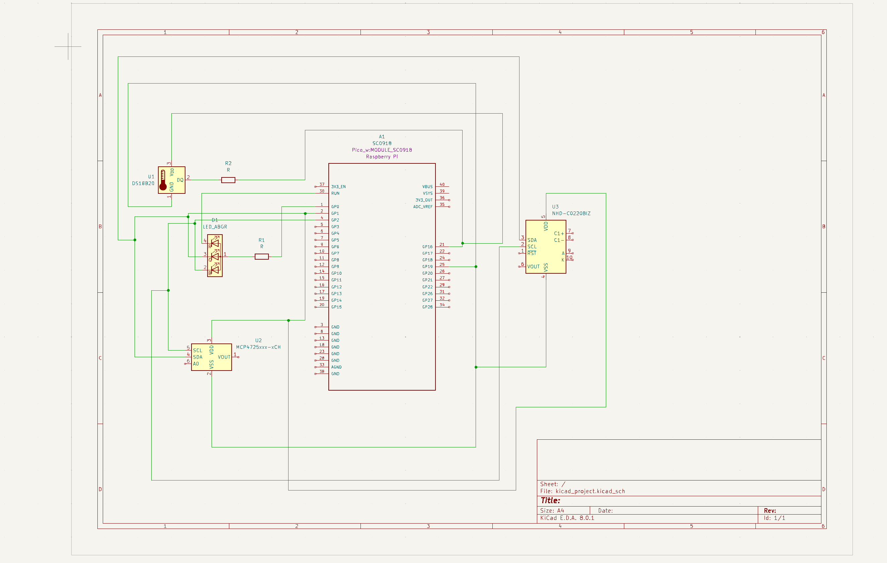
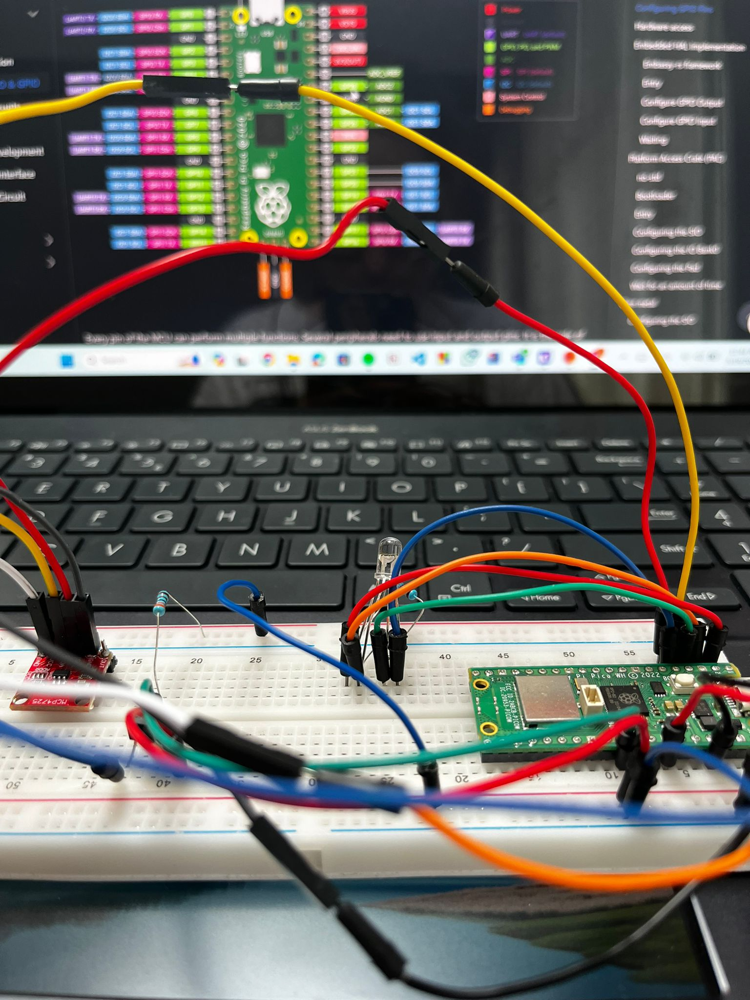
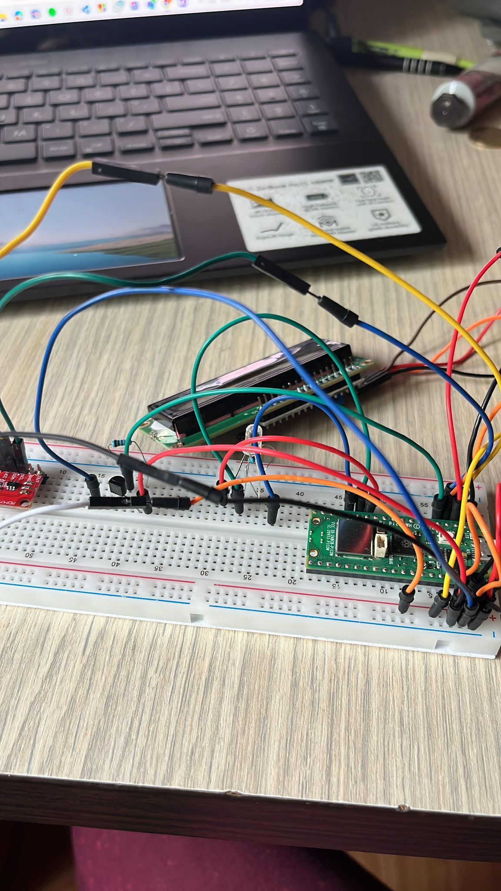

# House Thermometer

The House Thermometer project uses a Raspberry Pi Pico W to measure indoor temperatures, visually display data and enable remote monitoring and data analysis.

:::info 

**Author**: Grec Carina-Gabriela \
**GitHub Project Link**: https://github.com/UPB-FILS-MA/project-carinagrec

:::

## Description

House thermometer capable of displaying the current room temperature on an LCD display for immediate local access, as well as on a web application for remote monitoring. The system uses a digital temperature sensor for accurate measurements and features an RGB LED that changes color based on temperature ranges, enhancing visual feedback. Also, it has an external memory to keep track of the temperatures from the last hours and display the average value. 

## Motivation

I chose this project because it seems like a pretty practical idea in the day-to-day life that can be implemented. It's a mix from multiple topics that we studied and i can also implement extra knowledge such as the EEPROM

## Architecture 

# Connectivity and Interactions

1. **Sensor Interface → Data Processing and Logic Unit:**
   - The sensor interface reads temperature data.
   - This data is then sent to the data processing unit, where it is logged and processed for further actions.

2. **Data Processing and Logic Unit → Display Controller:**
   - Processed data, including current temperatures and system statuses, is forwarded from the data processing unit to the display controller.
   - The display controller provides real-time visualization of the data.

3. **Data Processing and Logic Unit → LED Controller:**
   - Based on the temperature data, the data processing unit issues commands to the LED controller.
   - The LED controller adjusts the LED's color and brightness according to the temperature conditions.

4. **Data Processing and Logic Unit ↔ Network Interface:**
   - The network interface functions as a gateway, facilitating communication between the web server and the data processing unit.
   - It allows the data processing unit to send temperature data to the web server and receive commands from the web application.

5. **Network Interface ↔ Web Application:**
   - The web application interacts with the network interface to transmit user commands and receive data for display.
   - This includes adjusting settings, monitoring real-time temperature updates, and accessing historical data logs.




## Log

<!-- write every week your progress here -->

### Week 6 - 12 May

### Week 7 - 19 May

### Week 20 - 26 May

## Hardware

1. **Raspberry Pi Pico W**
   - A compact microcontroller board featuring the RP2040 chip and built-in Wi-Fi connectivity.
   - Manages data collection from the temperature sensor, drives the display, controls the RGB LED, and handles network communications.

2. **DS18B20 Temperature Sensor**
   - A digital temperature sensor that provides 9-bit to 12-bit Celsius temperature measurements.
   - Known for its accuracy and ease of integration, it operates over a one-wire bus that requires only one data line (and ground) for communication with the Raspberry Pi Pico W.

3. **1602 LCD Module**
   - A 16x2 character LCD display that is simple and effective for displaying text and numerical data.
   - Interfaced via the I2C communication protocol, which simplifies the connection by using just two wires for data transmission.

4. **Common Cathode RGB LED**
   - A small and efficient multi-color LED capable of displaying various colors by mixing red, green, and blue.
   - Each color component can be controlled independently using PWM signals to create different colors.

5. **Breadboard and Jumper Wires**
   - Ideal for prototyping without soldering, useful for testing and adjusting the circuit layout during development.
   - Jumper wires facilitate connections between the components on the breadboard.

6. **Resistors**
   - Used for current limiting and voltage division.
   - Crucial for protecting components like the RGB LED and ensuring correct signal levels are applied to inputs.


### Schematics





### Bill of Materials

<!-- Fill out this table with all the hardware components that you might need.

The format is 
```
| [Device](link://to/device) | This is used ... | [price](link://to/store) |

```

-->

| Device | Usage | Price |
|--------|-------|-------|
| [Raspberry Pi Pico W](https://www.raspberrypi.com/documentation/microcontrollers/raspberry-pi-pico.html) | The microcontroller with Wi-Fi capability, used for managing sensors and network communication. | [35 RON](https://www.optimusdigital.ro/en/raspberry-pi-boards/12394-raspberry-pi-pico-w.html) |
| [DS18B20 Temperature Sensor](https://www.alldatasheet.com/view.jsp?Searchword=Ds18b20%20datasheet&gad_source=1&gclid=Cj0KCQjwudexBhDKARIsAI-GWYVUHqUtnoJCOwvXEnXHKXTR3qZre8D3MO_ehf0MTlAIB7ETcrZeTXIaArlOEALw_wcB)| Digital temperature sensor for accurate room temperature measurements. | [3,32 RON](https://www.optimusdigital.ro/en/sensors/1465-ds18b20-temperature-sensor-to-92.html) |
| [1602 LCD Module](https://www.waveshare.com/datasheet/LCD_en_PDF/LCD1602.pdf) | A simple LCD display for showing temperature readings locally. | [18 RON](https://www.optimusdigital.ro/ro/optoelectronice-lcd-uri/62-lcd-1602-cu-interfata-i2c-si-backlight-galben-verde.html) |
| [Common Cathode RGB LED](https://randomnerdtutorials.com/electronics-basics-how-do-rgb-leds-work/) | RGB LED to indicate temperature range through color changes. | [1 RON](https://www.optimusdigital.ro/en/leds/483-rgb-led-common-cathode.html) |
| [Breadboard](https://en.wikipedia.org/wiki/Breadboard) | A platform for temporary prototyping and experimenting without soldering. | [9,98 RON](https://www.optimusdigital.ro/en/breadboards/8-breadboard-hq-830-points.html?search_query=breadboard&results=413) |
| [Jumper Wires](https://en.wikipedia.org/wiki/Jump_wire) | Used to connect components on the breadboard. | [7,99 RON](https://www.optimusdigital.ro/en/wires-with-connectors/12-breadboard-jumper-wire-set.html?search_query=Jumper+Wires&results=100) |
| [Header de pini alb 2.54 mm (40p)](https://en.wikipedia.org/wiki/Pin_header) | This white single-row male 40 copper pin header can be broken into smaller strips with the use of a wire cutter, in order to fit your desired application. It is an ideal connector for integrated circuit and PCB boards. | [0,99 RON](https://www.optimusdigital.ro/ro/componente-electronice-headere-de-pini/463-header-de-pini-alb-254-mm-40p.html?search_query=headere+pini&results=216) |
| [Resistor Kit](https://en.wikipedia.org/wiki/Resistor) | Various resistors for current limiting for the LED and pull-up resistor for the temperature sensor. | [14,99 RON](https://www.optimusdigital.ro/en/resistors/10928-250-pcs-plusivo-resistor-kit.html?search_query=Resistor+Kit&results=42) |
| [DAC MCP4725 Module with I2C Interface](https://www.alldatasheet.com/view.jsp?Searchword=Mcp4725%20datasheet&gad_source=1&gclid=Cj0KCQjwudexBhDKARIsAI-GWYUenyA7lMcPWmrcVCqC1cvBR28NL38MnpyoS-Zzmi6TfeupLiwyvnMaAncYEALw_wcB) | Integrated circuits designed to store relatively small amounts of data but allowing individual bytes to be electrically erased and reprogrammed. | .[9,52 RON](https://www.optimusdigital.ro/en/others/1327-dac-mcp4725-module-with-i2c-interface.html?search_query=eeprom&results=101)


## Software

| Library | Description | Usage |
|---------|-------------|-------|
| [rp2040-hal](https://github.com/rp-rs/rp-hal) | Hardware Abstraction Layer for Raspberry Pi Pico | Provides access to the hardware features of the Raspberry Pi Pico W, simplifying tasks like GPIO management, ADC input, and PWM output. |
| [one-wire](https://github.com/rust-embedded-community/rust-onewire) | Rust implementation of the OneWire protocol | Manages communication with the DS18B20 temperature sensor to retrieve accurate temperature measurements. |
| [warp](https://github.com/seanmonstar/warp) | A web server framework for Rust | Serves the web application that displays real-time and historical temperature data, managing requests and routing in the backend. |
| [embassy-rs](https://github.com/embassy-rs/embassy) | Asynchronous runtime for embedded devices | Used to facilitate non-blocking, concurrent firmware development, handling all device peripherals and networking with ease and safety. |


## Links

<!-- Add a few links that inspired you and that you think you will use for your project -->

1. [Get the weather in real time](https://hackaday.io/project/190692-wow-enjoy-the-current-weather-with-picassos-pai/log/217890-complete)
2. [Raspberry Pi Pico](https://www.raspberrypi.com/documentation/microcontrollers/raspberry-pi-pico.html)
3. [How to build a web project using Rust](https://www.arewewebyet.org/)
4. [Temperature Sensor Tutorial](https://www.youtube.com/watch?v=aEnS0-Jy2vE)
5. [OLED display for Raspberry Pi Pico](https://www.tomshardware.com/how-to/oled-display-raspberry-pi-pico)
