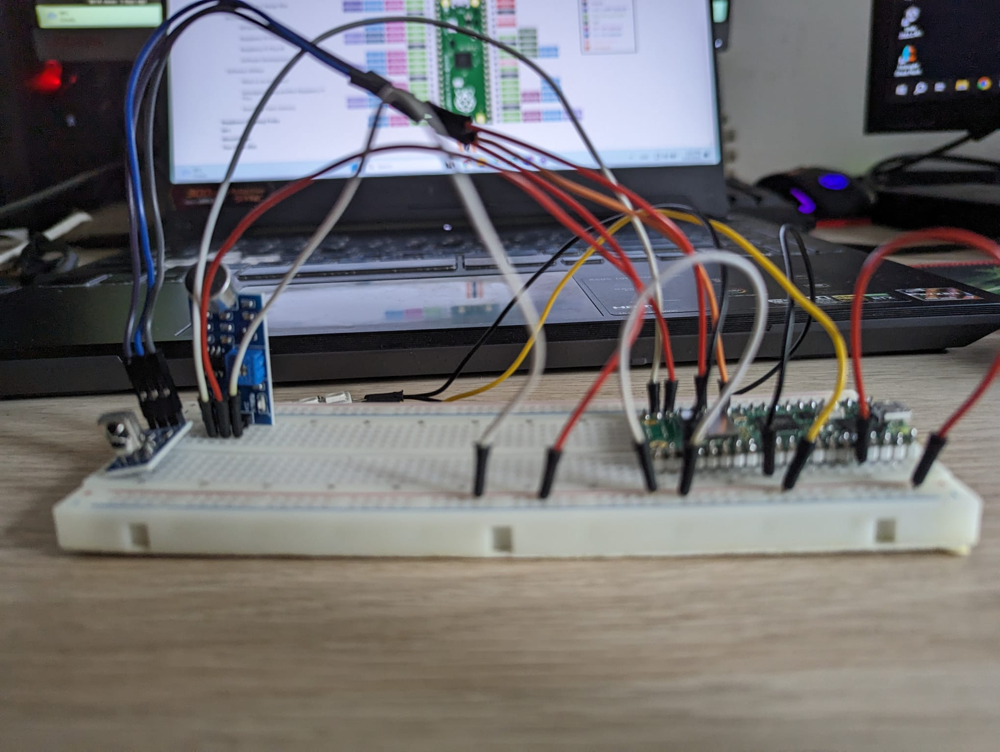

# Music Lights

A LED strip that responds to music and lights up the room accordingly.

:::info 

**Author**: BARABAȘ Cătălin-Gabriel \
**GitHub Project Link**: https://github.com/UPB-FILS-MA/project-cata-g

:::

## Description

The intensity of the LED strip will be adjusting based on ambiental sounds. The colors of the LED strip will be changed using the remote or the mobile application developed for this project using Android Studio.

## Motivation

This project's root stands in my love for ambient lighting from my computer setup. Also, I love listening to music while working, so I found this challenge a good addition to my environment.

## Architecture


- The light show will be on as long as the Raspberry PI will be plugged in
- The IR sensor will capture the signals from the remote
- The Sound sensor will capture the music in the background
- The Led Strip will flicker accordingly

## Log

<!-- write every week your progress here -->

### Week 6 - 12 May

This week, I spent a lot of time refining and re-evaluating ideas to identify a suitable project. I also managed to gather the necessary components for the project, but overall, there wasn't much progress made.

### Week 12 - 19 May

This week, I set up all the hardware on the breadboard and in KiCad. The main issue I encountered was with the sound sensor obtained last week, as it was not compatible with a Pico W. Fortunately, I got a new, more compatible sensor. During the KiCad process, I also had to modify some sensors to match what I have in the actual project.

### Week 20 - 26 May

## Hardware

In the project, the Raspberry Pi Pico W runs the logic behind the project. The Infra-Red will capture de remote control signal and will tell the micro-controller to change the intensity and the color of the LED strip. The Sound Sensor will capture the environment sound and turn on/off the LED strip to flicker on the music played. 

Here it is the actual setup:



### Schematics


### Bill of Materials

<!-- Fill out this table with all the hardware components that you might need.

The format is 
```
| [Device](link://to/device) | This is used ... | [price](link://to/store) |

```

-->

| Device | Usage | Price |
|--------|--------|-------|
| [Rapspberry Pi Pico W](https://www.raspberrypi.com/documentation/microcontrollers/raspberry-pi-pico.html) | The microcontroller | [35 RON](https://www.optimusdigital.ro/en/raspberry-pi-boards/12394-raspberry-pi-pico-w.html) |
| [Pin Header for Raspberry PI](https://static.optimusdigital.ro/60928-thickbox_default/header-de-pini-alb-254-mm-40p.jpg) | The pins for the breadboard | [0.99 RON](https://www.optimusdigital.ro/ro/componente-electronice-headere-de-pini/463-header-de-pini-alb-254-mm-40p.html) |
[LED Strip](https://static.optimusdigital.ro/23166-thickbox_default/bara-de-led-uri-rgb-ws2812-cu-8-led-uri.jpg) | The LED strip | [6.99 RON](https://www.optimusdigital.ro/ro/optoelectronice-bare-cu-leduri/753-bara-de-led-uri-rgb-ws2812-cu-8-led-uri.html)|
|[Sound Sensor](https://static.optimusdigital.ro/64125-large_default/modul-senzor-sunet-fara-cablu.jpg) | The sound sensor | [2.99 RON](https://www.optimusdigital.ro/ro/senzori-altele/12325-modul-senzor-sunet-fara-cablu.html) |
| [IR Sensor](https://static.optimusdigital.ro/23230-thickbox_default/modul-receptor-telecomanda-infrarou.jpg) | The infra-red sensor |[8.99 RON](https://www.optimusdigital.ro/ro/altele/755-modul-receptor-telecomanda-infrarou.html) |
| [Remote Control](https://static.optimusdigital.ro/52355-thickbox_default/mini-telecomanda.jpg) | The IR Remote Control | [3.60 RON](https://www.optimusdigital.ro/ro/altele/11-mini-telecomanda.html) |

## Software

| Library | Description | Usage |
|---------|-------------|-------|


## Links

<!-- Add a few links that inspired you and that you think you will use for your project -->

1. [Raspberry Pi Audio Reactive LED Strip (2020)](https://www.youtube.com/watch?v=7YLF-N0596I)
2. [Sound Reactive WS LED With Raspberry Pi Pico](https://www.youtube.com/watch?v=PaSVcxk2iVk)
3. [Audio Reactive Lights with Raspberry Pi](https://www.youtube.com/watch?v=FA9rMkuVmvQ)