# Blackjack Game
Using the Raspberry Pi Pico W to automate the logic for a Blackjack game

:::info 

**Author**: Iacobescu Cristian Mario \
**GitHub Project Link**: https://github.com/UPB-FILS-MA/project-MarioMario7.git

:::

## Description

This project facilitates a Blackjack game that allows the 'dealer' to use a barcode scanner to input the cards. The project will involve programming the Raspberry Pi Pico W to manage the game logic, display the game interface, and interact with the barcode scanner to read the cards. There are also different behaviors that correspond to different events and game states.

The choices for the players will be made using a simple web interface, and communication between the server and the Pico-side logic will be established via socket communication, utilizing the Pico's integrated Wi-Fi module.

## Motivation

What pushed me to choose this project was that, while observing a similar approach bring used to facilitate online Blackjack games, I was struck by the innate simplicity of the setup and the use of relatively inexpensive parts being used by multi-million-dollar companies worldwide on a day-to-day basis.

## Architecture 

 1. __Raspberry Pi Pico:__ Used for handling the game logic, controlling the scanner, LEDs, LCD and buzzer. Also for communicating with the server trough the sockets.
 2. __Passive Buzzer__ : Reacts to varying game events.
 3. __RGB LEDs__ : Reacts to game events / Used to show where the next card should be placed (Player/Dealer).
 4. __Barcode Scanner Module(+ RS232 -> TTL Adaptor)__ : Barcodes are scanned from the cards and are then used for the game logic, if the serial sent matches one of the ones stored in the dictionary and if it wasn't previously scanned in the current round (if any of the conditions are false, it will create a placeholder card object and suspend the game until a rescan is done successfully). The adaptor is needed as the Raspberry Pi Pico W doesn't support RS232 communication. We will use Transistor-To-Transistor Logic communication through the Pico's pins that support UART communication.
 5. __Linear Potentiometer + Push Button__: The potentiometer is used for choosing the bet for the new round, and the push button is used to confirm the bet and start the round.
 6. __16x02 LCD__: Used to display relevant information for pre/current/post game states.
 7. __Website Interface__ : Allows the user to select the choices for the game (Insurance, Hit, Stand, Double Down, Split). Communicating with the Pico trough the sockets of the web server to send/recieve information relevant to the current round. The server will run on a local machine, no connections other than the Pico are inteded.

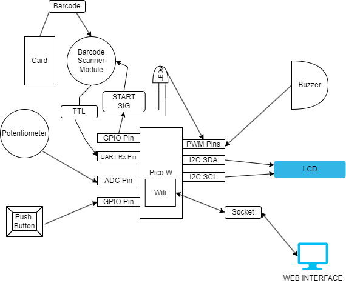


## Log

<!-- write every week your progress here -->

### Week 6 - 12 May

Up until this point, I had completed the basic structure of the blackjack game on the software side and tested the LCD. During this period, my main goal was setting up the scanner module and writing the code needed to operate it. At first, the setup seemed to be more difficult than expected: the `blocking_read` function was returning a BREAK error.

After some research, I quickly found out that this error signifies that the line stays in a low state for longer than expected, which led me to find out that the baud rate in the default UART config did not match that of my scanner. Embassy uses the default baud rate of 115200 and the scanner uses 9600. This issue was solved relatively quickly and the setup was ready to go since the scanner uses 8 data bits, one stop bit, and no parity (same as the default config in Embassy).

After this, a lot more information was revealed about the scanner (which unfortunately was not available in the datasheet as the datasheet itself doesn't exist): it turns itself off automatically after approximately 4 seconds as a form of protection, as it heats up very quickly, it uses UTF-8 encoding, the stop bit is 13 (which in ASCII is CARRIAGE_RETURN - represents the action of moving the cursor or print head back to the beginning of a line). This all led to a successful integration of the scanner into the project and after finishing the rest of the small hardware setup, only the blackjack logic and the socket communication + website are left for the upcoming weeks.

### Week 7 - 19 May

### Week 20 - 26 May

## Hardware

We will use a Raspberry Pi Pico W as the microcontroller. A potentiometer is used for getting the player's 'bet', and a push button used to confirm the bet (an RC Filter will be used to ensure no switch bounce happens).

The main piece of hardware for this project is the barcode scanner, which scans the barcodes from the playing cards and facilitates a way to connect the real-life events to the microcontroller for handling the logic behind the game. It sends the barcodes encoded using the UTF-8 encoding standard.

An adaptor (RS232 -> TTL) is needed for the scanner since it uses RS232 communication, which is not supported by the Pico. We also use an LCD to display relevant information, and the RGB LEDs and buzzer to react to game events.


Bird's Eye View

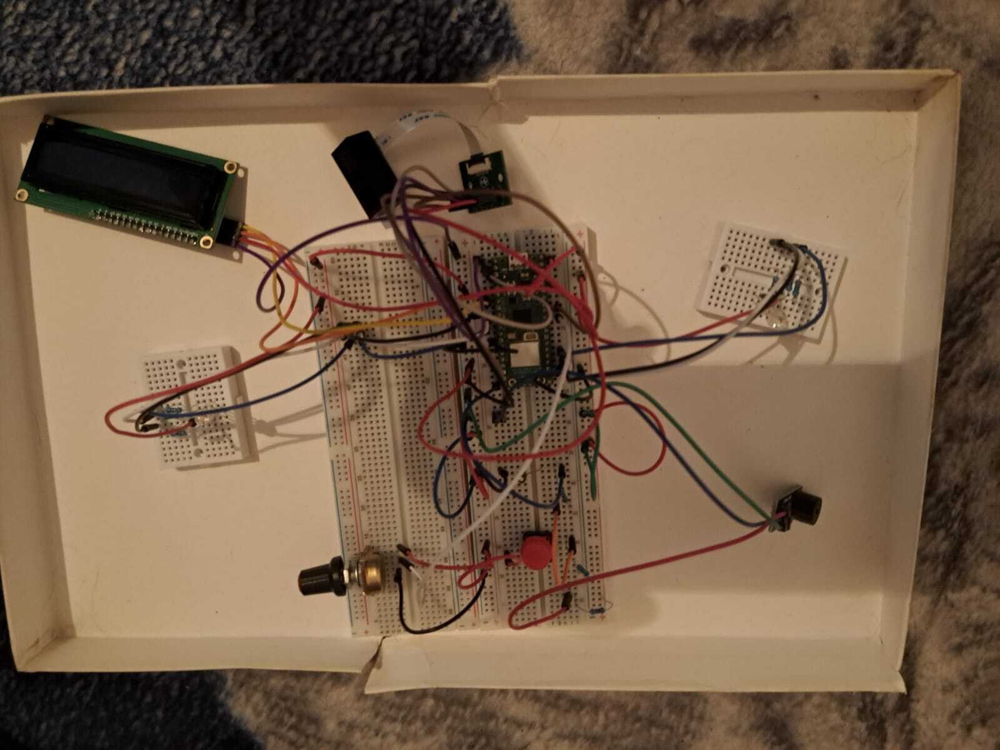


Scanner 

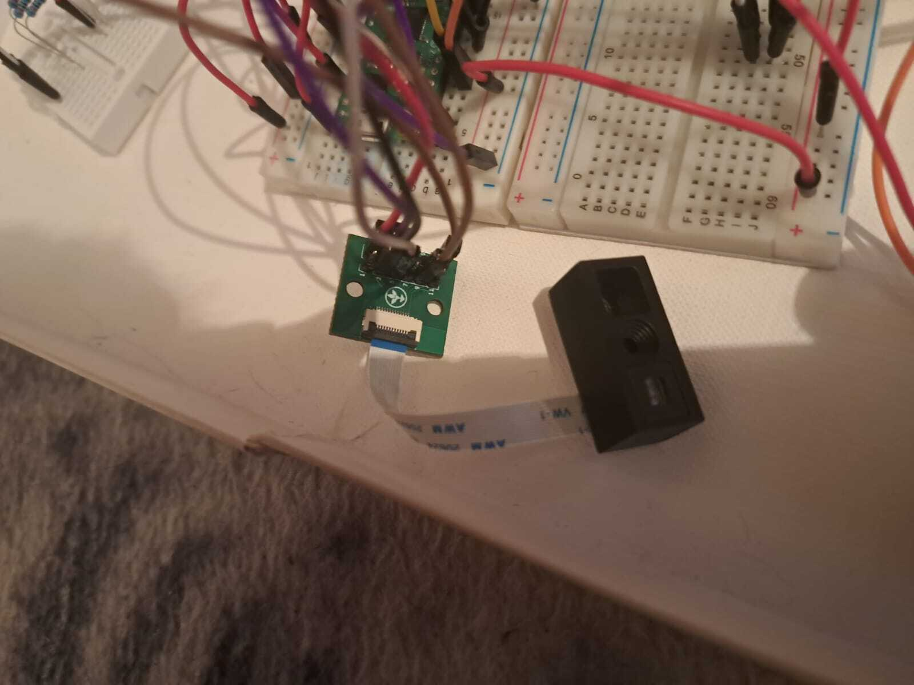


LCD 

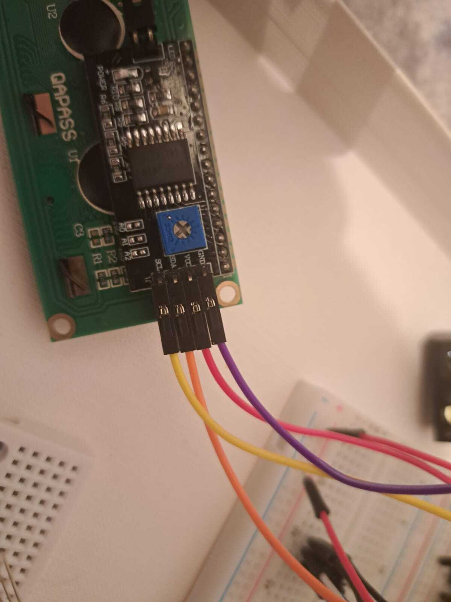


Buzzer

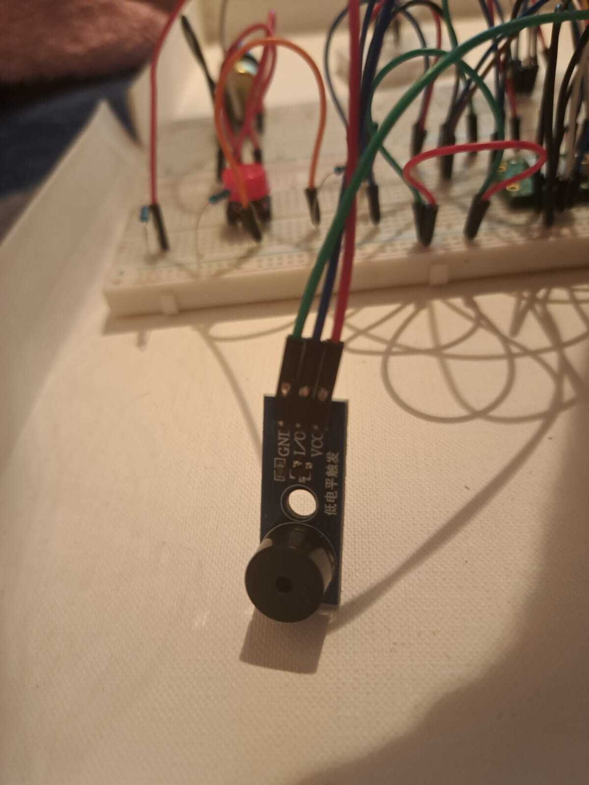


Potentiometer

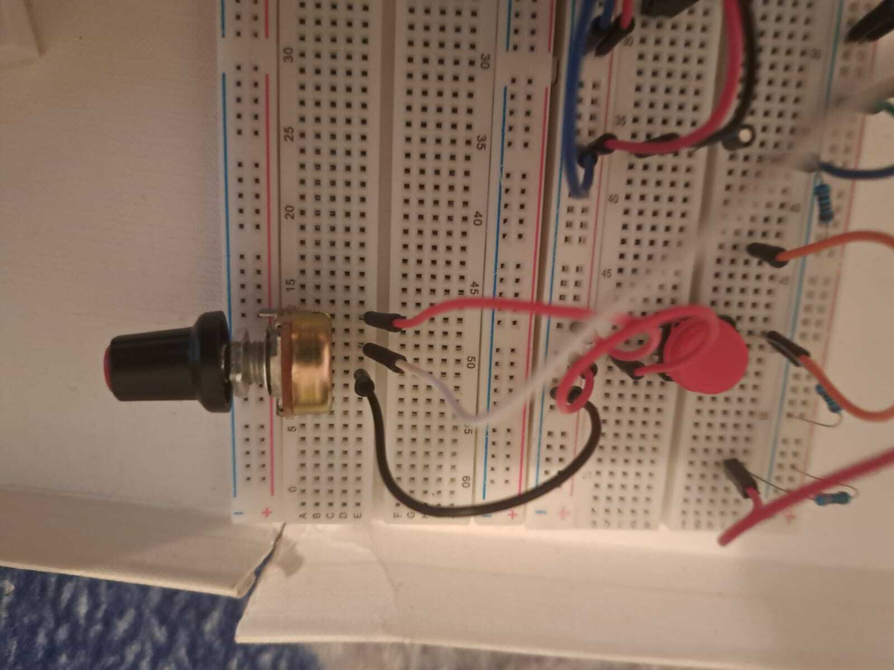


Push Button with physical pull-down resistor

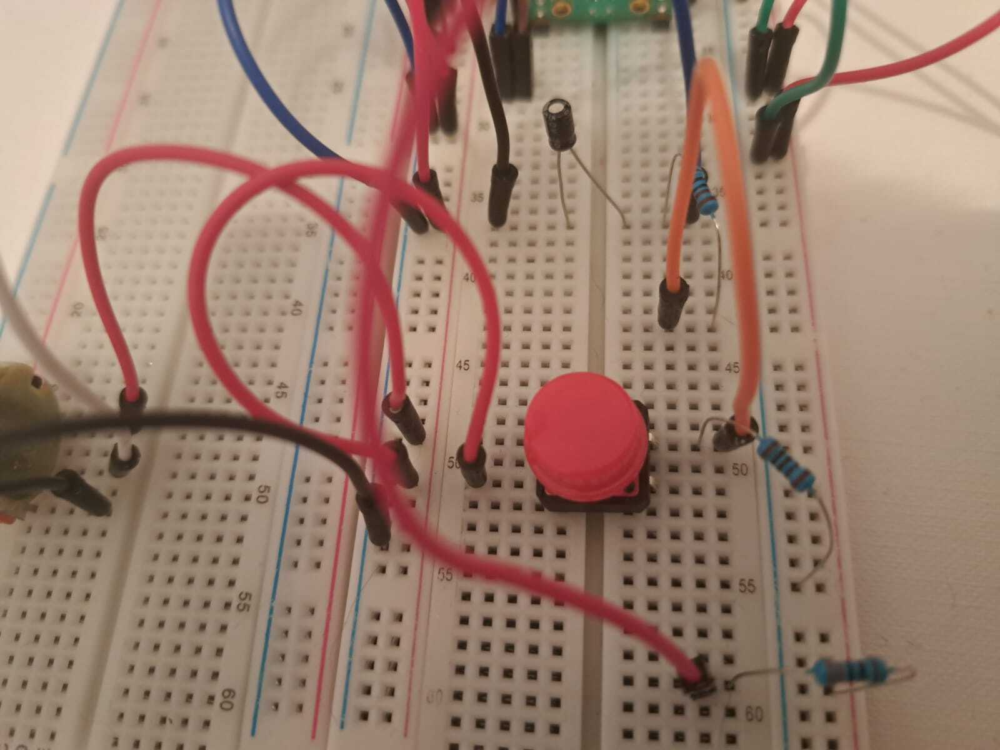


Resistive Capacitive Filter

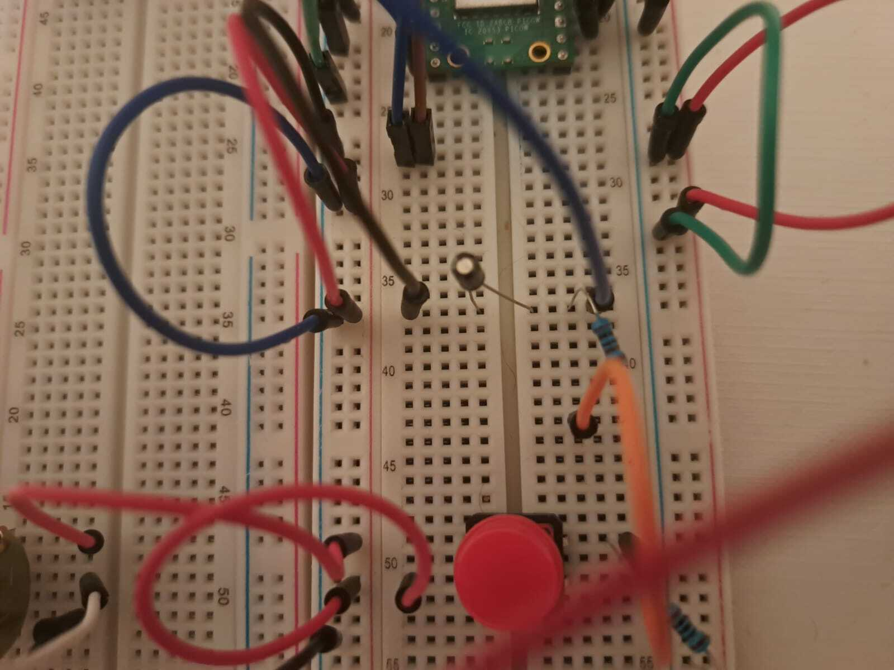


RGB LEDs

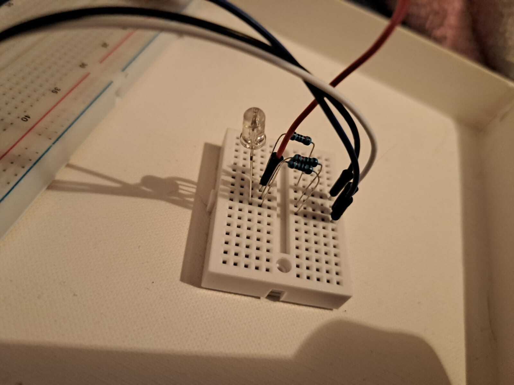


Pico Close-Up

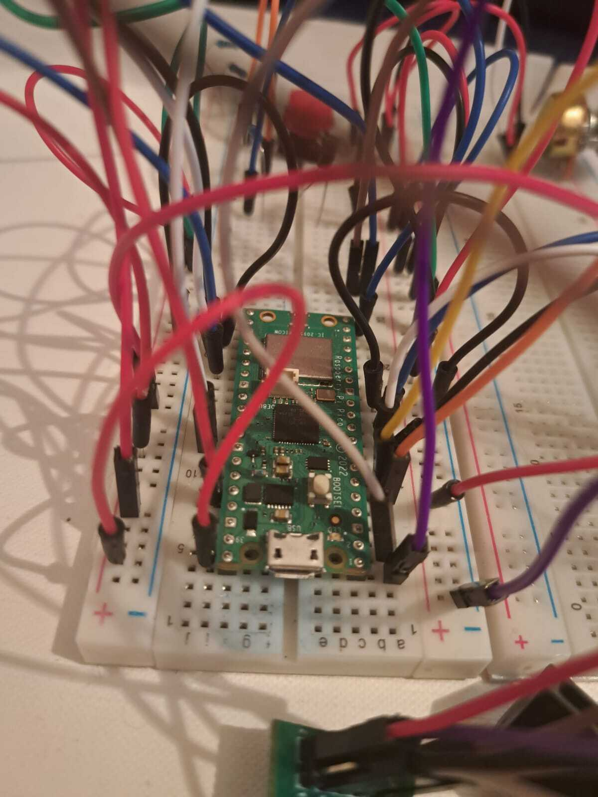


### Schematics

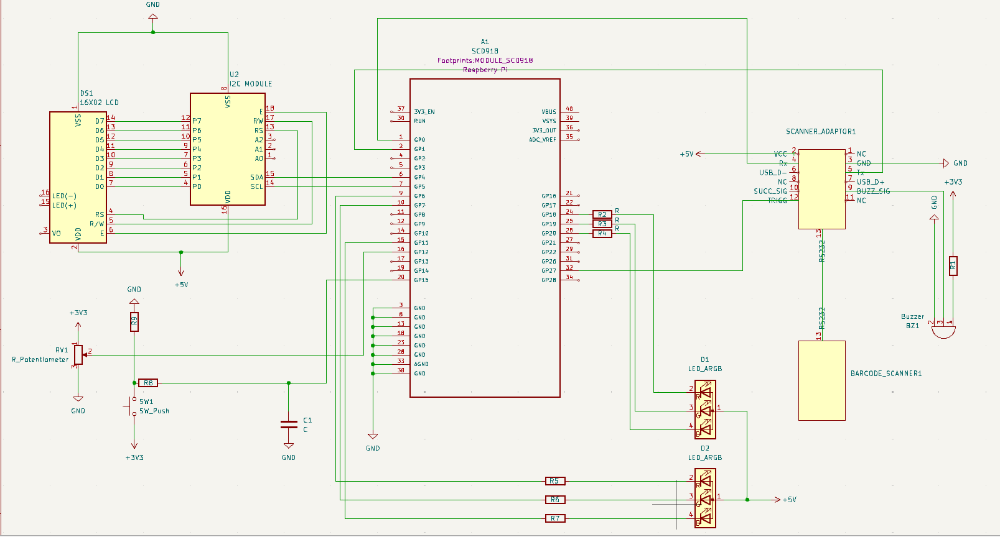

### Bill of Materials

<!-- Fill out this table with all the hardware components that you might need.

The format is 
```
| [Device](link://to/device) | This is used ... | [price](link://to/store) |

```

-->

| Device | Usage | Price |
|--------|--------|-------|
| [Raspberry Pi Pico W](https://www.raspberrypi.com/documentation/microcontrollers/raspberry-pi-pico.html) | The microcontroller | [35 RON](https://www.optimusdigital.ro/en/raspberry-pi-boards/12394-raspberry-pi-pico-w.html) |
| Breadboard830 | The main breadboard | [10 RON](https://ardushop.ro/ro/electronica/163-kit-breadboard830-65xfire-jumper-sursa-alimentare-335v.html) |
| Linear Potentiometer | Set the bet | [2.5 RON](https://ardushop.ro/ro/electronica/193-potentiometru-10k.html#/96-valoare_rezistenta-10k) |
| Push Button | Confirm Bet | [0.50 RON](https://ardushop.ro/ro/home/97-buton-mic-push-button-trough-hole.html?search_query=push+button&results=30) |
| [RGB LED](https://ardushop.ro/ro/index.php?controller=attachment&id_attachment=235) | Display player turn and game state | [2.50 x 4 RON](https://ardushop.ro/ro/electronica/271-led-tricolor-cu-catod-comun.html) |
| Barcode Scanner | Scan the QR Codes on the cards | [80 RON](https://ardushop.ro/ro/home/2815-modul-scanner-coduri-de-bare-e2100-rs232.html) |
| [RS232 -> TTL Adaptor](https://ardushop.ro/ro/index.php?controller=attachment&id_attachment=379) | Connect the scanner module to the pico | [6 RON](https://ardushop.ro/ro/electronica/1852-modul-fpc-groundstudio.html#/431-numar_pini-12) |
| Buzzer Module (Passive) | React to game events | [4 RON](https://ardushop.ro/ro/home/89-modul-buzzer.html#/63-tip-pasiv) |
| Mini Breadboard | Breadboard for the LEDs | [3 x 4 RON](https://ardushop.ro/ro/electronica/35-breadboard-170-puncte.html#/8-culoare-alb) |
| [1602 LCD Screen with I2C Interface](https://ardushop.ro/ro/index.php?controller=attachment&id_attachment=53) | Display game details | [15 RON](https://www.optimusdigital.ro/en/lcds/62-1602-lcd-with-i2c-interface-and-yellow-green-backlight.html) |
| Capacitor (0.1 uF) | Debounce button to avoid unwanted input | [0.25 RON](https://ardushop.ro/ro/home/2708-condensator-electrolitic-alege-valoarea.html?gad_source=1&gclid=CjwKCAjw57exBhAsEiwAaIxaZpg3s-VVKIPilWtcM-0Po90QrGbxYJy50oCzWjlC8kihEiA7bCG7GBoCudMQAvD_BwE) |
| Jumper wires | Connect components | [20 RON](https://ardushop.ro/ro/electronica/28-65-x-jumper-wires.html?gad_source=1&gclid=Cj0KCQjwgJyyBhCGARIsAK8LVLPhrybjljA9A3xgsd4vbqVUmO--VsbFIENcQA4Tjibbs8TRelUL_48aAqHuEALw_wcB) |
| Male-Female Cables | Connect components | [5 RON](https://ardushop.ro/ro/home/226-10-x-fire-dupont-mama-tata-20cm.html?gad_source=1&gclid=Cj0KCQjwgJyyBhCGARIsAK8LVLNSME8SlCdnLyn600SAGHKZJEvZYQEyryAc1VL_2S_HwYl7dAun4FYaArNrEALw_wcB) |
| Female-Female Cables | Connect components | [15 RON](https://www.tme.eu/ro/details/mikroe-511-kpl/accesorii-pentru-kituri-de-dezvoltare/mikroe/wire-jumper-female-to-female-10pcs/?brutto=1&currency=RON&gad_source=1&gclid=Cj0KCQjwgJyyBhCGARIsAK8LVLOw0Q8iHwvKr86T1EtKf0cCaMHjvixeEiZcaa4Qs0aYY1qpzcNQTgIaAl5bEALw_wcB) |
| Resistors | Regulates voltage for components | [22 RON](https://www.sigmanortec.ro/kit-rezistori-30-valori-20-bucati?gad_source=1&gclid=Cj0KCQjwgJyyBhCGARIsAK8LVLN9VAEYdEySVc1yxKakLE6hFED_pJPGWr9zKog2hp0IfI0_-HhANn0aAoP5EALw_wcB) |


## Software

| Library | Description | Usage |
|---------|-------------|-------|   
| [heapless](https://docs.rs/heapless/0.8.0/heapless/) | Data structure library | Used for String vectors |
| [embassy_rp](https://docs.embassy.dev/embassy-rp/git/rp2040/index.html) | Embassy Hardware Abstraction Layer (HAL) for the Raspberry Pi RP2040 microcontroller | Used to program the Pico |
| [embassy_sync](https://docs.embassy.dev/embassy-sync/git/default/index.html) | Synchronization primitives and data structures with async support | Used for communicating through different tasks |
| [embassy-executor](https://crates.io/crates/embassy-executor) | An async/await executor designed for embedded usage | Used for task execution |
| [ag_lcd](https://docs.rs/ag-lcd/0.2.0/ag_lcd//) | Library that allows developers to control a HITACHI HD44780 LCD screen with one or two 16-character lines| Used to operate the LCD|
| [port_expander](https://docs.rs/port-expander/0.6.1/port_expander/) | Abstraction for I2C port-expanders | Used for handling the Pcf8574 I/O Expander|


## Links

<!-- Add a few links that inspired you and that you think you will use for your project -->

1. [How do online BJ games work ?](https://meliorgames.com/gambling/live-dealer-online-casinos-recognize-cards/)
2. [Barcode Scanner Project](https://how2electronics.com/barcode-qr-code-reader-using-arduino-qr-scanner-module/)
...
