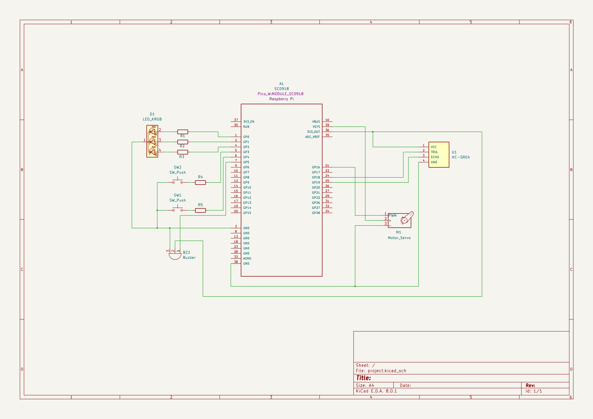

# Radar Secure System

A Raspberry Pi Pico W-based radar-like security system.

:::info 

**Author**: Cristiana-Florentina Precup \
**GitHub Project Link**: https://github.com/UPB-FILS-MA/project-cristianaprecup

:::

## Description

This project aims to develop a radar-like security system using a Raspberry Pi Pico W as its core. Designed to monitor and track the presence of objects within a specified perimeter, the system utilizes ultrasonic sensing technology to detect movements or intrusions. Objects within the sensor's range will be displayed on a computer through a graphical interface similar to naval radars, and there will be a visual and acoustic notification system. It will also provide data about the detected objects, including their distance and speed.

## Motivation

I chose this radar security system project because it combines practical engineering with advanced technology to address significant security issues, including military needs. Using a Raspberry Pi Pico W and ultrasonic sensors, this system mimics the radar used in submarines and aircraft for everyday safety and military surveillance. Additionally, I am implementing this system using the Rust programming language, which offers enhanced safety and performance features ideal for such critical applications. This project not only challenges my technical skills but also allows me to develop a tool that enhances safety in various environments, such as homes, warehouses, and military zones. It offers a valuable chance to deepen my understanding of hardware-software integration and contribute to creating safer, more secure areas with innovative technology.

## Architecture 

Main Components:\
Sensor Module: This includes the Ultrasonic Distance Sensor, which measures the proximity of objects. It is mounted on the Micro Servo Motor, allowing the sensor to pivot and scan a wider area.\
Control Unit: The Raspberry Pi Pico W acts as the brain of the system. It controls the Sensor Module, processes the distance data, operates the Servo Motor, and manages user interactions through buttons.

Feedback Mechanisms:\
Visual Feedback: Delivered by the RGB LED, which changes color to indicate different system statuses or alerts.\
Auditory Feedback: The Passive Buzzer produces sound alerts when movement is detected or under specific conditions.

User Interface: Consists of Tactile Push Button Switches that allow users to manually operate the system.\
Display Interface: A laptop connected to the Raspberry Pi Pico W via Wi-Fi. It displays the radar data graphically, mimicking naval radar systems, and provides a user-friendly interface for monitoring.

Connections Between Components:\
Sensor to Controller: The Ultrasonic Sensor is connected to the Raspberry Pi Pico W through GPIO pins, sending back data to the microcontroller for analysis.\
Servo Motor to Controller: The Servo Motor is connected to the Raspberry Pi Pico W, receiving commands to adjust the sensor’s orientation for comprehensive scanning.\
Feedback to Controller: Both the RGB LED and the Passive Buzzer are linked to the Pico W, which activates these elements based on the processed data to provide alerts.\
User Interface to Controller: The push buttons are wired to GPIO pins on the Pico W, enabling direct user control and configuration changes.


## Log

<!-- write every week your progress here -->

### Week 6 - 12 May
Assembled hardware components temporarily on a breadboard for testing. \
I started to test code on each component one by one to be sure that they worked as expected. 

### Week 7 - 19 May
Created the KiCad schematic for the project. \
Final assembled the components on the breadboard. \
Assembled the box structure, ensuring stability and correct dimensions. 

### Week 20 - 26 May

## Hardware

Raspberry Pi Pico W: Microcontroller with Wi-Fi, serves as the main processing unit.\
HC-SR04 Ultrasonic Distance Sensor: Measures distances to detect objects.\
SG90 Micro Servo Motor: Rotates the ultrasonic sensor for a wider scanning area.\
RGB LED: Provides visual feedback through color changes.\
Passive Buzzer Module: Emits audible alerts.\
Tactile Push Button Switches: Allows manual control and system adjustments.\
Resistors: 10KΩ for the buttons and 220Ω for the RGB LED.\
Breadboard: Used for assembling the prototype.\
Wires: Female-to-Male, Female-to-Female, and Male-to-Male for connections.\
Micro USB Cable: Powers the Raspberry Pi Pico W.\
Laptop: Displays the radar data graphically.

This is what the wiring looks like:
| Wiring Overview | Closer look |
|------------|------------|
|  |  |

This is the final product as of yet:


### Schematics



Connected to the Rasperry Pi Pico W, there is a RGB LED connected to `GPIO 0`, `GPIO 1` and `GPIO 2`, two push buttons connected to `GPIO 3` and `GPIO 4`. The buzzer is connected to `GPIO 5`. The HC-SR04 ultrasonic sensor is connected through `I2C` to the Raspberry Pi Pico using `GPIO 18` as SDA and `GPIO 19` as SCL, and to PIN 36 (`3V3_OUT`) for the power. The Servomotor is connected to `GPIO 16` in order to be used with `PWM`, and connected to PIN 39 (`VSYS`, used to power system, can be in range 1.8V-5.5V).


### Bill of Materials

<!-- Fill out this table with all the hardware components that you might need.

The format is 
```
| [Device](link://to/device) | This is used ... | [price](link://to/store) |


```

-->
| Device | Usage | Price |
|--------|--------|-------|
| [Raspberry Pi Pico W](https://www.optimusdigital.ro/ro/placi-raspberry-pi/12394-raspberry-pi-pico-w.html) | The microcontroller with Wi-Fi for phone notification | [34.5 lei](https://www.optimusdigital.ro/ro/placi-raspberry-pi/12394-raspberry-pi-pico-w.html) |
| [HC-SR04 Ultrasonic Distance Sensor](https://ardushop.ro/ro/electronica/47-modul-senzor-ultrasonic-detector-distanta.html) | For measuring distances to objects | [20 lei](https://ardushop.ro/ro/electronica/47-modul-senzor-ultrasonic-detector-distanta.html) |
| [SG90 Micro Servo Motor](https://www.optimusdigital.ro/en/servomotors/26-sg90-micro-servo-motor.html) | To rotate the ultrasonic sensor for a wider scan area | [14 lei](https://www.optimusdigital.ro/en/servomotors/26-sg90-micro-servo-motor.html) |
| [Passive Buzzer Module](https://www.optimusdigital.ro/en/electronic-components/12598-passive-buzzer-module.html?search_query=Buzzer&results=87) | For audible alerts | [1 lei](https://www.optimusdigital.ro/en/electronic-components/12598-passive-buzzer-module.html?search_query=Buzzer&results=87) |
| [Tactile Push Button Switch](https://ardushop.ro/ro/home/97-buton-mic-push-button-trough-hole.html?search_query=push+button&results=30) | For manual controls | [2 lei for 2](https://ardushop.ro/ro/home/97-buton-mic-push-button-trough-hole.html?search_query=push+button&results=30) |
| [10KΩ Resistors](https://ardushop.ro/ro/electronica/211-rezistenta-14w-1-buc.html#/96-valoare_rezistenta-10k) | For the buttons | [0.5 lei for 2](https://ardushop.ro/ro/electronica/211-rezistenta-14w-1-buc.html#/96-valoare_rezistenta-10k) |
| [220Ω Resistors](https://ardushop.ro/ro/electronica/211-rezistenta-14w-1-buc.html#/83-valoare_rezistenta-220r) | For the RGB LED | [1 lei for 3](https://ardushop.ro/ro/electronica/211-rezistenta-14w-1-buc.html#/83-valoare_rezistenta-220r) |
| [Breadboard](https://www.bitmi.ro/breadboard-830-puncte-mb-102-10500.html?gad_source=1) | For assembling the prototype | [10 lei](https://www.bitmi.ro/breadboard-830-puncte-mb-102-10500.html?gad_source=1) |
| [Female-to-Male Wires](https://ardushop.ro/ro/electronica/23-40-x-dupont-cables-female-male-10cm.html?search_query=fire&results=203) | For connections | [5 lei per pack](https://ardushop.ro/ro/electronica/23-40-x-dupont-cables-female-male-10cm.html?search_query=fire&results=203) |
| [Female-to-Female Wires](https://www.optimusdigital.ro/en/wires-with-connectors/880-fire-colorate-mama-mama-10p-10-cm.html?search_query=wires&results=565) | For connections | [3 lei per pack](https://www.optimusdigital.ro/en/wires-with-connectors/880-fire-colorate-mama-mama-10p-10-cm.html?search_query=wires&results=565) |
| [Male-to-Male Wires](https://www.optimusdigital.ro/en/wires-with-connectors/885-wires-male-male-10p-10cm.html?search_query=wires&results=565) | For connections | [9 lei for 3 packs](https://www.optimusdigital.ro/en/wires-with-connectors/885-wires-male-male-10p-10cm.html?search_query=wires&results=565) |
| [Micro USB Cable](https://www.optimusdigital.ro/en/usb-cables/4576-cablu-albastru-micro-usb.html?search_query=usb+to+micro+usb&results=516) | To power the Raspberry Pi Pico W | [3 lei](https://www.optimusdigital.ro/en/usb-cables/4576-cablu-albastru-micro-usb.html?search_query=usb+to+micro+usb&results=516) |
| [RGB LED](https://ardushop.ro/ro/electronica/271-led-tricolor-cu-catod-comun.html) | For visual feedback | [2 lei](https://ardushop.ro/ro/electronica/271-led-tricolor-cu-catod-comun.html) |


## Software

| Library | Description | Usage |
|---------|-------------|-------|
| [embassy](https://docs.rs/embassy/latest/embassy/) | Async runtime for embedded systems | Manages tasks and system operations |
| [embassy-hal](https://docs.rs/embassy-hal/latest/embassy_hal/) | Hardware Abstraction Layer | Interfaces with Raspberry Pi Pico W hardware |
| [embassy-executor](https://docs.rs/embassy-executor/latest/embassy_executor/) | Task executor | Handles asynchronous tasks and data processing |
| [embassy-time](https://docs.rs/embassy-time/latest/embassy_time/) | Timing module | Provides timing functions for operations |
| [embassy-net](https://docs.rs/embassy-net/latest/embassy_net/) | Networking library | Manages Wi-Fi communications |
| [embassy-gpio](https://docs.rs/embassy-gpio/latest/embassy_gpio/) | GPIO management | Controls GPIO pins for devices and inputs |

## Links

<!-- Add a few links that inspired you and that you think you will use for your project -->

1. [YouTube Video](https://www.youtube.com/watch?v=kQRYIH2HwfY&ab_channel=HowToMechatronics)

