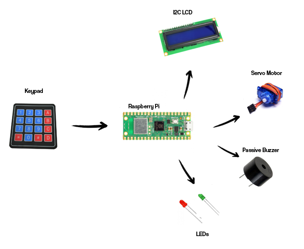
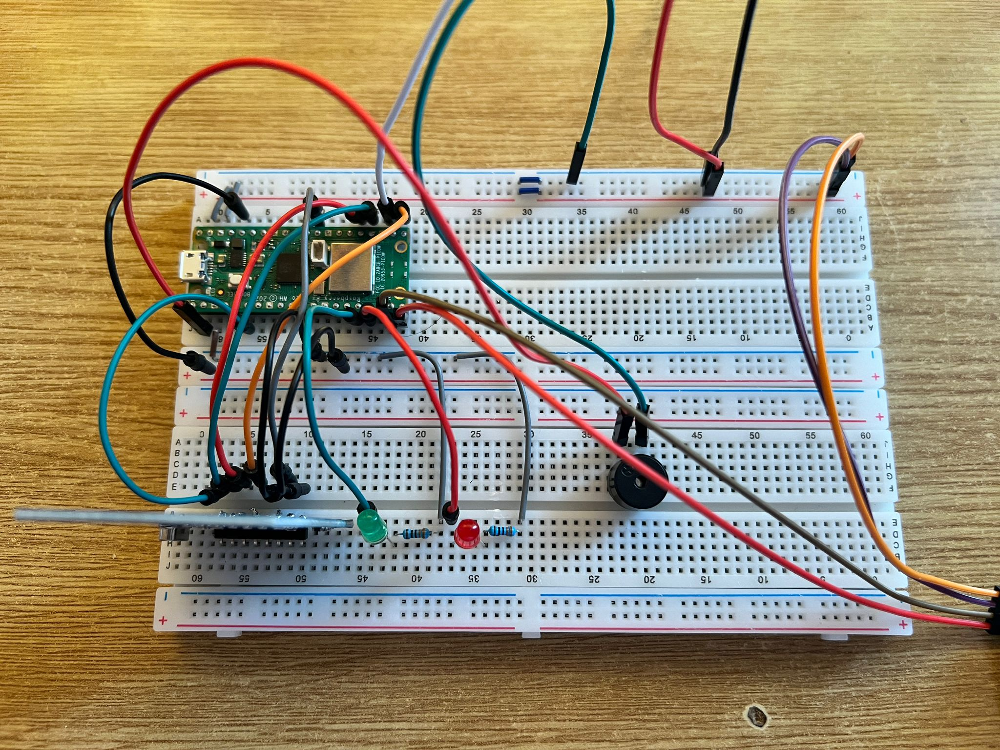
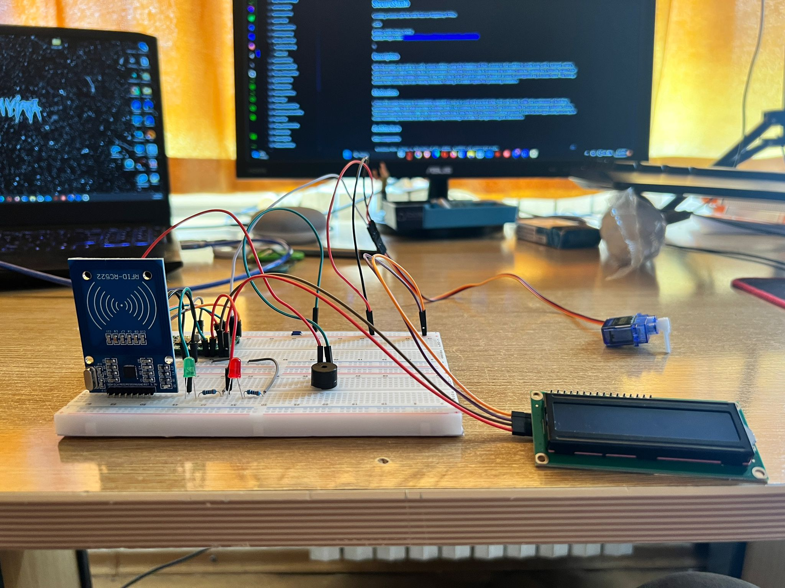
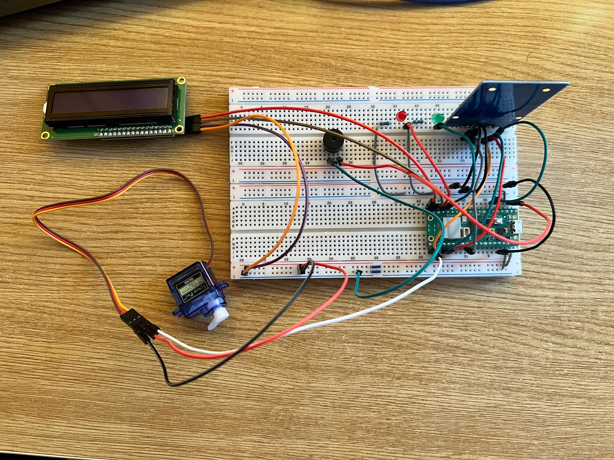
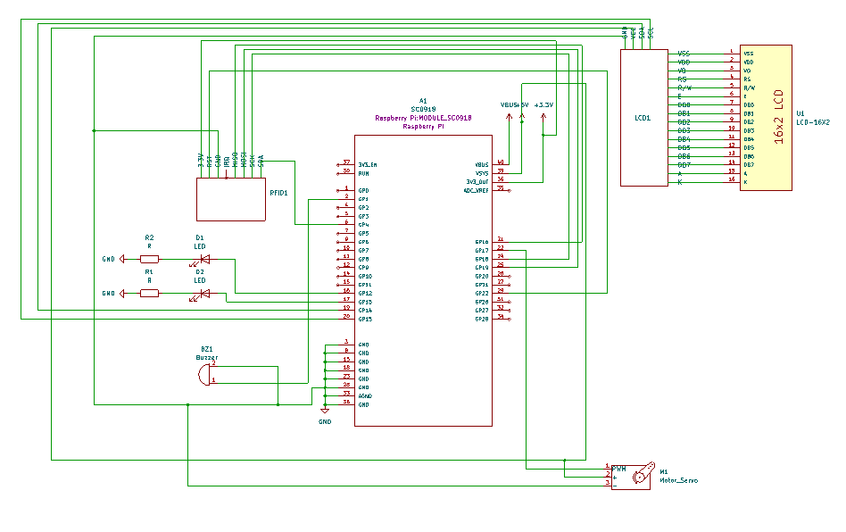

# SecureStash

Creating a secure safe box with Rust on Raspberry Pi Pico.

:::info 

**Author**: RAPA Denis-Andrei \
**GitHub Project Link**: https://github.com/UPB-FILS-MA/project-adenis033

:::

## Description

With this project, my goal is to craft a secure safebox using the Raspberry Pi Pico. Access to the safebox is made easy with a keypad, where users put in their unique PIN code for authentication. When the correct code is entered, the safebox unlocks, greeted by a friendly green LED and a message on the display. However, if the PIN code is off, a red LED signals a denial of access, accompanied by a buzzer alert. This setup ensures both security and user-friendly feedback, making it a reliable option for protecting valuables.

## Motivation

I chose this project because it immediately appealed to me as a cool and practical idea. Not only does it offer the excitement of building something tangible, but it also provides a solution that I can continue to benefit from in my everyday life by securely storing valuable items. This project perfectly blends utility with learning, which was a key factor in my decision-making process. I saw it as an opportunity not only to create something functional but also to expand my knowledge and skills in programming and electronics.

## Architecture 

Main Components:

    Raspberry Pico: Serves as the brain of the safebox, handling all processing tasks.
    
    4x4 Matrix Keypad: Enables user input for PIN verification, ensuring secure access to the safebox.
    
    Servo Motor: Functions as the locking mechanism, engaging when the correct PIN is entered to unlock the safebox.
    
    Buzzer: Acts as the audible alarm, alerting users in case of an incorrect PIN entry.

    I2C LCD : A display where you can see the PIN that you are typing.

Connection overview : 

    The 4x4 Matrix Keypad interfaces directly with the Raspberry Pico, facilitating PIN input.
    
    Acting as the central unit, the Raspberry Pico controls and coordinates all components of the safebox. This includes the LCD display, servo motor, and buzzer, which are all connected to and dependent on the Pico for operation.




## Log

<!-- write every week your progress here -->

### Week 6 - 12 May

- I did the hardware the best way possible. I had a prototype before that was messier, and now I managed to make it more understandable and cleaner.
- With the hardware part done, I also completed my KiCad design.
- I improved the software part. It's not finished yet, but I’m making good progress so far.

### Week 13 - 19 May

- I changed from the 4x4 keypad to an RFID RC522 module.
- I’m almost finished with the code. It still has some errors, but I am working hard on them. Most likely, one or two more days of work and everything will be smooth.
- I ordered an active buzzer instead of a passive one for better accuracy related to the alarm, as the sound is louder and more explicit for its use.

### Week 20 - 26 May

## Hardware

In my project, the Raspberry Pi Pico microcontroller serves as the central processing unit, mandated for the task. Its low power consumption ensures efficiency throughout. I've also integrated a 4x4 Matrix Keypad for user input, a servo motor for secure locking, and a buzzer for audible alarms. Each component is chosen with care to ensure a dependable system for safeguarding valuables.


This picture shows the project from the above.



Here I took a picture from the front for a better view.



This is how my project less or more will look like.




### Schematics




### Bill of Materials

<!-- Fill out this table with all the hardware components that you might need.

The format is 
```
| [Device](link://to/device) | This is used ... | [price](link://to/store) |

```

-->

| Device | Usage | Price |
|--------|--------|-------|
| [Rapspberry Pi Pico W](https://www.raspberrypi.com/documentation/microcontrollers/raspberry-pi-pico.html) | The microcontroller | [35 RON](https://www.optimusdigital.ro/en/raspberry-pi-boards/12394-raspberry-pi-pico-w.html) |
| [4x4 Keypad](https://cdn.sparkfun.com/assets/f/f/a/5/0/DS-16038.pdf) | The keypad | [7 RON](https://www.optimusdigital.ro/en/touch-sensors/470-4x4-matrix-keyboard-with-female-pin-connector.html) |
| [Servo Motor](http://www.ee.ic.ac.uk/pcheung/teaching/DE1_EE/stores/sg90_datasheet.pdf) | The servo motor | [14 RON](https://www.optimusdigital.ro/en/servomotors/26-sg90-micro-servo-motor.html?search_query=servo+motor&results=196) |
| [Passive buzzer](https://components101.com/sites/default/files/component_datasheet/Buzzer%20Datasheet.pdf) | The alarm | [2 RON](https://www.optimusdigital.ro/en/buzzers/634-5v-passive-buzzer.html) |
| [I2C LCD](https://www.handsontec.com/dataspecs/module/I2C_1602_LCD.pdf) | The display were you will see your PIN | [17 RON](https://www.optimusdigital.ro/en/lcds/2894-1602-lcd-with-i2c-interface-and-blue-backlight.html) |
| [Breadboard](https://www.optimusdigital.ro/en/breadboards/8-breadboard-hq-830-points.html) | For assembling the prototype | [10 lei](https://www.optimusdigital.ro/en/breadboards/8-breadboard-hq-830-points.html) |
| [Female-to-Male Wires](https://ardushop.ro/ro/electronica/23-40-x-dupont-cables-female-male-10cm.html?search_query=fire&results=203) | For connections | [5 lei per pack](https://ardushop.ro/ro/electronica/23-40-x-dupont-cables-female-male-10cm.html?search_query=fire&results=203) |
| [Female-to-Female Wires](https://www.optimusdigital.ro/en/wires-with-connectors/880-fire-colorate-mama-mama-10p-10-cm.html?search_query=wires&results=565) | For connections | [3 lei per pack](https://www.optimusdigital.ro/en/wires-with-connectors/880-fire-colorate-mama-mama-10p-10-cm.html?search_query=wires&results=565) |
| [Male-to-Male Wires](https://www.optimusdigital.ro/en/wires-with-connectors/885-wires-male-male-10p-10cm.html?search_query=wires&results=565) | For connections | [9 lei for 3 packs](https://www.optimusdigital.ro/en/wires-with-connectors/885-wires-male-male-10p-10cm.html?search_query=wires&results=565) |
| [Micro USB Cable](https://www.optimusdigital.ro/en/usb-cables/4576-cablu-albastru-micro-usb.html?search_query=usb+to+micro+usb&results=516) | To power the Raspberry Pi Pico W | [3 lei](https://www.optimusdigital.ro/en/usb-cables/4576-cablu-albastru-micro-usb.html?search_query=usb+to+micro+usb&results=516) |
| [RED Led](https://www.farnell.com/datasheets/1498852.pdf) | Indicates "Access Denied."  | [1 leu](https://www.optimusdigital.ro/en/leds/29-5-mm-red-led-with-difused-lens.html?search_query=led&results=2179) |
| [GREEN Led](https://www.farnell.com/datasheets/1498852.pdf) | Indicates "Access Permitted." | [1 leu](https://www.optimusdigital.ro/en/leds/697-led-verde-de-3-mm-cu-lentile-difuze.html) |

## Software

| Library | Description | Usage |
|---------|-------------|-------|
|[embassy-time](https://embassy.dev/book/dev/time_keeping.html)|Time management library  |Used for time-based operations such as delays |
|[embassy-rp](https://docs.embassy.dev/embassy-rp/git/rp2040/index.html)| Peripheral access library |Used for initializing and interacting with peripherals |
|[pwm](https://docs.embassy.dev/embassy-nrf/git/nrf52840/pwm/index.html)|Pulse-width modulation |Used for controlling the buzzer's sound |
|[embassy-executor](https://docs.embassy.dev/embassy-executor/git/std/index.html)|Asynchronous executor for Rust embedded systems| Used for task scheduling and asynchronous programming|

## Links

<!-- Add a few links that inspired you and that you think you will use for your project -->

1. [Project of a student from past years](https://ocw.cs.pub.ro/courses/pm/prj2022/arosca/rfid-lock)
2. [Door Lock](https://www.youtube.com/watch?v=kGyQS3B1IwU&t=19s&ab_channel=SriTuHobby)
3. [Anti-theft lock](https://www.youtube.com/watch?v=Jg0W165iHYk&t=32s&ab_channel=svsembedded)
