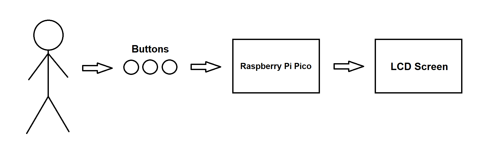
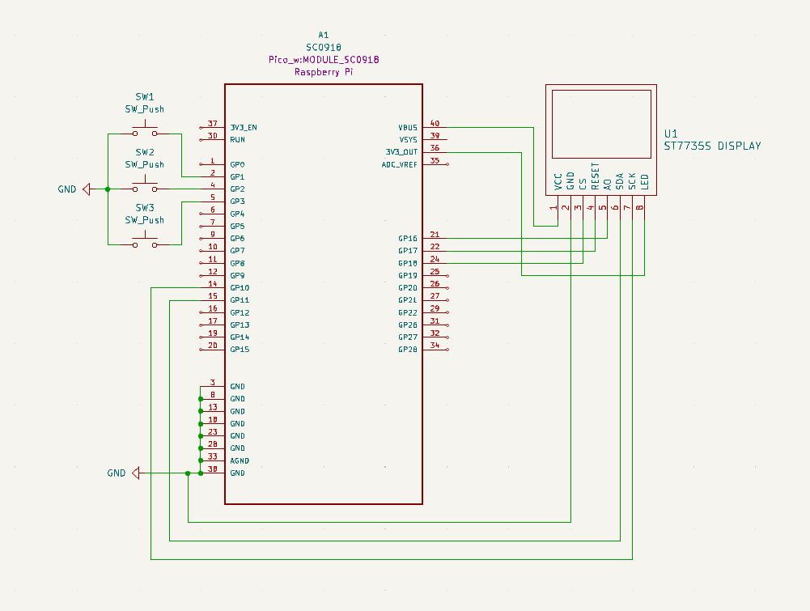

# Raspberry Pi Pico Virtual Pet
A Tamagotchi-like virtual pet that you can interact with and take care of.

:::info 

**Author**: Craciun Denisa-Gabriela \
**GitHub Project Link**: link_to_github

:::

## Description

My goal is to make a Tamagotchi-like virtual pet using the Raspberry Pi Pico. The pet will appear in the middle of the screen and will have four "needs": energy, hunger, health and happiness. The interface will consist of two toolbar menus, one on the top and one on the bottom, that are navigable using the three buttons. 
Using the options in the toolbar, you can:
- feed (↑ hunger + health + happiness)
- turn off light => the pet falls asleep (↑ energy + health)
- clean poop (↑ health + happiness)
- give medicine (↑ energy + health)
- play (↑ health + happiness, ↓ energy)
- check stats

All the stats will decrease over time and, when low enough, the pet will die.

## Motivation

I always wanted a Tamagotchi when I was little but never got one. I was recently reminded of them, so I wanted to recreate the concept on my own.

## Architecture 

The main component is the program running on the Raspberry Pi Pico W.
The subcomponents are the LCD that is showcasing the interface and the animated pet and the buttons that are used to interact with the pet.




## Log

<!-- write every week your progress here -->

### Week 6 - 12 May

I purchased the components needed for the project and drew the initial Kicad design.

### Week 7 - 19 May

I designed the interface, drawing icons for each interaction and editing a sprite of my favorite Pokemon, Quagsire, to act as my pet. I also made an animation for it by looping two sprites.

### Week 20 - 26 May

## Hardware

Detail in a few words the hardware used.

### Schematics



### Bill of Materials

<!-- Fill out this table with all the hardware components that you might need.

The format is 
```
| [Device](link://to/device) | This is used ... | [price](link://to/store) |

```

-->

| Device | Usage | Price |
|--------|--------|-------|
| [Rapspberry Pi Pico W](https://www.raspberrypi.com/documentation/microcontrollers/raspberry-pi-pico.html) | The microcontroller | [35 RON](https://www.optimusdigital.ro/en/raspberry-pi-boards/12394-raspberry-pi-pico-w.html) |
| [Breadboard HQ (830P)](https://static.cs.tme.eu/2018/03/5aaa4f5a91b79/Lecture_1_The_Breadboard.pdf) | Platform | [10 RON](https://www.optimusdigital.ro/ro/prototipare-breadboard-uri/8-breadboard-830-points.html) |
| [Cables (M-M)](https://www.sudatel.sd/storage/2019/12/JUMPER-WIRE-SPECIFICATION.pdf) | Wire connections | [8 RON](https://www.optimusdigital.ro/ro/fire-fire-mufate/12-set-de-cabluri-pentru-breadboard.html) |
| [LCD Module 128x128 px](https://www.alldatasheet.com/datasheet-pdf/pdf/1775164/SITRONIX/ST7735S.html) | Display | [28 RON](https://www.optimusdigital.ro/ro/optoelectronice-lcd-uri/870-modul-lcd-144.html) |
| [Buttons](https://components.omron.com/eu-en/products/switches/pushbutton-switches_indicators/pushbutton-switch_features) | Input | [1 RON](https://www.optimusdigital.ro/ro/butoane-i-comutatoare/1119-buton-6x6x6.html) |
| Total cost = 82 RON | | |


## Software

| Library | Description | Usage |
|---------|-------------|-------|
| [st7735](https://github.com/sajattack/st7735-lcd-rs) | Display driver for ST7735 | Used for the display for the LCD |
| [embedded-graphics](https://github.com/embedded-graphics/embedded-graphics) | 2D graphics library | Used for drawing to the display |

## Links

<!-- Add a few links that inspired you and that you think you will use for your project -->

1. ["Pico-Tamachibi - A Raspberry Pi Pico Powered Virtual Pet" by Kevin McAleer](https://www.youtube.com/watch?v=c6D1JRDddkE)
2. ["Remaking Tamagotchi 25 years later..." by SquidGod](https://www.youtube.com/watch?v=KUjVfoLtHwc)
