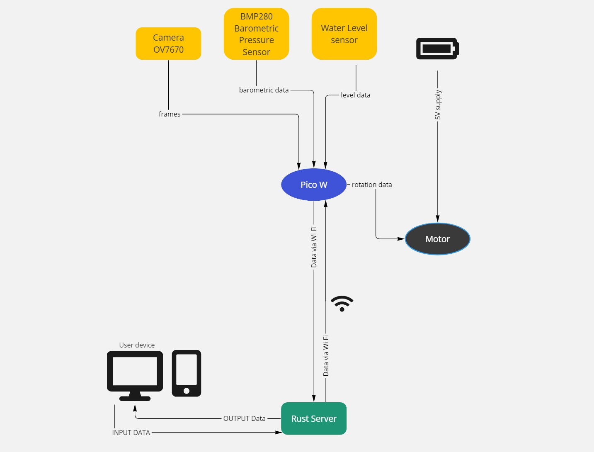
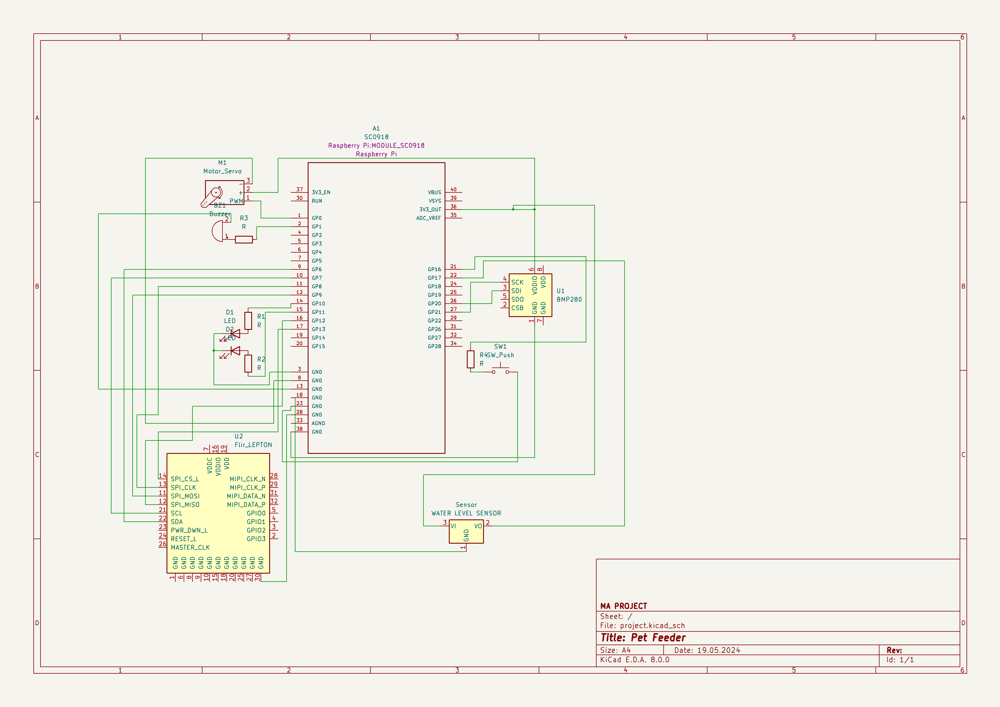
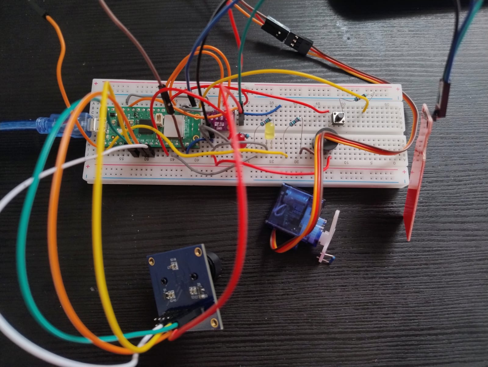
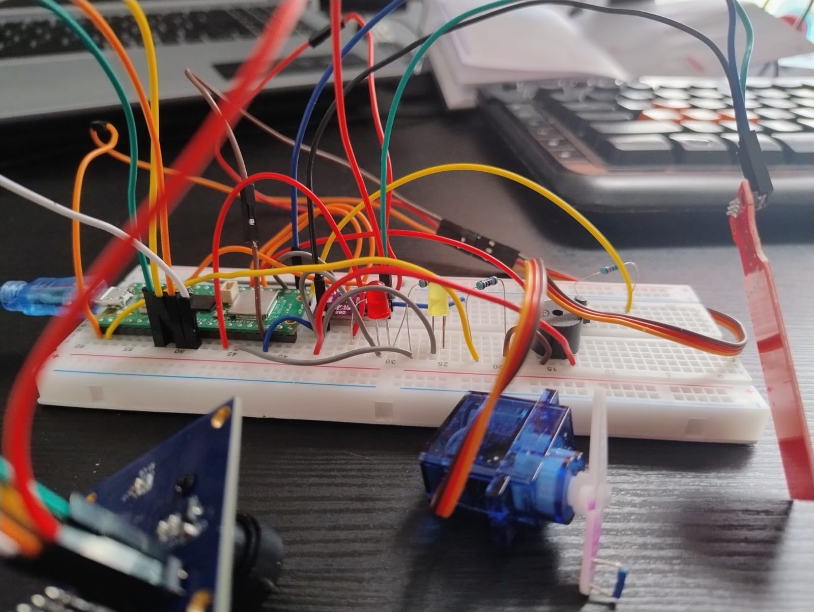
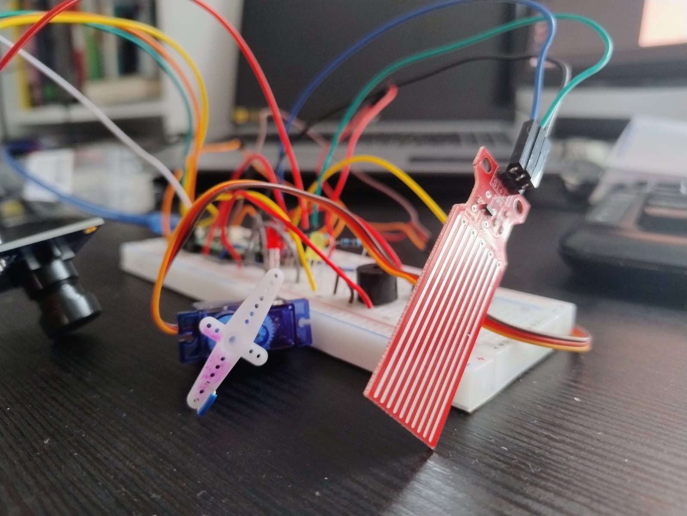

# Pet Feeder

Automatic food dispenser for animals

:::info

**Author**: FINICHIU Eduard Adelin \
**GitHub Project Link**: https://github.com/UPB-FILS-MA/project-EdwardAdelin.git

:::

## Description

I grew up with pets and animals around the house.
I was always upset because, as a family, we were very often not able to travel due to the need of finding someone that was able to feed the pets while we were in vacation.
That`s why I decided to create a Pet Feeder. It is a simple way to feed you pet and at the same time enjoy the holidays with family.
You just put some food in the Pet Feeder and the robot will feed your pet when he is very hungry.

## Motivation

I think that this would be a good solution for real-life problems that I have encountered. Even if it might come out as a really silly project, I`ll have fun using the hardware that I have bought.

## Architecture

Main Components:

Raspberry Pico: Acts as the central processing unit for the Pet Feeder, controlling the sensors and motors.

Barometric Sensor BMP280: Will be used to calculate temperature and pressure.

Camera OV7670: Used for capturing real time images.

Water Level Sensor: Detects if the minimum water level of the pet`s water resources is reached.

Electric Motors: Drives the mechanism to dispense the pet food.

Wi-Fi Module: Facilitates communication with external devices.

Power Supply: Provides the necessary power to all components at 5V.

Connection Overview:

Raspberry Pico:
Connects directly to:
Camera for monitoring the pet. Camera sends data to the owner.
Barometric Sensor for checking the status of the temperature. Owner recives the temperature at certain time intervals.
Water Level Sensor: Triggers an alarm in case of system failure and ensures minimal water level.
Electric motors for controlling food dispensing.
Wi-Fi module for external communication.
Powered by the main power supply.

The food will be stored in a special container. Owner of the pet can monitor the pet via camera images. When food level is low, owner can trigger the electric motor that provides food for the pet.
If the owner forgets to feed the pet and water level reaches critical status, the Pet Feeder send an alarm to the owner.
Barometric sensor offers the possibility of checking room temperature.

This architecture ensures seamless interaction between the components, allowing for efficient monitoring and control of the PetFeeder via the Raspberry Pico.

## Log

### Week 6 - 12 May

Bought hardware parts.
Mounted PICO on bread board. Wrote the code for barometric sensor. Tested PWM for servo.

### Week 7 - 19 May

Started hating PWM and put the whole thing together.
I did the KICAD schematic.

### Week 20 - 26 May

Implementing water level sensor and writing code for the rest of the hardware.

## Hardware

Pico W - brain of the Pet Feeder

Motor - delivers food

BMP280 - recives barometric data

OV7670 - captures images

Water Level sensor - no water, no current continuity

Power Supply - 4 \* R6 1.5V battery and a voltage divider to go at 5V

### Schematics

Kicad project also atached here in the folder and in the project repo.

Here are some pictures IRL:

### Bill of Materials

| Device                                                                                                               | Usage                  | Price                                                                                                                      |
| -------------------------------------------------------------------------------------------------------------------- | ---------------------- | -------------------------------------------------------------------------------------------------------------------------- |
| [Rapspberry Pi Pico W](https://www.raspberrypi.com/documentation/microcontrollers/raspberry-pi-pico.html)            | The microcontroller    | [35 RON](https://www.optimusdigital.ro/en/raspberry-pi-boards/12394-raspberry-pi-pico-w.html)                              |
| [BMP280](https://cdn-shop.adafruit.com/datasheets/BST-BMP280-DS001-11.pdf)                                           | The barometric sensor  | [9 RON](https://www.optimusdigital.ro/en/pressure-sensors/1666-modul-senzor-de-presiune-barometric-bmp280.html)            |
| [OV7670 Camera](https://web.mit.edu/6.111/www/f2016/tools/OV7670_2006.pdf)                                           | Camera                 | [16 RON](https://www.optimusdigital.ro/en/optical-sensors/624-modul-camera-ov7670.html)                                    |
| [Servo Motor](http://www.ee.ic.ac.uk/pcheung/teaching/DE1_EE/stores/sg90_datasheet.pdf)                              | The servo motor        | [14 RON](https://www.optimusdigital.ro/en/servomotors/26-sg90-micro-servo-motor.html?search_query=servo+motor&results=196) |
| [Water level sensor](https://circuitdigest.com/microcontroller-projects/interfacing-water-level-sensor-with-arduino) | The water level sensor | [2 RON](https://www.optimusdigital.ro/en/others/272-senzor-de-nivel-al-apei.html)                                          |

## Software

| Library                                                          | Description            | Usage                                                                                                                   |
| ---------------------------------------------------------------- | ---------------------- | ----------------------------------------------------------------------------------------------------------------------- |
| [bmp280](https://crates.io/crates/bmp280)                        | BMP280 sensor          | Barometric sensor will be used to calculate pressure and temperature.                                                   |
| [pwm](https://docs.rs/pwm-pca9685/latest/pwm_pca9685/)           | Pulse-width modulation | Traits for the RP2040 microcontroller used for controlling the servo motor.                                             |
| [embassy](https://github.com/embassy-rs/embassy)                 | Embassy                | Asynchronous executor and HAL (Hardware Abstraction Layer) for building embedded applications in Rust.                  |
| [embassy-network](https://github.com/embassy-rs/embassy-network) | Embassy Network        | Networking library for the Embassy asynchronous executor, enabling network communication in embedded Rust applications. |
| [image](https://crates.io/crates/image)                          | Image Processing       | Library for handling image manipulation tasks such as resizing, cropping, or object detection.                          |
| [rtc-pcf8523](https://crates.io/crates/rtc-pcf8523)              | Real-Time Clock (RTC)  | API for interacting with the PCF8523 real-time clock module for keeping track of time.                                  |

## Links

1. [Top 5 Pet Feeders](https://www.youtube.com/watch?v=vKdQXICO-r0&ab_channel=MrFlashPick)
2. [Project Inspiration](https://www.youtube.com/watch?v=U7KqqlYaXgY&ab_channel=NicoleZhang)
3. [Comercial product](https://mi-home.ro/products/xiaomi-smart-pet-food-feeder)
   ...
