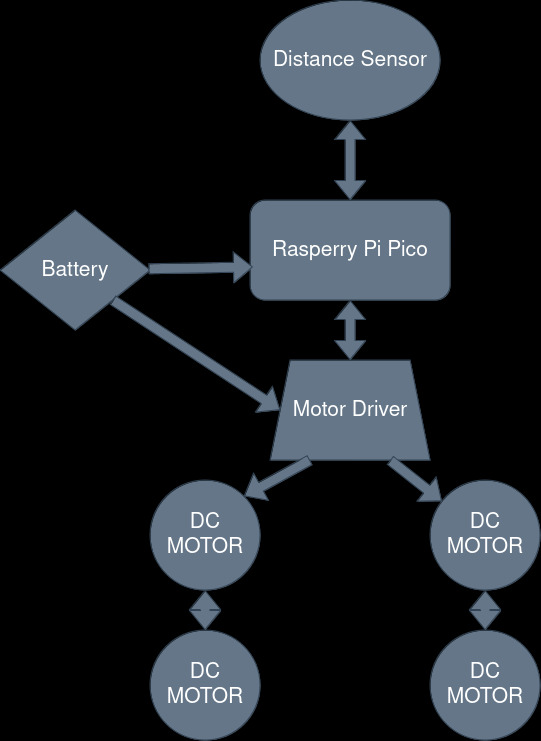
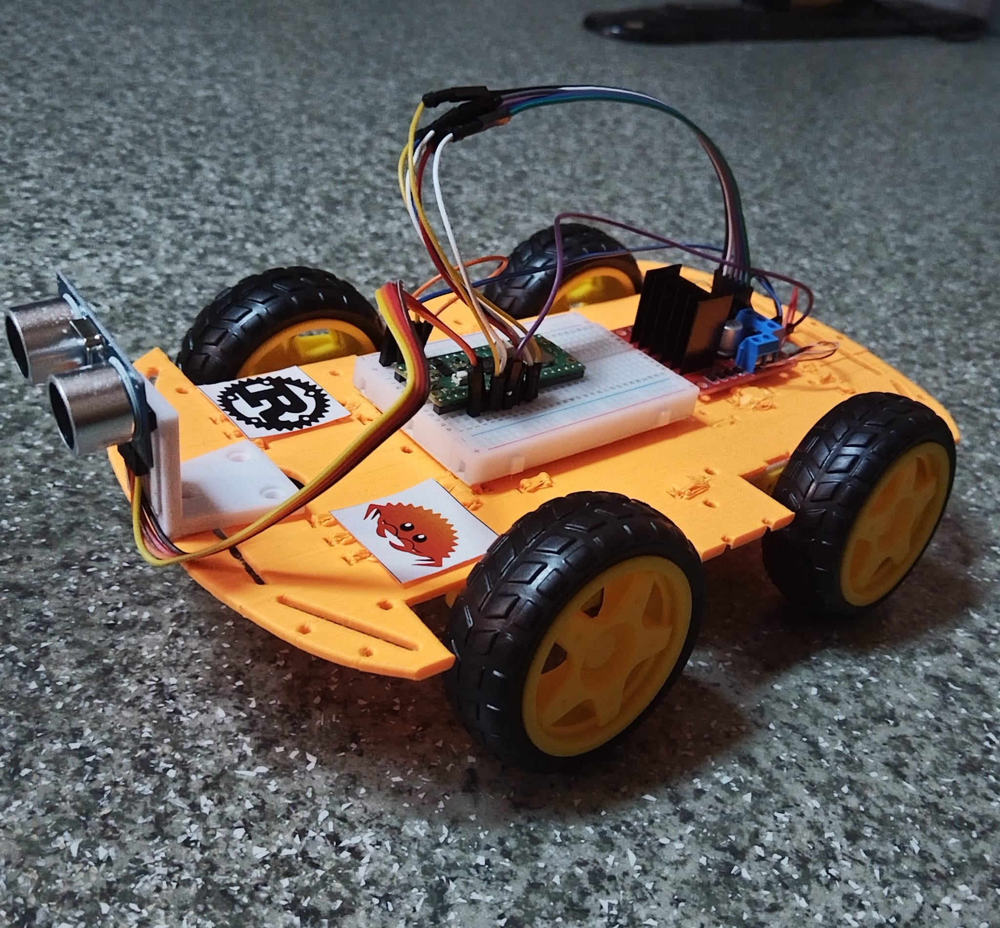
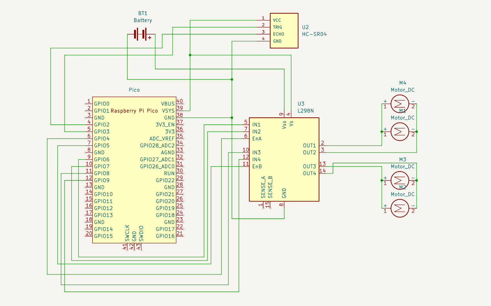

# Obstacltron

 A compact Raspberry Pi-powered robot adept at avoiding obstacles.

:::info 
**Author**: Matei Eduard Gabriel \
**GitHub Project Link**: [Obstacltron on GitHub](https://github.com/UPB-FILS-MA/project-lexofficial29)
:::

## Description

Obstacltron is an obstacle avoider robot built using Raspberry Pi Pico W. It utilizes an L298N motor driver, DC motors, and an HC-SR04 ultrasonic distance sensor.

## Motivation

The motivation behind this project was to create a simple yet effective robot that can navigate its environment autonomously by detecting and avoiding obstacles. This project aims to showcase practical applications of robotics and sensor integration while providing a platform for experimentation and learning.

## Architecture

* Raspberry Pi Pico W: Chosen as the microcontroller unit due to its affordability and versatility.

* L298N Motor Driver: Responsible for controlling the DC motors, offering bidirectional control and allowing precise manipulation of the robot's movement.

* HC-SR04 Ultrasonic Sensor: Serves as the primary sensor for obstacle detection, utilizing ultrasonic waves to measure distances accurately.

* DC Motors: These motors are the driving force behind the robot's movement, enabling it to navigate its environment.

### Components
- Raspberry Pi Pico W: Microcontroller unit
- L298N Motor Driver: Controls the DC motors
- HC-SR04 Ultrasonic Sensor: Detects obstacles
- DC Motors: Drive the robot's movement

### Connection
- Raspberry Pi Pico W and L298N Motor Driver are connected via GPIO pins.
- The DC motors are connected to the output terminals of the L298N Motor Driver.
- The HC-SR04 Ultrasonic Sensor is connected to the Raspberry Pi Pico W.

## Log

### Week 6 - 12 May

Acquired the required parts and researched the feasibility of the project. This phase involved understanding the specifications of each component and planning the integration.

### Week 7 - 19 May

Assembled all the parts and wired everything up. This step involved careful connection of the components according to the schematics and initial power-up testing to ensure all parts were functional. 

### Week 20 - 26 May

## Hardware

Hardware Diagram

Completed Robot

### Schematics

KiCad Schematic

### Bill of Materials

| Device                          | Usage              | Price              |
|---------------------------------|--------------------|--------------------|
| Raspberry Pi Pico W             | Microcontroller    | [35 RON](https://www.optimusdigital.ro/en/raspberry-pi-boards/12394-raspberry-pi-pico-w.html) |
| L298N Motor Driver              | Motor Driver       | [9 RON](https://www.optimusdigital.ro/en/brushed-motor-drivers/145-l298n-dual-motor-driver.html) |
| HC-SR04 Ultrasonic Sensor       | Distance sensor    | [7 RON](https://www.optimusdigital.ro/en/ultrasonic-sensors/9-hc-sr04-ultrasonic-sensor.html) |
| 2x 9V Battery                   | Power Source       | [5 RON](https://www.emag.ro/baterie-varta-superlife-zinc-carbon-9v-s1-4008496556632/pd/D0T5S3MBM/)

## Software

| Library                          | Description              | Usage              |
|---------------------------------|--------------------|--------------------|
| [embassy](https://github.com/embassy-rs/embassy) | Rust framework for embedded programming |  Used for writing correct, safe and asynchronous code, particularly targeted at embedded systems |
| [L298N](https://crates.io/crates/l298n) | Rust crate for L298N | Used for driving the motors |
| [HC-SR04](https://crates.io/crates/hc-sr04) | Rust crate for HC-SR04 distance sensor | Used for calculating the distance to the object in front |

## Links
**1. Inspiration video**: [Obstacle Avoider Youtube Video](https://www.youtube.com/watch?v=iajyaWi1Ln4)

**2. Inspiration video**: [Obstacle Avoider Youtube Video 2](https://www.youtube.com/watch?v=BhrrNtihIe8)

**3. Ultrasonic sensor**: [Datasheet](https://cdn.sparkfun.com/datasheets/Sensors/Proximity/HCSR04.pdf)

**4. L298N H-Bridge**: [Datasheet](https://pdf1.alldatasheet.com/datasheet-pdf/view/22440/STMICROELECTRONICS/L298N.html)
