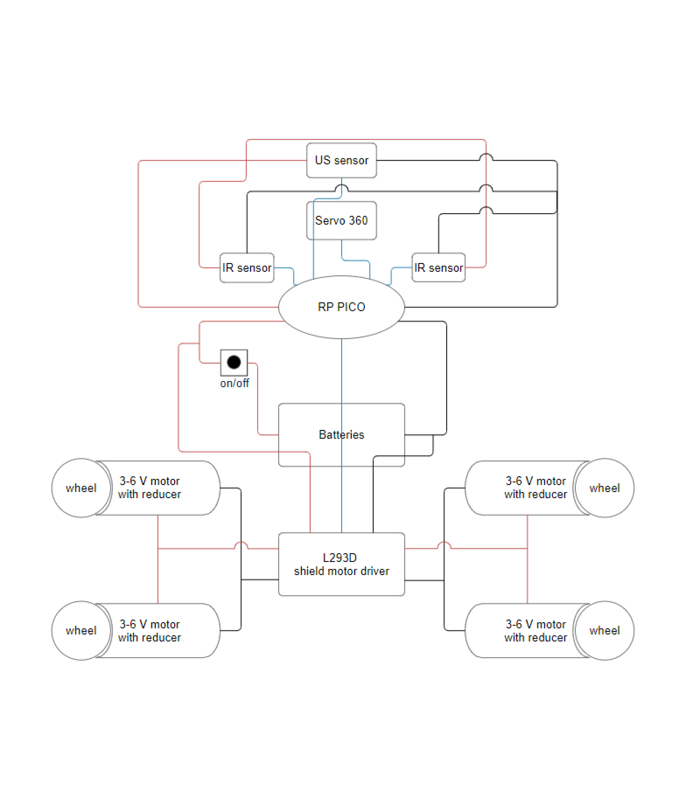
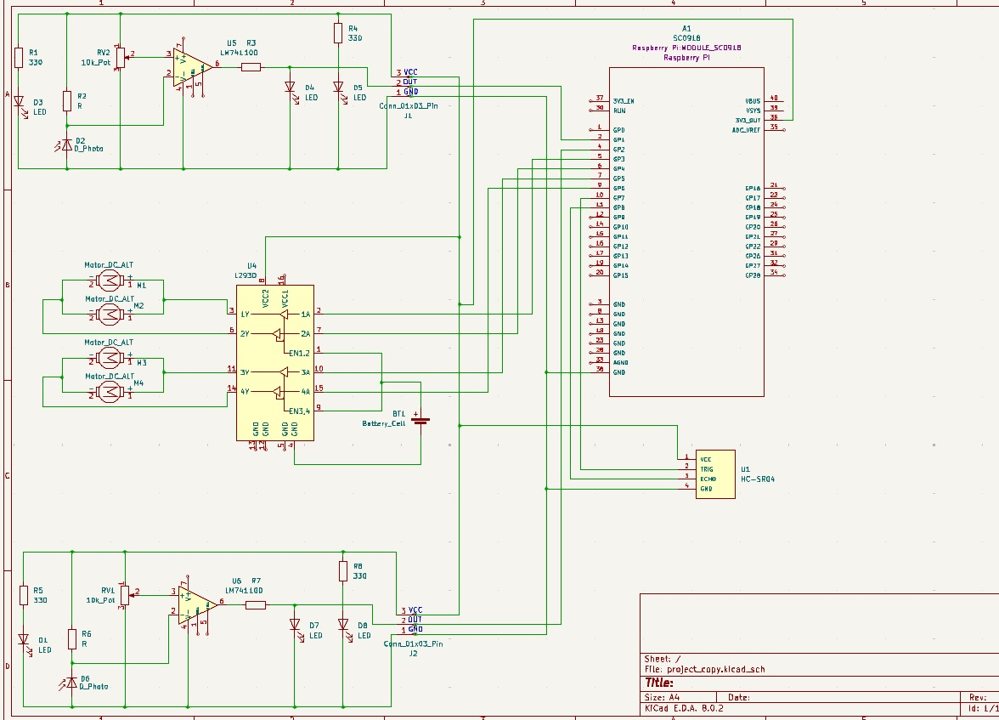

# Project Name
Line follower and obstacle avoiding robot

:::info 

**Author**: Bilciurescu Elena-Alina | Toma Daria-Maria \
**GitHub Project Link**: https://github.com/UPB-FILS-MA/project-ALINA308

:::

## Description

 This robotics project implements both line following and obstacle avoiding to a robot of relatively small stature. An important part of this project is the use of mathematical algorithms for optimisation in both the line following and the obstacle avoiding functionalities. For the line follower, we are using a PID algorithm instead of a Bang-Bang approach, so that the movements are smoother and more precise. When avoiding obstacles, the robot is calculating the shortest trajectory needed to avoid the said obstacle by using the ultrasonic sensor that is mounted on a 360 degrees servo motor on the top part of he robot. Each of the four DC motors with reducer has a wheel mounted on it and the motors are coordinated by a L293D motor shield.

## Motivation

 We wanted to combine two of the most useful and widespread robotics projects and optimize them using mathematical algorithms. We also consider that a project that combines these two functionalities has not already been done in the rust programming language, and we wanted to see the differenes between building this type of project in rust and other programming languages. We consider this project a great learning opportunity to develop both new software and hardware skills, while also exploring the challenges and advantages of implementing a multifunctional robotics project in the Rust programming language.

## Architecture 

The main parts of this robot are:
- line detection module (composed of te two infrared sensors)
- obstacle avoiding module (composed of the ultrasonic sensor and the servo motor it is munted on)
- the power supply (batteries)
- the raspberry pi pico
- the chassis with the 4 wheels and dc motors
  

## Log

<!-- write every week your progress here -->

### Week 6 - 12 May

### Week 7 - 19 May

### Week 20 - 26 May

## Hardware

- The raspberry pi pico: the "brain" behind the robot.
- The infrared sensors: used for the line detection.
- The ultrasonic sensor: used to detect distances and to avoid the obstacles.
- The 3-6 V dc motors with reducers are used to move and steer the robot.
- The L293D Motor Control Shield: controlling the speed and direction of each motor independently.
- The battery storage case for the power supply (AAA batteries)
  
### Schematics




### Bill of Materials

<!-- Fill out this table with all the hardware components that you might need.

The format is 
```
| [Device](link://to/device) | This is used ... | [price](link://to/store) |

```

-->

| Device | Usage | Price |
|--------|--------|-------|
| [Rapspberry Pi Pico W](https://www.raspberrypi.com/documentation/microcontrollers/raspberry-pi-pico.html) | The microcontroller | [35 RON](https://www.optimusdigital.ro/en/raspberry-pi-boards/12394-raspberry-pi-pico-w.html) |
| [Ultrasonic sensor HC-SR04](https://howtomechatronics.com/tutorials/arduino/ultrasonic-sensor-hc-sr04/) | Obstacle detection and measurement | [6.49 RON](https://www.optimusdigital.ro/ro/senzori-senzori-ultrasonici/9-senzor-ultrasonic-hc-sr04-.html?search_query=ultrasonic&results=51) |
| [Infrared IR sensor mode](https://ai.thestempedia.com/docs/evive/evive-tutorials/what-is-an-ir-sensor/) | Obstacle avoidance | [17.56 RON](https://ardushop.ro/ro/electronica/41-modul-senzor-ir-infrarosu-evita-obstacole.html?search_query=ir+sensor&results=1047) |
| [L293D Dual Motor Driver Module](https://5.imimg.com/data5/PX/UK/MY-1833510/l293d-based-arduino-motor-shield.pdf) | Motor control | [15.46 RON](https://www.optimusdigital.ro/en/pwmservo-controllers/987-l293d-motor-control-shield-motor-drive-expansion-board.html) |
| [3V-6V DC motor with reducer 1:48](https://www.egr.msu.edu/classes/ece480/capstone/spring13/group07/downloads/files/Application_Note_Ted.pdf) | Drive motors | [19.28 RON](https://ardushop.ro/ro/electronica/64-motor-dc-3v-6v-cu-reductor-148.html) |
| [Big wheels](https://www.ourpcb.com/robot-wheels.html) | Movement | [42.84 RON](https://ardushop.ro/ro/home/63-riata-roboti-cauciuc-65mm-diametru.html?search_query=ROATA+ROBOTI&results=73) |
| [Chassis](https://www.futurelearn.com/info/courses/robotics-with-raspberry-pi/0/steps/75882) | Structural support | [42.84 RON](https://www.filamente3d.ro/filamente/filament-polymaker-polyterra-pla-sakura-pink-roz-1kg) |
| [Battery](https://manlybattery.com/the-essential-guide-to-selecting-batteries-for-robotics/) | Power supply | [39.98 RON](https://onecoolgagdet.com/products/acumulator-li-ion-26650-3-7v-6800mah?variant=48167503462741&currency=RON&utm_medium=product_sync&utm_source=google&utm_content=sag_organic&utm_campaign=sag_organic&gad_source=1&gclid=CjwKCAjw_e2wBhAEEiwAyFFFo-FtlTpKJDm-uLhe_iMoYiMQdYJkTt9NDnGmBGj9qN61KE8tK6fMERoC4cUQAvD_BwE) |
| [Mini breadboard](https://www.kevsrobots.com/resources/how_it_works/breadboards.html) | Electrical connections | [2.35 RON](https://www.optimusdigital.ro/en/breadboards/244-white-mini-breadboard.html?search_query=breadboard&results=413) |
| [Wires](https://blog.sparkfuneducation.com/what-is-jumper-wire) | Electrical connections | [10 RON](https://www.optimusdigital.ro/en/wires-with-connectors/889-set-fire-tata-tata-10p-20-cm.html?search_query=Wires&results=562) |
| [Micro USB cable](https://www.wiringo.com/micro-usb-cable-the-ultimate-guide-on-how-to-choose.html) | Programming and power connection | [6.95 RON](https://www.optimusdigital.ro/en/usb-cables/497-micro-usb-1-m-black-cable.html?search_query=Micro+USB+cable&results=236) |


## Software

| Library | Description | Usage |
|---------|-------------|-------|
| [infrared](https://docs.rs/infrared/latest/infrared/) | Infrared sensor library | Used for the sensors that will track the line |
| [ultrasonic](https://docs.rs/hc-sr04/latest/hc_sr04/) | Ultrasonic sensor library | Used for the sensors that will avoid the obstacles |
| [embassy_rp](https://docs.embassy.dev/embassy-rp/git/rp2040/index.html) | Embassy Hardware Abstraction Layer (HAL) for the Raspberry Pi RP2040 microcontroller | Used to program the Pico |
| [embassy-executor](https://crates.io/crates/embassy-executor) | An async/await executor designed for embedded usage | Used for task execution |
| [syact](https://docs.rs/syact/latest/syact/) | A library for controlling stepper motors, servo motors and more complex assemblies using said motors. | Used for controlling the motor shield |


## Links

<!-- Add a few links that inspired you and that you think you will use for your project -->

1. [PID Controller based Line Following and Obstacle Avoidance Two Wheeled Robot](https://www.ijert.org/research/pid-controller-based-line-following-and-obstacle-avoidance-two-wheeled-robot-IJERTCONV7IS02026.pdf)
2. [Two wheeled Line Follower using PID](https://www.youtube.com/watch?v=QoNkpnpvEqc&ab_channel=ShyamRavi)
...
