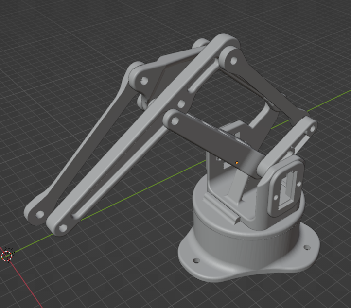
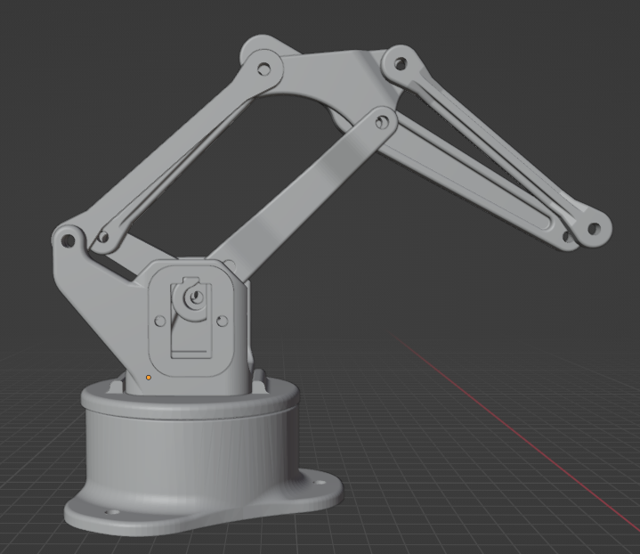
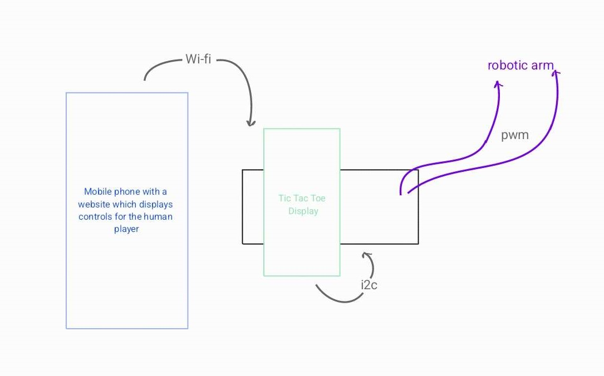
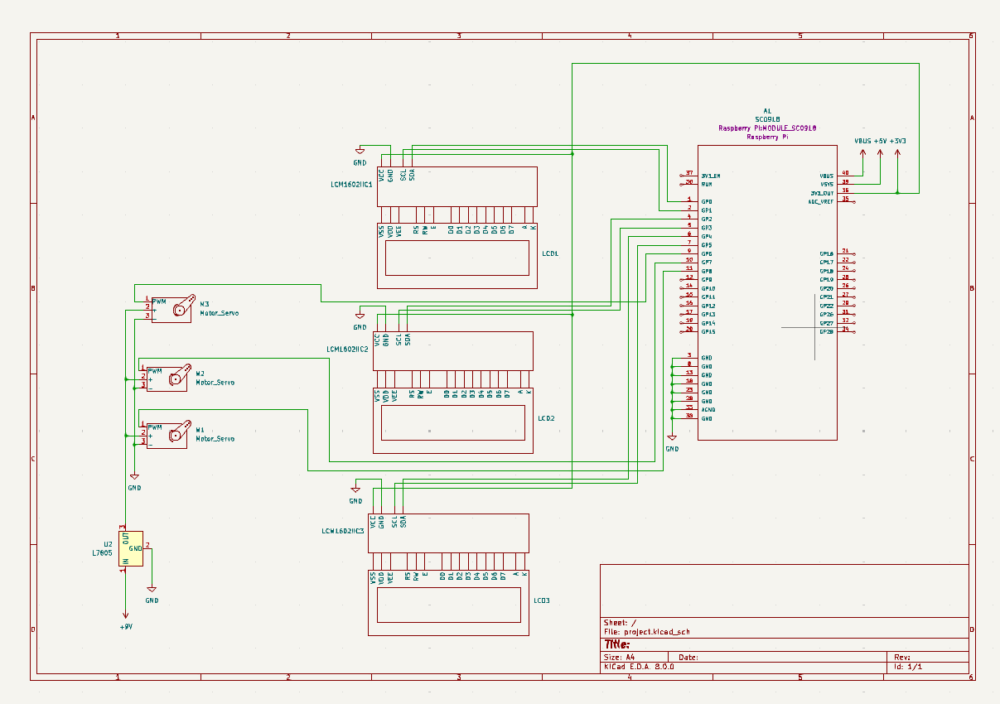
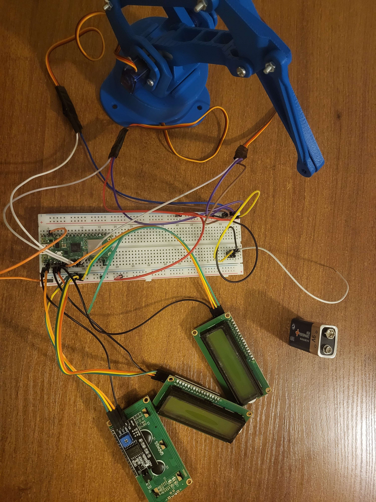
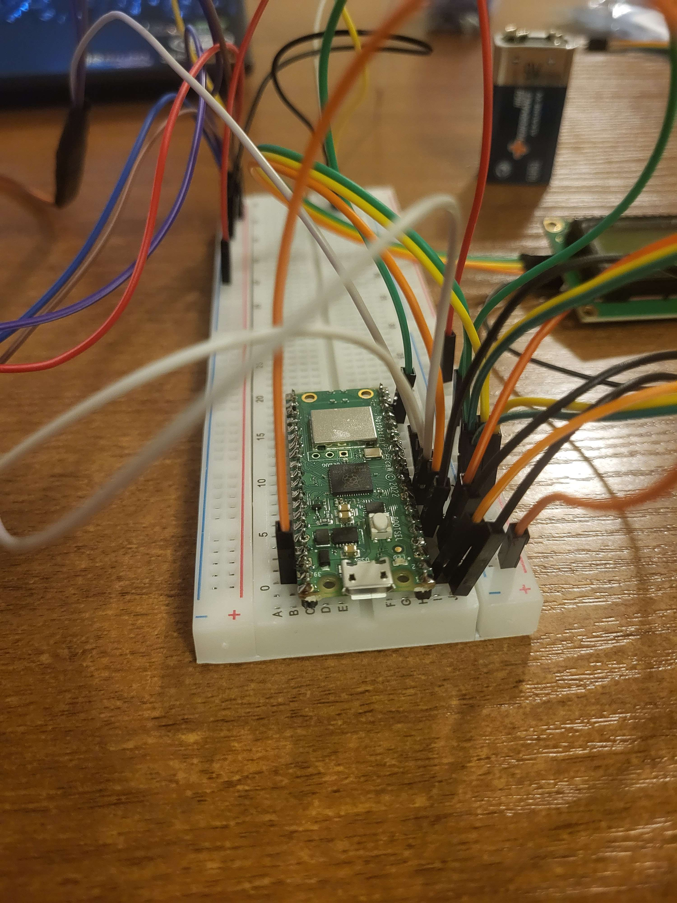
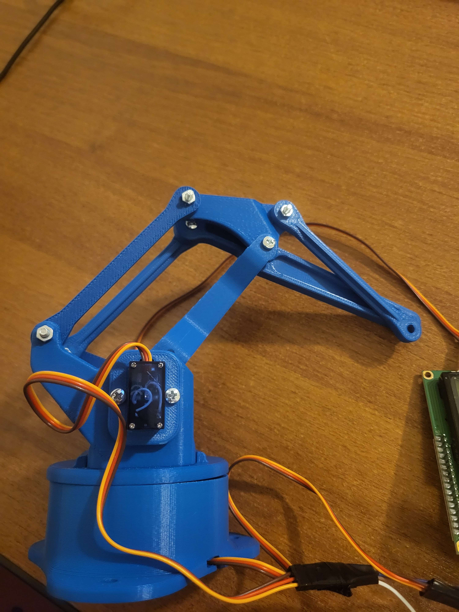

# Robo Tic Tac Toe
An interactive game of tic tac toe against a robotic arm.

:::info 

**Author**: Emma Răchițeanu \
**GitHub Project Link**: https://github.com/UPB-FILS-MA/project-emma-rachiteanu

:::

## Description

Robo Tic Tac Toe provides engaging gameplay in which a human player competes against a pre-programmed robotic arm. For simplicity, the game features a display board to which the robotic arm points to indicate its move. Players use a control panel on a website, with each control corresponding to a different space on the game board where the move will be executed. This information is transmitted via Wi-Fi to the micro-controller, enabling it to make its move.

## Motivation

For this project, I aimed to create something both fun and intricate. Merely creating a game felt insufficient, so I decided to build a robotic arm to enhance the interaction. I chose tic tac toe because it is relatively straightforward to program, making it the ideal game for this task. I found this approach to be both innovative and enjoyable.

## Architecture 

- _Microcontroller_: The Raspberry Pi Pico microcontroller handles input from the mobile website and processes it to determine subsequent moves. The programming aims to maximize the robotic arm's chances of winning.
- _Display_: This component displays game data on a 3x3 grid filled with X's and O's. The display is sized to allow for pointer inaccuracies.
- _Mobile website_: This site features a simple 3x3 grid design, acting as the control interface for the player. Inputs are transmitted to the microcontroller via Wi-Fi.
- _Robotic arm_: After the microcontroller decides on a move, the robotic arm points to one of the nine grid positions. Both servos adjust continuously to ensure accuracy. The lower servo is equipped with an L-shaped component to enable slight rotation, while the upper servo has a longer attachment to ensure it can reach all positions.

## Log

<!-- write every week your progress here -->

### Week 6 - 12 May
In the first week, I focused on figuring out the hardware and getting started on the tic tac toe code.

### Week 7 - 19 May
I finished the STL files for the robotic arm and finished the hardware part.

### Week 20 - 26 May

## Hardware

1. The Arm
Three servo-motors are used: one is for spinning the circular plate, moving the arm left and right, while the other two are for extending and retracting the arm. They are powered using a 9V battery and a 5V Voltage regulator.
The robotic arm functions using servo motors capable of lifting up to 750g at 5V, which maneuver 3D-printed components forming the structure of the arm. These components are designed with minimal infill to ensure they are lightweight enough for smooth movement. The pointer is mounted loosely on an axis, allowing it to maintain vertical orientation consistently.

2. Display 
Three LCD displays are mounted on the Pico, each containing a row of X's or O's.

### Schematics

### Bill of Materials

<!-- 
| [Device](link://to/device) | This is used ... | [price](link://to/store) |
-->

| Device | Usage | Price |
|--------|--------|-------|
| [Rapspberry Pi Pico W](https://www.raspberrypi.com/documentation/microcontrollers/raspberry-pi-pico.html) | The microcontroller | [35 RON](https://www.optimusdigital.ro/en/raspberry-pi-boards/12394-raspberry-pi-pico-w.html) |
| [3* Servo Motor SG90 9g](https://datasheetspdf.com/datasheet-pdf/791970/SG90.html) | The servomotors | [45 RON](https://www.emag.ro/servomotor-sg90-180-de-grade-ai0156-s297/pd/D33V1GMBM/) |
| [3* LCD 1602 i2c](https://www.openhacks.com/uploadsproductos/eone-1602a1.pdf) | Display of the game | [48 RON](https://www.optimusdigital.ro/ro/optoelectronice-lcd-uri/2894-lcd-cu-interfata-i2c-si-backlight-albastru.html?search_query=LCD+1602+cu+Interfata+I2C+si+Backlight+Albastru&results=2) |
| [PLA Fillament](https://www.eshop.formwerk.ro/cumpara/filament-extrudr-pla-nx2-matt-1196) | Plastic fillament | [125 RON](https://www.eshop.formwerk.ro/cumpara/filament-extrudr-pla-nx2-matt-1196) |
| [L7805](https://www.sparkfun.com/datasheets/Components/LM7805.pdf) | 5V Voltage regulator | [2 RON](https://www.optimusdigital.ro/ro/electronica-de-putere-stabilizatoare-liniare/937-l7805-stabilizator-de-tensiune-de-5-v-to-220.html?search_query=lm+7805+ic&results=7#idTab5) |

## Software

| Library | Description | Usage |
|---------|-------------|-------|
| [embedded-graphics](https://github.com/embedded-graphics/embedded-graphics) | 2D graphics library | Used for displaying the tic tac toe grid |
| [pwm](https://docs.embassy.dev/embassy-nrf/git/nrf52840/pwm/index.html) | Pulse-width modulation | Used for controlling the servos |
| [rp2040-hal](https://docs.rs/rp2040-hal/latest/rp2040_hal/) | Hardware Abstraction Layer (HAL) for the RP2040 microcontroller | For managing the I2C communication for the display and PWM signals for controlling the servos |
| [rppal](https://docs.rs/rppal/latest/rppal/) | Used for interacting with the hardware features | Useful for managing the GPIO, I2C, PWM, etc |

## Links

<!-- Add a few links that inspired you and that you think you will use for your project -->

1. [servo documentation + code snippet in python](https://docs.sunfounder.com/projects/ultimate-sensor-kit/en/latest/components_basic/27-component_servo.html)
2. [robot arm with the GPIO mapping](https://github.com/Makerfabs/PICO_Merchanical_Hand_Driver)
3. [tic tac toe code logic for C++ or Python](https://www.geeksforgeeks.org/implementation-of-tic-tac-toe-game/)
4. [i2c lcd display](https://microcontrollerslab.com/i2c-lcd-raspberry-pi-pico-micropython-tutorial/)
