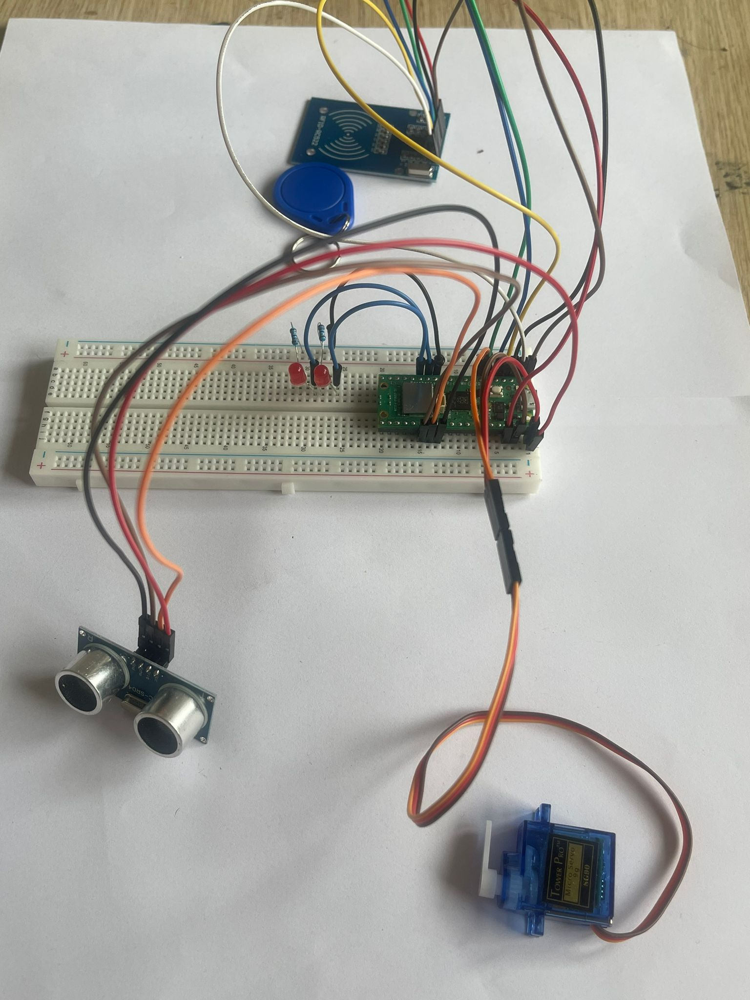

# Security Door

This project creates a nfc-protected automatic door system using a Raspberry Pi, microcontroller, and sensor.

:::info

*Author*: Alkhalidy Essam \
*GitHub Project Link*: https://github.com/UPB-FILS-MA/project-esxm

:::

## Description

This project is designed to create an automated door system that operates based on a nfc input. The door will open using a servo motor. An integrated sensor ensures the door remains open only as long as needed and closes securely after entry is detected. The system is built around a Raspberry Pi and a separate microcontroller, combining robust processing capabilities with efficient real-time control.

## Motivation

1. Practical Application of Skills: This project provides a comprehensive platform to apply and enhance a range of technical skills, including programming, electronics, mechanical system design, and systems integration. It's an excellent opportunity to work hands-on with both software and hardware components, thus deepening your understanding of how multiple systems interact.

2. Problem-Solving Challenge: Designing a system that requires synchronization between software and hardware presents complex problem-solving opportunities. It challenges you to think critically about issues like secure access, reliable mechanical movement, real-time data processing, and user interface design.

3. Innovation and Customization: An automated door system allows for a great deal of innovation and customization. You can tailor security features, such as password complexity, encryption, or even biometric authentication. The project can also be expanded to include IoT connectivity, enabling remote monitoring and control.

4. Interdisciplinary Learning: This project spans multiple disciplines—computer science, electrical engineering, mechanical engineering, and information security. Such an interdisciplinary approach can significantly broaden your learning and might open up new areas of interest.

5. Real-World Utility and Impact: Automated door systems have significant real-world applications in residential, commercial, and industrial settings. By working on this project, you can contribute to solutions that improve security and accessibility, potentially leading to entrepreneurial opportunities or impactful research projects.

## Architecture

Add here the schematics with the architecture of your project. Make sure to include:

## Log

<!-- write every week your progress here -->

### Week 6 - 12 May
managed to make the ultra somic work,the servo motor had some problems so i ordered a new one, changed the inout for openning the door from a password keypad to a nfc
### Week 7 - 19 May
the nfc and the new servo motor arrived and managed to make them work properly with the senzor, added to leds one lights green when the door is open and the other lights red when door closed
### Week 20 - 26 May

## Hardware

so there are 3 main parts beside the microcontroller 1.servo motor ,2.nfc ,3.ultrasonic senzor.
the servo motor opens the door only from the input taken from the nfc and closes the door with the input taken from the senzor.
there are also 2 leds one lights green when the door is open and when not the other lights red.

### Schematics

### Bill of Materials

<!-- Fill out this table with all the hardware components that you might need.

The format is 

| [Device](link://to/device) | This is used ... | [price](link://to/store) |

-->

| Device | Usage | Price |
|--------|--------|-------|
| [Rapspberry Pi Pico W](https://www.raspberrypi.com/documentation/microcontrollers/raspberry-pi-pico.html) | The microcontroller | [1 x 56.23 RON](https://ardushop.ro/ro/home/2819-raspberry-pi-pico-wh.html?search_query=WCBSTR_PICO_WH&results=108) |
| [4xAA Battery Holder](https://ardushop.ro/4684-thickbox_default/suport-baterii-4xaa.jpg) | battery holder | [2 x 4.39 RON](https://ardushop.ro/ro/home/65-suport-baterii-4xaa.html?search_query=XHFSRH_4xAAholder&results=1) |
| [830 Points Breadboard](https://ardushop.ro/4105-thickbox_default/breadboard-830.jpg) | breadboard | [1 x 10.14 RON](https://ardushop.ro/ro/electronica/33-breadboard-830.html?search_query=HTZAKJ_BB-830&results=47) | 
| [Set of Jumper Wires](https://ardushop.ro/6604-thickbox_default/65-x-jumper-wires.jpg) | jumper wires | [1 x 11.86 RON](https://ardushop.ro/ro/electronica/28-65-x-jumper-wires.html?search_query=QUKRNX_FJP-65&results=144) | 
| [Set of Resistances](https://ardushop.ro/7381-thickbox_default/set-rezistente-14w-600buc30-valori-10r-1m.jpg) | reistance | [1 x 12.29 RON](https://ardushop.ro/ro/electronica/212-set-rezistente-14w-600buc30-valori-10r-1m.html?search_query=PLCTHL_R-SET&results=425) | 
| [5mm LEDs](https://ardushop.ro/605-thickbox_default/led-5mm.jpg) | lights green when door open and red when closed| [10 x 0.45 RON](https://ardushop.ro/ro/electronica/299-led-5mm.html?search_query=GIISED_LED5_red&results=286#/10-culoare-rou) | 
| [Micro USB Cable](https://static.optimusdigital.ro/31356-large_default/cablu-micro-usb-1-m-alb.jpg) | micro usb cable | [RON](https://www.optimusdigital.ro/ro/cabluri-cabluri-usb/498-cablu-micro-usb-1-m-alb.html?search_query=0104210000002362&results=1) | 
| [Set of Male-Male Wires](https://static.optimusdigital.ro/48477-large_default/set-fire-tata-tata-10p-10-cm.jpg) | male-male wires | [1 x 2.85 RON](https://www.optimusdigital.ro/ro/fire-fire-mufate/885-set-fire-tata-tata-10p-10-cm.html?search_query=0104210000009040&results=1) | 
| [ultrasonic Sensor](https://www.optimusdigital.ro/ro/senzori-senzori-ultrasonici/2328-senzor-ultrasonic-de-distana-hc-sr04-compatibil-33-v-i-5-v.html?search_query=hc-sr0&results=35) | to see when te person has entered to close the door | [1 x 14.99 RON](https://www.optimusdigital.ro/ro/senzori-senzori-ultrasonici/2328-senzor-ultrasonic-de-distana-hc-sr04-compatibil-33-v-i-5-v.html?search_query=hc-sr0&results=35) | 
| [SG90 Servomotor](https://static.optimusdigital.ro/54859-large_default/micro-servomotor-sg90.jpg) | open amd closes the door | [1 x 13.99 RON](https://www.optimusdigital.ro/ro/motoare-servomotoare/26-micro-servomotor-sg90.html?search_query=0104110000001368&results=1) | 
| [NFC](https://www.optimusdigital.ro/ro/altele/1590-modul-nfc-pn532.html?search_query=nfc&results=22) | to introduce the password to unlock the door | [1 x 59.99 RON](https://www.optimusdigital.ro/ro/altele/1590-modul-nfc-pn532.html?search_query=nfc&results=22) | 
| [Set of Female-Male Wires](https://static.optimusdigital.ro/54998-large_default/set-fire-mama-tata-10p-30-cm.jpg) | female-male wires | [2 x 5.79 RON](https://www.optimusdigital.ro/ro/fire-fire-mufate/879-set-fire-mama-tata-10p-30-cm.html?search_query=0104210000008999&results=1) | 

## Software

| Library | Description | Usage |
|---------|-------------|-------|
| [embassy-time](https://docs.embassy.dev/embassy-executor/git/std/index.html) | Time management library | Delays & debouncing between button pressings |
| [embassy-rp](https://docs.embassy.dev/embassy-rp/git/rp2040/index.html) | Accessing peripherals | Interacting with peripherals (pins) |
| [embassy-executor](https://docs.embassy.dev/embassy-executor/git/std/index.html)| An async/await executor designed for embedded usage | Running multiple tasks simultaneously |
| [log](https://docs.embassy.dev/embassy-usb-logger/git/default/index.html) | Logging interface | Logging info or warning messages |
| [embassy-usb-logger](https://docs.embassy.dev/embassy-usb-logger/git/default/index.html) | USB implementation of the log crate | Logging info or warning messages over USB |

## Links

<!-- Add a few links that inspired you and that you think you will use for your project -->

1. [Anti-Theft Door Code Lock w RP Pico](https://www.youtube.com/watch?v=Jg0W165iHYk)
2. [Servo Motor Door Project](https://youtu.be/o263P5RVYc0?si=v0RRp57XY6DXxYQ4)
3. [Simple Automatic Car Parking Toll Gate System](https://www.youtube.com/watch?v=O7yoa-hwnkI)
