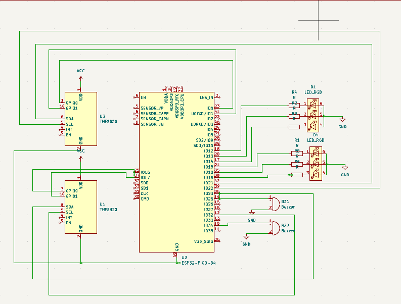

# Parking Sensor

Rust-Powered Parking Sensor with using Rasberry Pi Pico


:::info 

**Author**: Filip Denisa-Mihaela
**GitHub Project Link**: https://github.com/FilipDenisa/upb-fils-ma.github.io/edit/main/docs/project/2024/filip.denisa

:::

## Description

This project involves designing and implementing a parking sensor system using a microprocessor. The system includes two distance sensors, two RGB LEDs, two buzzers, and an LCD to provide visual and audio feedback to the driver about the proximity of obstacles.

 Objectives
- To design a functional parking sensor system.
- To integrate multiple hardware components with raspberry pi wh.
- To develop software for real-time processing of sensor data and output control.

 Scope
The project covers the design, implementation, and testing of a parking sensor system suitable for use in vehicles.


## Motivation

The motivation behind this project is driven by the need to enhance vehicle safety and convenience through the integration of technology. Parking is a common challenge for drivers, often leading to minor accidents and vehicle damage. By developing a parking sensor system, we aim to provide a reliable solution that aids drivers in safely maneuvering their vehicles in tight spaces.


## Log

<!-- write every week your progress here -->

### Week 6 - 12 May
-I decided on the theme of the project and informed myself of the necessary steps;
-I purchased the necessary parts for the implementation of the project;
-I started creating the prototype.


### Week 7 - 19 May
-I made the diagram in kicad;
-I did the hardware part of the project completely;
-I created a draft on the software side, to be edited.


### Week 20 - 26 May


  

  

  

### Schematics


Schematic of the project on KiCad Application.




### Bill of Materials

<!-- Fill out this table with all the hardware components that you might need.

The format is 
```
| [Device](link://to/device) | This is used ... | [price](link://to/store) |

```

-->

| Device | Usage | Price |
|--------|--------|-------|
| [Rapspberry Pi Pico WH]([https://www.raspberrypi.com/documentation/microcontrollers/raspberry-pi-pico.html](https://ardushop.ro/en/home/2819-raspberry-pi-pico-wh.html]) | The microcontroller | [56.23 RON]|
| [LCD 1602] ([https://www.optimusdigital.ro/ro/optoelectronice-lcd-uri/62-lcd-1602-cu-interfata-i2c-si-backlight-galben-verde.html?search_query=lcd&results=211])|lcd screen To display distance information| [14.99 RON]|
| [LED RGB] ([https://www.optimusdigital.ro/ro/optoelectronice-led-uri/484-led-rgb-anod-comun.html?search_query=rgb&results=126&HTTP_REFERER=https%3A%2F%2Fwww.optimusdigital.ro%2Fro%2Fcautare%3Fcontroller%3Dsearch%26orderby%3Dposition%26orderway%3Ddesc%26search_query%3Drgb%26submit_search%3D])|For visual indication of distance.|[0.99RON]|
|[Digital Infrared Obstacle Sensor Module] ([https://www.optimusdigital.ro/ro/senzori-senzori-optici/4347-modul-senzor-de-obstacole-digital-cu-infrarosu-reglabil-3-100-cm.html?search_query=senzor+infrarosu&results=121&HTTP_REFERER=https%3A%2F%2Fwww.optimusdigital.ro%2Fro%2Fcautare%3Fcontroller%3Dsearch%26orderby%3Dposition%26orderway%3Ddesc%26search_query%3Dsenzor%2Binfrarosu%26submit_search%3D])|distance measurement|[19.99 RON]|
|[Buzzer] ([https://www.optimusdigital.ro/ro/audio-buzzere/12247-buzzer-pasiv-de-33v-sau-3v.html?search_query=buzzer&results=62])|For auditory alerts.| [1.95 RON]|
|[Breadboard kit]|([https://www.optimusdigital.ro/ro/kituri/2222-kit-breadboard-hq-830-p.html?search_query=breadboard&results=145])| To connect the hardware|[22 ron]|


## Software

| Library | Description | Usage |

| [ag-lcd](https://github.com/mjhouse/ag-lcd) | Display Library | Used for I2C LCD Display |
| [embassy-rp](https://github.com/embassy-rs/embassy/tree/main/embassy-rp) | RP2040 Peripherals | Used for accessing the peripherals|
| [embassy-time](https://github.com/embassy-rs/embassy/tree/main/embassy-time) | Time Library | Used for Timeouts and Delays |
| [PWM](https://docs.embassy.dev/embassy-nrf/git/nrf52840/pwm/index.html) | Pulse-Width Modulation | Used for Buzzer |
| [embassy-executor](https://docs.embassy.dev/embassy-executor/git/std/index.html) | Executor for Rust Embedded Systems | Used for task scheduling and asynchronous programming |
| [embassy-usb-logger](https://docs.embassy.dev/embassy-usb-logger/git/default/index.html) | USB Logger for embassy | Used for logging messages over USB |
| [GPIO](https://docs.embassy.dev/embassy-stm32/git/stm32c011d6/gpio/index.html) | GPIO  | Used for interacting with GPIO Pins |
| [embassy-usb-logger](https://docs.embassy.dev/embassy-usb-logger/git/default/index.html) | USB Logger for embassy | Used for logging messages over USB |


## Links

1. [Pinouts for RP](https://pinout.xyz/pinout/1_wire)
2. [Crates](https://crates.io)
3. [Rust for Embedded Systems](https://docs.rs)
4. [RP2040 Datasheet](https://datasheets.raspberrypi.com/rp2040/rp2040-datasheet.pdf)
5. [Embassy Documents](https://embassy.dev/book/dev/index.html)
6. [Rust For Embedded Wyliodrin](https://embedded-rust-101.wyliodrin.com)

...
