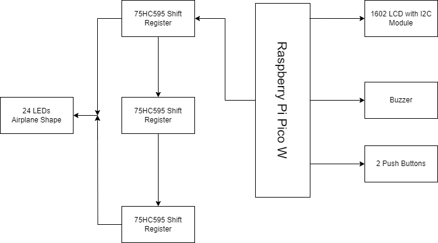
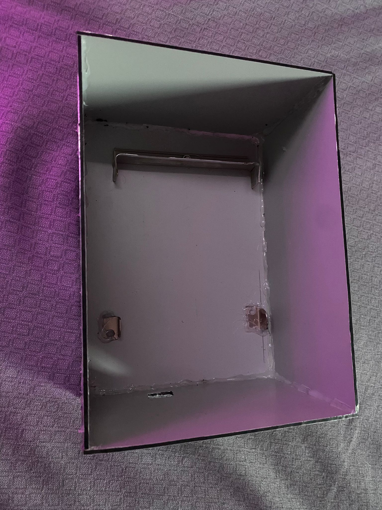
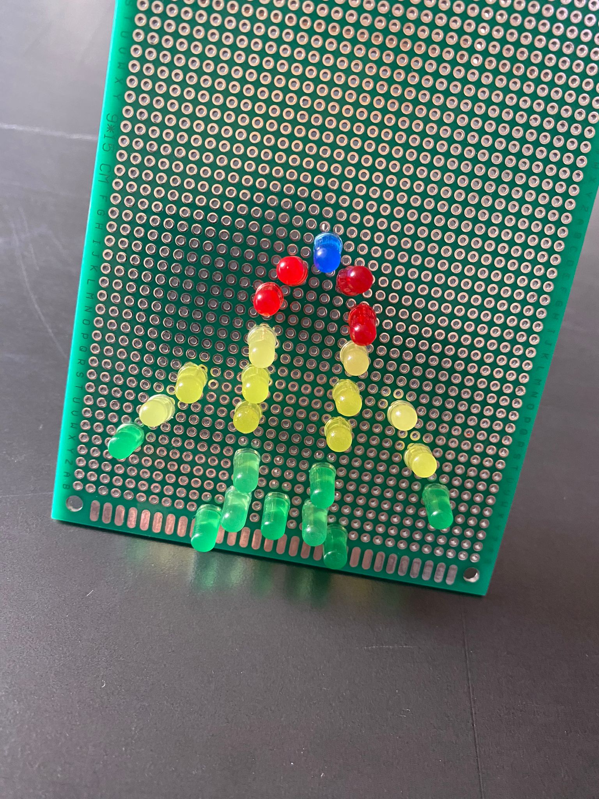
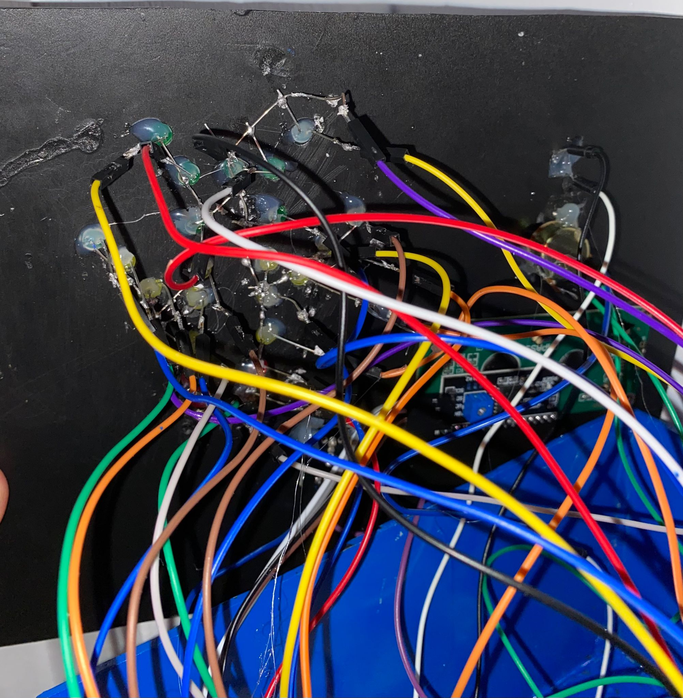
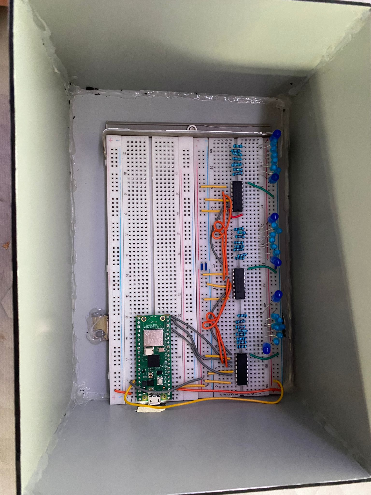
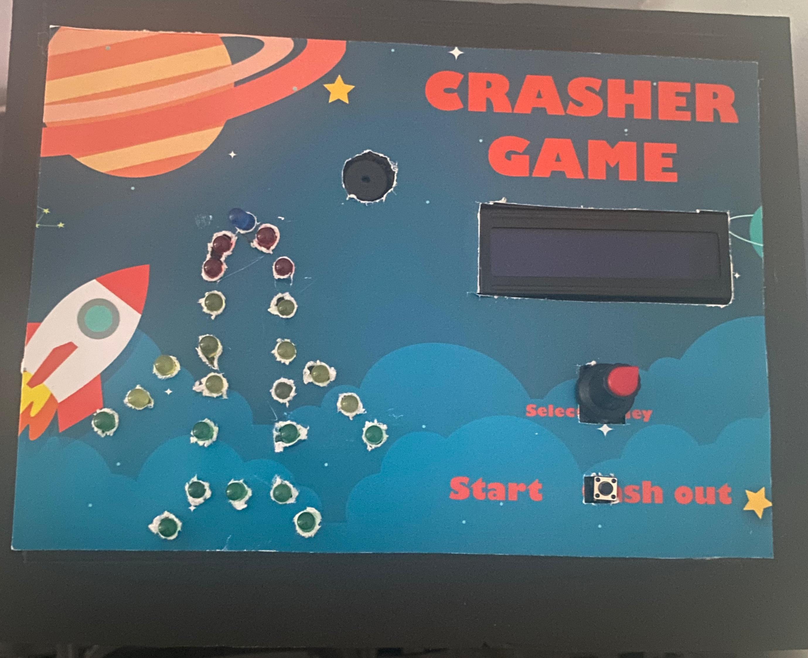
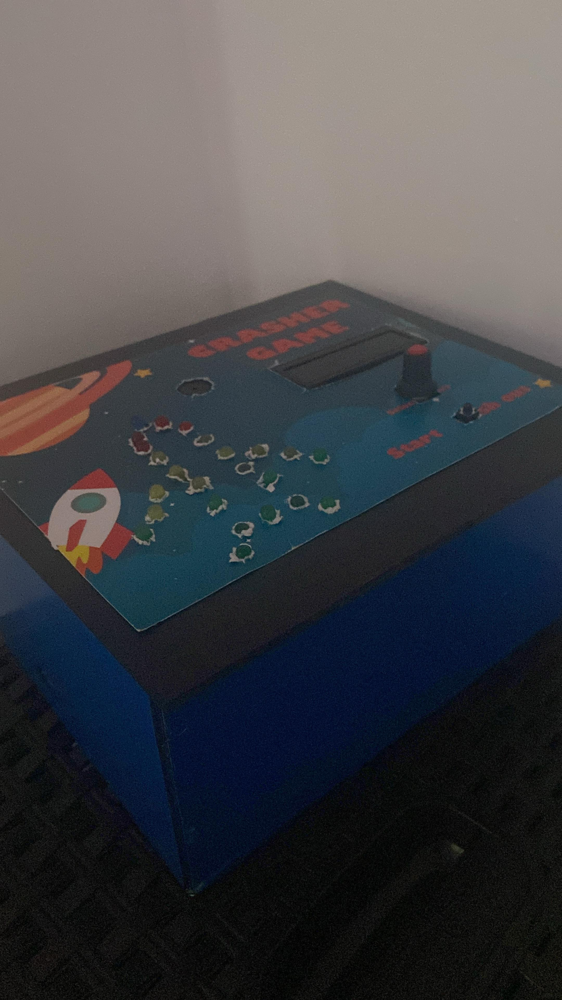
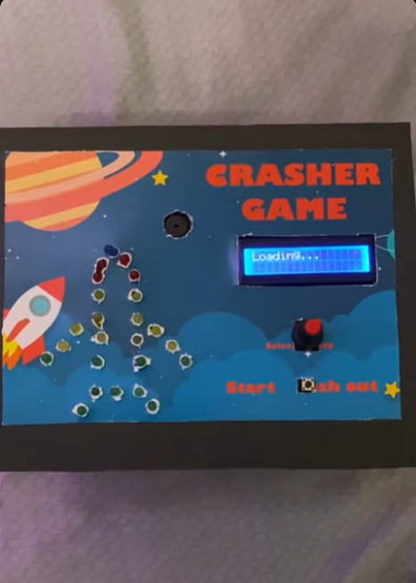
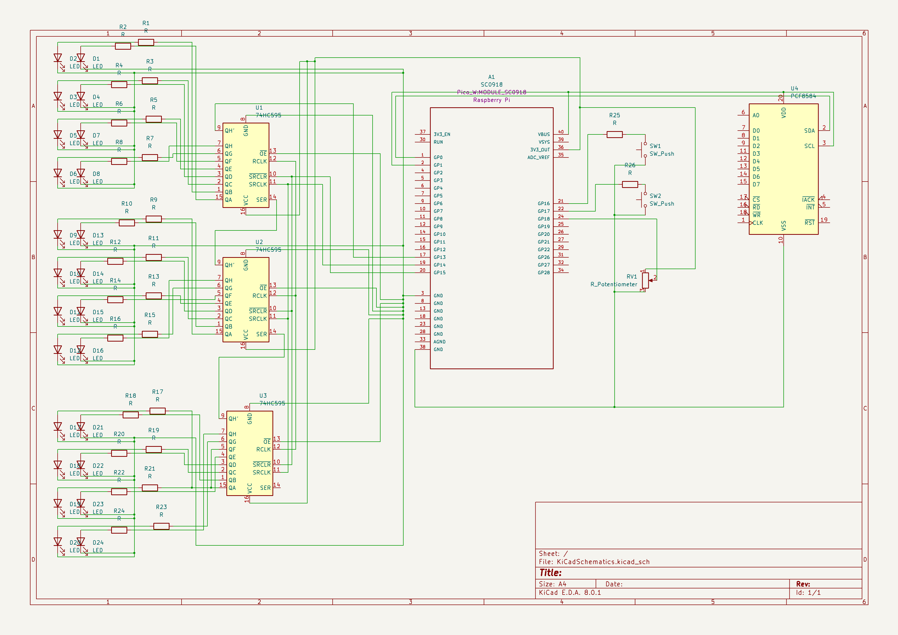

# Crasher game
Time your bet before the airplane crashes.

:::info 

**Author**: PRODAN Florin Mihai Alexandru \
**GitHub Project Link**: https://github.com/UPB-FILS-MA/project-mihaiprodann

:::

## Description

"Crasher" is an engaging online game featuring an airplane that ascends on the screen while a multiplier increases. Players are challenged to decide the optimal moment to cash out their bet before the airplane crashes, abruptly stopping the multiplier.

## Motivation

This project was inspired by my past experiences with gambling, particularly one that combined elements of risk and strategy in a simple yet engaging format. As part of a project requirement, I decided to bring this game into a tangible form using the Raspberry Pi Pico W and other electronic components. The goal was to recreate the game's excitement and decision-making process in a new, interactive way, merging it with practical experience gained during the lab.


## Architecture 



* The airplane shape will be made of LEDs connected using 75HC595 Shift Registers.
* The LCD screen will display information about game status, current money amount, etc.
* One of the buttons will start the game, the airplane will start flying.
* The other button is used to stop the game before the airplane crashes.
* With the potentiometer, you will select the amount of money you want to bet.
## Log

<!-- write every week your progress here -->

### Week 6 - 12 May
Considering that I was a complete beginner when I started the project, I decided to proceed in the following way: I tried to "play" with each individual component in order to see and better understand how they are used (see the branches in the [repository](https://github.com/UPB-FILS-MA/project-mihaiprodann)), later combining them to be able to create the logic of the game more easily. At least that's what I thought.

This week I didn't manage to make much noticeable progress, but at least I realized that for my project I need shift registers for LEDs because I don't have enough ports on the Raspberry Pi Pico.
Besides that, I built a custom box for the hardware setup:


### Week 7 - 19 May

I started by researching how shift registers can be used for my project, I was helped by [this very well explained tutorial](https://peppe8o.com/how-to-use-74hc595-shift-register-with-raspberry-pi-pico-and-micropython/). Unfortunately, MicroPython was used in the tutorial, but I managed to adapt my code in Rust.

I started to add the components on the breadboard, then I will also connect the LEDs in the shape of an airplane. Initially, I thought that I could connect them with mother-father wires, but after several tests from which I realized that the light intensity of the LEDs varies because of the wires, I decided that the most ideal would be to use a PCB board where I will solder the LEDs, from which the following prototype resulted:


### Week 20 - 26 May

This week I improved my code adding more functionalities: the money system and also some LED light show. I gave up on the PCB because I couldn't manage to solder it properly so I resumed to a easier solution: soldering the LEDs directly on my box:

I know it looks a bit messy, but was easier to connect the LEDs in the shape of an airplane like this rather than using a PCB (also I connected all LEDs' grounds together so that I don't have to use 24 wires for the ground).


## Hardware

1. **Raspberry Pi Pico W**: Microcontroller board for running the game logic.
2. **LEDs**: Visual indicators representing multiplier values.
3. **LCD 1602 module**: Display for showing current odds and game information.
4. **Push-button switch**: Trigger for starting the game.
5. **Potentiometer**: Control for adjusting the bet amount.
6. **Breadboard**: Platform for prototyping and connecting components.
7. **Jumper wires**: Connectors for establishing electrical connections on the breadboard.

In the project, the Raspberry Pi Pico W runs the game logic, while LEDs visualize multiplier values, the LCD 1602 module displays game information, the push-button switch triggers the game, and the potentiometer adjusts the bet amount. These components are connected using a breadboard and jumper wires for prototyping and experimentation.

Here is my hardware setup:



My final project is looking like this:
<!-- create a table with two columns and one row -->

| Front view | Side view |
|------------|------------|
|  |  |


#### Demo
Please click the photo below to see the project in action:\
[](https://youtube.com/shorts/bxZ65pR0FiY?feature=share "Project demonstration")

### Schematics



In the center of the schematics there is the Raspberry Pi Pico W. In it's left side, there are 3 shift registers (74HC595) which I use for the 24 leds that will form my airplane shape. In the right side of the Pico W, there is the LCD connection (actually the PCF8574 I2C module that I use to connect the 1602LCD with my Raspberry Pi Pico W), the 2 push buttons and the potentiometer.

### Bill of Materials

<!-- Fill out this table with all the hardware components that you might need.

The format is 
```
| [Device](link://to/device) | This is used ... | [price](link://to/store) |

```

-->


| Device                           | Usage               | Price |
|----------------------------------|---------------------|-------|
| Raspberry Pi Pico W              | Microcontroller Core | [35 Lei](https://www.optimusdigital.ro/ro/placi-raspberry-pi/12394-raspberry-pi-pico-w.html) |
| LCD 1602 Display (I2C Interface) | Display Output       | [25 Lei](https://www.bitmi.ro/ecran-lcd1602-cu-modul-i2c-iic-10487.html?gad_source=1) |
| Breadboard 830 Tie Points MB-102 | Prototype Platform  | [10 Lei](https://www.bitmi.ro/breadboard-830-puncte-mb-102-10500.html?gad_source=1) |
| Set of 200 LEDs (3mm & 5mm)      | Visual Indicators    | [16 Lei](https://www.bitmi.ro/componente-electronice/set-200-led-uri-de-diferite-culori-3-mm-5-mm-10508.html) |
| Tactile Push Button              | User Input           | [6.5 Lei](https://ardushop.ro/ro/home/97-buton-mic-push-button-trough-hole.html?gad_source=1) (for 10) |
| 10K ohm Potentiometer            | Adjustable Input     | [12.85 Lei](https://ardushop.ro/ro/electronica/193-potentiometru-10k.html?gad_source=1) (for 5) |
| Knobs for Potentiometers         | Knob for Adjustment  | [10.65 Lei](https://ardushop.ro/ro/electronica/321-buton-pentru-poteniometru.html?gad_source=1) (for 5) |
| Dupont Wires M-F, 20cm           | Wire Connection      | [6 Lei](https://www.bitmi.ro/electronica/40-x-fire-dupont-tata-mama-20cm-10512.html) |
| Dupont Wires M-F, 30cm           | Wire Connection      | [7 Lei](https://www.bitmi.ro/electronica/40-fire-dupont-tata-mama-30cm-10504.html) |
| Dupont Wires F-F, 30cm           | Wire Connection      | [6 Lei](https://www.bitmi.ro/electronica/40-fire-dupont-mama-mama-30cm-10503.html) |
| Dupont Wires F-F, 20cm           | Wire Connection      | [6 Lei](https://www.bitmi.ro/electronica/40-x-fire-dupont-mama-mama-20cm-10509.html) |
| Dupont Wires M-M, 30cm           | Wire Connection      | [7 Lei](https://www.bitmi.ro/electronica/40-fire-dupont-tata-tata-30cm-10505.html) |
| Dupont Wires M-M, 20cm           | Wire Connection      | [7 Lei](https://www.bitmi.ro/electronica/40-x-fire-dupont-tata-tata-20cm-10511.html) |
| 220Ω Resistors                   | Current Limiting     | [9 Lei](https://ardushop.ro/ro/electronica/211-rezistenta-14w-1-buc.html#/83-valoare_rezistenta-220r) (for 30) |
| 330Ω Resistors                   | Current Limiting     | [9 Lei](https://ardushop.ro/ro/electronica/211-rezistenta-14w-1-buc.html#/85-valoare_rezistenta-330r) (for 30) |
| Male Headers                     | Connection Points    | [7.5 Lei](https://ardushop.ro/ro/electronica/70-40-x-bareta-pini-tata.html?gad_source=1) (for 10) |

**Total Cost:** 159.5 Lei


## Software

| Library | Description | Usage |
|---------|-------------|-------|
| [cortex-m](https://crates.io/crates/cortex-m) | Low-level access to Cortex-M processors | Provides low-level access and inline assembly support |
| [cortex-m-rt](https://crates.io/crates/cortex-m-rt) | Cortex-M runtime support | Provides runtime support for Cortex-M microcontrollers |
| [embassy-embedded-hal](https://github.com/embassy-rs/embassy) | Embedded HAL implementation for Embassy | Provides hardware abstraction layer for Embassy |
| [embassy-executor](https://github.com/embassy-rs/embassy) | Async task executor for Embassy | Manages asynchronous task execution |
| [embassy-rp](https://github.com/embassy-rs/embassy) | Embassy support for Raspberry Pi RP2040 | Provides RP2040 support for Embassy |
| [embassy-usb-logger](https://github.com/embassy-rs/embassy) | USB logging support for Embassy | Enables logging over USB for debugging purposes |
| [log](https://crates.io/crates/log) | Logging facade for Rust | Provides a logging framework for Rust applications |
| [embedded-io-async](https://crates.io/crates/embedded-io-async) | Asynchronous I/O traits for embedded systems | Defines async I/O traits for embedded development |
| [embassy-time](https://github.com/embassy-rs/embassy) | Timing utilities for Embassy | Provides timing and delay functionalities |
| [static_cell](https://crates.io/crates/static_cell) | Static allocation utilities | Provides static memory cell utilities, useful for no-std environments |
| [heapless](https://crates.io/crates/heapless) | Heapless data structures | Provides data structures that do not require dynamic memory allocation |
| [embassy-futures](https://github.com/embassy-rs/embassy) | Async futures for Embassy | Provides utilities for working with async futures in Embassy |
| [futures](https://crates.io/crates/futures) | Asynchronous programming library | Provides async/await support and other async utilities |
| [embassy-sync](https://github.com/embassy-rs/embassy) | Synchronization primitives for Embassy | Provides synchronization primitives like mutexes and semaphores |
| [embedded-graphics](https://github.com/embedded-graphics/embedded-graphics) | 2D graphics library | Used for drawing to the display |
| [st7789](https://github.com/almindor/st7789) | Display driver for ST7789 | Used for the display for the Pico Explorer Base |
| [display-interface](https://crates.io/crates/display-interface) | Generic display interface traits | Provides generic traits for display interfaces |
| [byte-slice-cast](https://crates.io/crates/byte-slice-cast) | Casting between byte slices and arrays | Provides utilities for casting between byte slices and arrays |
| [embedded-hal-1](https://crates.io/crates/embedded-hal) | Hardware abstraction layer for embedded systems | Provides HAL traits for embedded systems |
| [embedded-hal-async](https://crates.io/crates/embedded-hal-async) | Asynchronous hardware abstraction layer | Provides async HAL traits for embedded systems |
| [embedded-hal-bus](https://crates.io/crates/embedded-hal-bus) | Bus abstractions for embedded HAL | Provides bus abstractions with async support |
| [embassy-usb](https://crates.io/crates/embassy-usb) | USB support for Embassy | Provides USB device support for Embassy |
| [micro-rand](https://crates.io/crates/micro-rand) | Tiny, no-std random number generator | Used to generate when the airplane will crash |
| [ag-lcd](https://crates.io/crates/ag-lcd) | LCD driver library | Provides support for LCD displays, including I2C interface |
| [port-expander](https://crates.io/crates/port-expander) | Port expander driver library | Provides support for port expanders |
| [panic-halt](https://crates.io/crates/panic-halt) | Halting panic handler | Provides a panic handler that halts execution |
| [shared-bus](https://crates.io/crates/shared-bus) | Shared bus manager | Manages shared bus resources |
| [no_std_strings](https://crates.io/crates/no_std_strings) | String handling for no-std environments | Provides string handling utilities for no-std environments |


For the software part, everything was pretty straightforward. I used [this](https://github.com/Mihai1803/1602LCD) repository for the LCD display. The flawless functionality of the game is ensured by using asynchronous tasks and custom channels from embassy.


## Links

<!-- Add a few links that inspired you and that you think you will use for your project -->

1. [Crasher game demo](https://www.youtube.com/watch?v=bzFpdu2o-o0])
2. [How to use 74HC595 Shift Register with Raspberry PI Pico](https://peppe8o.com/how-to-use-74hc595-shift-register-with-raspberry-pi-pico-and-micropython/)
