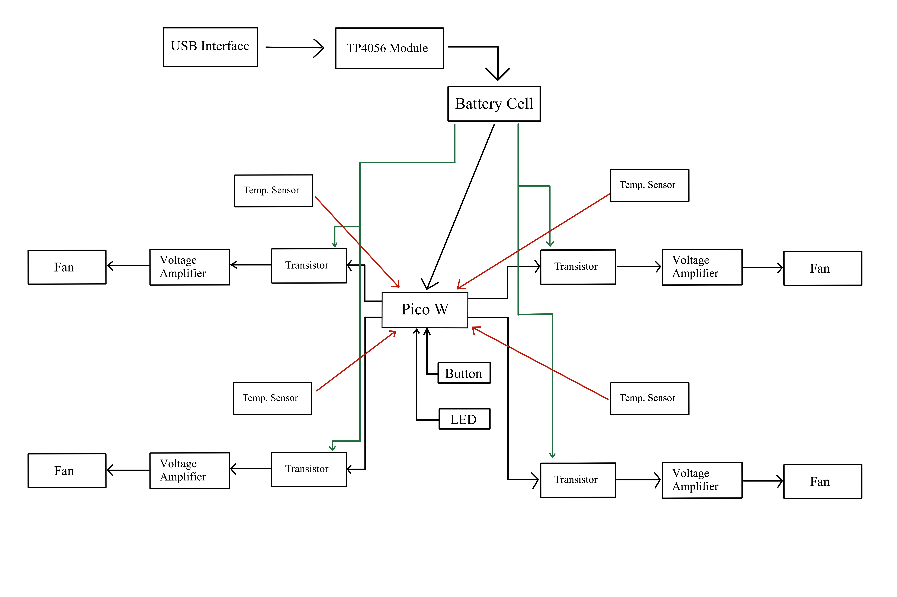
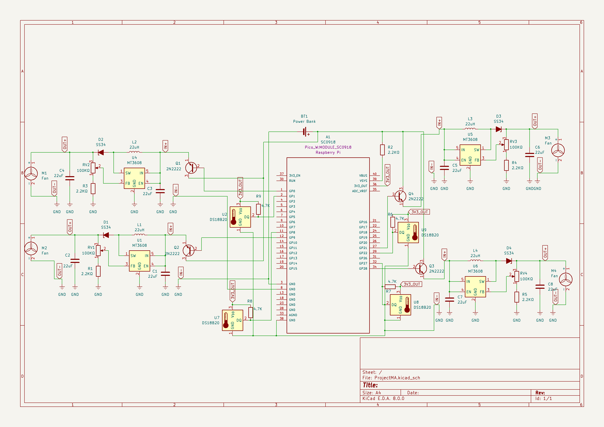
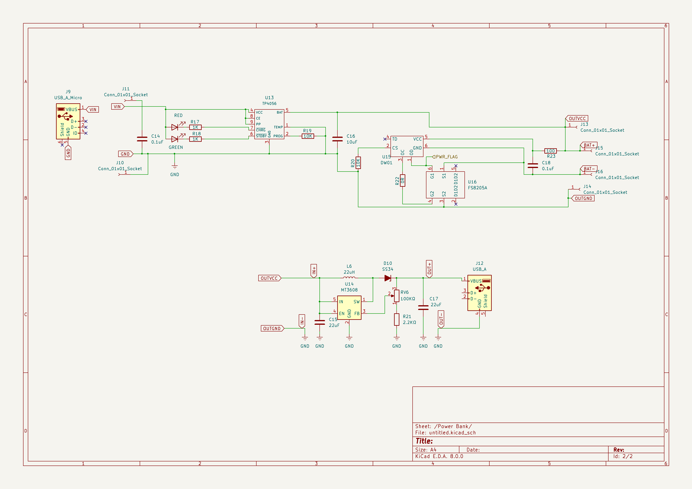

# TempTune

Auto-adjusting laptop cooler for efficient cooling and energy savings.

:::info 

**Author**: Bilciurescu Gabriel-Cosmin | Pica Eduard-Ionut \
**GitHub Project Link**: https://github.com/UPB-FILS-MA/project-Gabriel-x-1
:::

## Description


This versatile laptop cooler works with any laptop and offers dual power options: USB interface or its built-in rechargeable battery. It features multiple temperature sensors that adjust fan speed to maintain optimal cooling, with asynchronous fans activating only when needed to save energy.

The smart cooling system prevents overheating, extending your laptop's life and conserving battery. Its robust, advanced 3D-printed design is durable and well-suited for heavy use, whether for gaming, work, or streaming.

The cooler includes a desktop application for advanced monitoring, providing real-time heat mapping and tracking your laptop's internal hardware activity. It also identifies patterns in laptop activity based on task intensity, allowing you to optimize cooling for different scenarios. With this cooler, you can maintain ideal laptop conditions while gaining insights into its performance over time.

## Motivation

While searching for a reliable laptop cooler, I found that existing options were either too noisy, lacked intelligent cooling, or weren't portable. I needed a cooler that could automatically adjust fan speeds based on temperature, providing effective cooling without wasting energy. A built-in rechargeable battery was essential for portability, allowing the cooler to work independently of a power outlet.

I also wanted advanced monitoring through a companion app, providing real-time heat mapping and insights into my laptop's internal hardware activity. This would help optimize cooling based on task intensity. 
These unmet needs drove me to create a smart laptop cooler with adaptive cooling, power flexibility, advanced monitoring, and a robust design. My goal was to offer a solution that could efficiently keep laptops cool while providing valuable insights into their performance.

## Architecture 

The USB interface connects to the charging module, which is responsible for recharging the battery that powers the entire system. The battery provides power to the Raspberry Pi Pico W and supplies current to the collector terminals of the transistors.

Temperature sensors are used to measure the ambient temperature, and they send their readings to the Pico W microcontroller. When the temperature recorded by a sensor exceeds a predetermined threshold, the Pico W activates the corresponding transistors by sending current to their base terminals.

To operate a 12V cooling fan, a voltage amplifier is employed to boost the output voltage from the Pico W to approximately 12 volts. This elevated voltage drives the fan, enabling it to cool the laptop. The fan continues to operate until the temperature detected by the sensor falls below the set threshold.

The circuit features an on/off button that allows users to power the system up or down, and an LED indicator that signals whether the cooling system is currently active or inactive.

 

## Log

<!-- write every week your progress here -->

### Week 6 - 12 May
The hardware components arrived.
### Week 7 - 19 May
Changed the power supply method, and came up with a new solution to power up the pico w.
Continued to develop the software part, with focus on the onewire communication protocol with the temperature sensor.
### Week 20 - 26 May

## Hardware

MT3608 28V 2A - is a voltage regulator that we use to amplify the current given by the battery to power the fans
DS18B20 (TO-92) - is a digital temperature sensor with adjustable accuracy from 9 bit to 12 bit readings
2n2222 NPN BJT - are cheap bipolar transistor that we use as a switch to power the fans
TP4056 - is a module we use for charging the battery

### Schematics

 
  


### Bill of Materials

<!-- Fill out this table with all the hardware components that you might need.

The format is 
```
| [Device](link://to/device) | This is used ... | [price](link://to/store) |

```

-->

| Device | Usage | Price |
|--------|--------|-------|
| [Rapspberry Pi Pico W](https://www.raspberrypi.com/documentation/microcontrollers/raspberry-pi-pico.html) | The microcontroller | [35 RON](https://www.optimusdigital.ro/en/raspberry-pi-boards/12394-raspberry-pi-pico-w.html) |
| [Fans](https://www.optimusdigital.ro/ro/accesorii-altele/7964-ventilator-cy204a-12-v-92x92x25-mm.html?search_query=ventilator+92x92&results=2) |  For cooling | [40 RON](https://www.optimusdigital.ro/ro/accesorii-altele/7964-ventilator-cy204a-12-v-92x92x25-mm.html?search_query=ventilator+92x92&results=2) |
| [MT3608 28V 2A](https://ardushop.ro/ro/home/2263-mt3608boost.html?gad_source=1&gclid=CjwKCAjwt-OwBhBnEiwAgwzrUlvN5ijgoJgMqP_spVlZZMsu35QR1tdPDWzCjgjwklNRfOzatvnhlhoCqC4QAvD_BwE) | Voltage regulator | [23 RON](https://www.optimusdigital.ro/ro/cautare?controller=search&orderby=position&orderway=desc&search_query=MT3608+28V+2A&submit_search=) |
| [DS18B20 (TO-92)](https://www.alldatasheet.com/datasheet-pdf/pdf/58557/DALLAS/DS18B20.html) | Digital temperature sensor | [14 RON](https://www.optimusdigital.ro/ro/senzori/1465-senzor-de-temperatura-ds18b20-to-92.html?search_query=senzori+temperatura&results=227) |
| [Switch](https://www.optimusdigital.ro/ro/butoane-i-comutatoare/8031-intrerupator-patrat-push-cu-retinere.html?search_query=intrerupator&results=58) | On/off button | [3 RON](https://www.optimusdigital.ro/ro/butoane-i-comutatoare/8031-intrerupator-patrat-push-cu-retinere.html?search_query=intrerupator&results=58) |
| [Resistors](https://www.optimusdigital.ro/ro/componente-electronice-rezistoare/33-rezistoare-set.html?search_query=resistor&results=9) | The resistors | [15 RON](https://www.optimusdigital.ro/ro/componente-electronice-rezistoare/33-rezistoare-set.html?search_query=resistor&results=9) |
| [Wires](https://www.optimusdigital.ro/ro/fire-fire-mufate/884-set-fire-tata-tata-40p-10-cm.html?search_query=fire+tata+tata&results=79) | The wires | [7 RON](https://www.optimusdigital.ro/ro/fire-fire-mufate/884-set-fire-tata-tata-40p-10-cm.html?search_query=fire+tata+tata&results=79) |
| [Red LED](https://www.optimusdigital.ro/ro/optoelectronice-led-uri/696-led-rou-de-3-mm-cu-lentile-difuze.html?search_query=led+rosu&results=168) | LED | [0.5 RON](https://www.optimusdigital.ro/ro/optoelectronice-led-uri/696-led-rou-de-3-mm-cu-lentile-difuze.html?search_query=led+rosu&results=168) |
| [Breadboard](https://www.optimusdigital.ro/ro/prototipare-breadboard-uri/8-breadboard-830-points.html?search_query=breadboard&results=143) | for prototyping | [10 RON](https://www.optimusdigital.ro/ro/prototipare-breadboard-uri/8-breadboard-830-points.html?search_query=breadboard&results=143) |
| [2n2222 NPN BJT](https://pdf1.alldatasheet.com/datasheet-pdf/view/15067/PHILIPS/2N2222.html) | NPN BJT Transistors for current amplification | [2 RON](https://www.optimusdigital.ro/ro/componente-electronice-tranzistoare/935-tranzistor-s9013-npn-50-pcs-set.html?search_query=2n2222&results=9) |
| [TP4056](https://pdf1.alldatasheet.com/datasheet-pdf/view/1487471/ETC2/TP4056.html) | Charging module for the battery | [6 RON](https://www.optimusdigital.ro/ro/electronica-de-putere-incarcatoare/7534-incarcator-tp4056-cu-micro-usb-pt-baterie-lipo-1a-cu-protectie-pentru-circuite.html?search_query=modul+incarcator+&results=37) |
| [18650 LI-ION Battery 3200mA 10A Panasonic](https://www.keeppower.com.cn/products_detail.php?id=580) |  Battery | [23 RON](https://www.emag.ro/acumulator-18650-li-ion-3200ma-10a-panasonic-lincr18650bd/pd/DL86WWBBM/) |
| [Kit Powerbank 1S, 18650, 5V](https://components101.com/modules/power-bank-module-t6845c-datasheet-specifications) | Power Supply | [13 RON](https://www.sigmanortec.ro/kit-powerbank-1s-18650-5v?gad_source=1&gclid=CjwKCAjwo6GyBhBwEiwAzQTmc0hIOvBpkTSUBJ7S-j4w4NVuZLqWm4JrvdA0o2tr5zMtMWuXsB2O_xoCr_0QAvD_BwE) |

<!-- | []() |  | []() | -->

## Software

| Library | Description | Usage |
|---------|-------------|-------|
| [OneWire](https://github.com/kellerkindt/onewire) | One Wire protocol | Protocol for gathering data from the sensors |
| [embassy_rp](https://docs.embassy.dev/embassy-rp/git/rp2040/index.html) | Embassy Hardware Abstraction Layer (HAL) for the Raspberry Pi RP2040 microcontroller | Used to program the Pico |
| [embassy_sync](https://docs.embassy.dev/embassy-sync/git/default/index.html) | Synchronization primitives and data structures with async support | Used for communicating through different tasks |
| [embassy-executor](https://crates.io/crates/embassy-executor) | An async/await executor designed for embedded usage | Used for task execution |
| [embassy-time](https://crates.io/crates/embassy-time) | Instant and Duration for embedded no-std systems, with async timer support | Timekeeping, delays and timeouts. |
| [embassy-net](https://crates.io/crates/embassy-net)| Async TCP/IP network stack for embedded systems | To send data to the computer through wifi |
| [Kalman Filter](https://github.com/strawlab/adskalman-rs) | A filter for smoothing readings from sensors | To correct the temperature value sent by the sensors |

## Links

<!-- Add a few links that inspired you and that you think you will use for your project -->

1. [Kalman Filter](https://github.com/strawlab/adskalman-rs)
2. [MT3608 DC-DC Vol](https://www.youtube.com/watch?v=LMKiPE_2Uu4&t=557s)
3. [Transistor Interfacing to Pico W](https://www.youtube.com/watch?v=6KoJ_D2ashI)
4. [Temperature sensor tutorial](https://www.youtube.com/watch?v=lIpgGru2Wv0)
5. [Beginners Guide to 3D Printing](https://www.youtube.com/watch?v=b2Od4YHcLAQ)
6. [TP4056 Charging Module](https://www.youtube.com/watch?v=jE0O8PP-wsw)
...
