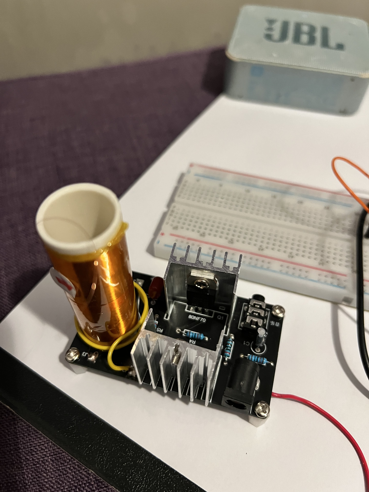
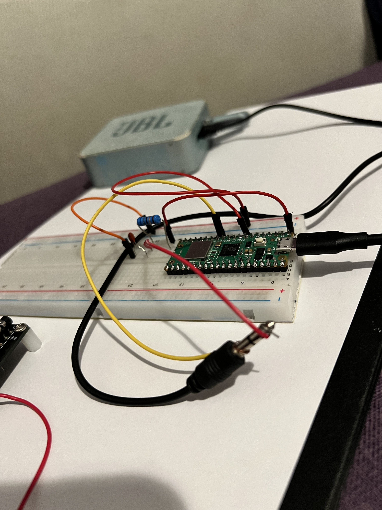
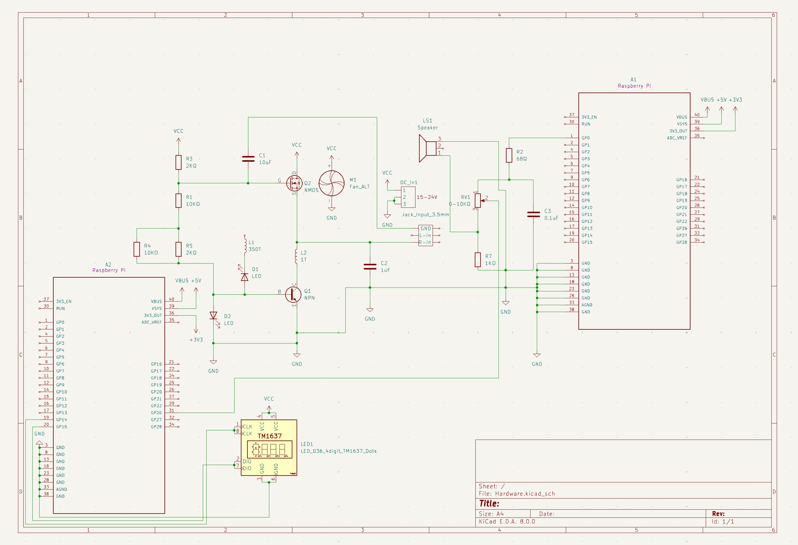

# WAV-player & more
WAV-player with adjustable volume, LED and wireless light.

:::info 

**Author**: Gabriel Dănăilă \
**GitHub Project Link**: https://github.com/UPB-FILS-MA/project-Gabi10017

:::

## Description

The first microcontroller plays an WAV-coded audio file, modulating it in function of frequency over PWM, which is filtered by an RC Filter and then sent over a 3.5mm Jack to a JBL Speaker, which plays the analog audio. The audio volume is controlled by a potentiometer, not from the speaker. The potentiometer's value is read by another identical microcontroller over ADC, and then it is processed. The result (in ohms) is displayed on a 4-digit display. The Tesla coil can also be used to play audio, but it is not powerful enough for this task, so I decided to bring a fluorescent neon light and use the coil for powering the tube.

## Motivation

I chose this project because I think it is an interesting, innovative idea to put in practice, that is neither too easy or too complex to do for a single-person project. This project idea was brought to me by the lab teacher.

## Architecture 

The project has the following architecture:
- __Raspberry Pi Pico 1:__ The first Pico has the role of processing the digital audio to a pulse-width modulated analog signal, transmitting it over a GPIO pin.
- __RC Filter:__ The RC Filter is a simple circuit, formed out of a few resistors and capacitors, which filters out some of the noise out of the PWM signal. The output signal is clearer.
- __Potentiometer:__ The potentiometer is used to adjust the volume of the speaker.
- __JBL Speaker:__ Is used to play the analog signal.
- __Raspberry Pi Pico 2:__ The second Pico has the role of reading and processing the potentiometer's resistance. The processed data is then transmitted to the 4 digits display.
- __4 digits Display:__ Is used to display the potentiometer's resistance. 
- __Powerbank/Power Source:__ Is used to power the devices.
- __Cooling Fan:__ Is used to cool off the transistors used to power the Tesla coil.
- __Fluorescent Neon Tube:__ Turns electrical current into visible light.
- __PCB with Tesla Coil Soldered onto it:__ The PCB is used to generate an EMF used for powering up the fluorescent tube.

&nbsp;


## Log

<!-- write every week your progress here -->

### Week 6 - 12 May
Received first hardware parts. The Tesla Coil did not work so I ordered another one. First succesful tests with the PWM Audio code.
### Week 7 - 19 May
Received the second Tesla Coil, which, after some fixes from the lab teacher, started working but had a very low visual and acustical intensity. Decided to order other components and shift the project's focus a bit. After an intensive code testing session I decided to use two Pico microcontroller for two separate purposes. The microcontrollers will both be placed on the same breadboard.
### Week 20 - 26 May
To be written.

## Hardware

I am using a Pico MCU in order to decode and send audio to a speaker, a potentiometer for adjustable volume, a secondary Pico MCU in order to process and send potentiometer's resistance value to a 4 digit display. Also, I will display a Tesla Coil which powers on a fluorescent neon tube wirelessly.





### Schematics



### Bill of Materials

<!-- Fill out this table with all the hardware components that you might need.

The format is 
```
| [Device](link://to/device) | This is used ... | [price](link://to/store) |

```

-->

| Device | Usage | Price |
|--------|--------|-------|
| [2x Rapspberry Pi Pico W](https://www.raspberrypi.com/documentation/microcontrollers/raspberry-pi-pico.html) | The microcontrollers | [70 RON](https://www.optimusdigital.ro/en/raspberry-pi-boards/12394-raspberry-pi-pico-w.html) |
| [Kit DIY Mini Speaker Tesla Coil 15-24V](https://s3.amazonaws.com/images.ecwid.com/images/wysiwyg/product/15692267/128673850/1594028694571-1078299868/tesla_schema_PNG) | Speaker/EMF generator for powering nearby bulbs/neon tubs | [45 RON](https://www.sigmanortec.ro/Kit-Bobina-Speaker-Mini-Tesla-p128673850) |
| [4 digits Display](https://components101.com/sites/default/files/component_datasheet/TM1637%20Display%20Module%20Datasheet.pdf) | Displays the potentiometer's resistance | [12 RON](https://www.emag.ro/modul-led-display-ceas-cl281/pd/DR966JBBM/) |
| 2x Power and Data Cable | Micro-USB to USB-A cable | [16 RON](https://www.emag.ro/cablu-alimentare-si-date-ugreen-fast-charging-usb-la-micro-usb-nickel-plating-pvc-1-5m-negru-6957303861378/pd/DV7CCBYBM/) |
| 2x Header Pins for Pi Pico W | Header Pins | 8 RON |
| Electronic Components Starting Kit | Kit with Electronic components | [100 RON](https://www.emag.ro/kit-start-componente-electronice-ai777/pd/DXRJ4TMBM/) |
| Breadboard with 830 points | Connects components | In-Kit |
| 2x Ceramic Capacitor 104 | Electrical component | In-Kit |
| Ceramic Capacitor 105 | Electrical component | In-Kit |
| Electrolytic Capacitor 10uF | Electrical component | In-Kit |
| 2x 10KΩ Resistors | Electrical component | In-Kit |
| 2x 2KΩ Resistors | Electrical component | In-Kit |
| 1KΩ Resistor | Part of the RC-Filter | In-Kit |
| 68Ω Resistor | Part of the RC-Filter | [5 RON](https://www.emag.ro/rezistenta-68-cu-pelicula-metalica-2w-royal-ohm-mf02sff680ja10-t230247/pd/DJQ53XMBM/) |
| Potentiometer | Adapts speaker volume | [6 RON](https://www.emag.ro/potentiometru-rotativ-accesorii-audio-hi-fi-10k-3-3-5v-z002396/pd/DX6JD9YBM/) |
| USB Cooling Fan | Cools Transistors| [101 RON](https://www.evomag.ro/electrocasnice-racire-ventilatoare-de-camera-si-birou/arctic-ventilator-de-birou-arctic-summair-pliabil-usb-c-2800-rpm-negru-4149402.html) |
| USB Hub for the Powerbank | Splits an USB port in 4 more ports (used on the Powerbank) | [27 RON](https://www.emag.ro/hub-4n1-vaxiuja-usb-3-0-30-cm-negru-jxq/pd/D38S3LMBM/) |
| USB-C to USB-A Adapter | Converts an USB-C port in an USB-A port (used on the Powerbank) | [13 RON](https://www.emag.ro/adaptor-baseus-usb-type-c-la-usb-a-usb-3-1-10gb-s-albastru-zjjq000003/pd/DDR9FCMBM/) |
| JBL Speaker | Plays Analog Audio | [Already Owned](https://www.emag.ro/boxa-portabila-jbl-go2-ipx7-negru-jblgo2blk/pd/DC855FBBM/) |
| Power Source | Powers the Tesla Coil | [60 RON](https://www.emag.ro/alimentator-24v-2a-112653/pd/D7VWPNBBM/) |
| Powerbank | Powers the Microcontrollers | [Already Owned](https://www.emag.ro/acumulator-extern-a-10-000-mah-quick-charge-3-0-pd-18w-port-usb-conectivitate-type-c-pbxwall1/pd/DTNV17MBM/) |
| Fluorescent Neon Tube | Lightens from the Tesla Coil | [6 RON](https://www.emag.ro/tub-neon-fluorescent-t4-12-w-lumina-rece-dan2934/pd/DGS55MMBM/) |

## Software

| Library | Description | Usage |
|---------|-------------|-------|
| [embassy-rp](https://crates.io/crates/embassy-rp) | The embassy-rp HAL targets the Raspberry Pi RP2040 microcontroller. The HAL implements both blocking and async APIs for many peripherals. | Reading, processing and sending data over ADC to multiple peripherals |
| [rp2040-hal](https://crates.io/crates/rp2040-hal)| High-level Rust drivers for the Raspberry Silicon RP2040 Microcontroller | Sending PWM Audio over GPIO |
| [defmt](https://crates.io/crates/defmt) | defmt ("de format", short for "deferred formatting") is a highly efficient logging framework that targets resource-constrained devices, like microcontrollers. | Logging and Debugging code |
| [embedded-time](https://crates.io/crates/embedded-time) | Fully defined, inter-operable, ergonomic, and fast human-time units (both duration and rate types) with hardware timer abstraction and software timers. | Used for defining the PWM wave's frequency change rate |

## Links

<!-- Add a few links that inspired you and that you think you will use for your project -->

1. [PWM Audio](https://gregchadwick.co.uk/blog/playing-with-the-pico-pt3/)
2. [Pico PWM Audio Example](https://github.com/DrChat/rp-hal/blob/feature/pwm_audio_example/boards/rp-pico/examples/pico_pwm_audio.rs)
3. [Creating PWM Output](https://www.alexdwilson.dev/learning-in-public/pwm-output-how-to-program-a-raspberry-pi-pico-with-rust)
4. [Raspberry Pi Pico -- TM1637](https://www.instructables.com/Raspberry-Pi-Pico-TM1637-4-Digit-7-Segment-Multipl/)
5. [Driver for a LED-display that uses the TM1637 chip](https://github.com/igelbox/tm1637-rs)
