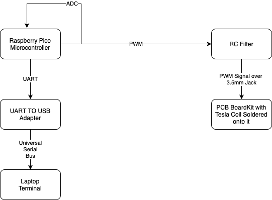

# DIY Pico Modulated Audio to Tesla Coil
This Tesla Coil has been modified so that the spark "sings" melody from a Raspberry Pico Microcontroller's flash.

:::info 

**Author**: Gabriel Dănăilă \
**GitHub Project Link**: https://github.com/UPB-FILS-MA/project-Gabi10017

:::

## Description

The microcontroller plays an WAV-coded audio file, modulating it in function of frequency over PWM, which is filtered by an RC Filter and then sent over a 3.5mm Jack to a PCB-Kit which has a Tesla Coil on it, which is used as a buzzer, in order to play the PWM Analog signal. Also, from the PWM pin the signal is also sent to one of the microcontroller's ADC ports where the signal is turned back into digital values which are read and printed over UART which is connected through an USB adapter to the laptop, which opens a serial connection with the microcontroller.

## Motivation

I chose this project because I think it is an interesting, innovative idea to put in practice, that is neither too easy or too complex to do for a single-person project. This project idea was brought to me by the lab teacher.

## Architecture 

The project has the following architecture:
- __Raspberry Pi Pico:__ The Pico has the role of processing the digital audio to a pulse-width modulated analog signal and also process it back from an analog signal to digital raw-values which it then sends to a computer over UART serial
- __RC Filter:__ The RC Filter is a simple circuit formed out of a few resistors and capacitors which filters out some of the noise out of the PWM signal
- __PCB BoardKit with Tesla Coil Soldered onto it:__ The PCB is used to get the PWM signal from the soldered 3.5mm Jack port to the soldered Tesla Coil which acts as a buzzer and plays the sound it receives.
- __UART TO USB Adapter:__ Connects to the TX & RX pins on the Pico, pushing the data over to a USB port. I thought this would be a bit more efficient than using the emulated serial port.
- __Laptop Terminal:__ Laptop connects to the serial port at the Pico's baud rate and prints the raw-values of the digital signal.




## Log

<!-- write every week your progress here -->

### Week 6 - 12 May

### Week 7 - 19 May

### Week 20 - 26 May

## Hardware

Detail in a few words the hardware used.

### Schematics

Place your KiCAD schematics here.

### Bill of Materials

<!-- Fill out this table with all the hardware components that you might need.

The format is 
```
| [Device](link://to/device) | This is used ... | [price](link://to/store) |

```

-->

| Device | Usage | Price |
|--------|--------|-------|
| [Rapspberry Pi Pico W](https://www.raspberrypi.com/documentation/microcontrollers/raspberry-pi-pico.html) | The microcontroller | [35 RON](https://www.optimusdigital.ro/en/raspberry-pi-boards/12394-raspberry-pi-pico-w.html) |
| Kit DIY Difuzor Mini TESLA Coil 15-24V Plasma | PCB BoardKit with Tesla Coil | [45 RON](https://www.olx.ro/d/oferta/kit-diy-difuzor-mini-tesla-coil-15-24v-plasma-IDgLEoY.html) |
| 2x Cablu alimentare si date | Micro-USB to USB-A cable | [16 RON](https://www.emag.ro/cablu-alimentare-si-date-ugreen-fast-charging-usb-la-micro-usb-nickel-plating-pvc-1-5m-negru-6957303861378/pd/DV7CCBYBM/) |
| Header Pins for Pi Pico W | Header Pins | 4 RON |
| Modul adaptor USB/UART CP2102 | UART to USB Adapter | [32 RON](https://www.emag.ro/modul-adaptor-usb-uart-cp2102-waveshare-5-3-3-v-cp2102usbuartboard-micro-waveshare11325/pd/DNDJFQMBM/) |
| Kit Start Componente Electronice | Kit with Electronic components | [100 RON](https://www.emag.ro/modul-adaptor-usb-uart-cp2102-waveshare-5-3-3-v-cp2102usbuartboard-micro-waveshare11325/pd/DNDJFQMBM/) |


## Software

| Library | Description | Usage |
|---------|-------------|-------|
| Work in progress | Will be updated | TBA |

## Links

<!-- Add a few links that inspired you and that you think you will use for your project -->

1. [PWM Audio](https://gregchadwick.co.uk/blog/playing-with-the-pico-pt3/)
2. [Pico PWM Audio Example](https://github.com/DrChat/rp-hal/blob/feature/pwm_audio_example/boards/rp-pico/examples/pico_pwm_audio.rs)
3. [ADC FIFO DMA Example with UART export](https://github.com/rp-rs/rp-hal/blob/main/rp2040-hal/examples/adc_fifo_dma.rs)
4. [RP2040 ADC over DMA Round-Robin in Rust](https://gist.github.com/chmanie/d897d9be6e85c872673b6f010dfff7b0)
5. [Creating PWM Output](https://www.alexdwilson.dev/learning-in-public/pwm-output-how-to-program-a-raspberry-pi-pico-with-rust)
