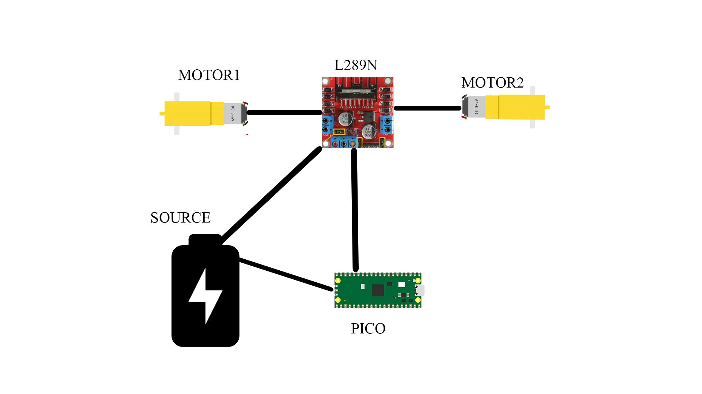

# RC Car controlled with WIFI
Remote Controlled Car using WIFI and a 

:::info 

**Author**: George-Alexandru PETRE 
**GitHub Project Link**: https://github.com/UPB-FILS-MA/lab-GeorgePetre11

:::

## Description

An RC Car, created using Pico, that can be controlled using a Phone App with the use of WIFI. The car has controls to move forward,backward and sideways (as of this moment, in time there can also be added a sensor that can detect obstacles) 

## Motivation

I choose this project because I wanted to have an RC car that I could control with my phone and the idea of creating it and modifying it to my liking felt like an interesting challenge to take. 

## Architecture 

<div align="center">

</div>


## Log

<!-- write every week your progress here -->

### Week 6 - 12 May

### Week 7 - 19 May

### Week 20 - 26 May

## Hardware

Detail in a few words the hardware used.

### Schematics

Place your KiCAD schematics here.

### Bill of Materials

<!-- Fill out this table with all the hardware components that you might need.

The format is 
```
| [Device](link://to/device) | This is used ... | [price](link://to/store) |

```

-->

| Device | Usage | Price |
|--------|--------|-------|
| [Rapspberry Pi Pico W](https://www.raspberrypi.com/documentation/microcontrollers/raspberry-pi-pico.html) | The microcontroller | [35 RON](https://www.optimusdigital.ro/en/raspberry-pi-boards/12394-raspberry-pi-pico-w.html) |
| [Punte H Dubla L298N](https://www.raspberrypi.com/documentation/microcontrollers/raspberry-pi-pico.html) | The Driver Motor | [11.53 RON](https://www.sigmanortec.ro/Punte-H-Dubla-L298N-p125423236) |
| [Kit sasiu Smart Car 4WD](https://www.raspberrypi.com/documentation/microcontrollers/raspberry-pi-pico.html) | The chasis of the Car | [75.05 RON](https://www.sigmanortec.ro/Kit-sasiu-Smart-Car-4WD-p136281803) |
| [Suport baterii 4AA](https://www.raspberrypi.com/documentation/microcontrollers/raspberry-pi-pico.html) | Support for batteries | [11.53 RON](https://www.sigmanortec.ro/Kit-sasiu-Smart-Car-4WD-p136281803) |
| [Suport baterii 4AA](https://www.raspberrypi.com/documentation/microcontrollers/raspberry-pi-pico.html) | Support for batteries | [11.53 RON](https://www.sigmanortec.ro/Kit-sasiu-Smart-Car-4WD-p136281803) |
| [Suport baterii 4AA](https://www.raspberrypi.com/documentation/microcontrollers/raspberry-pi-pico.html) | Support for batteries | [In the Kit.](https://www.sigmanortec.ro/Kit-sasiu-Smart-Car-4WD-p136281803) |
| [4 x Cauciucuri]() | Wheels | [In the Kit.](https://www.sigmanortec.ro/Kit-sasiu-Smart-Car-4WD-p136281803) |
| [2 x Placi acrilic ]() | 2 Acrylic Plates | [In the Kit.](https://www.sigmanortec.ro/Kit-sasiu-Smart-Car-4WD-p136281803) |
| [Fire Motoare ]() | Wires for the Motors | [In the Kit.](https://www.sigmanortec.ro/Kit-sasiu-Smart-Car-4WD-p136281803) |
| [4 x Encoders ]() | 4 Encoders | [In the Kit.](https://www.sigmanortec.ro/Kit-sasiu-Smart-Car-4WD-p136281803) |
| [8 x Suporti acrilic pentru motoare ]() | 8 Acrylic supports for the motors | [In the Kit.](https://www.sigmanortec.ro/Kit-sasiu-Smart-Car-4WD-p136281803) |
| [8 x Suporti acrilic pentru motoare ]() | 8 Acrylic supports for the motors | [In the Kit.](https://www.sigmanortec.ro/Kit-sasiu-Smart-Car-4WD-p136281803) |
| [6 x Piloni hexagonali 30mm ]() | 8 Acrylic supports for the motors | [In the Kit.](https://www.sigmanortec.ro/Kit-sasiu-Smart-Car-4WD-p136281803) |
| [8 x Suruburi M3x30mm ]() | 8 Acrylic supports for the motors | [In the Kit.](https://www.sigmanortec.ro/Kit-sasiu-Smart-Car-4WD-p136281803) |
| [16 x Suruburi M3x5mm ]() | 8 Acrylic supports for the motors | [In the Kit.](https://www.sigmanortec.ro/Kit-sasiu-Smart-Car-4WD-p136281803) |
| [10 x Piulite M3 ]() | 8 Acrylic supports for the motors | [In the Kit.](https://www.sigmanortec.ro/Kit-sasiu-Smart-Car-4WD-p136281803) |


## Software

| Library | Description | Usage |
|---------|-------------|-------|
| [st7789](https://github.com/almindor/st7789) | Display driver for ST7789 | Used for the display for the Pico Explorer Base |
| [embedded-graphics](https://github.com/embedded-graphics/embedded-graphics) | 2D graphics library | Used for drawing to the display |

## Links

<!-- Add a few links that inspired you and that you think you will use for your project -->

1. [link](https://www.youtube.com/watch?v=iTo4Qh2R6m4&list=PLfPN6PiGnry6a4tNFH2uDDkj0rArkB1w-)
2. [link](https://www.youtube.com/watch?v=U4unGGNjFBg&list=PLfPN6PiGnry6a4tNFH2uDDkj0rArkB1w-&index=4)

