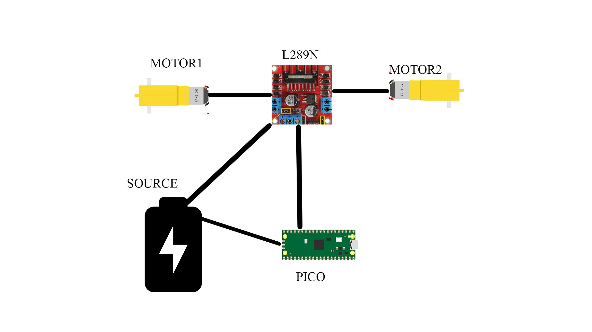
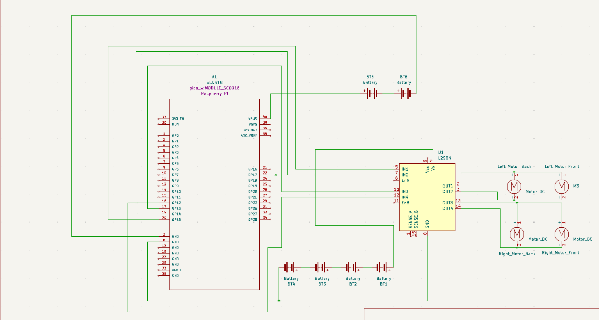
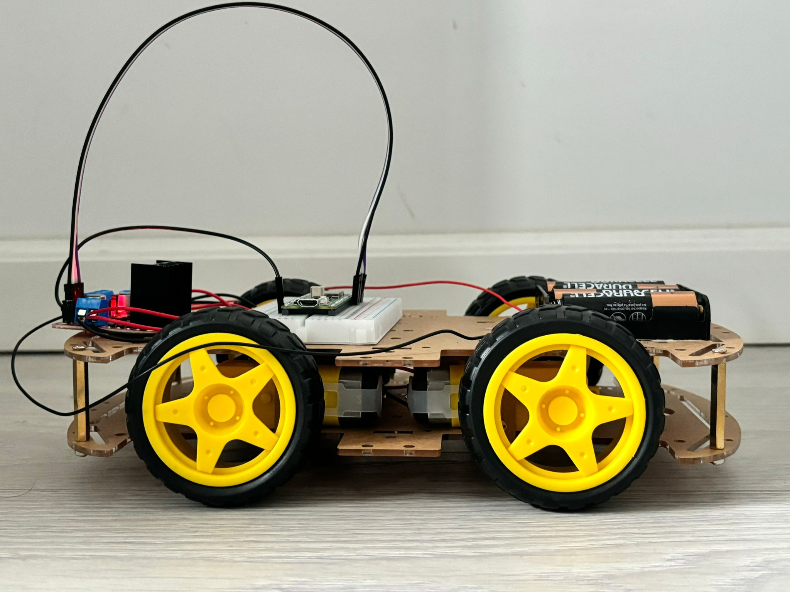
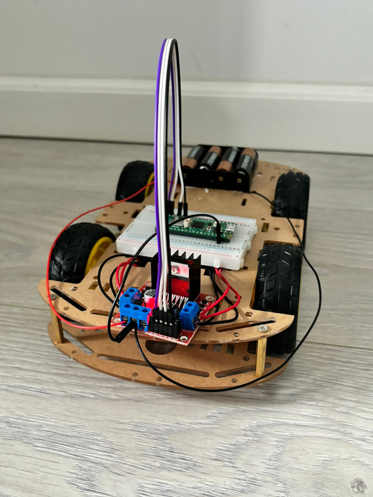
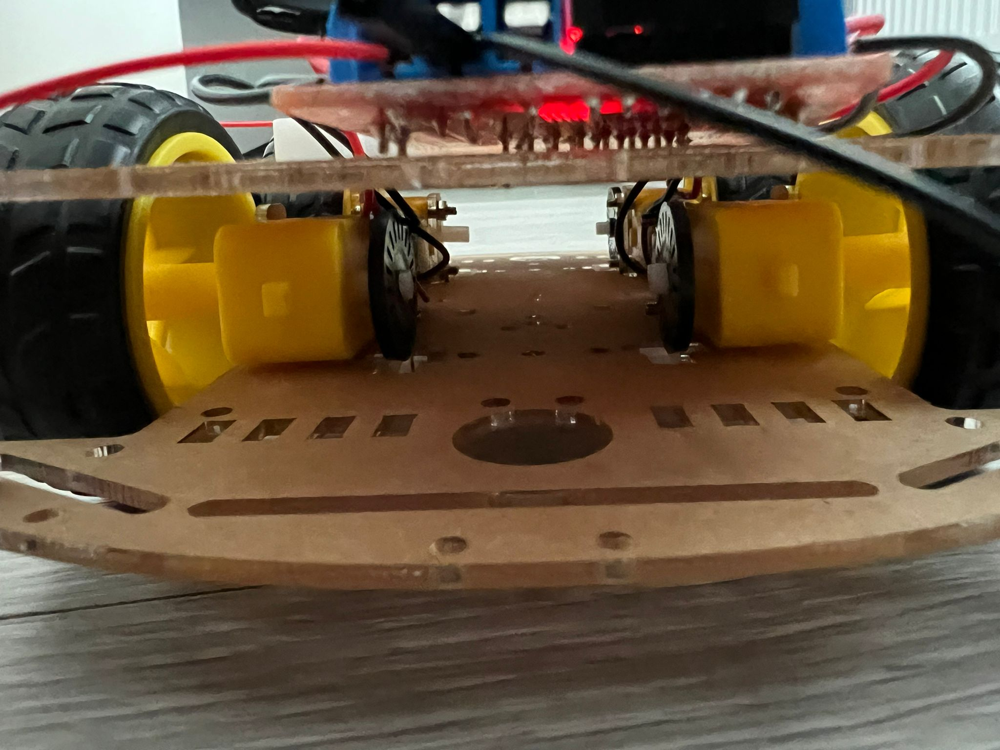
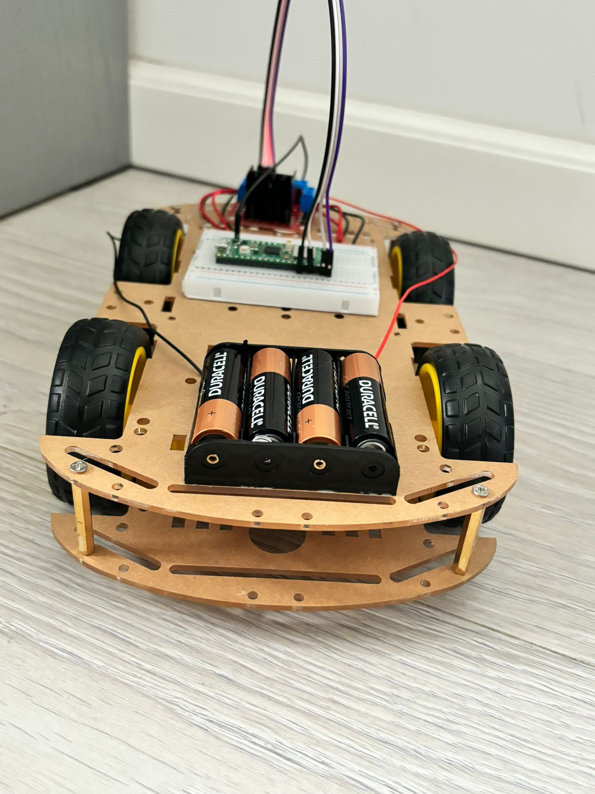
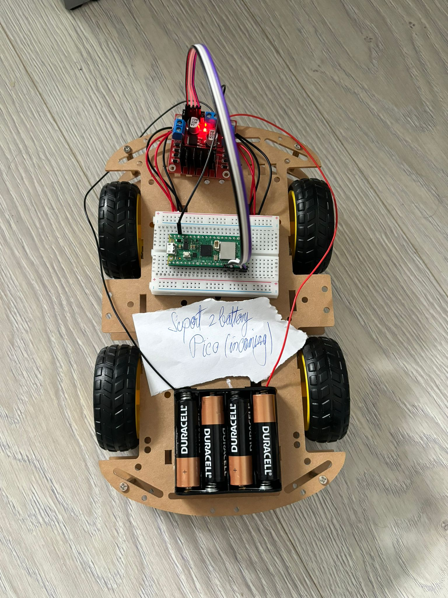
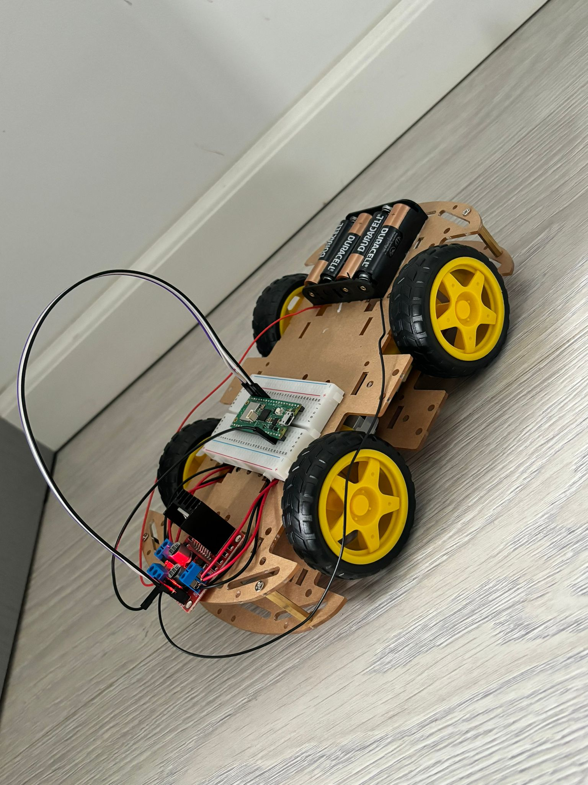

# RC Car controlled with WIFI
Remote Controlled Car using WIFI and a phone app. 

:::info 

**Author**: George-Alexandru PETRE  \
**GitHub Project Link**: https://github.com/UPB-FILS-MA/project-GeorgePetre11

:::

## Description

An RC Car, created using Pico, that can be controlled using a Phone App with the use of WIFI. The car has controls to move forward,backward and sideways (as of this moment, in time there can also be added a sensor that can detect obstacles) 

## Motivation

I choose this project because I wanted to have an RC car that I could control with my phone and the idea of creating it and modifying it to my liking felt like an interesting challenge to take. 

## Architecture 





## Log

<!-- write every week your progress here -->

### Week 6 - 12 May
- started buying the components for the project
- tested to see that all the components work properly

### Week 7 - 19 May
- started building the project
- soldered wires to the motors
- made the connection between the Pico, L289N and the Motors

### Week 20 - 26 May
- started the software milestone for the project
- first, made a code that moves the car 2 seconds in all directions
- then added the functions to move to lab 8 so that I can control the car using Wi-Fi.
## Hardware

The main components of the hardware that I used are:
- Raspberry Pi Pico - The Pico microcontroller is a small, low-cost, high-performance microcontroller board built with the RP2040 chip developed by Raspberry Pi. It features a dual-core ARM Cortex M0+ processor, which provides ample power for handling the logic and control functions of the car.
- L289N Driver motor - The L289N is a powerful dual full-bridge driver designed to drive inductive loads such as relays, solenoids, DC, and stepping motors. In this project, this driver manages the motors by allowing the Pico microcontroller to run motors with a higher power requirement than the Pico can provide directly. It can handle a significant current load and operates over a wide voltage range, making it ideal for controlling the wheels of the car.
- Power Supply  - 4 AA batteries
- 4WD Kit - This represents the chasis of the car. Contains the wheels, motors for the wheels and 2 acrylic plates that make the body of the car.

### Schematics




### Photos








### Bill of Materials

<!-- Fill out this table with all the hardware components that you might need.

The format is 
```
| [Device](link://to/device) | This is used ... | [price](link://to/store) |

```

-->

| Device | Usage | Price |
|--------|--------|-------|
| [Rapspberry Pi Pico WH](https://www.raspberrypi.com/documentation/microcontrollers/raspberry-pi-pico.html) | The microcontroller | [56 RON](https://ardushop.ro/ro/home/2819-raspberry-pi-pico-wh.html?search_query=pico+wh&results=108) |
| [Punte H Dubla L298N](https://www.handsontec.com/dataspecs/L298N%20Motor%20Driver.pdf) | The Driver Motor | [11.53 RON](https://www.sigmanortec.ro/Punte-H-Dubla-L298N-p125423236) |
| [Kit sasiu Smart Car 4WD](https://www.phippselectronics.com/wp-content/uploads/2021/08/4WD_Robot_Car_Guide_V1.0.pdf) | The chasis of the Car | [75.05 RON](https://www.sigmanortec.ro/Kit-sasiu-Smart-Car-4WD-p136281803) |
| [Suport baterii 4AA](https://www.phippselectronics.com/wp-content/uploads/2021/08/4WD_Robot_Car_Guide_V1.0.pdf) | Support for batteries | [11.53 RON](https://www.sigmanortec.ro/Kit-sasiu-Smart-Car-4WD-p136281803) |
| [4 x Cauciucuri](https://www.phippselectronics.com/wp-content/uploads/2021/08/4WD_Robot_Car_Guide_V1.0.pdf) | Wheels | [In the Kit.](https://www.sigmanortec.ro/Kit-sasiu-Smart-Car-4WD-p136281803) |
| [2 x Placi acrilic](https://www.phippselectronics.com/wp-content/uploads/2021/08/4WD_Robot_Car_Guide_V1.0.pdf)  | 2 Acrylic Plates | [In the Kit.](https://www.sigmanortec.ro/Kit-sasiu-Smart-Car-4WD-p136281803) |
| [Fire Motoare](https://www.phippselectronics.com/wp-content/uploads/2021/08/4WD_Robot_Car_Guide_V1.0.pdf)  | Wires for the Motors | [In the Kit.](https://www.sigmanortec.ro/Kit-sasiu-Smart-Car-4WD-p136281803) |
| [4 x Encoders](https://www.phippselectronics.com/wp-content/uploads/2021/08/4WD_Robot_Car_Guide_V1.0.pdf)  | 4 Encoders | [In the Kit.](https://www.sigmanortec.ro/Kit-sasiu-Smart-Car-4WD-p136281803) |
| [8 x Suporti acrilic pentru motoare](https://www.phippselectronics.com/wp-content/uploads/2021/08/4WD_Robot_Car_Guide_V1.0.pdf)  | 8 Acrylic supports for the motors | [In the Kit.](https://www.sigmanortec.ro/Kit-sasiu-Smart-Car-4WD-p136281803) |
| [6 x Piloni hexagonali 30mm](https://www.phippselectronics.com/wp-content/uploads/2021/08/4WD_Robot_Car_Guide_V1.0.pdf)  | 6 x Hexagonal Pillers 30mm | [In the Kit.](https://www.sigmanortec.ro/Kit-sasiu-Smart-Car-4WD-p136281803) |
| [8 x Suruburi M3x30mm](https://www.phippselectronics.com/wp-content/uploads/2021/08/4WD_Robot_Car_Guide_V1.0.pdf)  | 8 Screws M3x30mm | [In the Kit.](https://www.sigmanortec.ro/Kit-sasiu-Smart-Car-4WD-p136281803) |
| [16 x Suruburi M3x5mm](https://www.phippselectronics.com/wp-content/uploads/2021/08/4WD_Robot_Car_Guide_V1.0.pdf)  | 16 x Screws M3x5mm | [In the Kit.](https://www.sigmanortec.ro/Kit-sasiu-Smart-Car-4WD-p136281803) |
| [10 x Piulite M3](https://www.phippselectronics.com/wp-content/uploads/2021/08/4WD_Robot_Car_Guide_V1.0.pdf)  | 10 x Nuts M3 | [In the Kit.](https://www.sigmanortec.ro/Kit-sasiu-Smart-Car-4WD-p136281803) |
| [4 x AA Duracell Bateries](https://www.emag.ro/baterii-alcaline-duracell-plus-power-mn1500-lr6-aa-blister-de-4-buc-5000394017641/pd/D69PRMBBM/)  | 4 AA Duracell Bateries | [15 RON](https://www.emag.ro/baterii-alcaline-duracell-plus-power-mn1500-lr6-aa-blister-de-4-buc-5000394017641/pd/D69PRMBBM/) |
| [Suport baterii 2AA](https://www.optimusdigital.ro/ro/suporturi-de-baterii/941-suport-de-baterii-2-x-18650.html?search_query=0104110000008671&results=1&HTTP_REFERER=https%3A%2F%2Fwww.optimusdigital.ro%2Fro%2Fcautare%3Fcontroller%3Dsearch%26orderby%3Dposition%26orderway%3Ddesc%26search_query%3D0104110000008671%26submit_search%3D) | Support for 2 batteries | [4.99 RON](https://www.optimusdigital.ro/ro/suporturi-de-baterii/941-suport-de-baterii-2-x-18650.html?search_query=0104110000008671&results=1&HTTP_REFERER=https%3A%2F%2Fwww.optimusdigital.ro%2Fro%2Fcautare%3Fcontroller%3Dsearch%26orderby%3Dposition%26orderway%3Ddesc%26search_query%3D0104110000008671%26submit_search%3D) |


## Software

| Library | Description | Usage |
|---------|-------------|-------|
|[embassy-executor](https://docs.embassy.dev/embassy-executor/git/std/index.html)|Asynchronous executor for Rust embedded systems| Used for task scheduling and asynchronous programming|
|[embassy-time](https://embassy.dev/book/dev/time_keeping.html)|Time management library  |Used for time-based operations|
|[embassy-rp](https://docs.embassy.dev/embassy-rp/git/rp2040/index.html)| Peripheral access library |Used for initializing and interacting with peripherals |
|[log](https://docs.embassy.dev/embassy-usb-logger/git/default/index.html)|Logging facade |Used for logging messages |
|[embassy-usb-logger](https://docs.embassy.dev/embassy-usb-logger/git/default/index.html)|USB logger implementation for embassy  |Used for logging messages over USB  |
|[embassy-net](https://github.com/embassy-rs/embassy) | Networking library | Manages Wi-Fi communications |
|[gpio](https://docs.embassy.dev/embassy-stm32/git/stm32c011d6/gpio/index.html)|GPIO manipulation |Used for interacting with GPIO pins |
|[cyw43](https://docs.embassy.dev/embassy-stm32/git/stm32c011d6/gpio/index.html)|CYW43 |Used for interacting with the wi-fi chip of the pico |


## Links

<!-- Add a few links that inspired you and that you think you will use for your project -->

1. [Raspberry Pi Pico W: WiFi Controlled Robot](https://www.youtube.com/watch?v=iTo4Qh2R6m4&list=PLfPN6PiGnry6a4tNFH2uDDkj0rArkB1w-)
2. [Raspberry Pi Pico - Bluetooth Controlled Car Project](https://www.youtube.com/watch?v=U4unGGNjFBg&list=PLfPN6PiGnry6a4tNFH2uDDkj0rArkB1w-&index=4)
