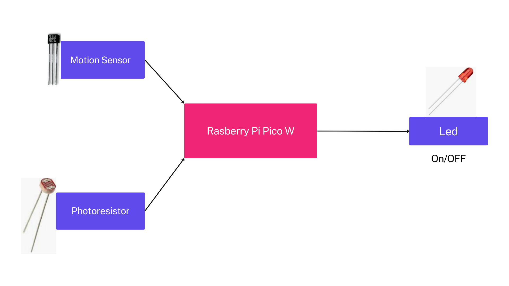

# Smart lamp
The project involves creating a smart lamp that responds to motion and ambient light levels. 

:::info 

**Author**: Radu George-Alexandru \
**GitHub Project Link**: https://github.com/UPB-FILS-MA/project-George2543

:::

## Description

This project revolves around creating a smart lamp system that enhances both convenience and energy efficiency. Utilizing the Raspberry Pi Pico W as its core, along with a motion sensor and a photoresistor, the lamp dynamically responds to its environment. By detecting motion, it ensures that illumination is provided when needed. Additionally, the led turns on/off based on ambient light levels, conserving energy when sufficient natural light is available and optimizing comfort when there is not enough light. This integration of motion and light sensing technology transforms the lamp into a versatile and adaptive lighting solution for any space.


## Motivation

I choose to persue this smart lamp project because I was thinking that one of the most important facilities of a smart house are the lights. This project tackles energy efficiency by innovating traditional lighting with a Raspberry Pi Pico W and motion/light sensors. It's a technical challenge that excites me, merging hardware and software seamlessly, so that I can craft a smart home solution that contributes to a mindful energy consumption.

## Architecture 





Main components:
- Raspberry Pi Pico W: Is the control unit, it manages the motion sensor, photoresistor and LED
- Magnetic sensor Hall: Detects motion within its range
- Photoresistor: Measures ambient light levels
- LED

 Connection between components:
 - Motion sensor to microcontroller: The motion sensor is connected to the Raspberry Pi Pico W through GPIO pins.
 - Photoresistor to microcontroller: The photoresistor is directly connected to the Raspberry Pi Pico W.
 - LED to microcontroller: The LED is connected to the Raspberry Pi Pico W, serving as the output. Through the microcontroller, the LED is controlled based on the inputs received from the magnetic motion sensor and photoresistor.
 

## Log

<!-- write every week your progress here -->

### Week 6 - 12 May

I completed the project Kicad schematic, ensuring all components are properly connected.

### Week 20 - 26 May
I used the project schematic as a template when putting together the hardware on the breadboard.
## Hardware

- Raspberry Pi Pico W: The microcontroller serves as the main processing unit, coordinating the functions of the entire system.
- Magnetic motion sensor: Detects motion within its range and sends signals to the Raspberry Pi Pico W, triggering the activation of the LED when movement is detected.
- Photoresistor: Measures ambient light levels and communicates this data to the Raspberry Pi Pico W.
- LED: Illuminates the lamp and is controlled by the Raspberry Pi Pico W. It turns on/off based on signals received from the motion sensor and light sensor.
- Resistors: Used to limit the current flow and protect the components, ensuring stable operation of the circuit.
- Breadboard: Provides a platform for assembling the circuit.
- Micro USB Cable: Powers the Raspberry Pi Pico W.


### Schematics

Place your KiCAD schematics here.

### Bill of Materials

<!-- Fill out this table with all the hardware components that you might need.

The format is 
```
| [Device](link://to/device) | This is used ... | [price](link://to/store) |

```

-->

| Device | Usage | Price |
|--------|--------|-------|
| [Rapspberry Pi Pico W](https://www.raspberrypi.com/documentation/microcontrollers/raspberry-pi-pico.html) | The microcontroller | [35 RON](https://www.optimusdigital.ro/en/raspberry-pi-boards/12394-raspberry-pi-pico-w.html) |
|[Magnetic sensor HALL SS495A](https://pdf1.alldatasheet.com/datasheet-pdf/view/124002/HONEYWELL/SS495A.html)|Detecting motions|[3.33 RON](https://ardushop.ro/ro/senzori/1291-ss495a-ss495a1-95a-solid-state-sensor.html?search_query=senzor+magnetic+hall&results=215)|
|[Photoresistor](https://digilent.com/reference/_media/ni:photoresistor_ds.pdf)|Measures ambient light|[1.90 RON](https://www.optimusdigital.ro/ro/componente-electronice-altele/28-fotorezistor10-pcs-set.html?search_query=photoresistor&results=3)|
|[LED 5mm](https://www.farnell.com/datasheets/1498852.pdf)|Serves as output|[0.45 RON](https://ardushop.ro/ro/electronica/299-led-5mm.html?search_query=led+5mm&results=621)|
|[Resistors](https://ardushop.ro/ro/electronica/212-set-rezistente-14w-600buc30-valori-10r-1m.html?search_query=rezistor&results=43)|Protect components|[12.29 RON 600pcs/30val](https://ardushop.ro/ro/electronica/212-set-rezistente-14w-600buc30-valori-10r-1m.html?search_query=rezistor&results=43)|
|[Breadboard](https://www.mouser.com/datasheet/2/58/BPS-MAR-BB830_BB830T-001-6408.pdf)|Assembling the circuit|[9.98 RON](https://www.optimusdigital.ro/ro/prototipare-breadboard-uri/8-breadboard-830-points.html?search_query=breadboard+830&results=16)|
|[Wires male to male](https://media.digikey.com/pdf/Data%20Sheets/Digi-Key%20PDFs/Jumper_Wire_Kits.pdf)|Connections|[6.99 RON 40pcs](https://www.optimusdigital.ro/ro/fire-fire-mufate/886-set-fire-tata-tata-40p-15-cm.html?search_query=fire+tata+tata&results=78)|
|[Micro USB cable](https://www.optimusdigital.ro/ro/cabluri-cabluri-usb/4576-cablu-albastru-micro-usb-50-cm.html?search_query=cablu+micro+usb&results=146)|Power the microcontroller|[3.03](https://www.optimusdigital.ro/ro/cabluri-cabluri-usb/4576-cablu-albastru-micro-usb-50-cm.html?search_query=cablu+micro+usb&results=146)|


## Software

| Library | Description | Usage |
|---------|-------------|-------|
| [embassy_executor](https://github.com/embassy-rs/embassy) |  Running asynchronous tasks | Execute asynchronous tasks |
| [embassy-time](https://github.com/embassy-rs/embassy/tree/main/embassy-time) | Time Library | Used for creating timing functions |
| [embassy-rp](https://github.com/embassy-rs/embassy/tree/main/embassy-rp) | RP2040 pheripherals | Accesing the pheripherals of the microcontroller  |


## Links

<!-- Add a few links that inspired you and that you think you will use for your project -->

1. [How to Connect BH1750 with the Raspberry Pi Pico/Pico W: Measure Ambient Light for Smart Lighting](https://www.youtube.com/watch?v=l9MAZu7yvN4&ab_channel=Shilleh)
2. [Smart Light | LDR | Relay | Arduino Uno | Arduino project | Smart Bulb | Smart Street Light | Bulb](https://www.youtube.com/watch?v=OapZNPaKrmA&ab_channel=ElectronicsUniversity)


