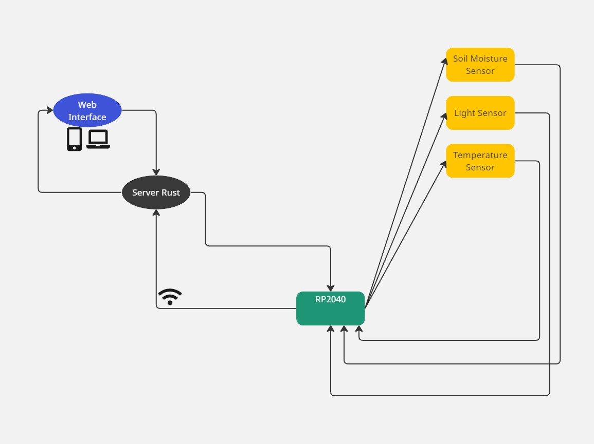
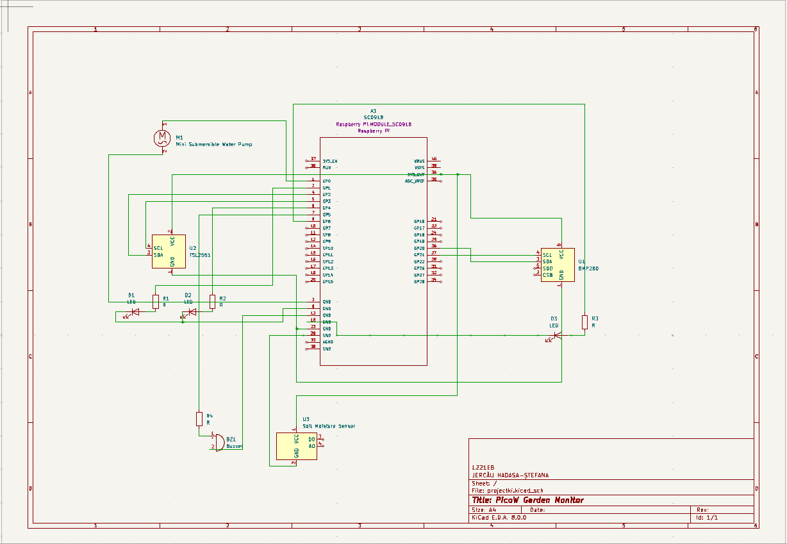
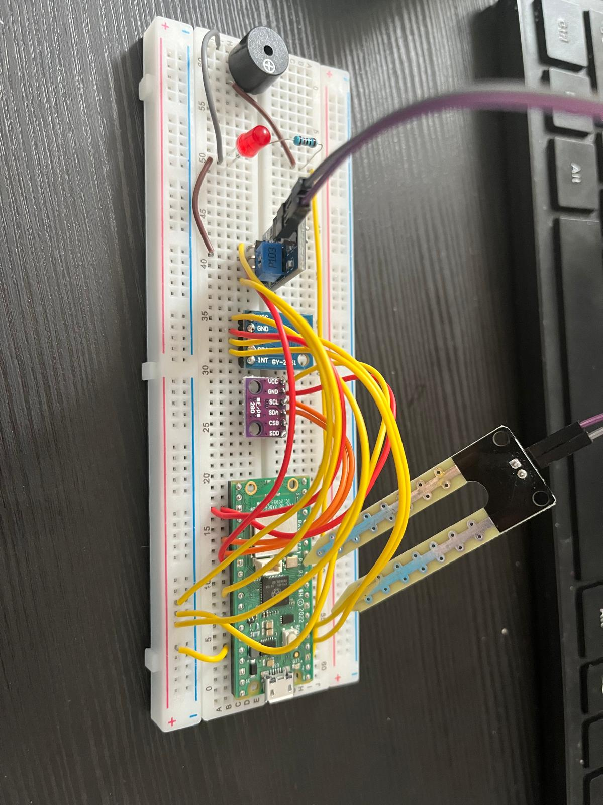

# PicoW Garden Monitor
 A Raspberry Pi Pico project for monitoring and optimizing plant growth conditions.

:::info

**Author**: JERCĂU Hadasa-Ștefana \
**GitHub Project Link**: https://github.com/UPB-FILS-MA/project-hadassahj

:::

## Description

PicoW Garden Monitor is a project designed to monitor and optimize the growth conditions of plants in gardens using the Raspberry Pi Pico microcontroller. It collects data on soil moisture, light exposure, and temperature to assess the health of plants and provide personalized care instructions for optimal growth. 

The project aims to include a web application too, hosted on a local server built with Rust, which would allow users to interact with the system, select plants, view real-time sensor data, and receive customized care instructions. By envisioning a locally hosted web interface as part of its development, PicoW Garden Monitor aims to offer a comprehensive solution for plant enthusiasts to cultivate healthy and thriving gardens.

## Motivation

The motivation behind PicoW Garden Monitor stems from a personal need to address common challenges faced in plant care. As someone who often forgets to water plants and struggles to find the optimal spot with the right amount of sunlight, there is a strong desire to find a solution that simplifies and enhances the gardening experience.

By developing the PicoW Garden Monitor, the goal is to create a reliable and intuitive tool that helps overcome these challenges. With real-time monitoring of soil moisture, light exposure, and temperature, the system provides timely reminders for watering and insights into the ideal environmental conditions for plant growth. This empowers users to nurture healthy and thriving gardens, even with busy schedules or limited gardening experience.

## Architecture 

**Main Components:**
* Sensors: Soil moisture sensor, light sensor, temperature sensor.
    - These sensors are strategically placed in the garden to capture essential environmental data.
    - The soil moisture sensor measures the moisture level in the soil, indicating when plants need watering.
    - The light sensor detects the intensity of sunlight, helping users identify optimal spots for different types of plants.
    - The temperature sensor monitors the ambient temperature, ensuring plants are not exposed to extreme conditions.
* Raspberry Pi Pico:
    - The Raspberry Pi Pico serves as the central hub of the system, responsible for interfacing with the sensors and facilitating communication with the Rust server.
    - It collects data from the sensors and sends this information to the Rust server for analysis.
    - Additionally, the Raspberry Pi Pico executes control logic based on the analyzed data, such as activating watering systems or adjusting light exposure.
* Rust Server:
    - The Rust server receives sensor data from the Raspberry Pi Pico and processes it to assess the health parameters of the plants.
    - Using algorithms and predefined thresholds, the server analyzes the data to determine if any corrective actions are needed.
    - It generates personalized care instructions based on the analysis results, considering factors such as soil moisture, light exposure, and temperature requirements.
* Web Interface:
    - The web interface provides users with a user-friendly dashboard to interact with the system.
    - Users can access the dashboard from their devices connected to the local network, such as smartphones, tablets, or computers.
    - Through the web interface, users can select specific plants, view live sensor data, and receive actionable insights and care recommendations.
    - The interface communicates with the Rust server to retrieve and display relevant information, ensuring a seamless user experience.
    
**Connection:**
* The sensors are connected directly to the Raspberry Pi Pico microcontroller, which interfaces with them to collect data.
* The Raspberry Pi Pico communicates with the Rust server over the local network, sending sensor data and receiving instructions.
* The Rust server processes the incoming data, generates care instructions, and communicates with the web interface to provide users with real-time updates and insights.

## Log

<!-- write every week your progress here -->

### Week 6 - 12 May
I ordered the components and connected them on the breadboard.
### Week 7 - 19 May
I started writing the code and testing the desired functionalities.
### Week 20 - 26 May

## Hardware

    - Raspberry Pi Pico WH: Microcontroller board used as the central hub for data acquisition and communication.
    - BMP280 GY Barometric Pressure Sensor Module: Used to measure atmospheric pressure and temperature.
    - TSL2561 Light Intensity Sensor Module: Used to measure light intensity and provide data on ambient light conditions.
    - Soil Moisture Sensor Module: Used to measure soil moisture levels, providing insights into soil hydration levels for plant care.
    - Jumper Wires: Used to establish electrical connections between components on the breadboard or between various parts of the circuit. They facilitate the prototyping and assembly process by enabling flexible and temporary connections.
    - Laptop: Used for connecting to the Raspberry Pi Pico and for managing and analyzing collected data. Utilized for software development and testing associated with the project.

### Schematics

Place your KiCAD schematics here.

### Bill of Materials

| Device | Usage | Price |
|--------|-------|-------|
| [Raspberry Pi Pico WH](https://www.optimusdigital.ro/ro/placi-raspberry-pi/12395-raspberry-pi-pico-wh.html?search_query=0104110000089595&results=1) | Microcontroller for data acquisition and communication | [38,99 lei](https://www.optimusdigital.ro/ro/placi-raspberry-pi/12395-raspberry-pi-pico-wh.html?search_query=0104110000089595&results=1) |
| [BMP280 GY Barometric Pressure Sensor Module](https://www.optimusdigital.ro/ro/senzori-senzori-de-presiune/1666-modul-senzor-de-presiune-barometric-bmp280.html?search_query=0104110000016300&results=1) | Measures atmospheric pressure and temperature | [8,49 lei](https://www.optimusdigital.ro/ro/senzori-senzori-de-presiune/1666-modul-senzor-de-presiune-barometric-bmp280.html?search_query=0104110000016300&results=1) |
| [TSL2561 Light Intensity Sensor Module](https://www.optimusdigital.ro/ro/senzori-senzori-optici/137-senzor-de-intensitate-a-luminii.html?search_query=0104110000000590&results=1) | Measures light intensity | [22,99 lei](https://www.optimusdigital.ro/ro/senzori-senzori-optici/137-senzor-de-intensitate-a-luminii.html?search_query=0104110000000590&results=1) |
| [Soil_moisture_module] (https://www.optimusdigital.ro/ro/senzori-senzori-de-umiditate/73-senzor-de-umiditate-a-solului.html?search_query=0104110000001023&results=1) | Measures soil moisture levels | [3,99 lei](https://www.optimusdigital.ro/ro/senzori-senzori-de-umiditate/73-senzor-de-umiditate-a-solului.html?search_query=0104110000001023&results=1) |
| [Jumpers] (https://www.optimusdigital.ro/ro/fire-fire-nemufate/899-set-de-fire-pentru-breadboard-rigide.html?search_query=0104110000008046&results=1) | Measures soil moisture levels | [12,49 lei](https://www.optimusdigital.ro/ro/fire-fire-nemufate/899-set-de-fire-pentru-breadboard-rigide.html?search_query=0104110000008046&results=1) |

## Software

| Library | Description | Usage |
|---------|-------------|-------|
| [rppal](https://crates.io/crates/rppal) | GPIO library for Raspberry Pi Pico | I'll rely on this library to access GPIO pins, SPI, I2C, PWM, and other peripherals on the Raspberry Pi Pico microcontroller. It'll help me interface with sensors like the BMP280, TSL2561, and soil moisture sensor, as well as control other components connected to the Pico. |
| [bmp280](https://crates.io/crates/bmp280) | Driver for BMP280 sensor | This library will facilitate interfacing with the BMP280 sensor, which measures atmospheric pressure and temperature. With its functions for initializing the sensor, reading temperature and pressure data, and configuring sensor settings, I'll collect environmental data for monitoring plant conditions in the garden. |
| [tsl2561](https://crates.io/crates/tsl2561) | Driver for TSL2561 light sensor | I'll employ this library to access the TSL2561 light sensor, which measures light intensity. Its capabilities in initializing the sensor, configuring its operating mode, and reading raw light intensity values will enable me to monitor ambient light conditions in the garden and optimize plant placement accordingly. |
| [embassy_net](https://crates.io/crates/embassy_net) | Networking for embedded systems | This crate will provide networking functionality for my embedded systems, including TCP and UDP sockets, IP addressing, and network stack management. |
| [heapless](https://crates.io/crates/heapless) | No-std data structures | This crate offers data structures that don't require dynamic memory allocation, which will be perfect for use in embedded systems with limited resources. |

## Links

1. [Emilostuff - Preventing Plant Death With Technology ](https://www.youtube.com/watch?v=9Fx9zQJe3H4&t=493s)
2. [TechNovelTies - Never Kill Another Plant! Flower Care Sensor & App Review](https://www.youtube.com/watch?v=_47GMmjb1Ik)
3. [Learn Rust](https://www.rust-lang.org/learn)

